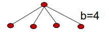

# SW04 - Modeling Search Problems

## Topics

* Problem-solving agents (cf. AIMA chapter 3.1)
* Modeling search problems (cf. AIMA chapter 3.3)

## Problem-solving agent

> *Problem solving agent: An agent that tries to come up with a sequence of actions that will bring the environment into a desired state.* - [Source](https://cs.lmu.edu/~ray/notes/problemsolving/)
>
> *Search: The process of looking for such a sequence, involving a systematic exploration of alternative actions.* - Same source

There are four general steps in problem solving:

* **Goal formulation**: Based on the current situation and the agents performance measure, define a set of states in which the agent would be successful (e.g. "arriving in Bucharest on time").
* **Problem formulation**: Process of deciding what actions and states to consider, given a goal (for instance, drive from one city to the next). Further, we have to state the problem in such a way that we can make efficient progress toward a goal state (and not get bogged down in the details of the world). It abstract from the real world and focuses on the properties of states and the possible actions.
* **Search**: Process of looking for a sequence of actions that reaches the goal. A search algorithm takes a problem as input and returns a solution in the format of an action sequence (e.g. Go(Arad) - Go(Fagaras) - Go(Bucharest), simply put)
* **Execute**: Once a solution is found, the actions it recommends can be carried out.

Summarized:

>  After formulating a goal and a problem to solve, the agent calls a search procedure to solve it. It then uses the solution to guide its actions, doing whatever the solution recommends as the next thing to do—typically, the first action of the sequence—and then removing that step from the sequence. Once the solution has been executed, the agent will formulate a new goal - AIMA, Chapter 3.1

In order to solve a problem with search, the environment has to be:

- observable
- static
- deterministic
- discrete

### Example

Problem: find a route from Arad to Bucharest

* States: the cities in a given map
  * Initial state: Arad
  * Goal state: Bucharest
* Actions: Edges (trips) between cities on the map
* Step costs: Distance information on the edges
* Solution: A sequence of actions that leads to a path from Arad to Bucharest
* Performance measure: Minimize the path length

More formally, this would be expressed as:

**Initial state** is the state from which the search starts: 
$$
s_{initial} = \text{In(Arad)}
$$

**State space** is a set of all possible states:
$$
\text{stateSpace} = \{In(Arad), In(Sibiu), \ldots \}
$$

**Actions** is a description of possible actions:
$$
In(Arad): \{Go(Sibiu), Go(Timisoara), Go(Zerind)\}
$$
**Transition Model** describes the outcome of an action given the current state (also: *successor*, refers to any state reachable from a given state by a single action):
$$
Result(In(Arad), Go(Zerind)) = In(Zerind)
$$
**Goal Test** checks whether the state description matches the goal state:
$$
In(Bucharest)
$$

### Concepts to describe a search space

* **Path** is a sequence of actions leading from one state to another
* **Path Costs**: A path cost function that assigns a numeric cost to each path. The problem-solving agent chooses a cost function that reflects its own performance measure. For the agent trying to get to Bucharest, time is of the essence, so the cost of a path might be its length in kilometers.
* **Solution**: A solution to a problem is an action sequence that leads from the initial state to a goal state. Solution quality is measured by the path cost function, and an optimal solution has the lowest path cost among all solutions.
* **Search Costs**: Time and memory requirements to find a solution
* **Search Space Size**: Number of states _visited_ by a search algorithm

### Example: Problem formulation for the vacuum cleaner agent

World state space: 2 positions (in left or right room), dirt or no dirt (8 states, see table below)

| Robots position  | Room A | Room B |
| ---------------- | ------ | ------ |
| left | dirt    | dirt |
| left | dirt | no dirt |
| left  | no dirt | dirt |
| left  | no dirt | no dirt |
| right | dirt | dirt |
| right | dirt | no dirt |
| right | no dirt | dirt |
| right | no dirt | no dirt |

The agent is in one of the two locations, each of which might contain dirt or not. Thus, there are $2 \cdot 2^2 = 8$ possible world states. A larger environment with $n$ location has $n \cdot 2^n$ states.

* Actions: $\text{Left (L), Right (R) or Clean (C)}$
* Goal: No dirt in the rooms
* Path costs: One unit per action

### Example: 8-Puzzle

See also section 3.2 in the AIMA book.

**States**: Description of the location of each tile and the blank square

**Actions**: Moving the blank left, right, up, down.

**Goal Test**: Does the configuration match the goal state?

**Path Costs**: Sum of steps, which cost 1 unit each

## Searching for Solutions

> Having formulated some problems, we now need to solve them. A solution is an action sequence, so search algorithms work by considering various possible action sequences. The  possible action sequences starting at the initial state form a **search tree** with the initial state at the root; the branches are actions and the **nodes** correspond to states in the state space of the problem - AIMA, Chapter 3.3 "Searching For Solutions"

We are following the example in the book; find a route from Arad to Bucharest:

First of all, we check if the current state is the goal state. Which is obviously not, but should solve problems such as: "starting in Arad, get to Arad". 

A **search tree** is created:

* Root node is the initial state
* The branches are the actions
* The nodes are the states

**Expanding** a node means to apply every allowed action to the current state. This generates a new set of states. In (a), we are expanding the current node $\text{In(Arad)}$ and thus generating new child nodes:  $\text{In(Sibiu)}, \text{In(Timisora)}, \text{In(Zerind)}$. In the next step, we need to explore which of these new nodes (possibilites) to consider (i.e. expand) further.

Figure (c) for example has choosen to go to Sibiu. First, we check again if we reached the goal state (we did not). Then, we expand Sibiu and create a new set of nodes. Now, we can choose to any of those or go back to Arand and choose Timisoara or Zerind.

The **frontier** is the set of all leaf nodes (nodes with no children in the tree). This means, that their children can just be unexplored for now. In our case, the frontier are the six white nodes in figure (c). 

Set of visited states (the explored node set) are all nodes that have been expanded by the search strategy at a specific point in time.

The process of expanding nodes on the frontier continues until either a solution is found or there are no more states to expand. Search algorithms all share this basic structure; they vary primarily  according to how they choose which state to expand next—the so-called **search strategy.**

Summarized:

* **Node expansion**: generating all successor nodes considering the available actions
* **Frontier** set of all nodes available for expansion
* **Search strategy** defines which node is expanded next
* **Set of visited states** (the explored node set): all nodes that have been expanded by the search strategy at a specific point in time

## General Search Algorithm

* Start with an initial state
* Repeatedly expand a state by generating its successors
* Stop when a goal state is expanded or all reachable states have been consideren

## The Search Tree

Describes the order in which the nodes in our search space are visited:

* a sequential description of the visiting order
* sometimes we backtrack to a parent node to explore its remaining children

### Repeated states can lead to loopy paths

If no care is taken, an algorithm might fall into the endless loop of Arad - Sibiu - Arad

### Redundant Paths

* Two possible paths from Sibiu to Bucharest
* The route via Fagaras is a more costly way to get to Bucharest

### Implementing the Search Tree

A data structure for each node `n`.

* `n.state`: the state in the state space to which the node corresponds
* `n.parent`: the node in the search tree that generated this node
* `n.action`: the action that was applied to the parent to generate the node (None for root)
* `n.path_cost`: the cost of the path from the initial state to the node

Given the components for a parent node, it is easy to see how to compute the necessary components for a child node. The function CHILD-NODE takes a parent node and an action and returns the resulting child node:

## Two fundamental types of search algorithms

* Tree-based search algorithm
  * Only keeps frontier, but not the visited states
  * if search space is a graph, it can enter a
* if the search space is a graph, it can enter a state repeatedly, leading perhaps to infinite loops
* works well for tree-based search spaces and uses less memory

## Quantitative Characterization of a Search Space

* $b$ is the branching factor (i.e. number of nodes spanned by a node)
* $d$ is the depth of the shallowest (nearest) goal node
* $m$ is the maximum length of *any* path in the state space.

### Evaluating Search Algorithms

* **Completeness**: Is the algorithm guaranteed to find a solution when there is one
* **Optimality**: \- Does the strategy find the best solution (with the lowest path cost)?
* **Time complexity**: How long does it take to find a solution?
  * Usually worst case analysis
  * Usually measured in generated nodes
* **Space complexity**: How much memory is needed to perform the search?
  * Usually worst case analysis
  * Usually measured in (concurrently) stored nodes

Time and space complexity depend on the branching factor $b$ and the search depth $d$.