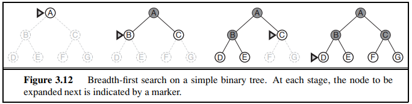
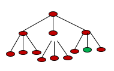
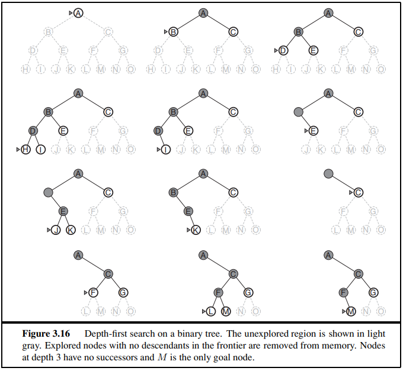
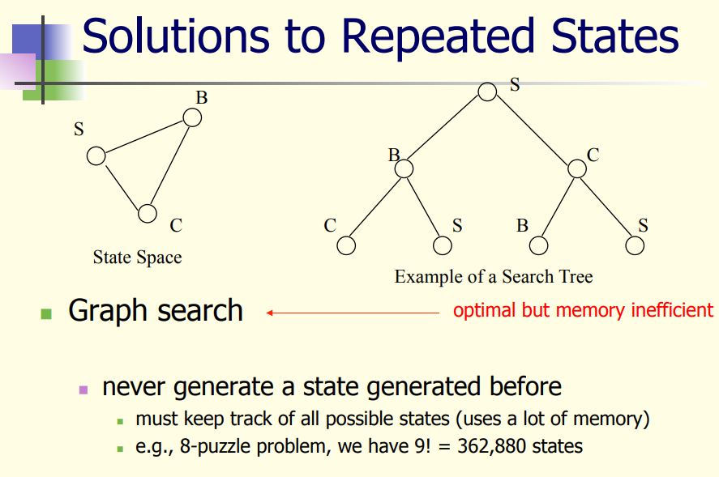
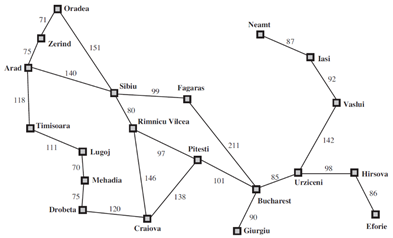
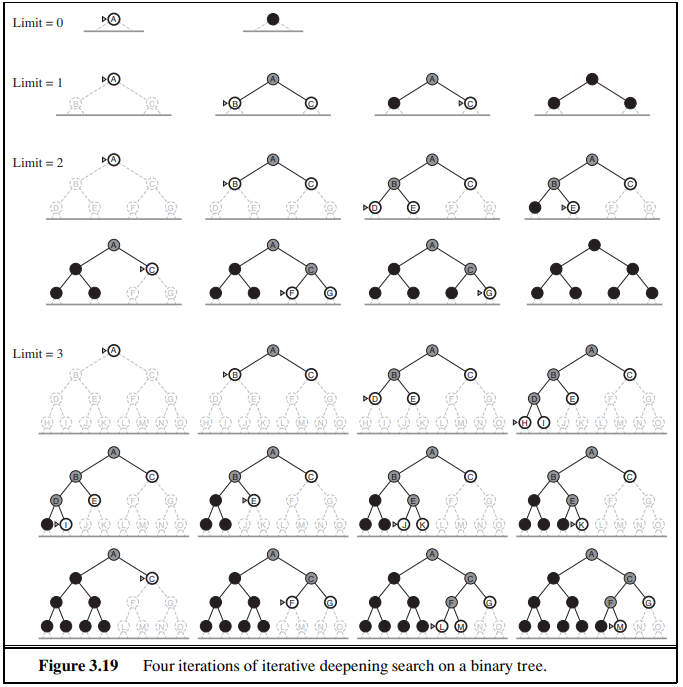
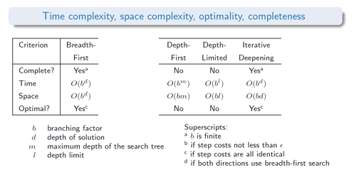

# SW06 - Uninformed / Systematic Search Strategies

## Topics

* Breadth-first search (Breitensuche)
* Depth-first search (Tiefensuche)
* Depth-limited search (Tiefenbeschränkte Suche)
* Iterative deepening search (Iterative Tiefensuche)

## What are uninformed search strategies?

> The term means that the strategies have no additional information about states beyond that provided in the problem definition. All they can do is generate successors and distinguish a goal state from a non-goal state. - AIMA Book, Chapter 3.4

Uninformed (also: *blind*) search strategies have no information on the length or cost of a path to the solution.

### Breadth-first search (Breitensuche)

> Breadth-first search is a simple strategy in which the root node is expanded first, then all the successors of the root node are expanded next, then their successors, and so on. In general, all the nodes are expanded at a given depth in the search tree before any nodes at the next level are expanded - AIMA, Chapter 3.4.1

it is an example for the general graph-search algorithm as show in Figure 3.7, in which the *shallowest* (nearest) unexpanded node is chosen for expansion.

This can be achieved by a FIFO queue:

* New nodes, which are by definition always deeper than their parent nodes, get to the back of the queue.
* Old nodes, which are shallower than new nodes, get expanded first.

Means: Nodes are expanded in the order they are produced (frontier is a **FIFO** queue.)

* It searches the state space layer by layer
* Is complete
* Always finds the shallowest (nearest) goal state first
  * if every action has identical, non-negative costs: solution is optimal
  * if actions have non-identical costs: solution is not optimal

### Time and Space Complexity

* $b$ is the maximal branching factor
* $d$ is the depth of a solution path

**Time complexity** describes the number of nodes we have to visit until we reach the goal node. Remember, time complexity is a worst case measure. As BFS expands all nodes at a given depth,  in the worst case, we'd have to visit all depths to find the target node. So the maximum number of nodes to expand is:
$$
b + b^2 + b^3 + \ldots+b^d \in O(b^d)= \sum_{n=0}^d{}b^n
$$
The first layer $b^0 = 1$ adds the odd number to the number of nodes in a binary tree (the root node).

**Space complexity** describes (also worst case) how many nodes have to be stored in memory. These nodes can be split up in  two sets: *frontier* and *explored*:

* Space for the frontier: $O(b^d)$ - see explanation below
* Space for the explored: $O(b^{d-1})$ - the set of explored nodes is the layer of nodes above the frontier, which have been previously expanded

Lets assume the green node is our target node and we have expanded all nodes above. The frontier would be all these 9 nodes at depth 3 ($b = 3; d=2; b^d = 9$):

### Depth-first search (Tiefensuche)

> Depth-first search always expands the *deepest* node in the current frontier of the search tree. The search proceeds immediately to the deepest level of the search tree, where the nodes have no successors. As those nodes are expanded, they are dropped from the frontier, so then the search “backs up” to the next deepest node that still has unexplored successor. - AIMA, Chapter 3.4.3

DFS always expands the deepest (i.e. most recent) node in the frontier. The frontier is a **LIFO** queue. If a node has no children, DFS will back up to the next deepest node that has unexplored children. The behavior of the depth-first search can be illustrated as ($M$ is the goal node):

#### Properties

In general, DFS can also be implemented as a graph-search or tree-search. But only the graph-search avoids repeated states and redundant paths is **complete** (and only in finite spaces) because it will eventually expand every node. 

The tree implementation is, however, not complete. As an example: In Figure 3.6 the algorithm will follow the Arad–Sibiu–Arad–Sibiu loop forever.

However, both implementation will fail in infinite spaces when an infinite non-goal path is encountered (it will just follow this infinite path forever).

TL;DR:

* Solution found is not optimal
* Completeness can only be guaranteed for the graph-based search and in finite spaces:
  * Graph-based search may loop forever in repeated states, additional checks have to be done. See example below:

[Source](https://www.ics.uci.edu/~welling/teaching/ICS171fall10/IntroSearch-3-fall10.pdf)

#### Time and Space Complexity

* $m$ is the depth of the search tree.
* $b$ is the branching factor of the search tree

Time complexity: $O(b^m)$:

* Worst case: all nodes have to be visited until a solution is found

Space complexity $O(bm)$:

* we only need to store the nodes  along the path from the root to the leaf node
* once a node has been expanded, it can be discarded from memory as soon as all its descendants have been fully explored
* However, there are additional costs to store the set of explored nodes.
* DFS needs less space than BFS!

### Depth-limited search (Tiefenbeschränkte Suche)

The problems that can occur with depth-first search can be circumvented by limiting the depth with a predetermined depth limit $l$. Nodes at the depth $l$ are treated as if they have no successors.

Take this map for example. There are 9 cities and the longest path is 9 (every city can be reached in at most 9 steps). Hence we can define the maximum depth as $l = n-1 = 8$

However, the limit must be larger than the depth of the shallowest (nearest) goal node. Otherwise, this node can not be reached. Therefore, Depth-Limited Search is not complete in general.

#### Time and Space Complexity

In general, it is incomplete since $l$ could be lower than the length of the shortest solution

Further, the first solution found may not be optimal

Similar to DFS, but $m = l$:

* Time complexity $O(b^l)$
* Space complexity $O(bl)$

### Iterative deepening search (Iterative Tiefensuche)

> Iterative deepening search (or iterative deepening depth-first search) is a general strategy, often used in combination with depth-first tree search, that finds the best depth limit. It does this by gradually increasing the limit—first 0, then 1, then 2, and so on—until a goal is found. This will occur when the depth limit reaches d, the depth of the shallowest goal node. The algorithm is shown in Figure 3.18. Iterative deepening combines the benefits of depth-first and breadth-first search - AIMA, Chapter 3.4.5

It performs a sequence of depth-limited searches with increasing depth limit.

It combines the advantages of BFS and DFS:

* Similar to BFS: complete if branching factor $b$ is finite
* Similar to BFS: optimal if all actions have the same cost
* Similar to DFS: only needs to store nodes along the path
* Time complexity is only slightly higher than DFS (since the iterative procedure, we have to visit more nodes)

	

#### Time and Space Complexity

$d$ is the minimal solution length

* Space complexity (same as the DFS): $O(bd)$
* Time complexity: $O(b^d )$ 

Some notes on the time complexity. Since we iterate over the nodes again and again, some nodes are visited more than once. An example:

Given the above search tree, we start with $l = 1$ and visited the first node. Then we increase $l = 2$ and visited the first node again and then the three following nodes, and so on.

In this case, $b=3; d=2$:

1. $l=0$ We visit the first node and reach $l$, abort.
2. $l = 1$ We visit the first node again and visit its children (once)
3. $l = 2$ We visit the first node again, its children again and the nodes below once

So the first node was visited 3 times $(d+1)$, its children 2 $(d)$ times and their children once $1$. Time complexity can be constructed as:
$$
(d + 1)b^0 + db^1 + (d-1)b^2 = (d+1) + db +1b^2
$$
The last term is equal to $b^d$, hence the most important term. Therefore, the time complexity is $O(b^d)$.

#### Application of iterative DFS

Iterative DFS is the method of choice when:

* A tree search is used
* All action costs are identical
* The solution depth is unknown

### Example for Complexity of Iterative DFS

$b = 10, d = 5$

* BFS: $1 + 10 + 100 + 1000 + 10k + 100k = 111111$
* Iterative DFS (using formula above): $6 + 50 + 400 + 3000 + 20k + 100k = 123456$

The number of nodes to visit in iterative DFS is only 11% higher than BFS.

## Summary

* **Iterative deepening** is the preferred uninformed search method when there is a large search space and the depth (length) of the solution is not known
* **DFS** is often used because of its minimal memory requirements
  * compact encodings of exponential-size explored node set exists
* **BFS** is rarely found in practice
  * this does not mean that there no applications, for which this would be the search methods of choice!

