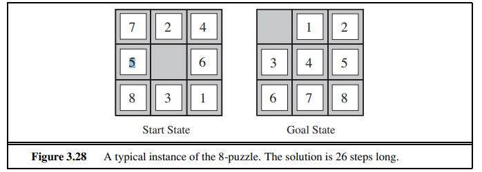
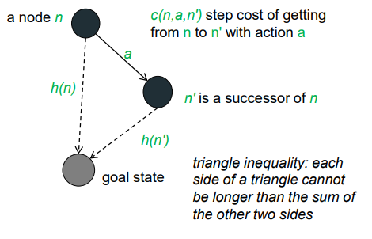
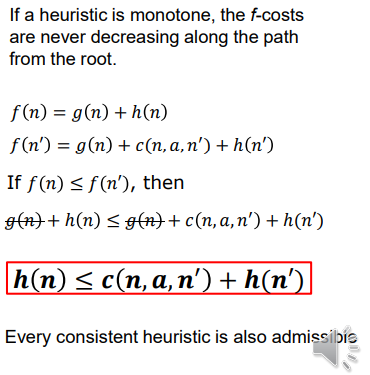
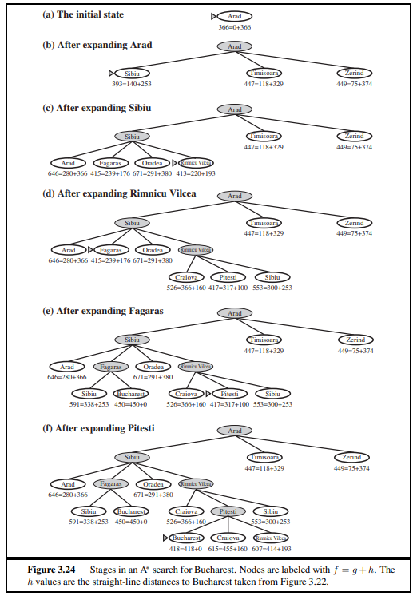
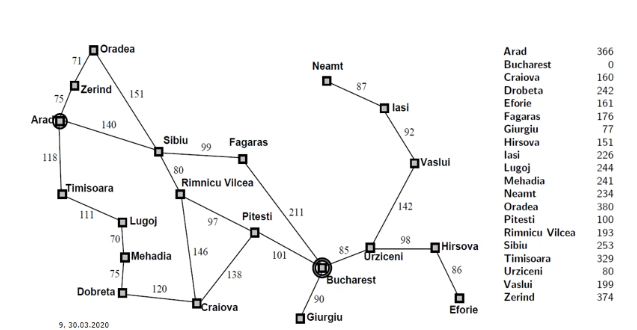
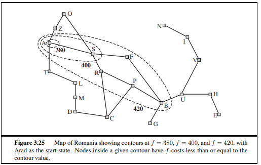
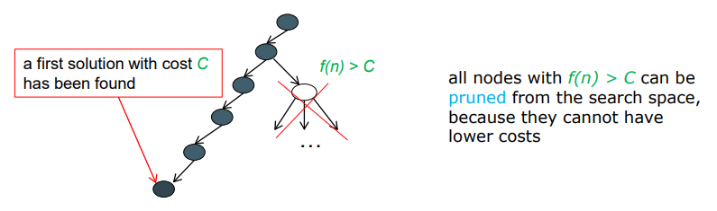
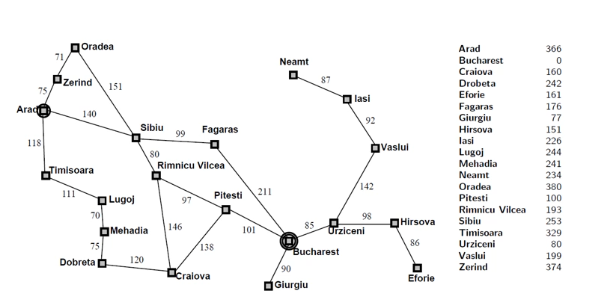

# SW07 - Heuristic and Local Search

Uninformed and informed (heuristic) search differ in how they determine the next node for expansion.

Uninformed search:

* A very rigid procedure, it has no knowledge of the **cost** from a node to the goal
* e.g. FIFO, LIFO queues

Informed (heuristic) search:

* Uses **knowledge** to navigate the search algorithm through the search space
* Evaluation function $f(n)$ assigns a real number to each node

### Evaluation function f(n)

The evaluation function $f(n) = g(n) + h(n)$ is composed by:

* $g(n)$: costs from the initial state to the current state (a precise value)
* $h(n)$ (the heuristic function): costs from the current state to the goal state  (an estimated value)

Note: $h(n)$ takes a node as input, but, unlike $g(n)$, it depends only on the state at that node.

### Heuristic function h(n)

> *Heuristic functions are the most common form in which additional knowledge of the problem is imparted to the search algorithm* - AIMA, chapter 3.5

The idea behind the heuristic function is to use knowledge about the **nature of the problem** to steer the search. This leads to more **efficient search**.

$h(n)$ is such a heuristic function:

* it describes the *estimated costs* from a node $n$ to the *goal state*
* the smaller the value of $h(n)$, the closer is $n$ to the goal
* Arbitrary, nonnegative, problem-specific functions ($h(n)$) with one constraint:
* if $n$ is the goal node, then $h(n) = 0$

Important properties of $h$:

1. $h(n) = 0$ if and only if $n$ is a goal state, otherwise $h(n) \gt 0$ 
2. $h$ ia admissible (see below)
3. $h$ is consistent

Good heuristics satisfy at least properties (1) and (2)!

### Example: 8-puzzle

What could be a heuristic function for the 8-puzzle?

Based on AIMA, Chapter 3.6. There are two candidates for a heuristic function, that are commonly used:

* $h1 =$ is the number of *misplaced* tiles in the initial state. In above figure, all tiles are misplaced compared to the goal state. Therefore, the initial state would have $h_1 = 8$. This heuristic is **admissible** since it is clear, that every tile has to be moved at least once.
* $h_2 =$ be the sum of the distances of each tile to its goal state. Keep in mind that the possible movements are only vertical (up & down) and horizontal (left & right). For instance, the tile $7$ needs at least $3$ steps to get to the goal position.

Both candidates do not overestimate the true solution cost: let the true solution cost be 26, then:

* $h1 = 8$ is smaller than 26
* $h2 = 3 + 1 + 2 + 2 + 3 + 2 + 2 + 3 = 18$ is smaller than 26

### Admissible heuristic (or optimistic, or zulässige Heuristik)

From AIMA, Chapter 3.5.2:

> An admissible heuristic is one that never overestimates the cost to reach the goal. Because $g(n)$ is the actual cost to reach $n$ along the current path, and $f(n) = g(n) + h(n)$, we have as an immediate consequence that $f(n)$ never overestimates the true cost of a solution along the current path through $n$.
>
> Admissible heuristics are by nature optimistic because they think the cost of solving the problem is less than it actually is. An obvious example of an admissible heuristic is the straight-line distance that we used in getting to Bucharest. Straight-line distance is admissible because the shortest path between any two points is a straight line, so the straight line cannot be an overestimate.

Let $h^*(n)$ be the **real** costs of the optimal path from node $n$ to the goal. $h$ is said to be admissible if it guarantees for all $n$:
$$
h(n) \le h^*(n)
$$
So, $h$ is an optimistic estimation of the costs that actually occur, it underestimates the real costs. In the exmaple of Romania, the aerial distance will always be smaller (or eqal) than the path costs to the goal location.

### Consistent $h(n)$

> A second, slightly stronger condition called consistency (or sometimes monotonicity) is required only for applications of $A^∗$ to graph search. A heuristic $h(n)$ is consistent if, for every node $n$ and every successor $n'$ of $n$ generated by any action $a$, the estimated cost of reaching the goal from n is no greater than the step cost of getting to $n$ plus the estimated cost of reaching the goal from $n$: 

$$
h(n) \le c(n, a, n') + h(n')
$$

In order that graph searches are *optimal*, the heuristics $h(n)$ must be consistent (aka monotone). A heuristic is said to be consistent if the f-costs never decrease along the path from the root.

Consistency is the stronger / stricter criteria than admissible, therefore all consistent heuristic is also admissible.

This consistency is illustrated here:

$h(n)$ must therefore be less or equal than the path via $n'$. This can be explained by the triangle inequality.

Example: Are aerial distances in a route finding search a consistent heuristic? Why?

// TODO: A: IS IT??

### A* Algorithm

The a-star algorithm considers both the heuristics $h(n)$ and the path cost $g(n)$.
$$
f(n) = g(n) + h(n)
$$
It is a tradeoff between the path costs and the proximity to the goal.

A* stops searching when frontier is empty or goal node was **selected for expansion**. Selected for expansion means, that this node will be expanded next based on the expansion criterias. It is not sufficient for the goal node to be in the frontier, it has to be actively selected by the algorithm.

The straight-line distances to the goal are known / provided to the algorithm.

### Exercise: A* search from Arad to Bucharest

$h(n)$ be the aerial distance to Bucharest. Perform an A* search from Arad to Bucharest.

$g(n)$ is the path distance of a node $n$ to the start node Arad. This is a precise value and known to the algorithm.

1. We expand Arad and apply the evaluation function $f(n)$ to all nodes in the frontier, we then choose the node based on the lowest evaluation value:
   1. $f(\text{Zerind}) = g(Zerind) + h(Zerind) = 75 + 374 = 449$
   2. $f(Timisoara) = 118 + 329 = 447$
   3. $f(Sibiu) = 140 + 253 = 393$
   4. frontier = $\{(Zerind, 449), (Timisoara, 447), (Sibiu, 393)\}$
   5. Sibiu is the node with lowest evaluation function, therefore go to Sibiu
2. Expand Sibiu and apply evaluation function:
   1. $f(Fagaras) = g(n) + h(n) = (140 + 99) + 176 = 415$
   2. $f(R.V.) = (140 + 80) + 193 = 413$ 
   3. $f(Oradea) = (140 + 151) + 380 = 671 $ 
   4. Frontier: $\{(Zerind, 449), (Timisoara, 447), (Fagaras, 415), (R.V, 413), (Oradea, 671)\}$
   5. Select $R.V.$
3. Expand R.V.:
   1. $f(Pitesti) = (140 + 80 + 97) + 100 = 417$
   2. $f(Craiova) = (140 + 80 + 146) + 160 = 526$
   3. Frontier: $\{(Zerind, 449), (Timisoara, 447), (Fagaras, 415),(Oradea, 671), (Pitesti, 417), (Craiova, 526)\}$
   4. Now, Fagaras has the lowest value, so we choose another path via Fagaras (not considering Pitesti or Craiova anymore).
4. Expand Fagaras
   1. $f(Bucharest) = (140+99+211) + 0 = 528$
   2. Frontier: $\{(Zerind, 449), (Timisoara, 447), (Oradea, 671), (Pitesti, 417), (Craiova, 526), (Bucharest, 528)\}$
   3. Since goal node has to be **selected**, we have to continue. Select Pitesti
5. Expand Pitesti:
   1. $f(Bucharest) = (101 + 97 + 80 + 140) + 0 = 418$
   2. $f(Craiova) = (138 + 97 + 80 + 140) + 160 = 615$
   3. Frontier: $\{(Zerind, 449), (Timisoara, 447), (Oradea, 671),(Craiova, 526), (Bucharest, 418), (Craiova, 615)\}$
   4. (Note: we replaced the value of Bucharest with the newest value)
   5. Select node with lowest value, which is Bucharest. The goal node was selected, abort search and return path: $ Arad  \rightarrow Sibiu  \rightarrow RV  \rightarrow Pitesti \rightarrow Bucharest$ 

// TODO **Warum bei f(Oradea) nicht (71 + 75) -> aha, weil der Such graph nach unten zeigt, Oradea ist ein Child Node von Sibiu**

#### Properties

A* is complete:

* if a solution exists, A* will find it - given that:
  * every node has a finite number of successor nodes
  * each action has positive & finite costs

A* is optimal:

* first solution found has minimum path cost, if $h$ is admissible (on trees) or if $h$ is consistent (on graphs)
* under an **only** admissible heuristics on graphs, A* needs to expand all nodes with $f(n) \le C^*$ (where $C^*$ is the cost of optimal solution)

Complexity:

* Space & time complexity are exponential in the path length of the solution
* This behaviour is **not practical for large-scale problems**

#### f(n)-based Contours in a Search Space

> The fact that f-costs are nondecreasing along any path also means that we can draw **contours** in the state space, just like the contours in a topographic map. Figure 3.25 shows an example. Inside the contour labeled 400, all nodes have f(n) less than or equal to 400, and so on. Then, because A∗ expands the frontier node of lowest f-cost, we can see that an A∗ search fans out from the start node, adding nodes in concentric bands of increasing f-cost. AIMA - 3.5.2

* A* fans out from the start node, adding nodes in concentric bands of increasing $f(n)-costs$
* Good heuristics can be seen, if the bands stretch *towards the goal* and are narrowly *focused around the optimal path*.
* Nodes with $f(n) > C^*$ are pruned. 

### Branch and Bound Under Admissible Heuristics

A* on graphs finds a first solution s with cost C:

* if $h$ is consistent, s is the optimal solution and the algorithm can stop
* if h is only admissible, A* needs to expand all nodes with lower or equal costs than C, until only nodes with f(n) > C are left to be sure that s is the optimal solution

## Uniform-cost and Greedy Search (Optional)

* A* uses: $f(n) = g(n) + h(n)$
* Uniform-cost search: $f(n) = g(n)$
* Greedy search: $f(n) = h(n)$

A* is the combination of a uniform-cost and greedy search.

## Iterative Deepening A*

The problem with A* is, that is requires exponential memory (in the worst case). Similar to the iterative-deepening DFS (see Systematic Search), we can also use successive iterations here. But, compared to DFS, it does use the f-cost ($g + h$) instead of the depth.

Each iteration performs a depth-first search and cuts offs a branch when its total cost is:
$$
f(n) = g(n) + h(n) > threshold
$$
* The threshold starts at the estimate of the cost of the initial state and increases for each iteration of the algorithm.
* At each iteration, the threshold used for the next iteration is the minimum cost of all values that exceeded the current threshold

#### Properties

* IDA* is optimal if $h$ is admissible
* Space complexity is reduced to $O(lb)$, where
  * $l$ is the length of the longest generated path
  * $b$ is the branching factor
* Compared to A* potentially considerable overhead because no duplicates are detected
  * Often combined with partial duplicate elimination
* Overhead due to iterative increases of f bound often negligible, but not always

#### Example:

1. Iteration: F-bound (aka threshold) = f(Arad) = 366
   1. Expand Arad: $\{(Zerind, 449), (Sibiu, 393), (Timisoara, 447)\}$
   2. All costs are higher than our f-bound. Therefore, abort the iteration and set the threshold for the next iteration to $min(frontier) = 393$.
2. Iteration: F-bound = 393
   1. Expand Arad: $\{(Zerind, 449), (Sibiu, 393), (Timisoara, 447)\}$
   2. Cut off Zerind and Timisoara, since f > f-bound. Only Sibiu is left.
   3. Expand(Sibiu) : $\{(Fagaras, 415), (RV, 413), (Oradea, 671)\}$
   4. All f > f-bound, abort and set f-bound to 413
3. Iteration: F-Bound = 413
   1. Expand Arad: $\{(Zerind, 449), (Sibiu, 393), (Timisoara, 447)\}$
   2. Cut off Zerind and Timisoara, since f > f-bound
   3. Expand(Sibiu) : $\{(Fagaras, 415), (RV, 413), (Oradea, 671)\}$
   4. Cut off Fagaras, Oradea
   5. Expand(RV) = ${(Pitesti, 417), (Craiova, 526)}$
   6. All f > f-bound
4. Iteration: F-Bound: 415
   1. Why 415 and not 417 you ask? f-bound: mininum cost of all values that exceeded the current threshold
   2. Expand Arad: $\{(Zerind, 449), (Sibiu, 393), (Timisoara, 447)\}$
   3. Cut off Zerind and Timisoara, since f > f-bound
   4. Expand(Sibiu) : $\{(Fagaras, 415), (RV, 413), (Oradea, 671)\}$
   5. Expand(Fagaras) -> tiefensuche, zuerst diesen Pfand entlang statt RV
   6. Expand(Fagaras): (Bucharest, 528)
   7. Cut Bucharest
   8. Expand(RV) = {(Pitesti, 417), (Craiova, 526)}
   9. f > f-bound
5. Itereation: F-Bound: 417
   1. Why 415 and not 417 you ask? f-bound: mininum cost of all values that exceeded the current threshold
   2. Expand Arad: $\{(Zerind, 449), (Sibiu, 393), (Timisoara, 447)\}$
   3. Cut off Zerind and Timisoara, since f > f-bound
   4. Expand(Sibiu) : $\{(Fagaras, 415), (RV, 413), (Oradea, 671)\}$
   5. Expand(Fagaras) -> tiefensuche, zuerst diesen Pfand entlang statt RV
   6. Expand(Fagaras): (Bucharest, 528)
   7. Cut Bucharest
   8. Expand(RV) = {(Pitesti, 417), (Craiova, 526)}
   9. Cut Craiova, expand(Pitesti) = {(Craiova, 615),(Bucharest, 418)}
   10. f > f-bound
6. Iteration: F-Bound: 418
   1. Why 415 and not 417 you ask? f-bound: mininum cost of all values that exceeded the current threshold
   2. Expand Arad: $\{(Zerind, 449), (Sibiu, 393), (Timisoara, 447)\}$
   3. Cut off Zerind and Timisoara, since f > f-bound
   4. Expand(Sibiu) : $\{(Fagaras, 415), (RV, 413), (Oradea, 671)\}$
   5. Expand(Fagaras) -> tiefensuche, zuerst diesen Pfand entlang statt RV
   6. Expand(Fagaras): (Bucharest, 528)
   7. Cut Bucharest
   8. Expand(RV) = {(Pitesti, 417), (Craiova, 526)}
   9. Cut Craiova, expand(Pitesti) = {(Craiova, 615),(Bucharest, 418)}
   10. Expand(Bucharest) = DONE

1. Iteration: F-Bound 51
   1. Expand(RV) = ${(Pitesti, 417), (Craiova, 526)}$
   2. Cut off Craiova
   3. Expand(Pitesti) = $\{(Bucharest, 418), (Craiova,  455)\}$
2. Iteration: F-Bound: 418
   1. Expand Arad: $\{(Zerind, 449), (Sibiu, 393), (Timisoara, 447)\}$
   2. Cut off Zerind and Timisoara, since f > f-bound
   3. Expand(Sibiu) : $\{(Fagaras, 419), (RV, 413), (Oradea, 671)\}$
   4. Cut off Fagaras, Oradea
   5. Expand(RV) = ${(Pitesti, 417), (Craiova, 526)}$
   6. Cut off Craiova
   7. Expand(Pitesti) = $\{(Bucharest, 418), (Craiova,  455)\}$
   8. Expand(Bucharest) Done.

## How to find good heuristics

< ab hier überarbeiten >

Heuristic - educated guess, rules of thumb => helps to solve a problem (informal)

When designing heuristic functions, keep in mind:

* informdness is critical for success for the search algo
* requires an understanding of the application domain

## Local Search

> [Previous chapters] addressed a single category of problems: observable, deterministic, known environments where the solution is a sequence of actions. AIMA, Chapter 4

> The search algorithms that we have seen so far are designed to explore search spaces systematically. This systematicity is achieved by keeping one or more paths in memory and by recording which alternatives have been explored at each point along the path. When a goal is found, the path to that goal also constitutes a solution to the problem. In many problems, however, the path to the goal is irrelevant. For example, in the 8-queens problem (see page 71), what matters is the final configuration of queens, not the order in which they are added. The same general property holds for many important applications such as integrated-circuit design, factory-floor layout, job-shop scheduling, automatic programming, telecommunications network optimization, vehicle routing, and portfolio management. 

>  If the path to the goal does not matter, we might consider a different class of algorithms, ones that do not worry about paths at all. Local search algorithms operate using a single current node (rather than multiple paths) and generally move only to neighbors of that node. Typically, the paths followed by the search are not retained. Although local search algorithms are not systematic, they have two key advantages:
>
> 1. they use very little memory—usually a constant amount; and
> 2. they can often find reasonable solutions in large or infinite (continuous) state spaces for which systematic algorithms are unsuitable

In applications, where only the solution itself is important rather than the path to it, local search is applied.

It works by starting with a randomly generated, partial solution which is then improved:

1. Start *somewhere* in the search space
2. Apply an evaluation function to each node
3. Steer towards the better evaluated nodes
4. Sometimes, move elsewhere (??)

Altough not being systemtic, it has the advantage to use **very little memory** while often finding **reasonable solutions** in large state spaces.

### Hillclimbing

Also: Steepest Ascent Search, Greedy Local Search

AIMA 4.1.1

---

* Hillclimbing
* Local maxima & minima
* Plateaus
* Ridges
* Tabu Search
* Escape Technqiues

## Summary Questions

1. How do local and systematic search methods differ?
2. How does **hillclimbing** work?
3. What can we say about the theoretical properties of local search methods?
4. What techniques exist to escape from **local optima** and **plateaus**?
5. Why does local search often work well in practice?

