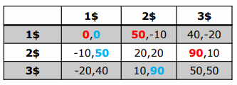
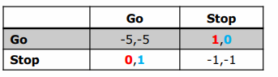
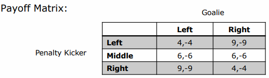

# Game Theory

## What is Game Theory?

It is the study of strategically interdependent behavior. Strategic interdependence means that whatever a player A does affects players B outcome and vice-versa.

### Theory of Rational Choice

Competitive decision making assumes rationality. The action chosen by a decision-maker is at least as good, according to her preferences, as every other available action.

An example with Game Theory: if two rational agents want to divide a cake, while each agent wants the largest possible piece, it is possible to provide fairness. The first agent cuts the cake and the other agent choose the piece that he likes more (i.e. the bigger piece). Using this approach, fairness can be guaranteed while both agents want as much as possible for themselves.

### Prisoner's Dilemma

Two suspects are arrested. They are accused of robbing a store. The law enforcement officers do not have enough evidence to actually arrest them for that crime, they only have evidence that these suspects trespassed. Therefore, the officers need one of the suspects to testify against the other suspect. The two suspects are interrogated separately, without knowing what the other does.

The officer gives each suspect following options:

* If neither of the suspects testify against each other: both are put in jail for one month (for trespassing)
* If one suspect testify against the other and the other remains silent: the "rat" gets out of jail for free (0 months of jail) while the other suspect is put in jail for 12 months
* If both testify against each other: Both suspects are put in jail for 8 months

We assume that each suspect wants to minimize **their individual** time in jail, what should they do?

Therefore, we are transforming the above information into a **payoff matrix**:

|                 | Player 2        |              |
| --------------- | --------------- | ------------ |
| **Player 1**    | Keep Quiet (p2) | Confess (p2) |
| Keep Quiet (p1) | -1, -1          | -12, 0       |
| Confess (p1)    | 0, -12          | -8, -8       |

Both players have two strategies: Confess or keep quiet. Let's examine each players options. Hence we assume rationality, none of the suspects will choose an option that is worse than an other.

If Player 1 somehow knows, that player 2 keeps quiet, he can either keep quiet too and get 1 month of jail time or confess, leaving him with no jail time. Since $0 > -1$, he is picking the least bad option and confesses. But if player 1 somehow knows that player 2 is confessing, he is left with either keeping quiet and gets 12 months or confess and get 8 month. Since $-8 > -12$ he is also going to confess. That same options are valid for player 2.

Here, confessing is a strategy that strictly dominated the strategy of keeping quiet. Since confessing always leaves a player with a greater payoff (either 0 or 1 month) than with keeping quiet (8 or 12 months). Therefore we say, confessing **strictly dominates** keeping quiet or keeping quiet is strictly dominated by confessing.

Rational players will never play **strictly dominated** strategies, since there is no point in keeping quiet when confessing results in a greater payoff.

Therefore, the outcome will be that both player confess and both are put in jail for 8 months.

> Rational choice sometimes leads to outcomes that suck (Ben Polak)

### Prisoner's Dilemma as a Strategic Game (Formal)

* **Players:** Player A, Player B
* **Actions:** keep quiet, confess
* **Action Profiles**: (quiet, quiet), (quiet, confess), (confess, quiet), (confess, confess)
* **Player A preference order**:
  * (confess, quiet) > (quiet, quiet) > (confess, confess) > (quiet, confess)
  * u(confess, quiet) = 0 > u(quiet, quiet) = 1 > u(confess, confess) = 8 > u(quiet, confess) = 12
* **Player B preference order**:
  * (quiet, confess) > (quiet, quiet) > (confess, confess) > (confess, quiet)
  * u(quiet, confess) = 0 > u(quiet, quiet) = 1 > u(confess, confess) = 8 > u(confess, quiet) = 12

u = utility; > means "is better option than"

#### Best Response Function

**Question**: What is your best action if you know all others players' actions?

**Answer**: The best possible action is the one that maximizes your payoff

> This is where the rationality assumption comes into play: When you know the choices of all other players, it would not be rational to play any other action than the best response action

## What is a Nash Equilibrium?

A Nash equilibrium is a set of strategies (one for each player), such that no player has incentive to change their strategy given what the other player(s) are doing. An action profile is a pure strategy Nash equilibrium if every player's action is a best response to every other players action.

In the prisoners dilemma, (confess, confess) is a Nash equilibrium. Imagine after the first round of interrogation, both players have made their choice to confess. The officers appear again, tell them that both have to go to jail for 8 months and offer each player to change their testimony. Both players will not change their testimony, since the options are worse. This state (confess, confess) is therefore a Nash equilibrium since none of the players would deviate from their testimony (equilibrium = gleichgewicht)

 It is called a dilemma, since while none of the players have incentive to deviate although the outcome (confess, confess) is not optimal.

There may be zero, one or many pure strategy Nash equilibrium in a given game.

### Exercise

A Nash Equilibrium is a steady state of which no rational person has an incentive to deviate.

> Coke (1) and Pepsi (2) compete in prices. They can sell their product for 1, 2 or 3 dollars. The company that charges a lower price will get more customers and thus, within limits, more profit than the higher-price competitor. Payoffs indicate net gain in M$.

|        | 1$      | 2$      | 3$      |
| ------ | ------- | ------- | ------- |
| **1$** | 0,0     | 50, -10 | 40, -20 |
| **2$** | -10, 50 | 20, 20  | 90, 10  |
| **3$** | -20, 40 | 10, 90  | 50, 50  |

1$ is roughly the price for break-even (production, marketing etc.)

Coke's perspective:

* If pepsi sells it for 1$:

  * selling it for $1 results in 0\$ profit
  * selling it for $2 results in -10\$ profit
  * selling it for 3$ results in -20\$ profit
  * Hence Coke would choose $1 (0 profit)

* If pepsi sells it for 2$

  * selling it for 1$ results in 50\$ profit
  * selling it for 2$ results in 20\$ profit
  * selling it for 3$ results in 10\$ profit
  * hence Coke would choose $1 (50 profit)

* If pepsi sells it for 3$

  * selling it for 1$ results in 40\$ profit
  * selling it for 2$ results in 90\$ profit
  * selling it for 3$ results in 50\$ profit
  * hence Coke would choose $2 (90 profit)

  same rules apply to pepsi

Unfortunately, there is no best response. If, for coke, a row exists to choose where it is always the best option that would be the best response (e.g. choosing 1$ 3x). There is no dominant strategy.

3$ is never a best response, hence it is a dominated action for both players.

There is only one cell (1$, 1\$), where the outcomes was colored by both companies. (1, 1) is a Nash equilibrium: If it is known that the other company sells it for 1, the other party would not want to derivate since it only gets worse (-10, -20).

#### Exercise: Nash Equilibrium for Law Enforcement

A Nash Equilibrium can be seen as a law that no rational person would want to break even in the absence of a police force.

> Suppose that two cars are driving at each other from perpendicular directions. The stoplight is red for one of them and green for the other. If the police could not ticket the driver, would they want to break the law? Payoffs stand for the driver’s happiness.

|               | Go (D2) | Stop (D2) |
| ------------- | ------- | --------- |
| **Go (D1)**   | -5, -5  | 1, 0      |
| **Stop (D1)** | 0, 1    | -1, -1    |

* There are no dominant strategies

  * no row is completely red and no column is blue -> hence no dominant actions
  * There is no row that *never* contains red - hence no dominated action for player 1
  * There is no column that *never* contains blue - hence no dominated action for player 2

* There are two Nash Equilibrium: (Go, Stop), (Stop, Go) - hence after this, no driver will derivate since it only gets worse (-1 or -5). Cells that are completely colored are Nash equilibria.

  

|               | Go (D2)    | Stop (D2)  |
| ------------- | ---------- | ---------- |
| **Go (D1)**   | -5, -5     | **1**, *0* |
| **Stop (D1)** | **0**, *1* | -1, -1     |

#### Exercise: Penalty Game

* Players: Penalty Kicker (1) vs. Goalie (2)
* Goalie actions: jump left, jump right
* Kicker actions: shoot left, middle, right

From statistics:

* If kicker shoots left and goalie jumps left, kicker has 40% chance of scoring
* If kicker shoots left and goalie jumps right, kicker has 90% chance of scoring
* If kicker shoots to the middle, kicker has 60% chance of scoring

## Topics:

* Definition of a Game
* Payoff Matrix
* Best Response Function & pure strategy nash equilibrium
* Games with zero or one pure strategy Nash equilibrium
* Mixed Strategies
  * Nash Equilibrium & its application in Sports
* Sequential Games
  * diff zu simultaneous
  * two player games with perfect information
  * game trees
  * theorem of Zermelo
  * Backward Induction
  * Nash Equilibrium in Sequential Games
  * 