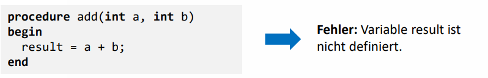
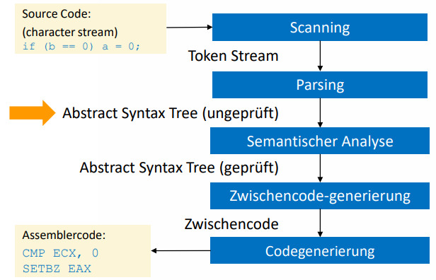
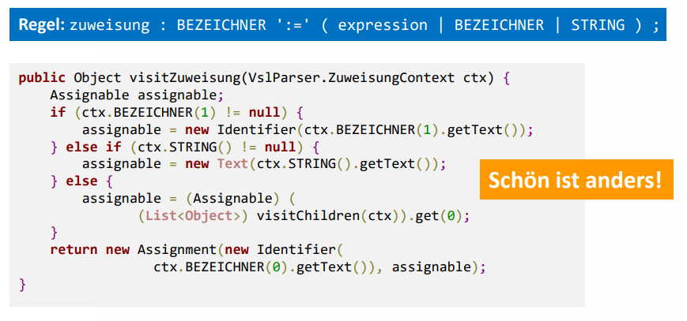
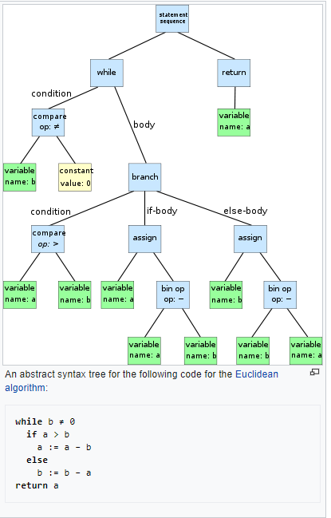
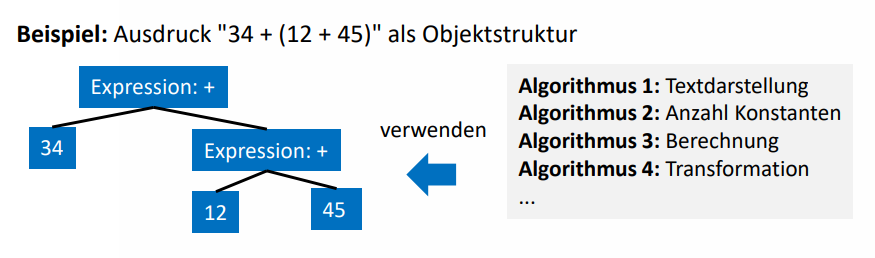

# Frontend: Visitor-Pattern und Abstract-Syntax-Trees

## Semantische Analyse

Kontextfreie Grammatiken sind begrenzt. Beispielsweise ist das Programm (links) syntaktisch korrekt, jedoch semantisch nicht.

Solche Fehler sind ein Fall für die semantische Analyse. Diese Analyse ordnet sich wie folgt in den Phasen ein:

(Note: Zwischencode-generierung wird in COBAU nicht behandelt).

Der Scanner produziert somit ein Token Stream welcher dem Parser übergeben wird. Der Parser produziert daraus einen **Parse-Tree** (in Grafik = AST (ungeprüft)). Dieser entspricht ziemlich genau der definierten Grammatik. 

In einfachen Fällen kann mit dem Parse-Tree weitergearbeitet werden, zum Beispiel bei simplen Dateiformaten wie CSV oder einer Konfigurationsdatei. Bei komplexen Grammatiken wie Programmiersprachen ist der Parse-Tree aber eher ungeeignet. 

Im Folgenden ist ein Beispiel, wie das aussehen würde:

ANTLR-Schnittstellen zum Parse-Tree:

* Interface: Visitor
  * Verarbeitung **nach** dem Erstellen des Parse-Tree
  * Elemente werden *besucht* in der Reihenfolge des Parse-Tree (Visitor Pattern)
* Interface: Listener
  * Events **während** des Parsens
  * Ordnung der Events nicht vorhersehbar: Events in der Reihenfolge des Parsens, welche z.T. nicht wie erwartet ist (Backtracking).
* Inline-Anweisungen
  * Annotation der Parsing-Regel mit Programmcode
  * Code & Grammatik gekoppelt (älteres Paradigma)

## Abstract Syntax Tree (AST)

* Parse-Tree ist für die weitere Verwendung im Compiler eher ungeeignet
* Daher wird der Abstract Syntax Tree eingeführt. Der ist zwar recht starr, wird aber von vielen Algorithmen verwendet

Der Abstract Syntax Tree hat diverse Eigenschaften, welche im Kompilationsprozess helfen:

* Elemente können verändert und mit Informationen angereichert werden. Der Parse-Tree kann nicht verändert werden, sonst würde der Source Code verändert. Diese Abstraktion erlaubt diese Erweiterung.
* Im Vergleich zum Parse Tree beinhaltet der AST keine Punctuation oder Delimiter (Klammern, etc)
* Der AST beinhaltet auch zusätzliche Informationen über das Programm da er über mehrere Kompilationsphasen existiert. So kann er beispielsweise die Position jedes Elementes im Source Code beinhalten, um z.B. Fehlermeldungen am richtigen Ort zu platzieren.

### Beispiel

Folgende Grafik zeigt ein Beispiel eines AST für den Euklidischen Algorithmus:

## Visitor Pattern

* Gängige Implementationsform für Compiler, die Verwendung des Visitor Patterns
* Visitoren kapseln dabei die verschiedenen Compliationsphasen

* Trennt strikt Datenstruktur und Algoritmus
* Algorithmen sind die "Besucher", welche die Datenstruktur besuchen

