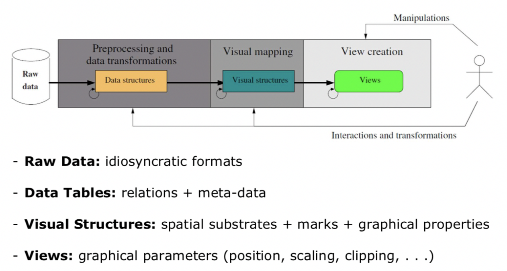
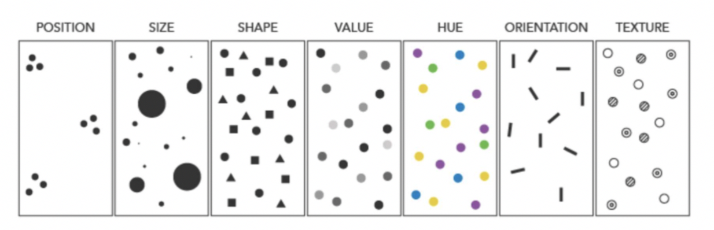

# Datenvisualisierung

## Referenzmodell für die Visualisierung

## Visuelle Variablen nach Bertin

Quelle: https://www.axismaps.com/guide/general/visual-variables/ 

## Design von visuellen Anwendungen nach Mazza

*TLDR;*:
	- Was
	- Für wen
	- Wozu
	- Wie

> The main problem in designing a visual representation lies in creating visual mapping that, on the one hand, faithfully reproduces the information codified in the data and, on the other, facilitates the user in the redetermined goal. ..., there is no way to know, given a collection of abstract data, which type of visual representation is suitable for such data. This depends on the nature of the data, the type of user it’s designed for, the type of information that has to be represented, and its use, but also on the creativity, experience, and ability of the representation’s designers. In these cases, the most precious and important information comes to us from potential users of the visual application, those who will use the system and ordain its success or failure. Believe it or not, most authors of works of visual representation of information don’t carry out preliminary research ...
(Mazza 2009, p 24)

## Prinzipien des analytischen Designs nach Tufte

Folgende Prinzipien des analytischen Designs werden von Tufte beschrieben:
  1. **Comparisons**: Show comparisons, contrasts, differences.
  2. **Causality**: Show causality, mechanisms, explanation, systematic structure.
  3. **Multivariate analysis**: Show multivariate data, that is, show more then 1 or 2 variables.
  4. **Integration of evidence**: Completely integrate words, numbers, images, diagrams.
  5. **Documentation**
  6. **Content counts most of all**: Analytical presentations ultimately stand or fall depending on the quality, relevance, and integrity of their content. 

Quelle: http://atc.berkeley.edu/201/readings/Tufte_BE_2006.pdf 

### Relation der Prinzipien mit der Karte von Minard

Folgende Relationen konnten u.a. identifiziert werden:
  1. Der Armeebestand wird verglichen, *ausgehend* und *eingehend* mit unterschiedlicher Farbe. Dabei wird der Armeebestand untereinander resp. übereinander dargestellt.
  2. Kausalität ist nur schwach dargestellt. Ein Hinweis ist die Veränderung Armeebestandes im Bezug auf die sich verändernde Temperatur (*eingehend*). Es werden jedoch weitere Informationen benötigt um Kausalität herzustellen.
  3. Es werden mehrere Dimensionen dargestellt: u.a. Temperatur, Armeebestand und Richtung der Armee.
  4. Die Karte wird mit Text, Elementen aus einer echten Karte (Flüsse), Tabellen, Beschreibungen und Überschriften annotiert, welche gewissermassen Beweise liefern.
  5. Es werden Informationen zur Kredibilität dokumentiert: Kurzbeschreibung der dargestellten Information, Author, Erstellungsort- und Datum, Quellen, Annahmen, Skalen der Messung, Veröffentlichungsdatum und Verleger.
  6. Im Fokus stehen die Verluste der Armee. Da nie Napoleon erwähnt wird, zeigt dies umso mehr.

### Identifikation der verwendeten Visualisierungsformen

Folgende Visualisierungsformen wurden u.a. verwendet:
  1. Armeebestand wird durch eine eingefärbte Fläche dargestellt. Diese verändert sich im Verlauf der Zeit, dargestellt durch den Verlauf der Strecke.
  2. Temperatauren werden mittels einer Tabelle dargestellt.
  3. Ort und Richtung der Armee wird mit der Position der eingefärbten Fläche und Ausschnitten von echten Karten (Flüsse) dargestellt.
