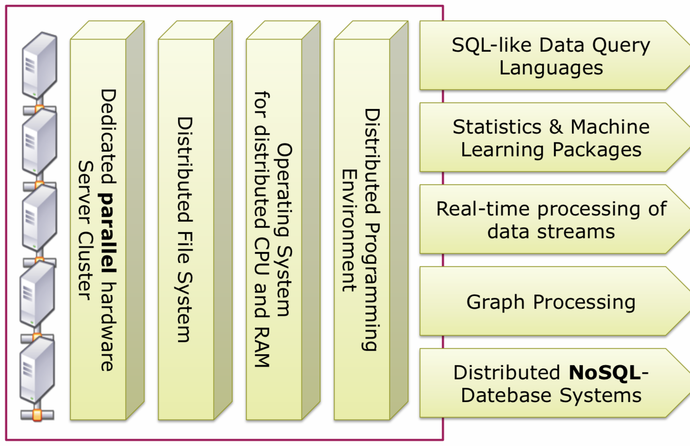
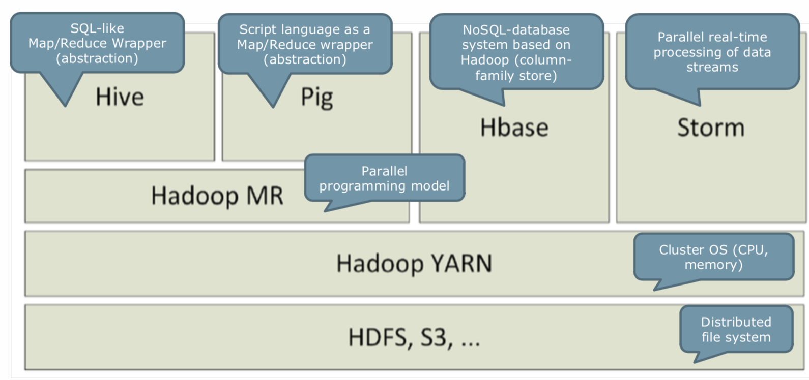

# Big Data Management

## Lernziele

### Einige Probleme aufzeigen, mit welchen uns Big Data konfrontiert

> The volume of data availabble to organizations today is on the rise, while the percent of data they can analyze is on the decline.

**TODO: konkrete Probleme und Beispiele**

### Erklären, was Big Data ist, und was es nicht ist

Nach dem US National Institute for Standards and Technology (NIST)  wird Big Data wie folgt definiert:
> Big Data consists of extensive datasets primarily in the characteristics of volume, variety, velocity, and/or variability that require a scalable architecture for efficient storage, manipulation, and analysis.

Siehe auch [Database Theory, Big Data: 3V](./database-theory.md#big-data-3v)

Des weiteren ist Data Science nach NIST Data Science wie folgt definiert:
> Data science is the extraction of actionable knowledge directly from data through a process of discovery, or hypothesis formulation and hypothesis testing.

Demnach ist Big Data **/=** Data Science!

Auch ist Big Data nicht einer spezifischen Technologie wie z.B. Hadoop zuordbar.
Nach NIST wird der Inhalt des Big Data Paradigmas wie folgt definiert:
> The Big Data paradigm consists of the distribution of data systems across horizontally coupled, independent resources to achieve the scalability needed for the efficient processing of extensive datasets.

### Werkzeuge und Werkzeug-Stacks erklären, welche zur Verarbeitung von sehr grossen Datenmengen und sehr schnellen Datenströmen verwendet werden können.

Ein Big Data Stack ist in der Regel wie folgt aufgebaut:

Die zwei wohl bekanntesten und verbreitetsten Big Data Stacks sind der Hadoop Stack und der Berkeley Data Analytics Stack (BDAS).
Ein zentrales Element beider Stacks ist das Hadoop Distributed File System (HDFS), eine kurze Erklärung dazu ist weiter unten zu finden.

**Hadoop Stack**

**BDAS**

BDAS basiert auf der Processing Engine **Apache Spark** (nativ ansprechbar mittels Java, Scala, Python und R).

Im Stack beinhaltet sind folgende Libraries/Interfaces:
- **Spark Streaming**: Library für Batch-ähnliches Stream Processing
- **Spark SQL**: Einheitliche SQL Library für diverse Datasources (Hive, Arvo, Parquet, JSON, JDBC, usw.)
- **GraphX**: Library für die Verarbeitung von Graphen
- **Splash**: Library für stochastische Learning Algorithmen
- **MLlib**: Libraary für Machine Learning

Im Stack beinhaltet sind folgende Storage Systeme:
- **Succint**: Direkte und effiziente Queries auf komprimierten Daten, siehe [Succint Website](http://succinct.cs.berkeley.edu/wp/wordpress/?page_id=127)
- **Alluxio (früher Tachyon)**: Virtuell verteiltes Storage System mit Memory Spped, siehe [Alluxio Website](https://www.alluxio.org/docs/1.8/en/Overview.html)
- **HDFS**: Siehe weiter unten
- **S3**: Siehe [Amazon Website](https://aws.amazon.com/de/s3/)
- **Ceph**: Siehe [Ceph Website](https://ceph.com/)

Der BDASA unterstützt folgende Resource Virtualization Systeme:
- **Apache Mesos**: Siehe [Apache Mesos Website](https://mesos.apache.org/documentation/latest/architecture/) 
- **Hadoop Yarn**: Siehe [Hadoop Yarn Website](https://hadoop.apache.org/docs/current/hadoop-yarn/hadoop-yarn-site/YARN.html)
- **Kubernetes**: Siehe [Kubernetes Website](https://kubernetes.io/)
- **EC2** Siehe [Amazon Website](https://aws.amazon.com/ec2/)

**HDFS**

Siehe [HDFS Design](https://hadoop.apache.org/docs/r1.2.1/hdfs_design.html)

TODO: TLDR;

### Aufzeigen, wie mit Big Data Werte geschaffen werden können

TODO

### In einem Anwendungsfall aufzeigen, wie Wert aus Daten generiert wird

TODO
