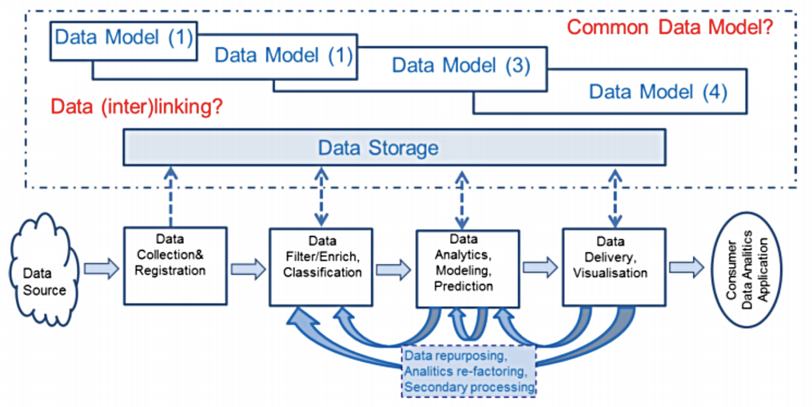

# Data Management

## Lernziele
Siehe Meier & Kaufmann (2016) Kapitel 1.5

### Datenbanken und Datenmanagement anhand eines Praxisbeispiels erklären

### Ziele und Werkzeuge der 4 Eckpfeiler des Datenmanagements anhand einer praktischen Fallstudie erkennen und zuordnen
Siehe Fallstudie von IBM und der deutschen Börse (sogleich auch die Gruppenarbeit)

## Definition Datenmanagement
Unter Datenmanagement fasst man alle betrieblichen, organisatorischen und technischen Funktionen der Datenarchitektur, der Datenadministration und der Datentechnik zusammen, die der unternehmensweiten Datenhaltung, Datenpflege, Datennutzung sowie dem Business Analytics dienen.

## Eckpfeiler des Datenmanagements
Ein zukunftgerichtetes Datenmanagement befasst sich sowohl strategisch mit der Informationsbeschaffung und -bewirtschaftung als auch operativ mit der effizienten Bereitstellung und Auswertung von aktuellen und konsistenten Daten.
Die vier Eckpfeiler des Datenmanagements sind die Datenarchitektur, Datenadministration, Datentechnik und Datennutzung.

### Datenarchitektur
Ziele:
- Formulieren und pfelgen der unternehmensweiten Datenarchitektur
- Festlegen von Datenschutzkonzepten

Werkzeuge:
- Datenanalyse und Entwurfsmethodik
- Werkzeuge der rechnergestützten Informationsmodellierung

### Datenadministration
Ziele:
- Verwalten von Daten und Methoden anhand Staandaardisierungsrichtlinien und Normen
- Beraten von Entwicklern und Endbenutzern

Werkzeuge:
- Data Dictionary Systeme
- Werkzeuge für den Verwendungsnachweis

### Datentechnik
Ziele:
- Installieren, reorganisieren und sicherstellen von Datenbeständen
- Festlegen des Verteilungskonzeptes inkl. Replikation
- Katastrophenvorsorge

Werkzeuge:
- Dienste der DBS
- Werkzeuge zur Leistungsoptimierung
- Monitoring Systeme
- Restart/Recovery-Tools

### Datennutzung
Ziele:
- Analyse und Interpretation
- Wissensgenerierung
- Erstellen von Prognosen
- Mustererkennung

Werkzeuge:
- Reporting Toolss
- Data Mining Tools
- Visualissierungstechniken für n-dimensionale Daten

## DAMA: Die 10 Aufgaben des Datenmanagements (Stand 2008, prä-Big-Data)

## Big Data Lifecycle Management Model (2014)

