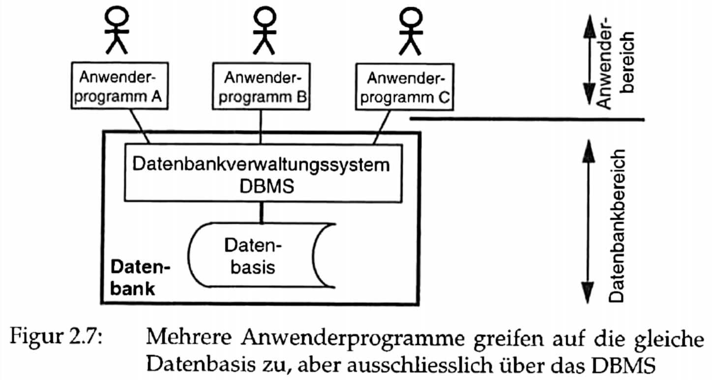

# Database Theory

## Lernziele

Siehe auch Meier & Kaufmann \(2016\) Kapitel 1.1; 1.2.3; 1.3; 1.4.3

### Das Konzept Datenbank definieren und erklären

Eine Datenbank ist eine Datenbanksystem \(zur Verwaltung von Datenbeständen\) und eine Datenbasis \(die Daten\), welche zusammen als Einheit gekapselt sind.

### Die Konzept Informationssystem und Datenbanksystem abgrenzen

Eine Datenbank ist ein Teil eines Informationssystems. Bei einem Informationssystem steht der Nutzer im Zentrum, das System hat den Kontext des Benutzers.

Im Unterschied zu einer Datenbank bietet ein Informationssystem auch folgendes \(teile können Datenbanken auch\):

* Benutzerführung
* Dialoggestaltung
* Abfragesprache
* Manipulationssprache
* Recherchehilfen
* Zugriffsrechte
* Datenschutz

### Die Gründe für den Einsatz von Datenbanken beschreiben

Siehe [Motivation: Weshalb Datenbanken?](database-theory.md#motivation-weshalb-datenbanken)

### Das Konzept der Relationalen Datenbank definieren und erklären

Siehe [Relationale Datenbanken](database-theory.md#relationale-datenbanken)

### Den Begriff Big Data definieren \(3V\)

Siehe [Erster Abschnitt Big Data: 3V](database-theory.md#big-data-3v)

### Das Konzept der NoSQL-Datenkbanken definieren und erklären

Siehe [Nicht-relationale Datenbanken](database-theory.md#nicht-relationale-datenbanken)

## Kontrollfragen

### Selbststudium

#### Was ist der Unterschied zwischen einer Datenbank und einem Informationssystem?

Ein Informationssystem erlaubt Anwendern interaktiv Informationen zu speichern und zu verknüpfen, Fragen zu stellen und Antworten zu erhalten. Im Unterschied ist eine Datenbank eine Software zum Speichern, Beschreiben und Abfragen von Daten. Die Datenbank kennt keinen Informationsgehalt und ist anwendungsunabhängig.

#### Was ist der Unterschied zwischen einm Datenbank-System und einem Dateisystem?

In einem Dateisystem kann jedes Anwenderprogramm direkt auf die Daten zugreifen. Beim Datenbanksystem passiert dies via DBMS.

#### Was ist der Unterschied zwischen einer SQL- und einer NoSQL-Datenbank?

Im Unterschied zu SQL-Datenbanken arbeiten NoSQL-Datenbanken nicht mit Tabellen und verwenden nicht die Datenbanksprache SQL. Des Weiteren erfüllen NoSQL-Datenbanken folgende Eigenschaften nur teilweise:

* Relational modelliert
* Schematisch
* Datenunabhängige Architektur
* Mehrbenutzerbetrieb
* Konsistenz
* Datensicherheit und Datenschutz

... und unterstützt die Eigenschaften aus dem Abschnitt [Nicht-relationales Datenbanksystem](database-theory.md#nicht-relationales-datenbanksystem)

#### Was ist der Unterschied zwischen Datenbanken und Datenmanagement?

Eine Datenbank ist das System, welches vom Datenmanagement betrieben und gewartet wird. Die Datenbank ist eine Software und das Datenmanagement eine organisatorische Tätigkeit.

#### Inwiefern handelte es sich gemäss der Datenbanktheorie bei IDS um eine Datenbank?

> TODO

### Gruppenarbeiten

#### Was ist eine mögliche eigene Definition des Begriffs Datenbanken? Formulieren Sie Ihre eigene Definition in Ihren Worten

Eine Datenbank ist eine Software, welche sich aus einem System \(Datenbanksystem\) und einer Datenbasis zusammenstellt. Der Zugriff auf die Daten erfolgt via dem System und nicht via File direkt.

#### Warum ist eine XML-Datei keine Datenbank?

Weil es eine Datei und keine Datenbank ist, bzw. die Datenbasis aber ohne Datenbanksystem. Des Weiteren ist XML mühsam.

#### Welche Vor- und Nachteile hat aus Ihrer Perspektive der Einsatz von Datenbanken? Bzw. welche Vor- und Nachteile hat die Verarbeitung mit Dateien? Vergleichen Sie.

Vorteile Datenbank:

* Tabellen können in Beziehung zueinander stehen
* Universelle Abfragesprache \(z.B. SQL\) für Datenauswertungen
* Transaktionen-Verarbeitung möglich \(z.B. T-SQL\)
* Geringe bis keine Redundanz von Daten

Nachteile Datenbank:

* Zusätzliche Infrastruktur
* Overhead in Operations und Wartung
* Zusätzliche Lizenzkosten notwendig
* Memory-Auslastung: RDBMSs sind sehr RAM-lastig, alle Daten müssen zuerst durch RAM \(Indexieren, Sortieren etc.\)

Vorteile Datei:

* Effizient für kleine Datenmengen
* Schneller für kleine, einfache Schreib- und Lesezugriffe

Nachteile Datei:

* Keine Transaktionen \(somit auch kein ACID\)
* Keine parallele Verwendung durch mehrer User
* Keine verteilte Systeme möglich \(mit relationalen Datenbanken auch nicht wirklich\)

## Datenbanksysteme

Ein Datenbanksystem besteht aus einer Datenbasis und einem Verwaltungsprogramm. Genauer: 1. System zur Verwaltung von Datenbeständen 2. bestehend aus Datenbasis 3. und Verwaltungsprograammen 4. welche zusammen als Einheit gekapselt sind

Nach Carl August Zehnder ist eine Datenbankverwaltungssystem folgendes:

> Das Datenbankverwaltungsssystem \(DBMS = database management system\) ist ein leistungsfähiges Programm für die flexible Speicherung und Abfrage von Daten.

Er definiert eine Datenbank wie folgt:

> Eine Datenbank ist eine selbstständige, auf Dauer und für flexiblen und sicheren Gebrauch ausgelegte Datenorganisaation, die einen Datenbestand \(Datenbasis\) und die dazugehörige Datenverwaltung \(dbms\) umfasst.

## Motivation: Weshalb Datenbanken?

DBMS ermöglichen:

* Persistierung, Strukturierung und Organisation von Daten
* Mehrbenutzerbetrieb: Transaktionsmanagement
* Möglichkeiten für Zugriff und Manipulation von Datensätzen
* Konsistenz und Integrität der Daten
* Sicherheit der Daten
* Effizienz bei Applikationsentwicklung durch Wiederverwendung
* Einfachere Wartung durch Kapselung der Daten \(Trennung von Daten und Anwendungen\)

## Relationale Datenbanken

In relationalen Datenbanken \(SQL-Datenbanken\) werden Daten und Beziehung in Tabellen gespeichert. Dabei entspricht ein Datensatz einer Zeile oder einem Tupel. Metadaten werden in Systemtabellen gespeichert.

Mit Hilfe der strukturierten Abfragesprache SQL \(Structured Query Language\) können Daten abgefragt werden. Dies gilt auch für Spezialfunktionen \(Recovery, Reorganisation, Sicherheit, Datenschutz, etc.\).

Zusammenfassend sind relationale Datenbanksysteme integrierte Systeme zur einheitlichen Verwaltung von Tabellen.

### Relationales Datenbanksystem

Ein Relationales Datenbanksystem ist durch folgende Eigenschaften charakterisiert:

* _Model:_ Das Datenbankmodell unterliegt dem Relationenmodell, d. h. alle Daten und Datenbeziehungen werden in Form von Tabellen ausgedrückt.
* _Schema:_ Die Definition der Tabellen und der Merkmale werden im relationalen Datenbankschema abgelegt. Dieses enthält zudem die Definition der Identifikationsschlüssel sowie Regeln zur Gewährung der Integrität.
* _Sprache:_ Das Datenbanksystem umfasst SQL für Datendefinition, -selektion und -manipulation. Die Sprachkomponente ist deskriptiv.
* _Architektur:_ Das System gewährleistet eine große Datenunabhängigkeit, d.h. Daten und Anwendungsprogramme bleiben weitgehend voneinander getrennt.
* _Mehrbenutzerbetrieb:_ Das System sorgt dafür, dass parallel ablaufende Transaktionen auf einer Datenbank sich nicht gegenseitig behindern oder gar die Korrektheit der Daten beeinträchtigen.
* _Konsistenzgewährung:_ Das System stellt Hilfsmittel zur Gewährleistung der Datenintegrität \(fehlerfreie und korrekte Speicherung\) bereit.
* _Datensicherheit und Datenschutz:_ Das Datenbanksystem bietet Mechanismen für den Schutz der Daten vor Zerstörung, vor Verlust und vor unbefugtem Zugriff.

## Nicht-relationale Datenbanken

Der Begriff NoSQL wird heute für nicht-relationale Ansätze im Datenmanagement verwendet, mit folgenden zwei Bedingungen:

* Die Speicherung der Daten erfolgt nicht in Tabellen
* Die Datenbanksprache ist nicht SQL 

Nicht-relationale Datenbanken sind stark für parallele Ausführungen und haben schwache bis starke Konsistenzgewährung.

Die Daten werden in Spalten, Dokumenten oder Graphen gespeichert. Dabei existieren in der Regel verteilte Datenreplikate.

### Nicht-relataionales Datenbanksystem

Ein nicht-relationales Datenbanksystem ist durch folgende Eigenschaften charakterisiert:

* _Modell:_ Das zugrundeliegende Modell ist nicht relational.
* _Mindestens 3V:_ Volume, Variety und Velocity wird unterstützt.
* _Schema:_ Das System unterliegt keinem fixen Schema.
* _Architektur:_ Die Architektur unterstützt masssiv verteilte Webanwendungen und horizontale Skalierung.
* _Replikation:_ Datenreplikation wird unterstüzt.
* _Konsistenzgewährleistung:_ Aufgrund des CAP-Theorems  ist die Konsistenz lediglich verzögert gewährleistet \(weak consistency\), falls hohe Verfügbarkeit und Ausfalltoleranz angestrebt wird.

## Big Data: 3V

Daten welche in die drei untenstehenden Dimensionen an Quantität und Qualität fallen werden oft Big Data genannt:

* _Volume:_ Der Datenbestand ist umfangreich und liegt im Tera- bis Zettabytebereich.
* _Variety:_ Speicherung von strukturierten, semi-strukturierten und unstrukturierten Daten.
* _Velocity:_ Der Begriff bedeutet Geschwindigkeit und verlangt, dass Datenströme \(engl. data streams\) in Echtzeit ausgewertet und analysiert werden können.

SQL-Datenbanken sind nicht für Big Data ausgerichtet. Aus diesem Grund werden vermehrt NoSQL-Datenbanksysteme eingesetzt.

In einigen Definitionen wird im Rahmen von Big Data auch von Informationskapital und Vermögenswert gesprochen. Aus diesem Grund fügen einige Experten ein weiteres V hinzu:

* _Value:_ Big Data Anwendungen sollen den Unternehmenswert steigern. 

Es liegen unterschiedliche Qualitäten von Datenbeständen vor. Dies muss bei der Auswertung berücksichtigt werden. Daher werden die drei oder vier V oft mit dem letzten V abgerundet:

* _Veracity \(Aufrichtigkeit oder Wahrhaftigkeit\):_ Da viele Daten vage oder ungenau sind, müssen spezifische Algorithmen zur Bewertung der Aussagekraft resp. zur Qualitätseinschätzung der Resultate verwendet werden.

> Umfangreiche Datenbestände garantieren nicht per se bessere Auswertungsqualität!

