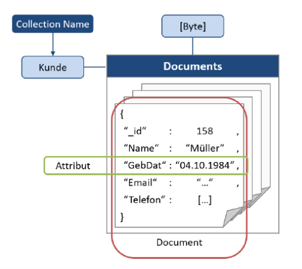
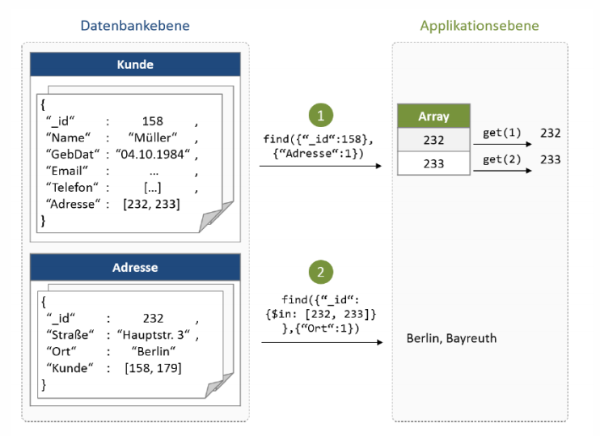
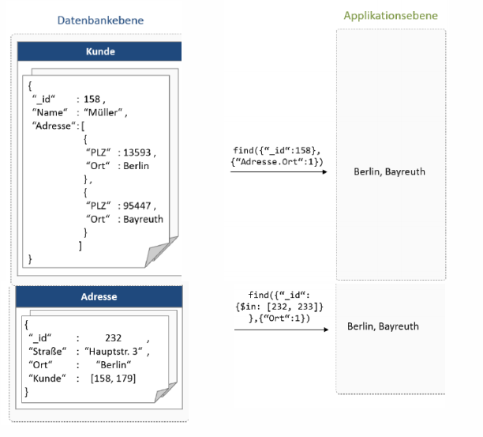
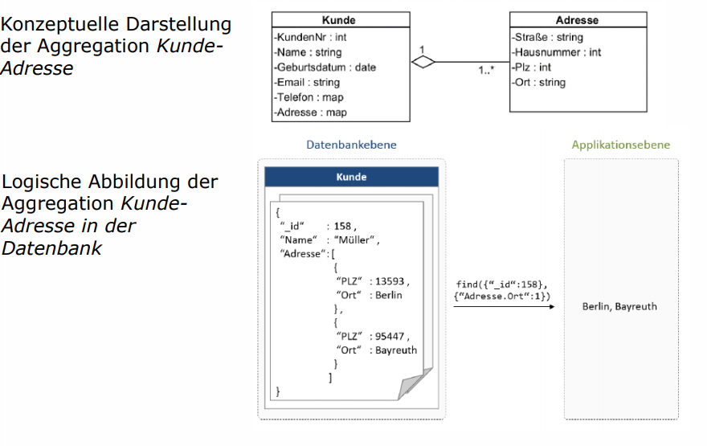
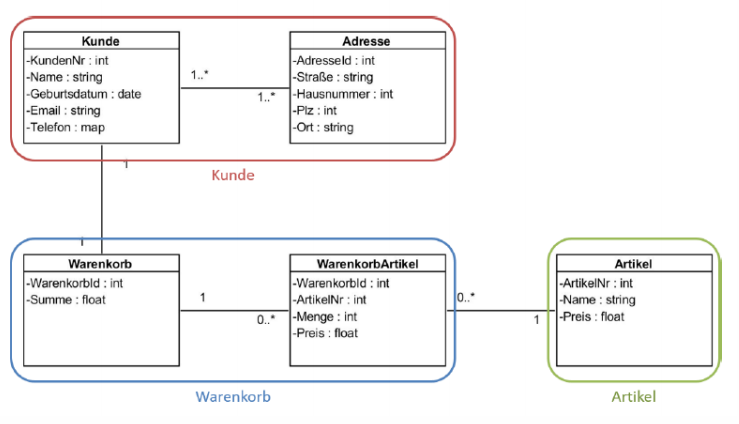
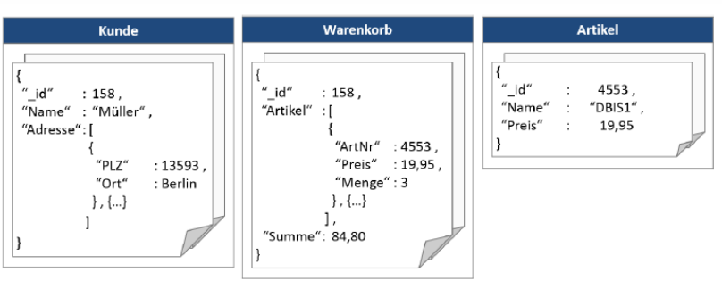
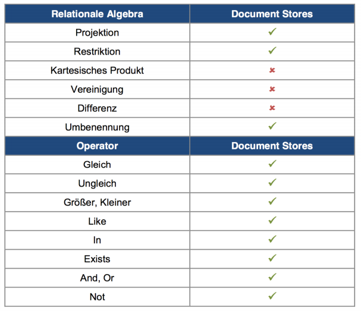
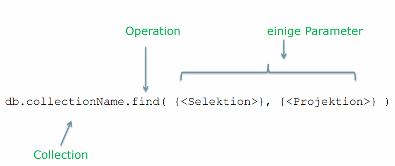
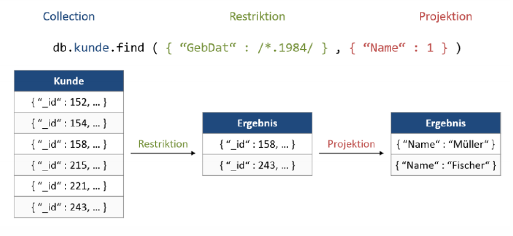
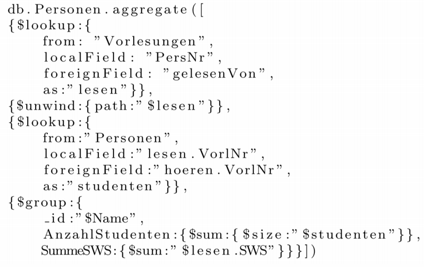

# Document Databases

[TOC]

## Lernziele

* Das Datenbankmodell der Dokumentdatenbanken beschreiben
* Ein ER-Datenmodell in ein Dokument-Schema übersetzen: Enitätsmengen, Beziehungsmengen mit Referenzierung, Denormalisierung oder Aggregation
* Relationale Unvollständigkeit von Sprachen für Dokument-DBs erklären
* Daten aus einer Dokument-DB abfragen mit `find`
* Daten in einer Dokument-DB verändern mit `insert`, `update`, `delete`
* Mechanismen zur Einhaltung der Datenintegrität und Transaktionsisolation zwischen Dokument-DB‘s und RDBMS vergleichen

## Document Stores

Document Stores haben folgende Eigenschaften:

* Datensätze werden als Dokumente gespeichert (z.B. Key-Value, JSON)
* Können flexibel Werte unterschiedlicher Strukturen in derselben Collection speichern (ohne Anpassungen wie z.B. ALTER TABLE ... ADD COLUMN). Neue Felder können idR einfach direkt hinzugefügt werden.
* Gute Alternative zu RDBMS bei heterogenen Datensätzen (unterschiedliche Strukturen / Schemata)
* Beispiele: CouchDB, MongoDB

## Was ist ein Dokument?

Ein Dokument in diesem Kontext ist eine *strukturierte Sammlung (verschachtelter)* Schlüssel-Werte-Paare. Ist meistens in einem der folgendem Formate: JSON, YAML, XML, etc.

## Datenbankmodell

* Document Stores legen Datensätze als Dokumente ab
* Attribute und deren Werte werden als Key:Value Paar in einem Dokument abgespeichert
* Dokumente werden in Collections verwaltet und über den Key `_id` eindeutig identifiziert.

Vergleich zwischen relationalen Datenbanken und Document Stores:

| Relationale Datenbank | Document Stores |
| --------------------- | --------------- |
| Tabelle               | Collection      |
| Tupel (Datensatz)     | Dokument        |
| Primärschlüssel (ID)  | _id             |
| Attribut              | Key-Value-Paar  |

Ein Beispiel:

Die Collection **Kunde** hat für jeden Kunden ein Dokument, welches über die _id eindeutig identifiziert wird:

## Datenmodellierung

### Entitätsmengen abbilden

* Entitätsmengen können durch jeweils eine Collection abgebildet werden (z.B. **Kunde**)
* Innerhalb einer Collection werden einzelne Realwelt-Objekte durch jeweils ein Dokument repräsentiert (z.B. **Kunde XY**)
* Eigenschaften des Objektes werden als Key:Value im Dokument gespeichert (**z.B. Name: Franz**)
* Dokumente in derselben Collection können sich in ihrer Struktur voneinander unterscheiden
* Fazit: Spezialisierung und Generalisierung können in derselben Collection gespeichert werden.

### Beziehungsmengen

Document Stores bieten keine Auflösung von Fremdschlüsselbeziehungen an sowie keine Sicherstellung der Integrität von Referenzen! Dafür bieten sie komplexe Datentypen wie `Array` und `Object` an. Darüber können Beziehungen in drei Möglichkeiten abgebildet werden:

#### 1. Referenzierung: ID des referenzierten Datensatz speichern

#### 2. Denormalisierung: Kopie des referenzierten Datensatz speichern

#### 3. Aggregation: Referenzierten Datensatz als Unterteil (Teilmenge) speichern / einbetten

Collection *Adresse* wird direkt beim Kunden gespeichert.

##### Aggregationen modellieren

Schritt 1: Teilmengen auf konzeptueller Ebene identifizieren:

* Starke Entitäten wie *Kunde*, *Warenkorb* und *Artikel*
* Schwache Entitäten wie *Adresse* und *Warenkorb-Artikel*

Schritt 2: die drei starken Entitäten (Kunde, Warenkorb & Artikel) werden als Collections abgebildet, die schwachen Entitäten (Adresse und WarenkorbArtikel) wurden in die zugehörigen Dokumente eingebettet:

## ER-Modelle in Dokumenten-DBs umsetzen

| ER-Modell                  | Document Stores                               |
| -------------------------- | --------------------------------------------- |
| Entitätstyp                | Collection                                    |
| Entität                    | Dokument                                      |
| Einfaches Attribut         | Key-Value-Pair                                |
| Zusammengesetztes Attribut | Object                                        |
| Mehrwertiges Attribut      | Array                                         |
| 1:1 Beziehung              | Referenzierung, Denormalisierung, Aggregation |
| 1:N Beziehung              | Referenzierung, Denormalisierung, Aggregation |
| M:N Beziehung              | Referenzierung, Denormalisierung, Aggregation |

## UML zu Dokument-Struktur

## Datenbanksprache

### Relationale Unvollständigkeit

Dokument-Datenbanken unterliegen nicht der relationalen Algebra, sie unterscheiden sich wie folgt:

### Anfrageverarbeitung mit MongoDB

MongoDB ist eine beliebte Dokumentendatenbank. Es unterstützt folgende Operationen: `find`, `insert`, `update`, `delete`. Die Selektionsbedingungen sind eine Liste von Key-Value Paaren.

Ein konkretes Beispiel für eine Leseabfrage:

Die Collection `kunde` wird auf das Feld `GebDat` gefiltert (Restriktion) und als Rückgabewert möchten wir den Namen (Projektion).

### Aggregation in MongoDB

Weitere Beispiele für Aggregation sind im Cheat Sheet zu finden.

### MongoDB Cheat Sheet

Für mehr Informationen über MongoDB, siehe MongoDB Cheat Sheet im cheatsheets Ordner.

## Konsistenzsicherung

### Datenintegrität

* Dokumentdatenbanken haben kein festes Datenschema
* Die Struktur der Dokumente lässt sich nicht zuvor definieren
* Dokumente können sich innerhalb einer Collection voneinander strukturell vollständig underscheiden
* Definition und Prüfung der Datenintegrität auf Applikationsebene
* Ausnahme: CouchDB hat optionale Integritätsbedingungen: bei Schreiboperationen werden diese Checks / Bedingungen auf dem Dokument ausgeführt.
  * Inhaltliche und strukturelle Bedingungen
  * Überprüfung von Benutzerrechten
  * Wird gegen eine dieser Regeln verstossen, wird die Schreiboperation abgewiesen

### Transaktionsmanagement

MongoDB unterstützt keine Transaktionen!

* Operationen müssen einzeln ausgeführt werden
* Operation umfasst Änderungen auf *ein* Dokument, werden diese atomar durchgeführt
* Operation umfasst Änderungen auf mehreren Dokumenten, werden diese unabhängig voneinander ausgeführt
* transaktionale Atomarität muss bei Document Stores auf Anwendungsebene sichergestellt werden
* Aggregation fasst zusammenhängende Sachverhalten zu einem Dokument zusammen
* Dauerhaftigkeit wird in MongoDB mittels einer Log-Datei (WALPrinzip) sichergestellt

## Systemarchitektur

### Indizes zur Anfrageoptimierung

* Auf einfachen Attributen wie dem _id-Field, auf mehrwertigen Attributen und eingebetteten Dokumenten
* bei Schreiboperationen synchron aktualisiert
* können aufsteigend oder absteigend definiert werden
* MongoDB:
  * Maximal 64 Indizes pro Collection
  * Geospatial-Index: ermöglicht das Auffinden eines nahegelegenen Objekts innerhalb eines zweidimensionalen Raums 

### Parallelisierung (Fragmentation und Allokation)

Ein MongoDB-Cluster besteht aus drei Serverarten:

* Replica Sets (einer oder mehrere Nodes): Speichern die Dokumente, durch mehrfache Replikation haben die Replica Sets eine hohe Verfügbarkeit.
* Router: Schnittstelle für Clientabfragen, leiten Abfragen an die zuständigen Replica Sets weiter und geben das Resultat an den Client zurück.
* Config Server: Verwalten Metadaten. Für die Ausfallsicherheit besitzt ein Produktivsystem immer drei Config Server. Fällt dieser komplett aus, so sind für diesen Zeitraum keine Verteilungsreorganisation von Dokumenten möglich.

### Dokumente im Cluster verteilen mittels Shard-Keys

* Die Verteilung von Dokumenten auf verschiedene Replica Sets ist von Verteilungsschlüssel (Shard Key) abhängig
* Shard Key - frei wählbares Attribut, das alle Dokumente einer Collection zwangsläufig beinhalten müssen
* Abhängig vom Wert Shard Key wird ein Dokument entweder per Hashfunktion oder per Wertebereich einem Replica Set zugeordnet
* Hashfunktion bietet einfache und gleichmäßige Verteilung
* Verteilung über Wertebereiche hat effizientere Bereichsanfragen

### Map & Reduce in MongoDB

* in MongoDB werden MapReduce-Programme nur für die Analyse von sehr großen Datenmengen eingesetzt
* Verarbeitung von gewöhnlichen Anfragen wird in einem MongoDBCluster von Routern übernommen
* Verteilungsschlüssel ist entscheidend für die Verarbeitungsgeschwindigkeit einer Anfrage
* Basiert die Anfrage auf diesem Schlüssel, können Dokumente direkt an Replica Set adressiert werden
* Eine Anfrage ist ohne diesen Schlüssel ausgeführt, müssen Replica Sets zeitaufwendig durchsucht werden 