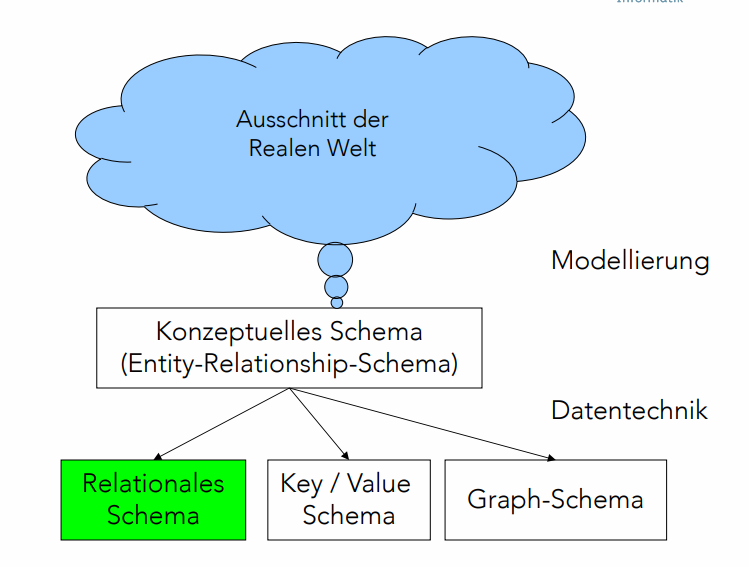
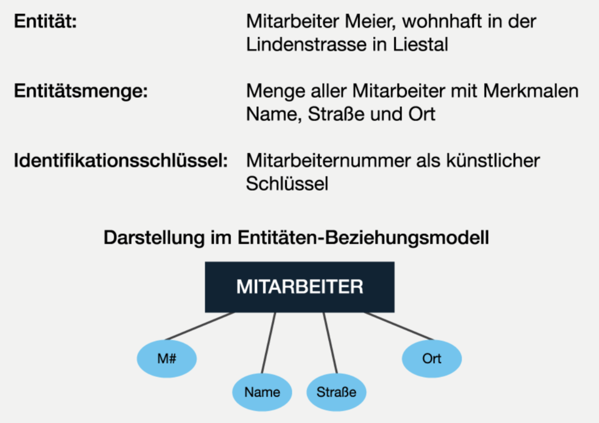
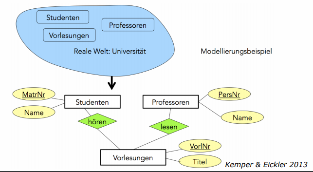
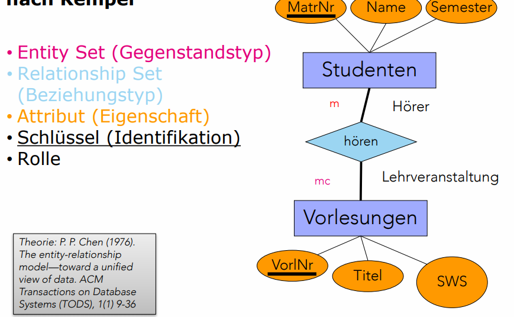
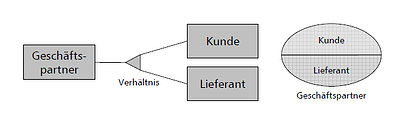
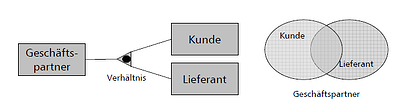
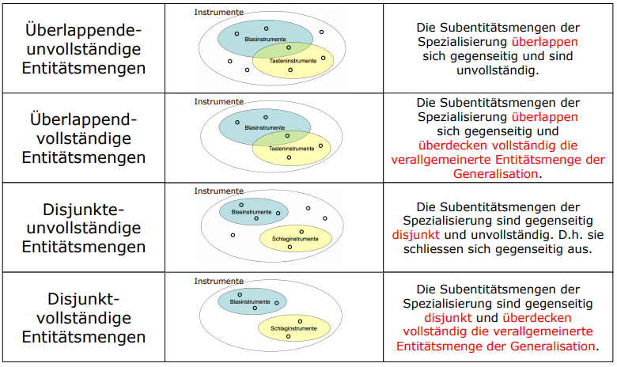
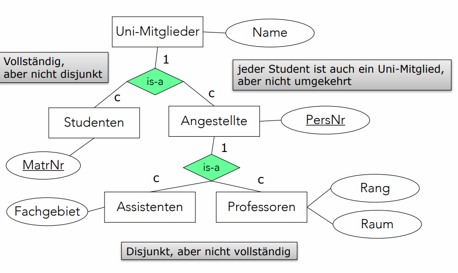
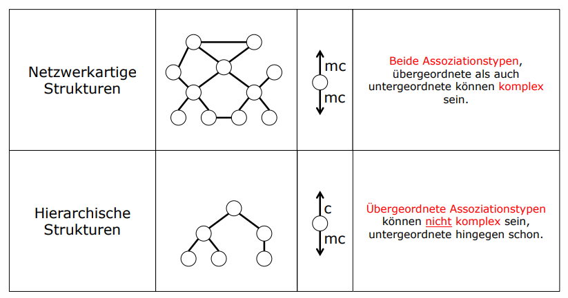
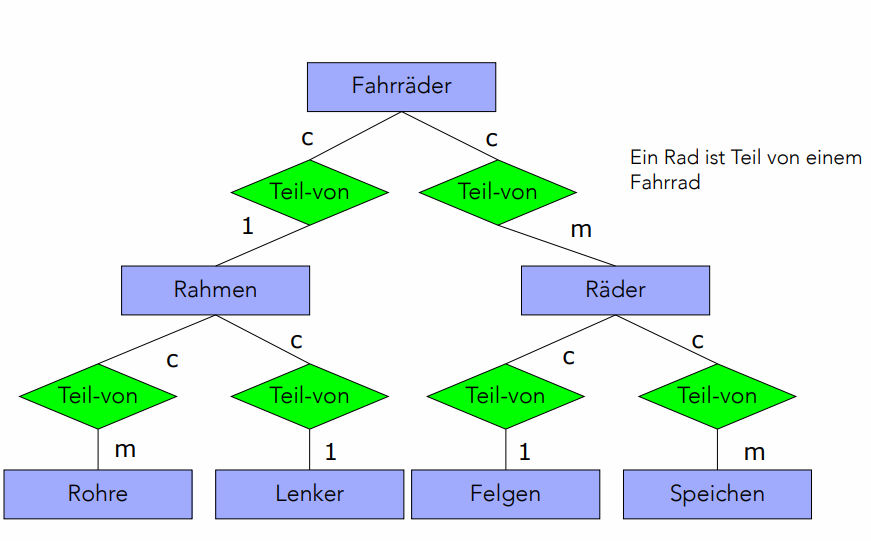

# Entity-Relationship Models

[TOC]

## Lernziele

1. Aufgrund einer beschriebenen Ausgangslage:
  • Entitätsmengen,
  • Beziehungsmengen (inkl. Assoziation, Assoziationstyp und Grad)
  • Und Merkmale (inkl. Identifikationsschlüssel) erkennen und diese in einem Entity-Relationship Modell darstellen
2. Fortgeschrittene Beziehungsarten in der Modellierung anwenden
  • Generalisierung
  • Disjunkte Spezialisierung
  • Vollständige Spezialisierung
  • Aggregation

## Modellierung

## Entitäten und Entitätsmengen

Unter Entität \(engl. entity\) versteht man einen bestimmten, von anderen unterscheidbaren, d.h. erkennbaren Gegenstand der realen Welt oder unserer Vorstellung. Entitäten des gleichen Typs werden zu Entitätsmengen zusammengefasst und durch Merkmale weiter charakterisiert. Für jede Entitätsmenge ist ein Identifikationsschlüssel, der die Entitäten innerhalb der Entitätsmenge eindeutig bestimmt.  

## Beziehungen und Beziehungsmengen

Die Beziehungen \(engl. relationships\) zwischen Entitäten geben diesen Bedeutung und Kontext. Beziehungen könne wiederum Mengen bilden. Beziehungsmengen können, ebenso wie Entitätsmengen, durch eigene Merkmale näher charakterisiert werden.

Ein Modellierungsbeispiel:

## Assoziationstypen

Unter Assoziation \(engl. association\) versteht man die Bezeichnung der Bedeutung einer Beziehung in dessen Richtung. Assoziationstypen, auch genannt *Kardinalitäten*, sagen, wie oft ein Element der jeweiligen Entitätsmenge in der Beziehung vorkommen kann.

### Grade von Beziehungen

## Zusammenfassung Entity/Relationship-Modellierung nach Kemper

## Generalisation

Bei der Generalisierung werden gemeinsame Eigenschaften von Entitäten nur einmal modelliert. Dabei enthält der **Generalisierungstyp** die Attribute, die alle Entitäten gemeinsam haben. Die **Spezialisierungstypen** enthalten die speziellen Attribute, wobei diese Spezialisierung disjunkt oder überlappend sein kann. Ebenfalls erbt der Spezialisierungstyp die Eigenschaften der Generalisierung. Es gibt zwei Typen: IS-A oder ODER Typen.

IS-A-Typ (Kunde *is a* Geschäftspartner, in Gegenrichtung: Geschäftspartner *can-be* Kunde)

ODER-Typ:

Bei der Generalisation treten folgende Fälle auf:

Ein Beispiel für die Generalisierung (Is-a-Struktur):

## Aggregation

> Werden mehrere Einzelobjekte (z. B. Person und Hotel) zu einem eigenständigen Einzelobjekt (z. B. Reservierung) zusammengefasst, dann spricht man von Aggregation. Dabei wird das übergeordnet eigenständige Ganze Aggregat genannt; die Teile, aus denen es sich zusammensetzt, heißen Komponenten. Aggregat und Komponenten werden als Entitätstyp deklariert.

* Zusammenfügen von Entitäten zu einem übergeordneten Ganzen. Dabei werden die Struktureigenschaften der Aggregation in einer Beziehungsmenge erfasst. 
* Allgemein beschreibt eine Aggregation das strukturierte Zusammenfügen von Entitäten, das wir in  Anlehnung ans Englische als PART-OF-Struktur bezeichnen.

Beispiel: Fussballmanschaft *is-part-of* Fussballspiel und Spielort *is-part-of* Fussballspiel. In anderer Leserichtung: Fussballspiel *besteht-aus* Fussballmanschaft und Spielort.

Es können hierarchische- oder netzwerkartige Strukturen entstehen:

Ein weiteres Beispiel für Aggregation:

## Kontrollfragen

### Was ist ein Modell?

### Wozu brauchen wir Modelle?

### Was sind Entitäten?

### Was sind Beziehungen?

### Was sind Assoziationen?

### Was sind Generalisation & Aggregation?

## Aufgaben

### Aufgabe 1

- Welche Assottiationstypen gibt es?
  - Einfache Assoziation \(1\)
  - Konditionelle Assoziation \(c\)
  - Mehrfache Assoziation \(m\)
  - Mehrfach konditionelle Assoziation \(mc\)
- Was ist der Unterschied zwischen Generalisierung un Aggregation?
  - Generalisation = Verallgemeinern von Entitäten.
  - Aggregation = Zusammenfügen von Entitäten zu einem übergeordneten Ganzen.
- Was ist der Unterschied zwischen Generalisierung und Spezialisierung?
  - Spezialisierung = spezialisierung von Entitätsmengen.
- Wann ist eine Spezialisierung vollständig?
  - Wenn die Entitätsmenge die Subentitätsmengen vollständig umfasst.
  - "Kein Mitarbeiter ist _Abteilungslos_"
- Wann ist sie disjunkt?
  - Die Subentitätsmengen schliessen sich gegenseitig aus und haben keine Schnittmenge.

### Aufgabe 2 \(Bonus\)

- Wie definiert Chen den Begriff „Entity“?
- Was ist der Unterschied zu einem Entity Set?
- Wie definiert Chen den Begriff „Relationship“?
- Was ist der Unterschied zum Relationship Set?
- Schauen Sie sich die Abbildung 11 an. Wie unterscheidet sich die Notation von der Variante, wie sie    im Buch von Meier dargestellt wird?
- Worin unterscheiden sich die Notationen von Meier & Kaufmannl \(2016\) und Chen \(1976\)? Vergleichen Sie.

### Aufgabe 3

> Aufgabenbeschreibung TODO

### Aufgabe 4

> TODO