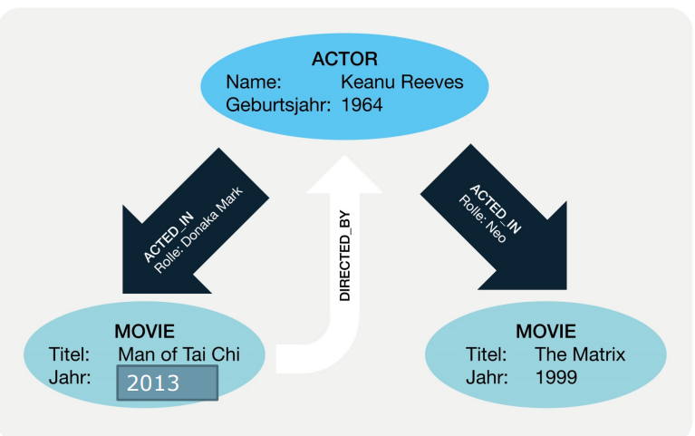
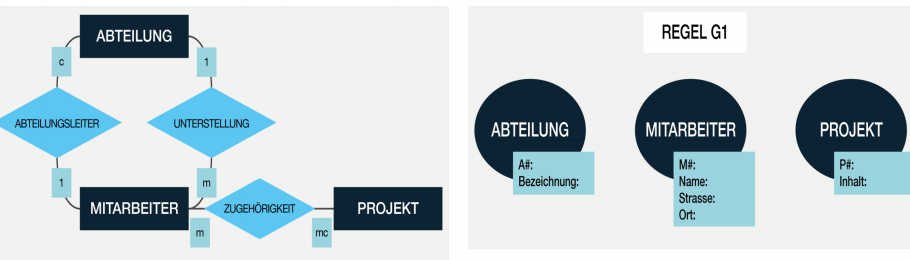
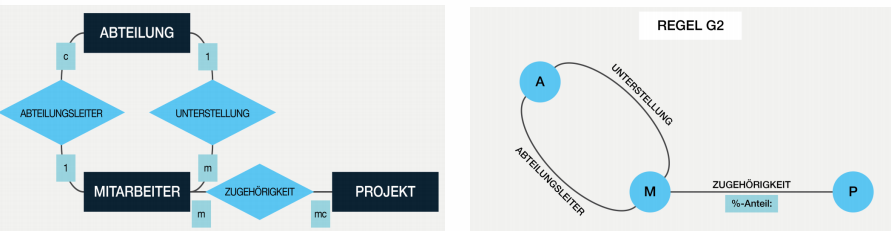
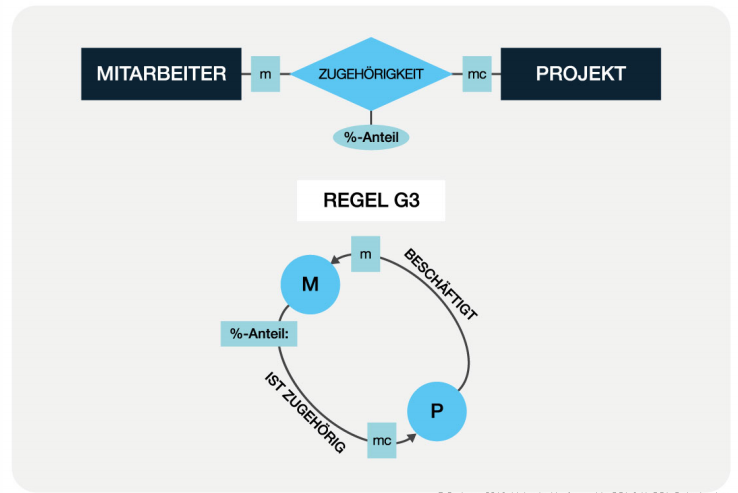
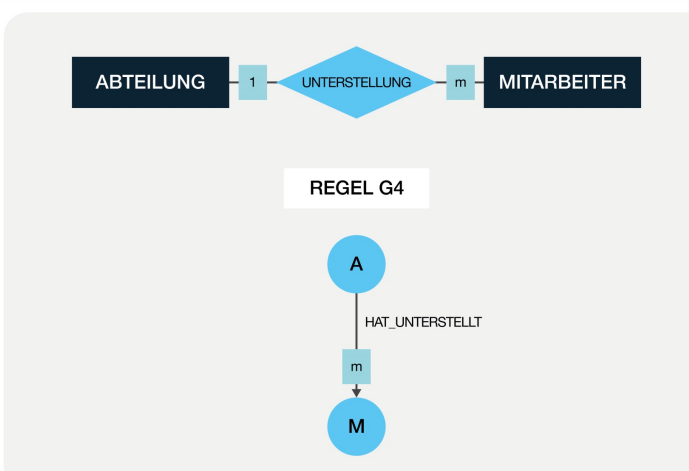
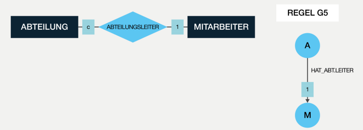
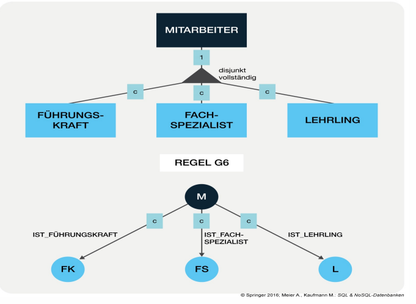
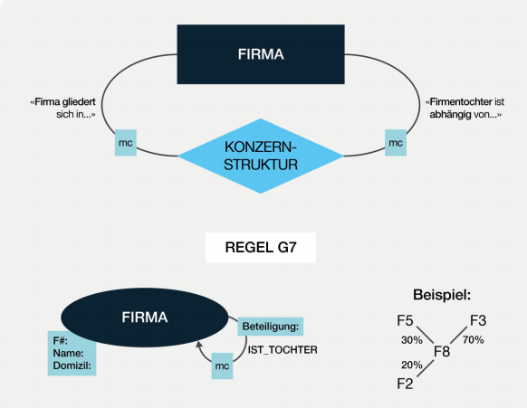

# Graph Databases

## Lernziele

* Das Konzept des Eigenschaftsgraphen definieren
* Die Eigenschaften von Graphdatenbanken aufzählen und erklären
* Ein ER-Datenmodell in ein Graph-schema mit Knoten- und Kantentypen übersetzen
* Daten aus einer Graphdatenbank mit Cypher abfragen: MATCH, WHERE, RETURN, ORDER BY, OPTIONAL MATCH, COUNT, SUM
* Daten mit Cypher definieren und manipulieren: CREATE, SET, DELETE


## Property Graph

Ein Eigenschaftsgraph \(engl. _property graph_\) besteht aus Knoten \(Objekten\) und _gerichteten Kanten_ \(Beziehungen\). Sowohl die Knoten als auch die Kanten tragen Namen \(engl. _labels_\) und können Eigenschaften \(engl. _properties_\) aufweisen. Beispiel:



Je nach Reifegrad enthalten die Datenbanken Algorithmen zur Berechnung unter anderem folgender bedeutender Eigenschaften:

* _Zusammenhang:_ Jeder Knoten hat einen Pfad zu jedem anderen Knoten des Graphen.
* _Kürzester Pfad_
* _Nächster Nachbar_
* _Matching:_ Berechnung einer Menge von Kanten, die keine gemeinsamen Knoten enthalten.

## Eigenschaften einer Graphdatenbank

* Daten und / oder das Schema werden als Graphen abgebildet
* Manipulationen an den Daten werden als Graph-Transformationen ausgedrückt (*)
* Prüfung von Integritätsbedingungen, um die Datenkonsistenz sicherzustellen, werden von der Datenbank angeboten
  * Definition von Konsistenz bezieht sich auf Graph-Strukturen: Knoten- und Kantentypen Attribut-Wertebereiche, referenzielle Integrität der Kanten usw
* "Indexfreie Nachbarschaft" -  Aufwand bleibt konstant für die Abfrage von Beziehungen zu einem Knoten und unabhängig von Datenvolumen
* Balancierte Bäume (B-Bäume) werden für die Indexierung aufgebaut (d.H. der Index für Graphen ist selbst ein Subgraph)
* Fragmentierung (sharding) einer Graph-Datenbank ist bislang NP-komplett (d.H. es gehört zu den schwersten Problemen)

### Strukturelle Integritätsbedingungen

- Eindeutigkeitsbedingung: Jeder Knoten und jede Kante kann im Graphen eindeutig identifiziert werden. Mit Pfadausdrücken können beliebige Kanten oder Knoten aufgesucht werden.
- Wertebereichsbedingung: Merkmale der Knoten sowie Kanten haben einen Datentyp (wohldefinierter Wertebereich)
- Zusammenhang: Ein Graph ist zusammenhängend wenn es zu je zwei beliebigen Knoten einen Pfad gibt. Die Graph-Datenbank garantiert diesen Zusammenhang für Graphen oder Teilgraphen.

## Datenmodellierung als Graph

Für die Datenmodellierung gelten folgende Regeln:

### G1 - Entitätsmengen

Jede Entitätsmenge muss als eigenständiger Knoten in der Graph-DB definiert werden. Die Merkmale der Entitätsmengen werden als Eigenschaften der Knoten geführt. Folgendes Beispiel zeigt das ER-Diagramm (links) und die Regel G1 (rechts):



### G2 - Beziehungsmengen

Jede Beziehungsmenge kann als ungerichtete Kante in der Graphdatenbank definiert werden. Eigenschaften der Beziehungsmengen werden den Kanten zugeordnet (attributierte Kanten).



### G3 - Netzwerkartige Beziehungsmengen

Jede komplex-komplexe Beziehungsmenge kann durch zwei gerichtete Kanten ausgedrückt werden, indem die Assoziationen der Beziehung den Namen der Kante liefern und die entsprechenden Assoziationstypen an den Pfeilspitzen annotiert werden. Eigenschaften der Beziehungsmengen können einer oder beiden Kanten angehängt werden.



### G4 - Hierarchische Beziehungsmengen

Eine **einfach-komplexe** Beziehungsmenge kann als gerichtete Kante zwischen den Knoten etabliert werden, indem die Richtung vom Wurzelknoten zum Blattknoten gewählt und der mehrfache Assoziationstyp (m oder mc) an der Pfeilspitze annotiert wird.



### G5 - Hierarchische Beziehungsmengen

Jede **einfach-einfache** Beziehungsmenge kann als gerichtete Kante zwischen den entsprechenden Knoten etabliert werden. Dabei soll die Richtung so gewählt werden, dass der Assoziationstyp an der Pfeilspitze nach Möglichkeit eindeutig ist.



### G6 - Generalisierung

Die Superentitätsmenge der Generalisation wird zu einem Doppelknoten, die Subentitätsmengen zu normalen Knoten. Dabei wird die Generalisierungshierarchie durch Spezialisierungskanten ergänzt.



### G7 - Aggregation

Bei einer netzwerkartigen oder hierarchischen Aggregationsstruktur wird die Entitätsmenge als Knoten und die Beziehungsmenge als Kante dargestellt, wobei die Pfeilspitze mit dem Assoziationstypen mc annotiert wird. Eigenschaften der Knoten werden bei den Knoten, Eigenschaften der Kanten bei den Kanten angehängt.



 


## Graphbasierte Sprachen

Sie sind ähnlich zu den relationalen Sprachen:

* Mengenorientiert
* lassen die Filterung von Daten anhand von Prädikaten zu (konjuktive Abfragen)
* bietet die Möglichkeit, Mengen von Knoten im Graphen zu skalaren Werten zu aggregieren

Sie unterscheiden sich aber zu relationalen Sprachen:

* bietet Mechanismen zur Analyse von Pfaden in Graphen an (z.B. Pfadabfrage)

### Cypher

Cypher ist eine deklarative Abfragesprache, um Muster in Graphdatenbanken extrahieren zu können. Die Anwendenden spezifizieren ihre Suchfrage durch die Angabe von Knoten und Kanten. Daraufhin berechnet das Datenbanksystem alle gewünschten Muster, indem es die möglichen Pfade \(Verbindungen zwischen Knoten via Kanten\) auswertet. Mit anderen Worten deklarieren die Anwendenden die Eigenschaften des gesuchten Musters, und die Algorithmen des Datenbanksystems traversieren alle notwendigen Verbindungen \(Pfade\) und stellen das Resultat zusammen. Cypher kennt ebenfalls DML Sprachbefehle um Daten zu manipulieren. Die DDL kann nur Indexe, Unique-Constrains und Statistiken beschreiben

Untenstehend ein Beispiel zum Abfragen von Filmtitel, Rollen und Schauspieler für einen Schauspieler mit dem Namen _Keanu Reeves_, welcher in einem Film gespielt hat:

```cypher
match (a : Actor) -- [r : Acted_In] --> (m : Movie)
where (a.name = "Keanu Reeves")
return m.Titel, a.Name, r.Rolle
```

Cypher ist ähnlich wie SQL deklarativ aufgebaut. Allerdings ist das Auswerten von Beziehungsgeflechten, das Verwenden re-kursiver Suchstrategien oder die Analyse von Eigenschaften von Graphen mit SQL kaum zu bewältigen.

### Cypher: Grundkonstrukt

* `MATCH`: Identifiziert Knoten und Kanten und deklariert Suchmuster
* `WHERE`: Filtert Ergebnisse
* `RETURN`: Stellt Resultate bereit, kann bei Bedarf aggregieren

Als Beispiel:

```
MATCH (p:Product)
WHERE p.productName = 'Beer'
RETURN p
```

Des Weiteren kennt es:

* `ORDER-BY` um Ergebnisse zu sortieren
* `SET` um Datenwerte zu verändern welche ein bestimmtes Muster erfüllen
* `DELETE` löscht entsprechende Knoten und Kanten

### Zusammenhang mit der Relationenalgebra I

Projekton und Selektion inkl. Sortierung

```cypher
MATCH (p:Product)
WHERE p.unitPrice > 55
RETURN p.productName, p.unitPrice
ORDER BY p.unitPrice
```

Kartesisches Produkt (Kreuzprodukt)

```cypher
MATCH (p:Product), (c:Category)
RETURN p.productName, c.categoryName
```

Verbund (Join)

```cypher
MATCH (p:Product) -[:PART_OF]-> (c:Category)
RETURN p.productName, c.categoryName
```

Left outer join, Aggregation (COUNT) aus der Rel. Algebra 2

```
MATCH (e:Employee)
OPTIONAL MATCH (e)<-[:REPORTS_TO]-(sub)
RETURN e.employeeID, count(sub.emplyeeID)
```

### Implizite Schemaerstellung

````cypher
CREATE
(p:Product {
    productName:'SQL-& NoSQL-Datenbanken',
	year:2016})
 -[:PUBLISHER]->
	(o:Organization {
    name:'Springer'})
````

Erklärung:

* neue Knoten kreiert und verbunden
* neuer Knotentyp "Organization" erstellt
* Attribute "year" sowie "name" werden im Schema hinzugefügt
* Neuer Kantentyp "PUBLISHER" erstellt
* in SQL wäre dafür ein CREATE TABLE und ALTER TABLE Befehle nötig

### Datenmanipulation

Ändere den unitPrice auf dem Produkt "Chocolate"

```
MATCH (p:Product)
WHERE p.productName = 'Chocolate'
SET p.unitPrice = 13.75
```

Lösche alle Produkte namens 'Tunnbröd' und alle eingehenden und ausgehenden Kanten

```
MATCH
	()-[r1]->(p:Product)
	(p)-[r2]->()
WHERE p.productName = 'Tunnbröd'
DELETE r1, r2, p
```

### Graphspezifische Funktionen von Cypher am Beispiel shortestPath

Beispiel: Für alle Produktpaare, die in derselben Bestellung vorkommen, wird eine Kante vom Typ "BASKET" (Einkaufskorb) erstellt. Für zwei beliebige Produkte kann mit der Funktion `shortestPath` der kürzeste Pfad von gemeinsamen Einkaufskörben eruiert werden:

```
MATCH
	(p1:Product)<--(o:Order)-->(p2:Product)
CREATE
	p1-[:BASKET{order:o.orderID}]->p2,
	p2-[:BASKET{order:o.orderID}]->p1;
	
MATCH path = 
	shortestPath(
		(p1:Product)-[b:BASKET*]->(p2:Product))
RETURN
	p1.productName, p2.productName, LENGTH(path),
	EXTRACT(r in RELATIONSHIPS(path) | r.order)
```