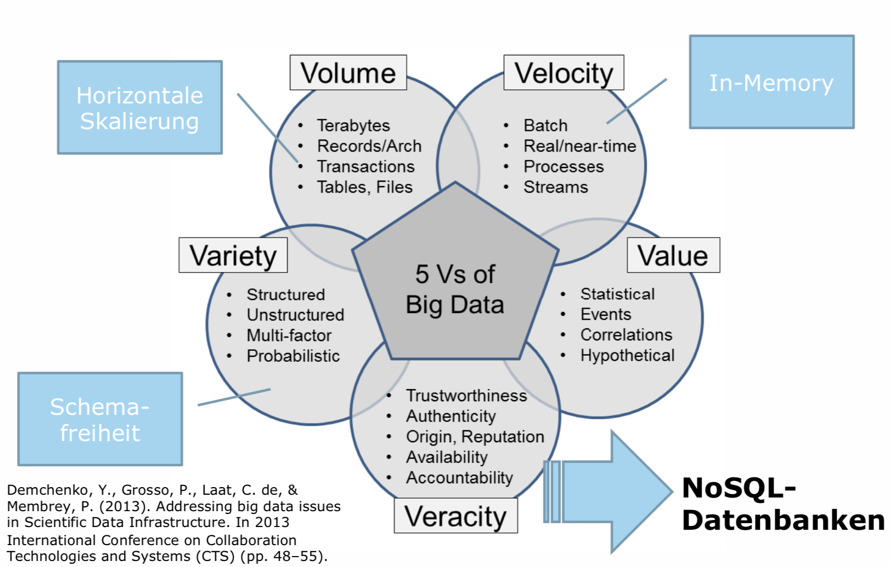
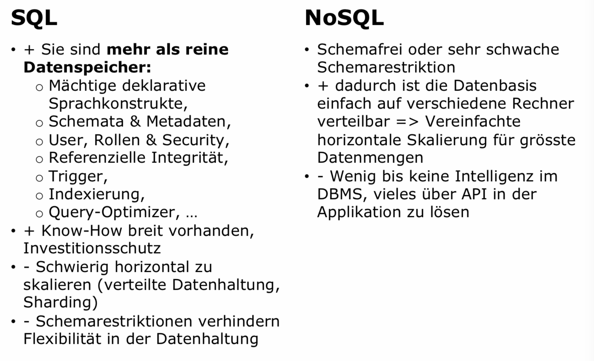
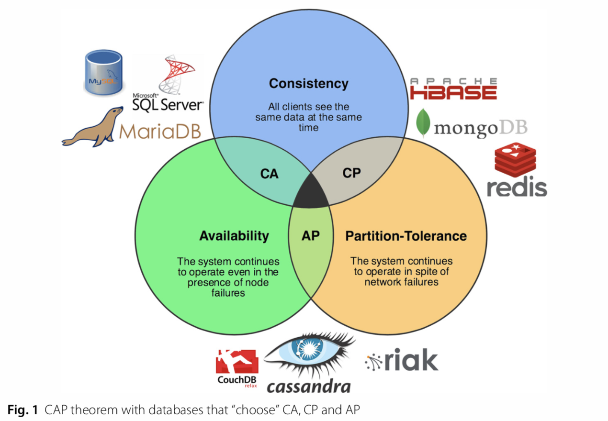

# NoSQL Databases

## Lernziele

### Den Zusammenhang von Big Data und NoSQL erklären

SQL Datenbanken sind nur sehr schwierig auf mehreren Rechner verteilbar (Sharding, Partitioning, horizontal Scaling).
Der Grund dafür sind Schemarestriktionen (Tabellen, Foreign Keys, usw.).
NoSQL löst dieses Problem, indiem Schemafreiheit oder schwache Schemas erlaubt werden.
Dies erlaubt einfaches Partitioning.

### NoSQL-Datenbanken definieren

Eine NoSQL-Datenbank weist folgende Eigenschaften auf:
- Das Datenmodell ist nicht relational
- Ausrichtung auf verteilte und horizontale Skalierbarkeit
- Schemafreiheit
- Einfache Datenreplikation
- Einfacher Zugriff über eine API
- Anderes Konsistenzmodell als ACID (z.B. BASE)

### Vor- und Nachteile von SQL im Verhältnis zu NoSQL-Datenbanken erklären

### Grund für die Entwicklung von NoSQL-Datenbanken und deren Eigenschaften (CAP, Base, Partitioning) erklären

Das CAP Theorem visualisiert:

Unterschied dem Konsistenzmodell ACID und BASE:

### Die Core NoSQL-Technologien erklären und ihre Unterschiede aufzeigen

Die Core NoSQL-Technologien sind:
- Schlüssel-Wert Datenbanken
- Dokumentdatenbanken
- Spaltenfamilien-Datenbanken
- Graphdatenbanken

**Schlüssel-Wert Datenbank**

