# Anfrageoptimierung

## Leistungsengpässe verstehen

>  Lernziel: Leistungsengpässe verstehen, I/O, JOIN, Quadratische Komplexität

Speicherhierarchie und deren typischen Zugriffszeiten:

* Register: 1-10ns
* Cache: 10-100ns (Angenommen CPU Cache L1, L2, ...)
* Hauptspeicher: 100-1000ns
* Plattenspeicher: 10ms (SSD: 1ms)
* Archivspeicher: 10sec

### Schichtenarchitektur für RDBMS

Folgende Grafik erklärt die einzelnen (Speicher-)Schichten, ihre Verwendung innerhalb des RDBMS und mögliche Optimierungen für jede Schicht:

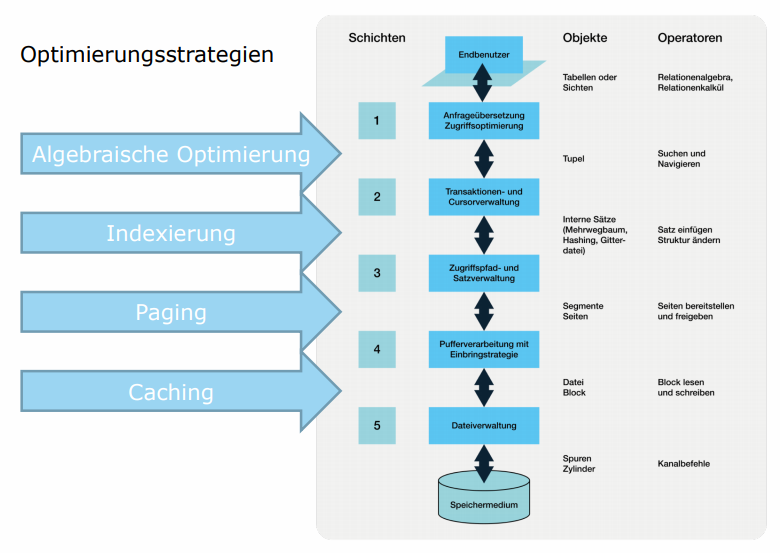

### Konsequenzen von I/O, Paging und Caching

* Pages auf der Disk sind langsam zu lesen (SSD macht es etwas wenige rlangsam)
* Der Cache im Memory ist zwar schnell, hat aber nur begrenzt Platz
* **Grösse des Caches im Memory ist der Flaschenhals für die Abfragegeschwindigkeit in Datenbanken**
* • Je mehr Daten so früh wie möglich vor der Verarbeitung rausgefiltert werden können, desto besser. => Anfrageoptimierung (siehe unten)

## Anfragen logisch optimieren

Dabei wird mittels relationaler Algebra durch Äquivalenzumformungen zur logischen Optimierung genutzt. Dabei gelten einige Grundsätze:

* Mehrere Selektionen auf dieselbe Tabelle vereinigen
* Zwischenresultate so klein wie möglich halten (Selektion, Projektion)
* Nicht verwendete Zeilen und Spalten einer Anfrage entfernen, und zwar so weit unten im Baum wie möglich
  * Selektion früh ausführen
  * Projektionen so früh wie möglich ausführen
* Verbundsoperatoren (JOIN) im Wurzelknoten des Anfragebaums verwenden

### Beispiel: Optimierter Anfragebaum in SQL

Das Anfragebeispiel:

```sql
SELECT Ort
FROM MITARBEITER, ABTEILUNG
WHERE Unt = A# AND Bezeichnung = 'Informatik'
```

Das optimierte Query:

```sql
Select Ort from 
	(select Unt, Ort from Mitarbeiter) q1
Join
	(select A# from Abteilung where Bezeichnung = 'Informatik') q2
	on q1.Unt = q2.A#
```

Optimierter Abfragebaum:

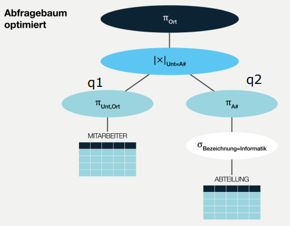

### Join-Strategien

* Gegeben sind zwei Relationen $R1$ und $R2$ mit dem Join-Prädikat $R1.X = R2.X$
* **Quadratischer Aufwand**: *Alle* Tupel aus R1 werden mit *allen* Tupeln aus R2 auf Join-Kompatibilität geprüft (Nested Join)
  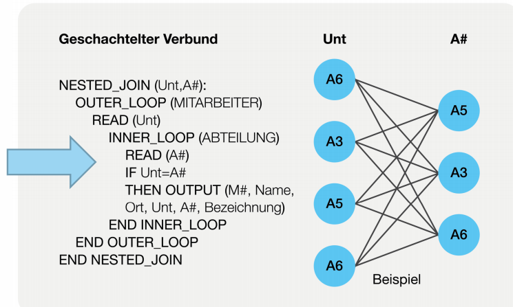
* **Linearer Aufwand nach Sortierung**: Tupel werden in Sortierreihenfolge des Joinattributs X durchlaufen (Sort-Merge-Join)
  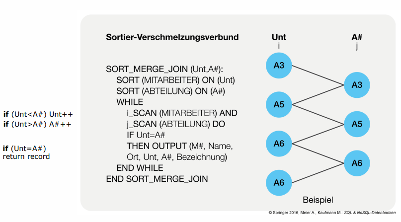


Sort-Merge-Join Implementation in C# (pseudo-code):

```c#
while (!left.IsPastEnd() && !right.IsPastEnd()) {
	if (left.Key == right.Key) {
		output.Add(left.Key);
		left.Advance();
		right.Advance();
	}
	else if (left.Key < right.Key) {
		left.Advance();
	}
	else if (left.Key > right.Key) {
		right.Advance();
	}
}
```


### Algebraische Optimierung

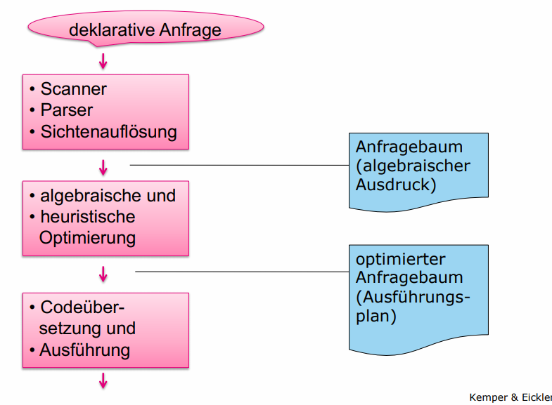

Abfragebaum optimieren:

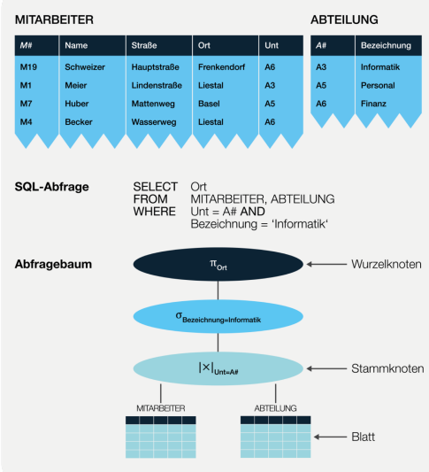

## Indexe

> Lernziel: Indexe sinnvoll setzen und verwenden (Primary Key, Foreign Key, Attribute)

Als Beispiel wird ein Telefonbuch genannt: Chur > G > Gafner > Gafner's Telefonnummer

### Indexe als Zugriffsstrukturen

* Ein Index ermöglicht es, Primärschlüssel, Fremdschlüssel, Attributwerte und Attributkombination bei Anfragen schnell zu finden

* Diese Zugriffsstruktur wird oft als B-Baum implementiert (siehe unten)

* Primär- und Fremdschlüssel-Indexe werden implizit generiert, Attributindexe müssen explizit mit `CREATE INDEX` in SQL erstellt:

  ```sql
  CREATE INDEX ix1 on Professoren(Name);
  -- Index kann auch wieder gelöscht werden
  DROP INDEX ix1;
  ```

### Bulk Loads vs. Indexe

Als Bulk Load versteht man das Laden grosser Datenmengen in die Datenbank.

Indexe sind für lesende Zugriffe optimiert und müssen bei jeder Schreiboperation aktualisiert werden. Dies kann die Ladezeit stark erhöhen.

**Empfehlung**: Bei Bulk Loads den Index zuerst löschen, nach dem Bulk Load neu erstellen.

Note: Einige Datenbanken können den Index auch temporär abschalten (z.B. Oracle mittels `ALTER INDEX ix1 disable` respektive `ALTER INDEX ix1 enable`)

### Optimierung: Index-Join

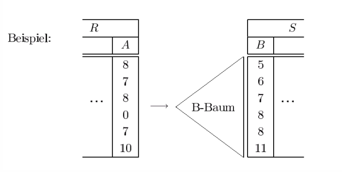

### Baumstrukturen und B-Bäume

* In einer Baumstruktur kann man Datensätze schnell Auffinden (ähnlich einem Inhaltsverzeichnis in einem Buch)
* **Definition**: B-Bäume der Breite $n$ sind ausbalancierte Bäume, also alle Pfade von Wurzel zu Blatt sind gleich lang und jeder Knoten hat mindestens $n$, aber höchstens $2n$ Teilbäum
* Der **Vorteil** der Balancierung ist, dass die Zugriffszeit für alle Datensätze gleich kurz ist

Beispiel für einen Mehrwegbaum (Zugriffsschlüssel ist die Mitarbeiter-Nr `M#`):

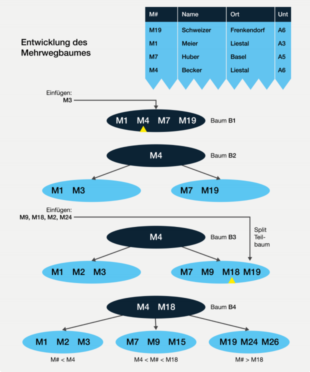

### Varia

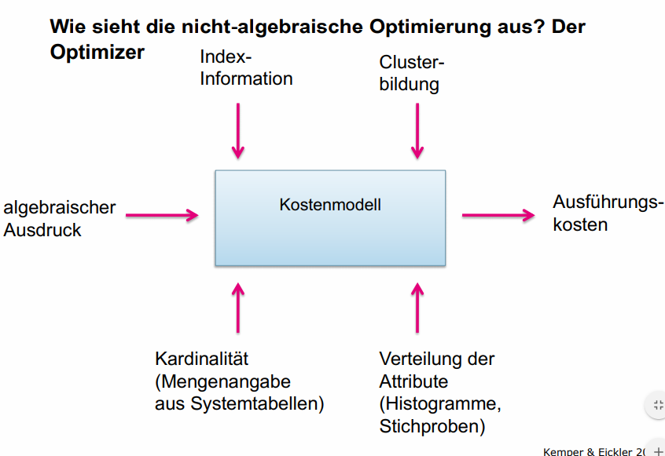

## Execution-Plan

> Lernziel: Einen Execution-Plan im Datenbankserver anzeigen und auswerten

Der Execution-Plan kann via `EXPLAIN` für eine Query erzeugt werden, z.B.:

```sql
EXPLAIN
SELECT * FROM moreStudenten s
JOIN morehoeren h on (s.MatrNr = h.MatrNr)
JOIN moreVorlesungen v on (h.VorlNr = v.VorlNr)
JOIN moreProfessoren p on (p.PersNr = v.gelesenVon)
WHERE s.Name = "Studentin_12401"
```

Daraus wird der Execution-Plan für diese Query erzeugt:

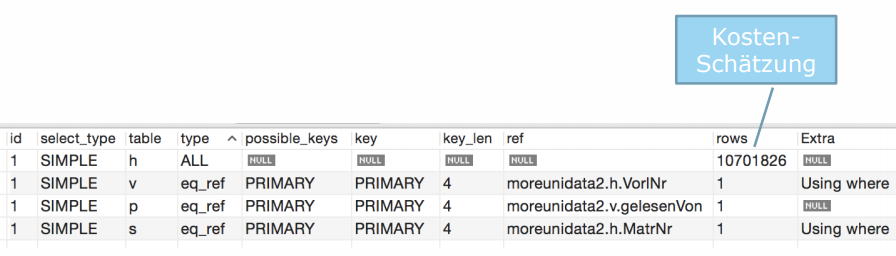

## Anfrageoptimierung durch Parallelisierung

> Lernziel: Anfrageoptimierung durch physikalische Parallelverarbeitung erklären (Map / Reduce; Federated Tables)

### Map-Reduce

Performance-Gewinn druch Map-Reduce (Verteilung im Datenbankcluster)

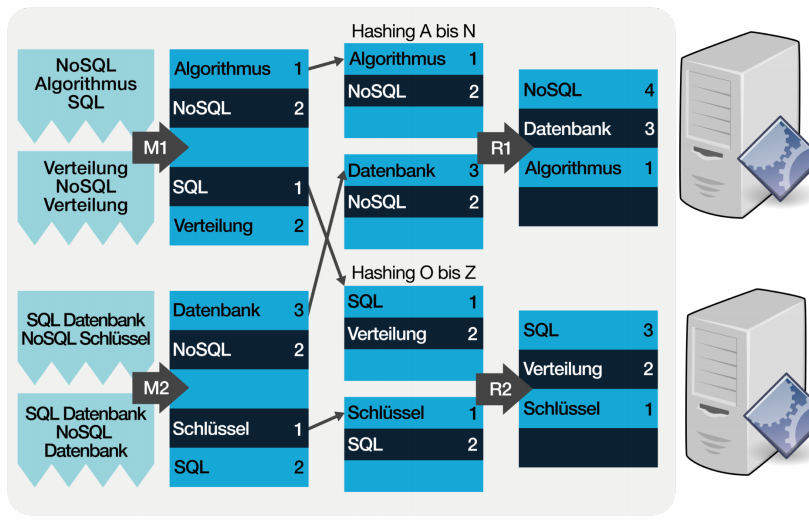

### Feterated Database Servers

Parallelisierung durch physische Verteilung von Tabellen im RDBMS

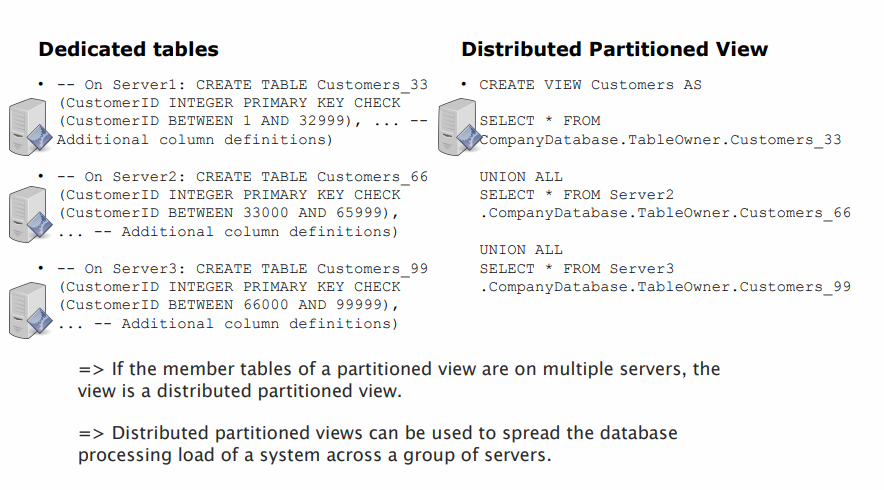