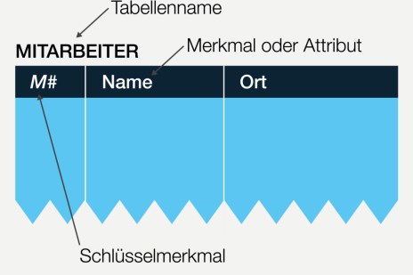
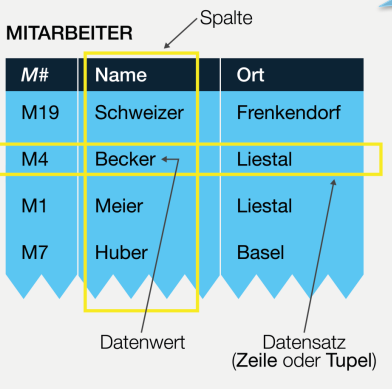

# Relationale Schemas

## Lernziele

1. Das Relationenmodell definieren
2. Sinn und Zweck der Normalformen erklären
3. Funktionale Abhängigkeit erkennen und für die Herleitung der Normalformen 1 und 2 anwenden
4. Transitiven Abhängigkeit erkennen und für die Herleitung der Normalform 3 anwenden
5. Entitätsmengen, Beziehungsmengen, Asssoziationen und Assoziationstypen in ein relationales Schema umsetzen
6. Generalisierung und Aggregation in relationale Schemas übersetzen
7. Auf der Basis eines konzeptuellen Datenmodells ein relationales Schema in einem CASE-Werkzeug modellieren

## Repetition

Daten in Tabellen:

Spalten, Zeilen und Datensätze

## Was ist eine Tabelle?

Eine Tabelle oder *Relation* ist eine Menge von Tupeln, dargestellt als Tabellen. Diese erfüllen folgende Anforderungen:

* Tabellenname: Eine Tabelle besitzt einen eindeutigen Tabellennamen. 
* Merkmalsname: Innerhalb der Tabelle ist jeder Merkmalsname eindeutig und bezeichnet eine bestimmte Spalte mit der gewünschten Eigenschaft.
* Keine Spaltenordnung: Die Anzahl der Merkmale ist beliebig, die Ordnung der Spalten innerhalb der Tabelle ist bedeutungslos.
* Keine Zeilenordnung: Die Anzahl der Tupel einer Tabelle ist beliebig, die Ordnung der Tupel innerhalb der Tabelle ist bedeutungslos.
* Identifikationsschlüssel: Eines der Merkmale oder eine Merkmalskombination identifiziert eindeutig die Tupel innerhalb der Tabelle und wird als Identifikationsschlüssel deklariert

## Identifikationsschlüssel

Haben zwei wichtige Eigenschaften:

* Eindeutigkeit: Jeder Schlüsselwert identifiziert eindeutig einen Datensatz innerhalb der Tabelle, d.h. verschiedene Tupel dürfen keine identischen Schlüssel aufweisen.
* Minimalität: Falls der Schlüssel eine Kombination von Merkmalen darstellt, muss diese minimal sein. Mit anderen Worten: Kein Merkmal der Kombination kann gestrichen werden, ohne dass die Eindeutigkeit
  der Identifikation verlorengeht

## Kontrollfragen

### Selbststudium

#### Wie wird der Begriff der Redundanz definiert?

Redundanz bezeichnet das Vorhandensein von eigentlich überflüssigen, für die Information nicht notwendigen Elementen.

Ein Merkmal einer Tabelle gilt als redundant, wenn einzelne Werte dieses Merkmals innerhalb der Tabelle _ohne Informationsverlust_ weggelassen werden können.

Beispiel Mitarbeitertabelle:

| M#  | Name  | A#  | Abteilungsbezeichnung |
| --- | ----- | --- | --------------------- |
| 1   | Meier | 1   | Informatik            |

Hier ist das redundante Merkmal die Abteilungsbezeichnung. 
Es geht keinerlei Information verloren, wenn hier lediglich die Abteilungsnummer gespeichert wird. 
Des Weiteren entsteht eine Änderungsanomalie: Wechselt ein Mitarbeiter die Abteilung, müssen zwei statt nur ein Wert aktualisiert werden.

#### Wozu werden die Normalformen eingesetzt und aus welchem Grund? 

Mit den Normalformen wird der Redundanz entgegengewirkt, da diese zu Anomalien führen kann.

#### Was ist eine Löschanomalie? Erklären Sie dies anhand eines konkreten Beispiels!

Eine Löschanomalie entsteht, wenn durch das Löschen eines Datensatzens mehr Informationen als erwünscht verloren gehen. 
Dies tritt auf, wenn ein Datensatz mehrere unabhängite Informationen enthält. Durch das Löschen der einen Information wird somit auch die andere (unabhängig existierende) Information gelöscht.

Beispiel Mitarbeitertabelle:

| M#  |    Name     | A#  | Abteilungsbezeichnung |
| --- | ----------- | --- | --------------------- |
| 1   | Meier       | 1   | Informatik            |
| 2   | Müller      | 2   | Verkauf               |
| 3   | Hugentobler | 1   | Informatik            |

Wird in dieser Firma nun Herr Müller entlassen bzw. von der Tabelle gelöscht, so wird auch die Abteilung "Verkauf" entfernt. Existiert kein anderer Mitarbeiter dieser Abteilung mehr, dann existiert diese plötzlich nicht mehr.

> Diesem Problem wird mit den Normalformen, genauer mit der dritten Normalform, entgegengewirkt.

#### Was ist eine funktionale Abhängigkeit?

Ein Mermal B ist funktional abhängig vom Merkmal A, falls zu jedem Wert von A genau ein Wert aus B existiert. 
Die funktionale Abhängigkeit B von A verlangt somit, dass jeder Wert von A eindeutig einem Wert von B zugewiesen werden kann. 
Bekanntlich haben alle Identifikationsschlüssel die Eigenschaft, dass die Nichtschlüsselmerkmale eindeutig vom Schlüssel abhgängig sind. 
Es gibt also allgemein für einen Identifikationsschlüssel S und für ein beliebiges Merkmal B einer bestimmten Tabelle die funktionale Abhängigkeit S->B.

#### Was ist eine volle funktionale Abhängigkeit?

Wie oben beschrieben, haben generell Schlüsselmerkmale diese Eigenschaft, dass die Nichtschlüsselmerkmale von ihnen funktional abhängig sind.
Ein Schlüssel kann jedoch auch aus mehreren zusammengesetzten Merkmalen bestehen. 
Eine _volle funktionale Abhängigkeit_ bezeichnet nun, wenn in der beschriebenen Situation ein Nichtschlüsselmerkmal funktional abhängig vom zusammengesetzten Schlüssel ist, nicht aber von den einzelnen Bestandteilen des Schlüsselmerkmals.

#### Was ist eine transitive Abhängigkeit?

Transitiv abhängig bedeuted hier "über Umwege abhängig", also z.B. über zwei funktionale Abhängigkeiten.

> Formal: Das Merkmal C ist transitiv abhängig von A, falls B funktional abhängig von A, C funktional abhängig von B und nicht gleichzeitig A funktional abhängig von B ist.

Im Beispiel der Mitarbeitertablle beispielsweise existieren die folgenden funktionalen Abhängigkeiten: 

- zwischen der Mitarbeiternummer und der Abteilungsnummer
- zwischen der Abteilungsnummer und der Abteilungsbezeichnung

Dies führt zu der transitiven Abhängigkeit von Mitarbeiternummer und Abteilungsbezeichnung. Diese beiden Informationen haben nichts miteinander zu tun und doch existiert eine Abhängigkeit.

#### Welchen Bezug haben diese Abhängigkeiten zu den Normalformen 1-3?

Es gelten die folgenden Kriterien, um den Normalformen zu entsprechen:

1. Normalform: Keine Wiederholungsgruppen, alle Merkmalswerte müssen atomar sein
2. Normalform: Alle Nichtschlüsselmerkmale sind [voll vom Schlüssel abhängig](#was-ist-eine-volle-funktionale-abhängigkeit)
3. Normalform: Keine transitiven Abhängigkeiten

#### Was ist der Unterschied zwischen einer Tabelle und einer Relation?

Eine Relation bezeichnet eine Beziehung zwischen Entitäten, hier zwischen Tabellen. Allerdings erfordert eine Beziehung nur im Falle einer _komplex-komplexen_ Beziehung (n:n) eine eigene Tabelle. 
Ansonsten (1:1, n:1) sind diese Extra-Tabellen nicht nötig.

#### Welches sind die zwei wichtigen Schlüsseleigenschaften?

#### Warum braucht es für einfach-komplexe und einfach-einfache Beziehungsmengen keine Beziehungstabelle?

Hier können die Schlüssel jeweils einer der beiden Entitäten zugewiesen werden. Bei der 1:1 -Beziehung (einfach-einfache) spielt es keine Rolle, wo der Fremdschlüssel sich befindet.
Bei der 1:n-Beziehung (einfach-komplexe) muss der Schlüssel zwingend auf die Tabelle der _n_-Seite kommen (Vergleich zum Beispiel mit den Mitarbeitern, der Fremdschlüssel müsste hier auf die Mitarbeitertabelle, nicht auf die Abteilungstabelle).

#### Wozu braucht es die siebte Regel?

Die siebte Regel beschreibt die Aggregationen. Hier müssen die Beziehung sowie auch die Entitätsmenge als eigenständige Tabelle definiert werden. 
Sie wird benötigt, um zwei Entitäten mit einer _komplex-komplexen_ Beziehung abzubilden, d.h. Instanzen der beiden Entitäten haben jeweils eine Beziehung zu mehreren (n) Elementen der anderen Entität. 
Somit ist es (anders als bei [einfach-einfachen oder einfach-komplexen Beziehungen](#warum-braucht-es-für-einfach-komplexe-und-einfach-einfache-beziehungsmengen-keine-beziehungstabelle)) nicht möglich, das Schlüsselelement einer der beiden Entitäten als Tabellenspalte anzufügen.