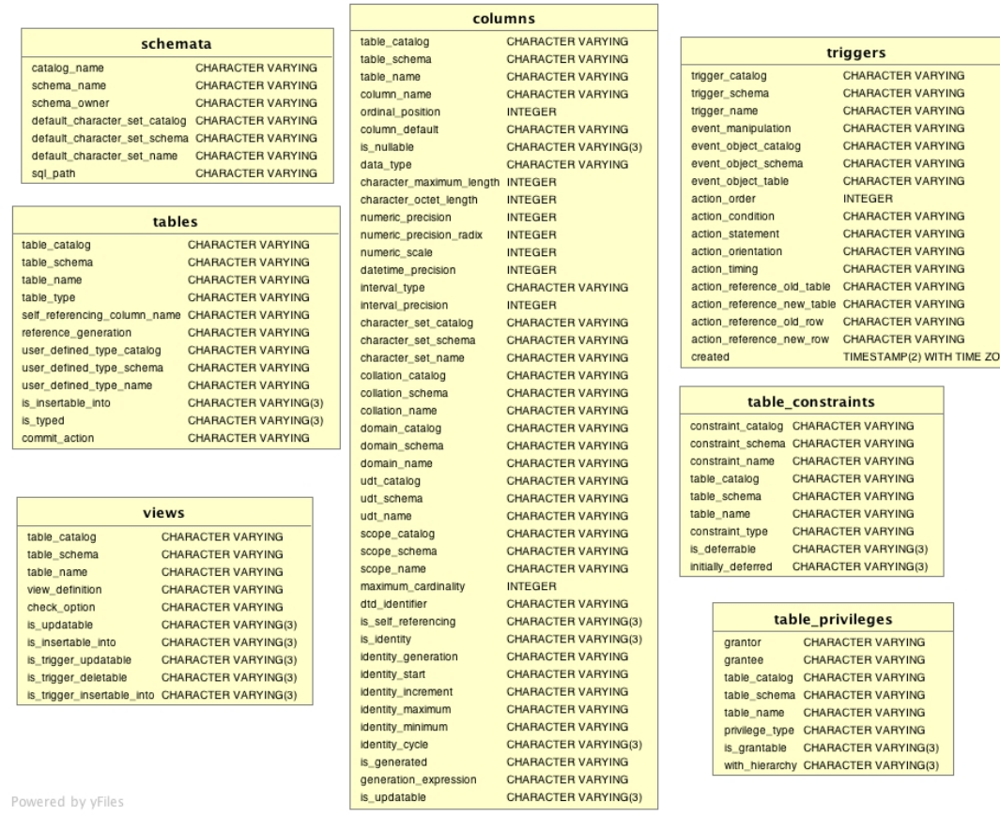
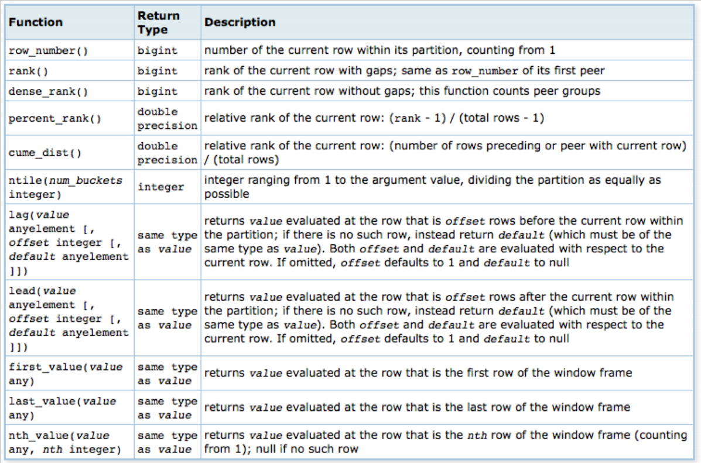

# SQL Spezialisierung

## Lernziele

### Metadaten: Das Data Dictionary anwenden

- Data Dictionary = *Information Schema*
- Schreibgeschützt, nur per DBMS mutierbar
- beschreibt Tabellen und Spalten
- Metadaten: d.h. Daten, welche andere Daten beschreiben (Daten über Daten)
- Ermöglicht Abfragen über in Tabelle vorhandene Spalten

#### Inhalt

Das *Information Schema* bietet viele verschiedene Metadaten zur Abfrage an:



#### Anwendungsfall

Sinnvollerweise kann dies in SQL-Migrationsskripts verwendet werden, wenn eine Spalte nur bei nicht-Existenz hinzugefügt werden soll.
So macht es nichts, wenn ein Skript mehrmals ausgeführt wird.

```sql
IF NOT EXISTS (SELECT * FROM sys.columns
                WHERE object_id = OBJECT_ID('MyTable')
                AND [name] = 'MyColumn')
BEGIN
    ALTER TABLE [MyTable] ADD [MyColumn] NVARCHAR(MAX);
END
```
> Dieses Beispiel bezieht sich auf eine Microsoft SQL Server Installation.

### Nullwerte

Ein Nullwert bezeichnet eine komplett leere Tabellenzeile. 
Dies ist nicht zu verwechseln mit einem leeren String in einer Zelle eines beliebigen String-Typs.
Logisch ausgedrückt ist der Wert der Zelle also unbekannt. 

Neu wird hier eine dreiwertige Wahrheitslogik eingeführt: Neben den bereits bekannten Werten 1 (wahr) und 0 (falsch) wird nun auch noch ? (unbekannt) eingeführt. 
Ist ein Operand in einer Wahrheitsoperation unbekannt, so ist auch das Ergebnis `null`.

Nullwerte können entsprechend als Filterkriterien verwendet werden.

```sql
-- nur die NULL-Einträge
SELECT * FROM [Student] WHERE [Semester] IS NULL;

-- keine NULL-Einträge
SELECT * FROM [Student] WHERE [Semester] IS NOT NULL;
```
 
> Dies kann in Zusammenhang mit den Joins (INNER, LEFT, RIGHT, FULL OUTER) interessant werden.

### Quantifizierte Anfragen (exists)

- Prüft, ob ein entsprechender Datensatz im Resultat eines Subqueries enthalten ist [(siehe Beispiel im DataDictionary)](#anwendungsfall)
- Unterschied zu `IN`: `EXISTS` beendet den Scanning-Prozess des Subresultats, sobald ein Match gefunden wurde
    - Subquery-Resultat sehr gross: `EXISTS` ist schneller
    - Subquery-Resultat sehr klein: `IN` ist schneller
- Subqueries sind oft durch `JOIN` ablösbar, was auch empfehlenswert ist.

[Weiterführender Link](http://www.dba-oracle.com/t_exists_clause_vs_in_clause.htm)

### Fallunterscheidungen (case when)

Mit dem `CASE WHEN` Statement kann einfach eine wertabhängige Ausgabe erreicht werden.
Häufig können diese Statements gross und eher unschön werden.

```sql
SELECT MatrNr (
CASE
    WHEN [Note] > 5.5 THEN 'sehr gut'
    WHEN [Note] > 4.5 THEN 'gut'
    WHEN [Note] = 4 THEN 'bestanden'
END)
FROM [Exam]
```

### Common Table Expressions (CTE)

- CTE's werden verwendet, um temporär benötigte Resultatsets zu spezifizieren
- Diese Sets werden von einem simplen Query abgeleitet.
- Das Resultat einer CTE kann danach im Query wie jede andere Tabelle oder View verwendet werden

[Weiterführender Link](https://www.geeksforgeeks.org/cte-in-sql/)

### Rekursion in SQL (with recursive)

- Basierend auf [CTEs](#common-table-expressions-cte)
- Rekursiv verwendete CTEs: ermöglichen Erstellung von komplexen Abfragen ohne auf eine prozedurale Sprache wie z.B. plpgsql zugreifen zu müssen
- Rekursive CTEs ermöglichen es, aufgerufen zu werden, bis eine bestimmte Bedingung eintrifft

[Weiterführender Link für Postgres](https://www.citusdata.com/blog/2018/05/15/fun-with-sql-recursive-ctes/)

### Window Functions (over, partition by)

- Führt Berechnung über eine Menge von Tabellenzeilen durch, die irgendwie im Zusammenhang mit der aktuellen Reihe stehen 
- Im Gegensatz zu gewöhnlichen Aggregatfunktionen führt die Verwendung einer Fensterfunktion nicht dazu, Zeilen in einer einzigen Ausgabezeile zu gruppieren - die Zeilen bleiben bestehen.
- Keyword: `OVER()`
- `OVER (ORDER BY X)`: laufende Aggregation, sortiert nach einer Spalte X
- `OVER (PARTITION BY Y)`: gruppierte Aggregation auf Einzelsatzbebene, partitioniert nach einer Spalte Y
- **Sinn:** So kann z.B. eine Aggregatsfunktion (`SUM`, `COUNT`, `MIN`) in Einzeldatensätzen verwendet werden

#### PostgreSQL

PostgreSQL bietet einige built-in window functions an:

