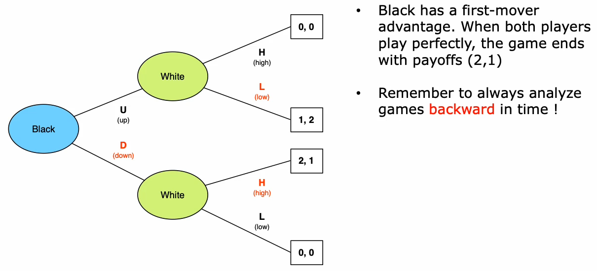
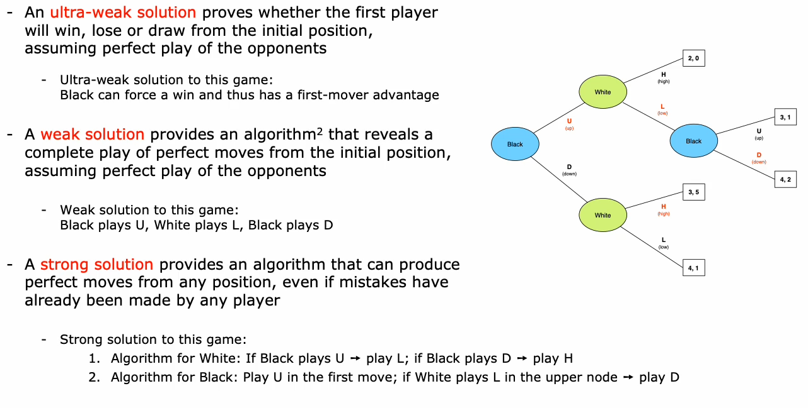
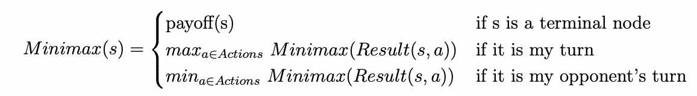
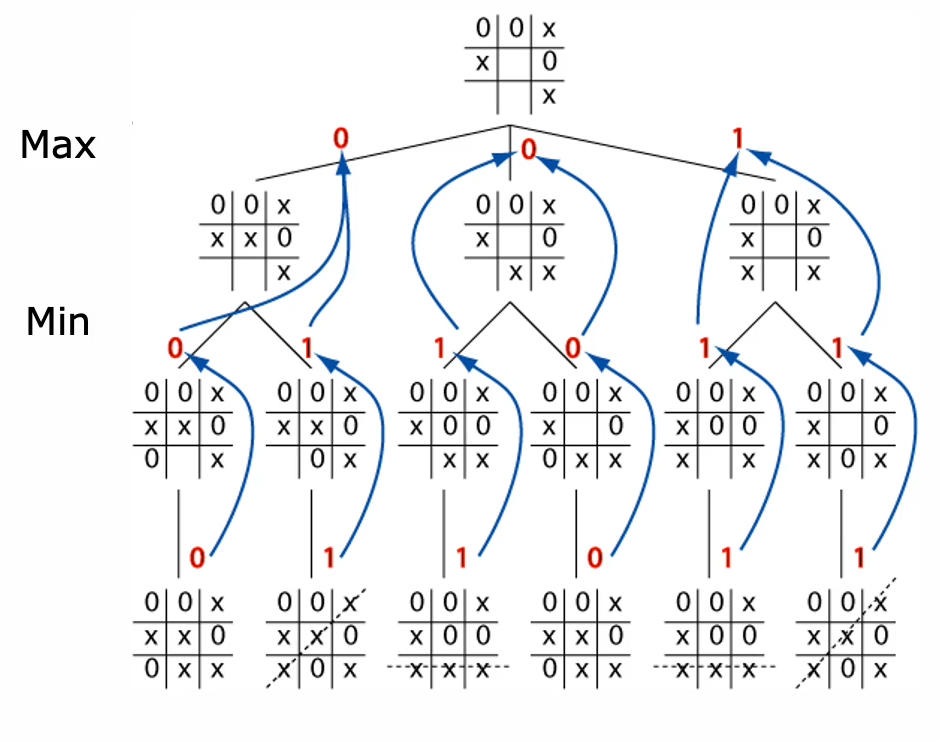

# Sequential Games With Perfect Information (SW02)

## Finite Sequential Games

Es werden nur endliche Spiele betrachtet, d.h. Spiele mit einer endlichen Anzahl Spieler, die jeweils eine endliche Anzahl Aktionen haben.
Die beteiligten Spieler wählen ihre Aktionen sequentiell (rundenweise, einer nach dem andern).
Es wird immer eine endliche Anzahl Runden gespielt.

Anders als bei menschlichen Spielern gilt hier der sogenannte **Perfect Recall**: Ein Spieler kann jeweils alle bisherigen Aktionen von sich selber sowie allen Gegnern aus allen vorhergehenden Runden in seine Entscheidungsfindung miteinbeziehen.

Jeder Spieler wählt eine Strategie. Diese gibt auszuführende Aktion in einer Runde vor.
Ein **Strategy Profile** ist die Wahl einer Strategie durch alle Spieler, die am Spiel beteiligt sind.
Eine **payoff function** definiert das Resultat (_outcome_) für jedes Strategieprofil.

## Complexity Factors

Verschiedene Faktoren haben Einfluss auf die Komplexität einer Spielanalyse, die im Folgenden erklärt sind.

> In dieser Semesterwoche werden lediglich _kompetitive_, _deterministische_ Spiele mit _perfekter Information_ betrachtet.

### Anzahl Spieler

Häufig ist ein Spiel leichter zu analysieren, wenn es eine geringere Anzahl beteiligter Spieler hat.

### Grösse des Suchraumes

Der Suchraum bezeichnet die Menge aller legaler Spielsituationen.
Während beispielsweise _Tic-Tac-Toe_ einen sehr kleinen Suchraum hat, so hat Schach einen sehr grossen Suchraum.

### Kompetitiv vs. Kooperativ

In kompetitiven Spielen existieren nur Spieler mit direkt entgegengesetzten Interessen und Absichten.
In kooperativen Spielen kommen durch Koalliationen verschiedene Kombinationen von gleichgesetzten und entgegengesetzten Interessen und Absichten dazu.

### Stochastisch vs. Deterministisch

In stochastischen Spielen kommt ein Zufallselement hinzu, zum Beispiel Würfeln oder das Ziehen von Karten.

### Perfekte vs. Imperfekte Information

Bei Spielen mit perfekter Information kann zu jedem Zeitpunkt der gesamte Zustand in eine Entscheidung miteinfliessen.
Ist ein Spiel durch den Agenten nur _partially observable_, so gilt die Information als imperfekt.
Beispiel: In einem Poker-Spiel kennt der Agent nur seine eigenen, nicht jedoch die Karten seiner Gegner.

## Game Tree

Prinzipiell können sequentielle Spiele als Baum (sog. _Game Tree_) repräsentiert werden.
Dabei stellen die _Nodes_ die verschiedenen Spielsituationen (z.B. Positionen von Spielsteinen auf Spielbrett) dar.
Die _Edges_ (Kanten) repräsentieren Aktionen bzw. Spielzüge.
Sie verbinden zwei sukzessive auftretende Spielsituationen; vom _parent node_ wird mit der Aktion der jeweiligen Kante die Spielsituation des _child nodes_ erreicht.
Die _leaves_ (Blätter) des Spielbaumes repräsentieren schlussendlich die _payoffs_ der Kombination aus Aktionen, die den Pfad zum Blatt bilden.

> Der Spielraum (Menge aller _nodes_ im Spielbaum) ist grundsätzlich grösser als der Suchraum. 
> Grund dafür ist, dass einzelne legale Spielsituationen durch unterschiedliche Aktionen eintreten können und somit potentiell mehrfach vorhanden sind.

## Backward Induction

Damit ein Spieler eine Aktion wählen kann, braucht er eine gewisse Entscheidungsgrundlage.
Diese bildet er durch eine Analyse des Spielbaums.
Eine Möglichkeit dies zu tun ist _backward induction_: Der Spielbaum wird schrittweise (_induction_) vom zeitlich vom Ende (_leaves_, _payoff_) her analysiert (_backward_).
Backward Induction ist eine Lösungsstrategie für endliche Spiele mit perfekter Information.

## Reasoning About Sequential Games

Es existieren verschiedene Formen der Lösung, wenn es um sequentielle Spiele geht:

- **Ultra-weak solution**: Eine ultraschwache Lösung gibt an, ob der erste Spieler gewinnt (_first-mover advantage_), verliert oder ein Unentschieden erreicht wird. Dabei wird von der Initialposition aus das "perfekte Spiel" vorausgesetzt, d.h. jeder wählt immer die für ihn bessere Option. Bei dieser Art von Lösung gibt es keinerlei Anweisung, wie dieses mögliche Ergebnis erreicht wird.
- **Weak solution**: Eine schwache Lösung gibt den Pfad zum Endergebnis an, wenn jeder Spieler in jedem Spielzug die rationale Wahl trifft. Eine _weak solution_ kann durch einmaliges von _Backward Induction_ vom Startzustand des Spiels aus errechnet werden.
- **Strong solution**: Eine starke Lösung liefert einen Algorithmus, der von jeder Spielsituation aus den perfekten Spielzug findet. Anders als die anderen beiden Lösungsarten funktioniert dies also auch, wenn in einem vorhergehenden Spielzug nicht die rationale Wahl getroffen wurde. Um eine _strong solution_ zu erhalten, muss _Backward Induction_ dynamisch während des Spiels ausgeführt werden können, ungeachtet des aktuellen Spielzustands.

### Beispiel

## Zero-Sum Game

Eine spezielle Art von Spielen sind die sogenannten _Nullsummenspiele_.
In einem Nullsummenspiel hat der Gewinner des Spiels genau so viel zu gewinnen, wie der Verlierer zu verlieren hat.

Nullsummenspiele ermöglichen die Verwendung des _minimax_ Algorithmus.

### Formale Definition

In der folgenden Gleichung steht $$u$$ für die _utility function_ eines Strategiepaars (gleich dem _payoff_), $$s_1$$ und $$s_2$$ jeweils für die Strategie des Spielers 1 bzw. 2.

$$
u_1(s_1, s_2) = -u_2(s_1, s_2)
$$

## Minimax Algorithmus

Der _Minimax_ Algorithmus baut auf der Nullsummen-Eigenschaft von Spielen auf.
Wie in jedem Spiel will jeder Spieler seinen eigenen _payoff_ maximieren.
Durch die Nullsummen-Eigenschaft kann nun zusätzlich auch der _payoff_ des Gegners minimiert werden, denn jeder Minuspunkt des Gegners ist ein Pluspunkt für den Spieler.

Der Trick ist nun, im _Game Tree_ vorwärts zu schauen und wie folgt vorzugehen (aus Sicht des Spielers):

- Handelt es sich um ein _Node_ von mir, wähle ich die Aktion, welche meinen _payoff_ maximiert.
- Handelt es sich ein _Node_ meines Gegners, wähle ich diejenige Aktion, welche dessen _payoff_ minimiert.

Auch der Minimax Algorithmus ist rekursiv und funktioniert in Bezug auf den _Game Tree_ von unten nach oben.
In jedem Schritt, den Spieler 1 selber wählen kann, wird der Payoff maximiert, in jedem Schritt von Spieler 2 minimiert.

**Beispiel Tic-Tac-Toe**

Dieser Algorithmus kann unmöglich auf dem ganzen Spielbaum von komplexen Spielen durchgeführt werden.
Deswegen werden zwei Tricks angewendet, um die Analyse zu ermöglichen:

1. Die Tiefe der Suche im Spielbaum wird auf $$x$$ Züge begrenzt, bzw. es werden nur die nächsten fünf Züge betrachtet. Die mögliche Tiefe $$x$$ hängt hier von den Spielregeln (bzw. Anzahl möglicher Aktionen), Effizienz der Implementation sowie Rechenpower ab.
2. Da die Tiefe der Lösungssuche begrenzt ist, werden die _leaves_ nie erreicht, der reale Payoff bleibt unbekannt. Aus diesem Grund wird eine Heuristik eingeführt, welche die erreichte Spielsituation nach $$x$$ Zügen beurteilt. _Je besser die Heuristik, desto besser der Bot._

> Achtung: Unter Anwendung dieser Tricks wird keine Lösung nach Spieltheorie mehr erreicht!

## Alpha Beta Pruning

Bei _Alpha Beta Pruning_ wird das optimale Erebnis im Spielbaum gefunden, ohne alle Knoten abarbeiten zu müssen.
Dies basiert auf dem Wissen, dass zu jedem Zeitpunkt klar ist, ob der Knoten ein _Minimum-Knoten_ (gegnerische Aktion folgt) oder ein _Maximum-Knoten_ (eigene Aktion folgt) ist.

_Sub-Trees_, die keine besseren Payoffs (somit bessere Lösungen für Spieler 1) enthalten können, werden abgeschnitten (en: _pruning_, bedeutet Äste/Sträucher stutzen und kommt aus Landwirtschaft).
Zu diesem Zweck hält der Algorithmus zwei Parameter:

1. $$\alpha$$: Bezeichnet den höchsten Wert aller _Max-Ancestors_ eines _Min-Knotens_.
2. $$\beta$$: Bezeichnet den tiefsten Wert aller _Min-Ancestors_ eines _Max-Knotens_.

_Es werden alle Knoten auf dem Pfad zwischen dem aktuellen Knoten und dem Wurzelknoten als Ancestor bezeichnet._

Der Lösungsalgorithmus _alpha beta pruning_ aktualisiert die Werte $$\alpha$$ und $$\beta$$ während der Durchführung des _Minimax_ Algorithmus.
Sobald ersichtlich ist, dass Werte aus einem Sub-Tree weder $$\alpha$$ überbieten noch $$\beta$$ unterbieten können, wird dieser Sub-Tree abgeschnitten bzw. ausser Acht gelassen. 
Dabei spielt es keine Rolle, ob der Teilbaum bereits komplett abgesucht wurde oder nicht.

### Regeln

1. Schneide einen Teilbaum ab, sobald der aktuelle Wert eines _Min-Knotens_ kleiner ist als $$\alpha$$.
2. Schneide einen Teilbaum ab, sobald der aktuelle Wert eines _Max-Knotens_ grösser ist als $$\beta$$.

### Speed-Up

Für einen Spielbaum mit der Tiefe $$m$$ und $$b$$ möglichen Aktionen gilt die maximale Zeitkomplexität von $$O(b^m)$$ für den _Minimax_ Algorithmus.
Im Idealfall braucht _Alpha Beta Pruning_ nur eine Zeitkomplexität von $$O(b^\frac{m}{2})$$. Dies entspricht einer Reduktion des Branching-Faktors um das Ziehen der Wurzel.
Um diesen maximalen Speed zu erreichen, wird allerdings vorausgesetzt, dass die möglichen Zustände in einer cleveren Reihenfolge explored werden.