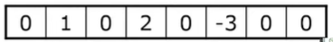
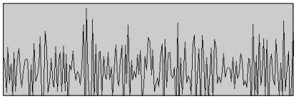
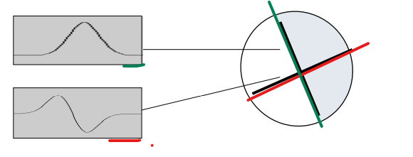

# SW07 - EBV & IPCV - Liniensegmentierung

https://www.youtube.com/watch?v=yQDP-OX10dg

Topics:

* Kantendetektion
  * Segmentierung
  * In 1D & 2D
  * Durch Ableitung
  * In verrauschten Bilder
  * Canny Filter
* Hough Transformation
  * Verdichtung
  * Kreise detektieren

## Segmentierung

Die Segmentierung gilt der Detektion von Objekten. Es existieren zwei Ansätze:

* Kantenbasiert: Objekte werden durch Kanten begrenzt
* Regionenbasiert: Objekte werde durch ihr Inneres bestimmt (z.B. ihre Farbe oder Textur)

Bei kantenbasierten Verfahren müssen zuerst die Kanten erkannt werden.

### Wie werden Kanten detektiert?

Im 1D-Raum können Kanten als Sprünge in der Bildintensität erkannt werden. Das ist Idee: man sucht nach Nachbarschaften mit Anzeichen für eine grosse Änderung. Um diese Änderungen zu finden gibt es verschiedene Ansätze:

1. Durch Ableiten der Intensitätswerte (Sobel Filter)
2. Optimaler Filter durch Gütekriterien (Canny Filter)
3. Matched Filtering

### 1. Kantendetektion durch Ableitung

1. Differenz der Nachbaren
2. Zentriert: Differenz zwischem den rechten und dem linken Pixel

Die beiden Ableitungen sind gleichbedeutend mit Anwendung einer Filtermaske.

1. [-1, 1]
2. [-1/2, 0, 1/2]

Als Beispiel haben wir ein Bild (1D) mit folgendem Profil:

Die roten Linien kennzeichnen eine Änderung in der Intensität, die Tabelle die Intensitätswerte. Nun können wir ableiten oder den passenden Filter mittels Faltung anwenden:

Nachdem wir das Signal mit dem Filter gefaltet haben erhalten folgende Werte für die Änderungen der Intesitätswerte.

Drei Kanten wurden so identifiziert mit unterschiedlichen Kantenstärken (1, 2, -3). Das negative Vorzeichen kommt daher, dass die Intensitätswerte dort abgenommen statt zugenommen haben. (daher ggf. den Absolutwert nehmen!)

#### Problem: Verrauschte Bilder

In der Realität sind die Bilder verrauscht, dies verhindert das nur genau eine Kante gefunden werden kann. Der Idealfall sieht so aus:

Und durch Ableitung findet man den Peak in der Intensitätsänderung:

Da wir jedoch mit verrauschten Bilder arbeiten, sehen die Profile üblichweise so aus. Die Änderung im Profil ist immer noch ersichtlich.

Aber aus der Ableitung dazu kann die Kante nicht mehr identifiziert werden:

Um genau diesem Problem entgegenzuwirken wurde der Canny Filter entwickelt.

### Canny Filter

Kantenerkennung über Gütekriterien. Die Eigenschaften / Gütekriterien eines guten Kantendetektors nach Canny:

* Gute Detektion: Wo Kanten sind, soll der Filter einen hohen Wert zurückgeben
* Gute Lokalisierung der Kante: Die lokalisierte Kante soll möglichst nahe bei der korrekten Kante liegen
* Eindeutigkeit: Für eine korrekte Kante soll der Detektor auch nur eine Kante lokalisieren, sodass der Filter keine zwei- oder mehrdeutigen Antworten zurück gibt. Eine Kante soll also nur ein klares Maximum geben.

Auf Basis dieser Kriterien wurde ein optimaler Kantenfilter gefunden, welcher der ersten Ableitung einer Gaussfunktion entspricht:

Somit kann aus dem verrauschten Bild von oben folgendes Bild erzeugt werden:

Der Peak ist also deutlich besser zu sehen.

## Kantendetektion 2D

Das Detektionsprofil verläuft senkrecht zu der Kante.

Im Profil ist die Zunahme der Intensität (weisser Fleck) und die darauffolgende, starke Abnahme (schwarzer Fleck) ersichtlich. Das Profil wurde senkrecht zu dieser Kante (schwarze Linie erstellt).

Filtern ist aufwändig und daher nicht die schnellste Operation, daher muss man das so effizient wie möglich gestalten. Dazu gibt es einen Trick: der isotrope (i.e. runde) Filter mit einem Gauss Profil in der einen Richtung, und der Ableitung derselben Gauss Funktion in der anderen Richtung (beide Funktionen haben dasselbe sigma).

Da es sich in beiden Fällen um lineare Operationen handelt können Ableitung und Filterung vertauscht werden. Uns interessiert eigentlich nur die Richtung, in welcher die Ableitung des gefilterten Bildes am grössten ist. Dies ist am grössten in der Richtung des Gradienten. Kantenstärke entspricht der Magnitude des Gradienten.

Implementation des isotropen 2D Canny Kantenfilters:

1. Filterung mit 2D Gaussfunktion
2. Numerische Berechnung der x und y Ableitungen (DX(x,y), DY(x,y)). Da nach der Filterung das Rauschen bereits weg ist.
3. Kantenstärke an einem beliebigen Punkt (x, y) erhalten wir durch den Gradientenvektor, der sich aus $\sqrt{(DX^2+DY^2)}$ ergibt.

Die Detektion von feineren resp. gröberen Kanten kann durch verschiedene Grössen des Gaussfilters (Sigma) detektiert werden. Dies wird auch *Detektion auf versch. Auflösungsstufen* genannt.

#### Auflösungsstufen

Links ist das Originalbild. Das Bild in der Mitte wurde mit einer Gaussfunktion mit grossen Sigma gefiltert. Es liefert also nur sehr grobe Kanten, hingegen das Bild auf der rechten Seite wurde mit einem tiefen Sigma gefiltert. Dafür erhält man feinere Kanten, wo hingegen die hautpsächlichen Kanten nicht so klar dargestellt werden (z.B. unterbrochen etc.)

### Andere Kantenfilter

* Sobel Filter
* Prewitt Filter

Beide sind ähnlich dem Canny Filter. Jedoch können diese beide Filter nicht parameterisiert / konfiguriert werden.

### Canny Kantenfilter: Zusätzliche Schritte

* Ziel: Nur 1 Pixel breite Kante (?)
* Dazu sucht man das lokale Maxima senkrecht zur Kantenrichtung
* Non-Maxima Suppression

### Hysteresis Thresholding

Es werden zwei Thresholds eingeführt: $T_{high}, T_{low}$:

* Pixel über T_high gehören zu einer Kante
* Pixel unter T_low gehören nicht zu einer Kante
* Pixel über T_low gehören nur dann zu einer Kante wenn sie über andere T_low Pixel direkt mit einem T_ high Pixel verbunden sind

Dies erlaubt es, mehr zusammenhängende Pixel zu finden als wenn wir nur einen Threshold verwendet wird.

## Hough-Transformation

Die Hough-Transformation ist ein Verfahren zur Erkennung von Geraden, Kreisen oder beliebigen anderen parametrisierbaren geometrischen Figuren in einem binären Bild nach einer Kantenerkennung.

* Kanten: Intensitätsänderung im Bild, Begrenzung von Objekten (Canny Edge Detector)
* Konturen: Begrenzungslinien von bereits gefundenen, binärer Objekte. Beispielsweise findContours, findet die Begrenzungslinien von binären Objekten.
* Gerade: Parametrische Beschreibung einer Geraden im Bild.

Üblicherweise möchte man prüfen, ob entdeckte Kanten auf einer Gerade liegen um so beispielsweise ein Rechteck zu finden.

Detektion von Bildstrukturen die durch Parameter beschrieben werden:

* Geraden
* Kreise

### Idee

- für jeden Pixel alle möglichen Geraden berechnen und inkementieren
- (phi, r) im Akkumulator inkrementieren
- Am Schluss die höchsten Werte im Akkumulator (peaks) prüfen. Dort liegen das Parameterpaar, die am häufigsten auftreten (dH eine Gerade, auf der die Pixel liegen)

Akkumulator

Darstellung der Geraden via $b = -xa + y$ ist ungünstig, da $a \rightarrow \infty$. Daher wählt man als Darstellung Polarkoordinaten: $x \cos \phi + y \sin \phi = r$. Wobei $r$ der Abstand der Gerade vom Nullpunkt ist. $\phi$ ist dabei der Winkel von $r$ zu der Geraden.

Der Wertebereich des Parameterraumes entspricht: 
$$
\alpha \in [-90°, 90°] \\
\rho \in [-D, D] \mbox{ mit } D = \sqrt{\Delta{x^2} + \Delta{y^2}}
$$
$D$ entspricht der Diagonalen, $\Delta{x}$ und $\Delta{y}$ sind die Breite resp. Höhe des Bildes. In IPCV entspricht $\alpha = \phi$ und $\rho = r$.

Für jede mögliche Gerade an einem Bildpunkt wird $\alpha$ sowie $\rho$ berechnet und in im Akkumulatorraum inkrementiert.

Der Akkumulatorraum beinhaltet nun sinusförmige Kurven. Die Peaks können befinden sich an den Stellen, die besonders hell sind. Sprich dort wurde das Wertepaar $r, \phi$ am häufigsten inkrementiert.

#### Implementation

- Um dies nicht analytisch machen zu müssen, wir der Akkumulator diskretisiert
- Jeder Pixel im Akkumulator steht für einen Parameter (Werte für $r$ und $\phi$)
- Danach sucht man das Maximum in diesem Parameterraum (Schnittmengen im Akkumulator)

Implementation:

1. Akkumulator initialisieren
2. Für jedes detektiere Kantenelement ($\rightarrow x, y$):
   - Für jede Richtung $\phi$:
     - Berechne $r = x \cos(\phi) + y \sin(\phi)$
     - Inkrementiere Akkumulator ($\phi, r$)
3. Suche Maxima im Akkumulator.

### Kreise mit Hough Transformation detektieren

Die Hough Transformation kann für jede beliebige, parametrisierbare geometrischen Figur in einem binären Bild nach einer Kantenerkennung angewendet werden. Für Kreise ist das Verfahren daher sehr ähnlich:

1. Binäres Kantenbild erzeugen
2. Bildpunkt $x, y$ am Rand eines Kreises identifizieren, an Hand dem hohen Betrag im Gradientenvektor.
3. Der Mittelpunkt des Kreises ($x_c, y_c$) kann von diesem Punkt durch einen Radius $R$ erreicht werden. Der Radius ist in der negativen Richtung zum Gradientenvektor (siehe Abbildung 105 unten).
4. Für alle Werte eines Kreises akkumulieren.

Dadurch sollte ein Peak am Mittelpunkt ($x_c, y_c$) entstehen. Da $R$ nicht immer genau bekannt ist, wird das Verfahren oft über einen Intervall von $R$ durchgeführt.

