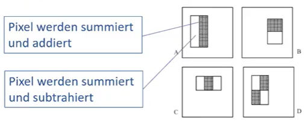

# SW10 - IPCV - Segmentation & Recognition

## Exercises Recap

* kmeans - compactness (sum of abstand to center)  -> could minimize this one to get better results
* kmeans - possibility - other color system (eg rgb2lab)

Topics:

* Viola-Jones Face Detector
* Klassifizierung auf Bildern

## Viola-Jones Face Detector

### Lernziele

Am Ende dieses Moduls sollten sie: 

* Verstehen wie aus welchen Schritten der Viola-Jones Face Detektor aufgebaut ist
* Verstehen wie die Features detektiert werden
* Verstehen wie die Features ausgewählt werden
* Verstehen wieso die Auswertung in einer Cascade erfolgt

Idee:

* Einfache Features welche effizient berechnet werden können
* Boosting (Adaboost): Lernt, welche Features für die Gesichtserkennung relevant sind
* Cascaded Classifiers: Effiziente Auswertung der Features - so kann man bereits nach wenigen Features sagen, ob ein Gesicht vorliegt oder nicht.

### Features

* Objekten / Gesichter direkt aus Pixeln ist nicht möglich (ausser bei CNN etc)
* Deshalb möchte man Fetaures aus dem Bild berechnen
* Mögliche Features: Fitlerantworten

### Haar Features

* Problem; Filter sind sehr aufwändig
* Idee: Einfache Rechteck-Filter von verschiedenen Grösse und Typen mit Filterwerten von -1 oder 1

Integral Image:

* Schnelle Berechnung der Filter Resultate durch Verwendung des sog Integral-Images
* Jeder Pixel des Integral Images enthält die Summe des schraffierten Rechtecks <bild\> 

Feature Extraction:

* 

(Ada)Boosting:

* Schwache Klassifikatoren zusammenziehen zu einer neuen, besseren Funktion (schwache classifier: sind meistens richtig, aber nicht immer, zB Filter )

"weak classifier": it performs slightly better than chance

* Fehler werden höher gewichtet (also die Samples)

Face detection:

Idee: Regionen ohne Gesichter schnell verwerfen

cascade approach:

*  ein paar features nehmen - > falls diese kein Gesicht finden, verwerfen und aufhören
* falls gesicht, dann der gleiche test mit anderen Filter (falls jetzt: kein Gesicht, verwerfen)
* etc

10 stufe cascade

cascade:

- trainingszeiten zum erstellen der Cascade: Tage bis Wochen!
- gute performance um gesichter zu finden
- "bester" face detektor seiner zeit
- Erster Ansatz mit guter Detektionsrate und schneller Verarbeitungen

## Klassifizierung auf Bildern (Supervised Learning)

### Lernziele

Am Ende dieses Moduls sollten sie:

* Die Anwendung von Klassifizierung kennen
* Verstehen welche Schritte zur Klassifizierung notwendig sind
* Wissen, wieso Feature Detektoren auf Bildern angewendet werden
* Die Eigenschaften von Feature Detektoren wie SIFT oder HOG kennen
* Wissen, was ein linearer Klassifikator ist
* Die Eigenschaften der Klassifikations-Algorithmen Nearest Neighbor und Support Vector Machines (SVM) kennen

### Was ist Klassifizierung?

* Erkennen / klassifizieren welches Objekt in einem Bild zu sehen ist
* Klassifizierung & Lokalisierung von mehreren Objekten im Bild
* Klassifizierung einzelner Pixel (Semnatic Segmentation)

Applications:

* Instance Recognition: Wiedererkennen eines gegebenen Objekts (zB ein spezifischer Fussballspieler)
* Class Recognition: Erkennen einer gelernten Klasse von Objekten (e.g. Gesichter)

Funktion finden, die ein "Bild" klassifiziert:

* f(🐄) = "kuh"
* f(🍅)  = "tomate"

### Features (Merkmale)

* In klassischen Verfahren wird nicht direkt auf den Pixelwerten sondern auf extrahierten Merkmalen (zB. Filterantworten, lokale Deskriptoren) gelernt.

* Deep Learning: Tiefe (convolutional) neuronale Netze können direkt Pixelwerte als Input benutzen

### Merkmalsvektor

* Klassischer Datensatz: Fisher 1936 (Iris Datensatz)
* Länge und Breite des Kronblattes

### Klassifizierung: Nearest Neighbour

Statt Cluster Center nimmt man die Distanz zu den Daten und nimmt man den am nächsten gelegenen Datenpunkt

### Klassifizierung: Lineare

## Support Vector Machine (SVM)

Falls die Daten nicht komplett trennbar sind: 2 Möglichkeiten:

### 1. Soft Margin SVM

Bestimmte Werte können auf der "falschen" Seite sein. Diese Punkte resultieren in einer Penalty, welche es zu minimieren gibt (während Margin hoch ist)

### 2. Nonlinear SVM

"Kernel-trick"; Transformation in höher dimensionalen Raum indem die Klassen linear separierbar sind

### Features (Input zur SVM)

## SIFT

* Scale Invariant Feature Transform
* Scale Invariant = Unabhängig von der Grösse des Bildes kommt derselbe Feature Vektor heraus
* Weit verbreiteter Deskriptor für Objekt Detektion, Imag Stitching etc
* Kombination aus Detektor & Deskriptor
* Benutzt Histogram der Gradienten (= Feature  )
* 128 dimensionaler Vektor

## HOG - Histogram of Oriented Gradients (HOG)

* Wie Kanten im Bereich eines Bildes verlaufen
* In welche Richtung gehen die wichtigsten Kanten?

Gradientenwert = Mass für die Kante