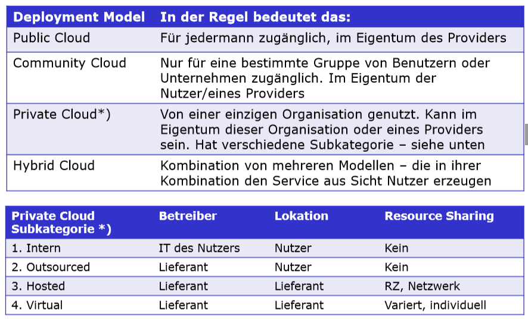

# 10 - Cloud-Computing & Outsourcing

## Stoffabgrenzung

* Sie verstehen die grundlegende Theorie des Cloud Computing (IaaS, PaaS und SaaS).
* Sie kennen die wichtigsten Prinzipien für eine Cloud-Architektur und können diese bewerten und in der IT-Landschaft einordnen
* Sie verstehen was Outsourcing ist und kennen die möglichen Ausprägungen
* Sie kennen die Beweggründe sowie Risiken und Strategien des Outsourcing
* Die Themen Microsoft Cloud Center (Folien 22 – 26) und die Fallstudie Credit Suisse (Folien 39 - 44) sind  nicht prüfungsrelevan

## Grundlegende Theorie Cloud

### Definition

Cloud Computing ist ein Modell respektive beschreibt den Ansatz, um IT-Applikationen (Services) aber auch Plattformen und IT-Infrastrukturen nach Bedarf dynamisch erweiterbar über ein Netzwerk zur Verfügung zu stellen.

### Beschreibung

* Cloud Computing ist im Kern eine Outsourcing-Technik, bei der bisher typischerweise intern erledigte IT-Aufgaben an ein externes Unternehmen vergeben werden
* Aus Nutzersicht scheint die zur Verfügung gestellte abstrahierte IT-Infrastruktur fern und undurchsichtig, wie von einer „Wolke“ verhüllt. Angebot und Nutzung dieser Dienstleistungen erfolgen dabei ausschließlich über definierte Schnittstellen und Protokolle

### Eigenschaften

Eine Cloudeinfrastruktur respektive ein Cloud-Dienst muss fünf wichtige Eigenschaften aufweisen:

1. **On Demand Self Service**: Selbstzuweisung von Leistungen aus der Cloud durch den oder die Nutzer, die bei Bedarf bereitstehen sollen.
2. **Rapid Elasticity / Scalability**: Funktionen können schnell und dynamisch bereitgestellt werden, wenn möglich sogar automatisch. Aus Sicht der Benutzer erscheint die verfügbare Kapazität als «unlimitiert» und kann jederzeit in beliebigem Umfang erworben werden.
3. **Broad network access**:  Die Services sind über ein Netzwerk (intern oder Internet) verfügbar und können über standardisierte Schnittstellen und Mechanismen genutzt werden auf unterschiedlichen Plattformen (PC oder Mobiles).
4. **Resource pooling**: Die Computer Ressourcen wie Speicher, Netzwerk oder CPU-Power des Providers werden gebündelt und sind meistens virtualisiert und können dynamisch vergeben werden. Typischerweise kennt der Nutzer eines Services auch nicht den Ort der Erbringung (Ortsintransparenz).
5. **Measured Service**:  Die Qualität der Cloudsysteme und – dienste werden fortlaufend durch den Dienstanbieter überwacht und die Qualität sichergestellt. Dies ermöglicht eine Transparenz der Nutzung des Cloudservice sowohl für den Dienstnutzer wie für den Cloud-Provider.

## Deployment Models (Ausprägungen)

## Outsourcing Überlegungen

Make vs. Buy (selber machen oder einkaufen). Nur selber bauen, wo man sich abheben kann und für alles andere auf Standardlösungen zurückgreifen / kaufen.

### Motivation

* **Kosten und Flexibilität**: z.B. Kosteneinsparungen, Gewinn an unternehmerischer Flexibilität
* **Finanzielle Überlegungen**: z.B. Reduktion des gebundenen Kapitals bei investitionsintensiven Aktivitäten, Minimieren des unternehmerischen Risikos durch Delegation der Verantwortung auf den Zulieferer
* **Technische Überlegungen**: verbessertes Beherrschen von Kapazitätsschwankungen durch flexible Outsourcing-Verträge, lediglich Belastungsspitzen werden outgesourced (Teiloutsourcing)

### Risiken

Die Gefahren und Probleme von Outsourcing lassen sich zu folgenden Gruppen zusammenfassen:

* **Abhängigkeit**: z.B. Furcht vor Verlust des unternehmerischen Handlungsspielraums und vor einem einseitigen Abhängigkeitsverhältnis, Abhängigkeit vor allem bei am Markt nicht breit verfügbaren Leistungen oder bei hohen “Switching Costs” zu einem anderen Outsourcing-Anbieter geben
* **Sicherheit**: z.B. Abgabe der Kontrolle über sensitive Informationen kann mit Sicherheitsrisiken verbunden sein
* **Know-how-Verlust**: z.B. bezüglich Produkte, Technologien und Verfahren im Informationsmanagement und in der Informationsverarbeitung
* **Personalpolitik**: z.B. Aktivitätsauslagerung kann zu Vetrauensverlust und Widerständen beim Personal führen

Weitere Risiken:

* Abhängigkeiten
* Langfristigkeit der Bindung (4-7 Jahre üblich)
* Vendor Lock-in
* Räumliche Distanz
* Hohe Anbahnungskosten
* Hohe, einmalige Umstellungskosten
* Verlust von IT-spezifischen Komponenten
* Datenschutz (Banken, Telekommunikationsanbieter) und Datenverlust
* Verlust von Schlüsselpersonen (Kündigungen wegen Outsourcing)
* Restaufgaben sind nicht motivierend
* Widerstand des Personals