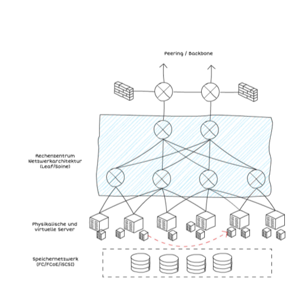
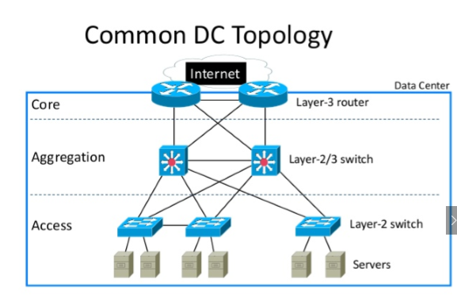

# Das Data Center

## Lernziele
* Building Blocks eines Data Centers
* kritische Punkte eines Data Centers adressieren und Massnahmen vorschlagen
* Tier Level von Data Centers
* Daten Klassifizierung und deren Einbindung in ein SLA
* Data-Tiers und deren Aufgaben erklären

## Stoffabgrenzung

### 02 Data Center

* Sie kennen die Building Blocks eines Datacenters
* Sie sind fähig die kritischen Punkte eines Datacenters zu adressieren und Massnahmen vorzuschlagen
* Sie kennen die Technologien und Tiers eines Datacenters
* Sie können die Anwendung eines Failover Datacenters aufzeichnen und erklären
* Sie wissen wie man Daten klassifiziert und sie in SLAs einbindet
* Sie sind in der Lage Data-Tiers und deren Aufgaben zu erklären. 

### 03 Netzwerke im Datacenter

* Sie können die Anforderungen an ein RZ-Netzwerk definieren und erklären
* Sie sind fähig die kritischen Punkte eines RZ-Netzwerks zu adressieren und vorbeugende Massnahmen vorzuschlagen
* Sie kennen die grundlegenden Topologien im RZ-Netzwerk
* Sie kennen die wichtigsten Begriffe im RZ-Netzwerkbereich


## Building Blocks
* Gebäude
* Zutrittskontrolle
* Brand- und Hochwasserschutz
* Klimatisierung
  - Optimal: Konstante Lufttemperatur und Luftfeuchtigkeit (ca. 26°C ist optimal)
  - Free Flow Systeme vs Kalt- oder Warmgang-Einhausungen 
    a. zustätzliche Kosten
    b. erhöhter Abschottungsbedarf
    c. geringere Energiekosten
    d. kleine vertikale Temperaturdifferenzen)
  - Immersion Cooling (Hardware ist direkt in Flüssigkeit für die Kühlung, benötigt spezielle Ausrüstung)
* Serverracks mit Rechnern
  - 1 U/HE = 1.75" = 44.56mm
  - Höhe 21-49U, Tiefe 0.8-1.2m, Breite 0.6-1m
  - 19" Standard (48.26cm)
* Stromversorgung
  - USV
  - Batterieschränke
* Datenleitungen und Netzwerk
  - Kupfer
  - Glas
* Administration und Überwachung

## Kritische Punkte: Gefährdungen und deren Massnahmen
  * Gebäude
    - Einbruch, Diebstahl, Vandalismus, Sturmschäden, Witterung
    - bauliche Massnahmen
  * Zutrittskontrolle
    - Fremdzugriff
    - Zutrittskontrolle, Abhörsicherheit
  * Brand- und Hochwasserschutz
    - Feuer, Rauch, usw.
    - Brandfrüherkennung, Löschung, Abschottung
  * Stromversorgung
    - Netzausfälle, Netzstörungen, elektromagnetische Störfelder
    - Netzfilter, USV mit Batterien, Generatoren, Abschirmung
  * Klimatisierung
    - Staub, Schmutz, Wasser
    - Filteranlagen, Schleusen, Standortwahl, Abschottungen, Pumpenanlagen

## Prävention von Gefährdungen durch Überwachung
  * Gebäude
    - Türen (offen, zu, verschlossen), Kameras, Bewegungsmelder, Zutritte
  * Räume
    - Temperatur, Luftfeuchtigkeit, Bewegungen, Rauch, Brand, Wasser
  * Energieversorgung
    - Strom, Spannung, Leistung (kW), Leistungsfaktor
  * Einzelne Geräte
    - Niederspannungsverteilungen, Stromverbrauch einzelner Geräte, Sicherungen, Überlastungen
  * Generator
    - Kraftstoff, Funktionsbereitschaft (z.B. monatliche Tests), Temperatur
  * Klimageräte
    - Temperatur, Luftfeuchtigkeit, Filterwiderstand
  * USV
    - Ladezustand und Batterietemperatur
  *  Brandmelde- und Löschanlage

    - Zustandsanzeigen, Service

## Effizienz eines Data Centers
Die Effizienz eines Data Centers lässt sich mit dem PUE (Power Usage Effectiveness) Faktor messen. Er ist wie folgt definiert:
```
d := Verbrauchte Energie vom Data Center
g := Verbrauchte Energie der Geräte
PUE = d / g
```
Grössenordnungen:
  * 1.0: optimal, kein Energieaufwand für Kühlung nötig
  * 1.2: gut, normaler Bereich
  * \>1.4: schlecht

## Verfügbarkeit eines Data Centers

### Verfügbarkeit im SLA
Die Verfügbarkeit eines Data Centers wird in einem SLA in der Regel mit einem prozentualen Wert der Uptime angegeben.
```
d := Anzahl zu gewährleistete Tage pro Woche
h := Anzahl zu gewährleistete Stunden pro Tag
u := Zu gewährleistende Uptime pro Jahr in der Form 0.99 für 99%
Anzahl Tage Downtime pro Jahr = (365/7=52.14) * d * h * (1-u)
```

### Hochverfügbarkeitsklassen
Harvard Research Group (HRG) teilt Hochverfügbarkeit in ihrer Availability Environment Classification (AEC) in sechs Klassen ein.

| Klasse | Bezeichnung       | Beschreibung                                                                                 |
| ------ | ----------------- | -------------------------------------------------------------------------------------------- |
| 0      | Conventional      | Unterbrüch möglich, Datenintegrität nicht essentiell                                         |
| 1      | Highly Reliable   | Unterbrüch möglich, Datenintegrität muss gewährleistet sein                                  |
| 2      | High Availability | Unterbruch nur in festgelegten Zeiten oder zur Hauptbetriebszeit minimal unterbrochen werden |
| 3      | Fault Resilient   | Keine Unterbrüche innerhalb den festgelegten Verfügbarkeitszeiten/Hauptbetriebszeiten        |
| 4      | Fault Tolerant    | 24/7 Betrieb muss ohne Unterbrüche gewährleistet werden                                      |
| 5      | Disaster Tolerant | Muss unter allen Umständen verfügbar sein                                                    |

### Präventive Massnahmen
**Failover Cluster**: Der Zugriff auf einen Service geschieht über eine virtuelle IP, welche im Fehlerfall automatisch auf einen alternativen Host verschoben wird.

**Failover Datacenter**: Das Data Center wird an einer anderen Lokation gespiegelt (synchron -> kurze Übertragungen, asynchron -> zeitintensive Übertragungen) und befindet sich im Standby Betrieb.

## Data Center Tiers
Data Center Tiers ist ein standartisiertes Ranking von Uptime Institute für die potentielle Infrastruktur Performanz (Uptime). Weitere Informationen im [Topology](http://www.gpxglobal.net/wp-content/uploads/2012/10/TIERSTANDARD_Topology_120801.pdf) und [Operational Sustainability](http://www.karebil.com/uploads/1361890241-Operational-Sustainabilitypdf.pdf) Standard. 

**TLDR;**

| Tier Klasse | Redundanz | Jährliche Ausfallzeit | Verfügbarkeit |
| ----------- | --------- | --------------------- | ------------- |
| Tier 1      | N         | 28.8h                 | 99.67%        |
| Tier 2      | N+1       | 22h                   | 99.75%        |
| Tier 3      | N+1       | 1.6h                  | 99.98%        |
| Tier 4      | 2(N+1)    | 0.8h                  | 99.99%        |

# Netzwerke im Data Center

## Wichtige Begriffe im RZ-Netzwerkbereich

* VLAN
  * Bildung von getrennten Netzen auf gemeinsamer Hardware
  * Virtual LAN
  * Tagged oder Untagged
  * Trunks (immer tagged) (mehrere VLANs)
  * Access Port (norm. 1 VLAN) 
* DNS: Domain Name System: Zuordnung von IP Adr. zu DNS-Namen
* IPAM: IP Address Management (MS Service oder separate Verwaltungstools) 
* DHCP (Dynamic Host Configuration Protocol): Dynamische oder reservierte Zuweisung von IP-Adressen und weiteren Eigenschaften an einen TCP/IP-Client
* NAP (network access protection)
* NAC (network access control): Qualifizierung des Clients anhand von verschiedenen Parametern (User, OS, Version, AntiVir, …) - Zuordnung zu den erlaubten Netzwerken oder nur zur Quarantäne Zone

## Topologien im RZ

### Physikalisch

* Top of Rack (TOR): jedes Rack hat eigene Switches
* End of Row (EOR): Racks nur über Patchpanels verbunden

| Top of Rack (TOR)                                   | End of Row (EOR)                                             |
| --------------------------------------------------- | ------------------------------------------------------------ |
| + Redundanz bei Stromunterbruch in einem Rack       | + Aktivkomponenten sind in einem Rack                        |
| - Platzbedarf muss genau kalkuliert werden pro Rack | - Bei Stromunterbruch im Rack der Komponenten sind alle Aktivkomponenten offline |

### LAN Strukturen (einfach)

* Peering / Peripherie (Anschluss nach aussen, z.B. zu einem Upstream Provider zum Internet)
* Backbone / Spine / Core (Rückgrat, zentrales Netz)
* Leaf (Anschlüsse für Server)





### RZ Topologie

* Core (Zentrale Verbindungen, auch RZ zu RZ)
* Aggregation (Direkte Verbindungen von Serverfarmen)
* Access (Zugangspunkt für physikalische Server und Komponenten)



### Multiprotocol Label Switching (MPLS)

- VPN ähnliche Struktur zur Verbindung zusammengehöriger Netzwerk
- Kann von Provider (Swisscom) zur Verfügung gestellt werden um zum Beispiel das RZ von Sursee direkt mit dem RZ in Sempach zu verbinden
- IP-Paket erhält zusätzlichen MPLS Header


## Kritische Punkte eines RZ-Netzwerks

* Single Point of Failure
  * WAN (Internetanbindung nach aussen)
  * Verkabelung / Hardware
  * Router, Firewall, etc.
* Abhilfe: Monitoring, Redundanz etc.

## Topologie

1. Provider (Angebot, Speed, Technik)
2. Grenze (Router, Firewall, IDP, Redundanz)
3. DMZ (Web-Services, Authentifizierung, Dienste)
4. Lokales Netzwerk, LAN (Topologien, Speed, Trennung, Services)

## Internet Service Providers
Techniken und deren Geschwindigkeiten:
- ADSL (Asymmetric Digital Subscriber Line) mit \~2-16 Mbit/s *(Upstream \~10% des Downstreams)*
- VDSL (Very High Speed Digital Subscriber Line) mit \~20-100 Mbit/s *(Upstream \~10% des Downstreams)*
-  SDSL (Symmetric Digital Subscriber Line) mit \~20-100 Mbit/s *(Upstream = Downstream)*
- Atennenkabel mit \~2-500 Mbit/s (Parallel zum TV Signal)
- Glasfaser mit \~10 Mbits/s bis 10 Gbit/s
- Richtfunk (abgelegene und unerschlossene Gebiete) mit bis zu 20 Mbit/s

## Grenzen
### Router
Ein Router ist oft in einer Firewall oder in einem Layer3-Switch integriert und ermöglicht die Anbindung von verschiedenen Netzen oder mehreren Providern. Er übersetzt öffentliche IP Adressen in private Adressen (Network Adress Translation \[NAT] oder Port Adress Translation \[PAT]). Dabei bietet er optimale Weiterleitungen bei redundanten Leitungen oder einen Start von Fallback Szenarien und kann durch spezifische Weiterleitungen (Pakettypen/Protokoll) QOS Aufrechterhalten. Er kann auch als VPN-Endpunk dienen und lässt verschiedene Netzwerktechniken verbinden (Ethernet, xDSL, PPPoE, ISDN, ATM, FDDI, …).

### Firewall
Eine Firewall bietet Regelbasierte Sperrungen oder Weiterleitungen von Netzwerkpaketen (Paketfilter, Stateful Inspection, Proxy- und Content-Filter), auf allen OSI-Schichten. Des weiteren kann eine Firewall auch als VPN-Endpunkt mit Authentifizierung agieren (lokal, radius, AD).

### Intrusion Detection and Prevention (IDP)
Mit Intrusion Detection Systemen (IDS) und Intrusion Prevention Systemen (IPS) versucht man in IDP Eindringversuche zu erkennen (Mustererkennung, DOS, Fakes, Portscan, IP-Spoofing, …). Da diese Funktionen oft rechenintensiv sind, sind diese Systeme oft in eigenen Geräten, >= 1 Gbit/s Netzwerke sind heute an der Leistungsgrenze: Pakete müssen ev. verworfen werden, lückenhafte Überprüfung.

## Demilitarized Zone
Geschützter Bereich, in welchen bestimmte Zugriffe erlaubt werden (WWW, Mail, FTP, …). Bei 2 Schritten (DMZ Model 2) können verschiedene Hersteller
und Gerätetypen verwendet werden, was die Sicherheit vor Hackern erhöht. 
(img)

## Netzwerk Redundanz und weiteres nicht gemacht


