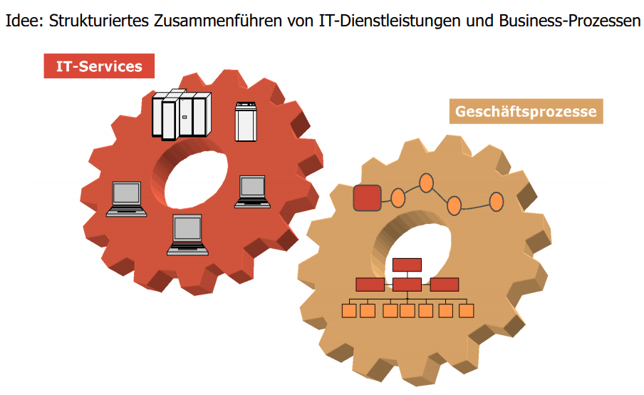

# 07 - Grundlagen ITIL & Service Management

[TOC]

## Stoffabgrenzung

* Sie verstehen die Bedeutung des IT-Betriebs für ein Unternehmen.
* Sie kennen die Bedeutung von ITIL und wissen was ITIL ist.
* Sie verstehen die Kernidee von ITIL, das IT-Service Management.
* Beachten Sie die beiden referenzierten Kapitel im Buch.

## IT-Betrieb im Unternehmen

### Anforderungen an einen modernen IT-Dienstleister

* Über die letzten Jahre hinweg entwickelten sich IT Abteilungen immer mehr zu einem Dienstleister (innerhalb oder außerhalb des Unternehmens), der die Arbeit der Fachbereiche der jeweiligen Organisation möglichst effektiv und effizient unterstützen soll
* Dadurch entsteht eine Reihe von Anforderungen an den IT Dienstleister
  * Die Dienstleistungen leiten sich aus den Anforderungen des Geschäfts ab
  * Die Dienstleistungen müssen einen qualifizierbaren und quantifizierbaren Mehrwert liefern.
  * Auf die Wünsche und Anforderungen des Kunden muss flexibel  eingegangen werden können
  * Die Kunden müssen als Partner und nicht als Bittsteller behandelt
    werden
* Entsprechend wird ein IT Dienstleister gemessen an
  - Der Qualität der erbrachten Dienstleistungen
  - Leistungsfähigkeit, Zuverlässigkeit, Funktionalität
  - Anpassungsfähigkeit, Reaktionszeit für die Bereitstellung neuer Services,
    u.a.
  - Der Wirtschaftlichkeit der erbrachten Dienstleistungen

## ITIL (IT Infrastructure Library)

- Best Practice Framework um IT-Applikationen und Services zu managen
- De facto standard
- Generisches Rollen- und Prozessmodell:
  - Organisationsneutral
  - Umfassend & vollständig
  - auf grössere IT-Organisationen ausgelegt
- Fokus: Weg von Technik-Orientierung hin zu Kunden-Orientierung

### Definition IT-Service

* Ein IT-Service besteht aus einem oder mehreren Elementen, die einen Geschäftsprozess unterstützen
* Elemente = Hardware, Software, Prozesse, Personen und Einrichtungen

## IT Service Management

