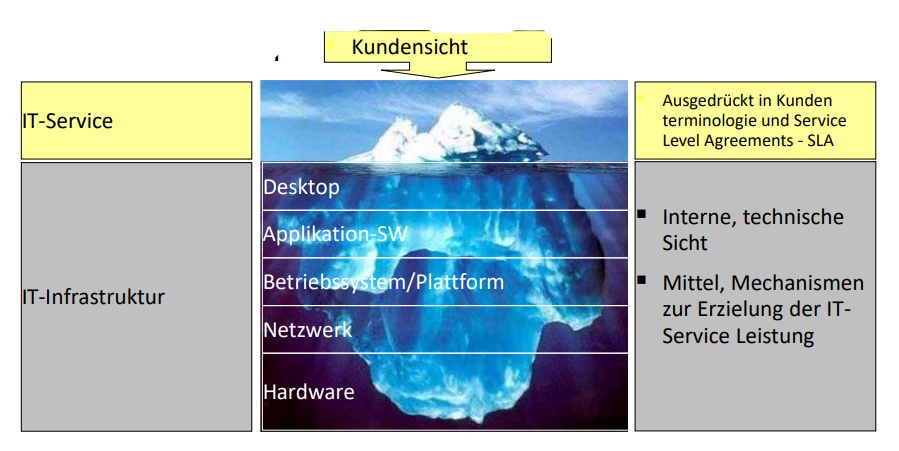

# 07 - Grundlagen ITIL & Service Management

[TOC]

## Stoffabgrenzung

* Sie verstehen die Bedeutung des IT-Betriebs für ein Unternehmen.
* Sie kennen die Bedeutung von ITIL und wissen was ITIL ist.
* Sie verstehen die Kernidee von ITIL, das IT-Service Management.
* Beachten Sie die beiden referenzierten Kapitel im Buch.

## IT-Betrieb im Unternehmen

### Aufgabe 2 (Im Unterricht)

- Zugang zum internationalen Börsenverkehr
- Hochverfügbares IT-System
- Effiziente Arbeitsmittel (Bildschirme, Tastaturen, etc.)
- Tiefe Latenzen bei Börseninformationen
- Controlling / Aufsichtsprozesse

### Aufgabe 3 - Laptop/PC Unterhalt (Im Unterricht)

- CCleaner
- Backup/Restore
- Updates
- Akku laden

## ITIL (IT Infrastructure Library)

- Best Practice Framework um IT-Applikationen und Services zu managen
- De facto standard
- Generisches Rollen- und Prozessmodell:
  - Organisationsneutral
  - Umfassend & vollständig
  - auf grössere IT-Organisationen ausgelegt
- Fokus: Weg von Technik-Orientierung hin zu Kunden-Orientierung

### Definition IT-Service

* Ein IT-Service besteht aus einem oder mehreren Elementen, die einen Geschäftsprozess unterstützen
* Elemente = Hardware, Software, Prozesse, Personen und Einrichtungen

