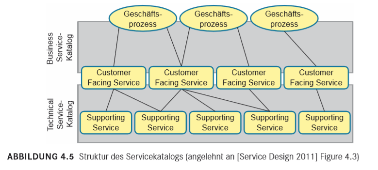
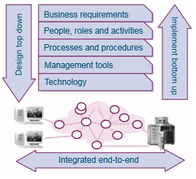
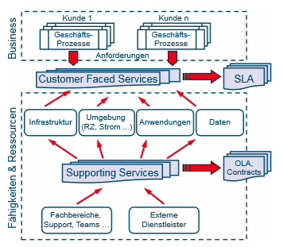
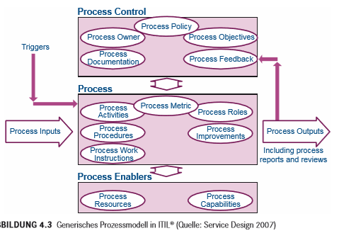

# 08 - ITIL im KMU Umfeld

[TOC]

## Stoffabgrenzung

* Sie können die grundlegenden Prozesse eines Unternehmens erläutern und in die drei Hauptkategorien einteilen.
* Sie kennen die Prozessgruppen von ITIL V3.
* Sie wissen, was ein IT-Service ist und kennen die Bedeutung eines IT-Servicekatalogs.
* Sie können das Budget für ein kleines Team oder die IT einer KMU erstellen.

## Buch Kapitel 1-2

### Generische Prozessmodelle

Klassische Bestandteile eines generischen Prozessmodell (erste bis dritte Ebene) sind:

* Prozesssteuerung
  * Prozessziel (*Was soll dieser Prozess leisten, weshalb gibt es ihn und was kann als Ergebnis erwartet werden?*)
  * Wichtige Erfolgsfaktoren (Critical Success Factor, CSF) und Kennzahlen (KPIs)
* Prozess
  * Input und Trigger
  * Aktivitäten
  * Output
* Prozess-Enabler
  * Fähigkeiten und Ressourcen
  * Rollen

### RACI

Modell um Rollen in einem Prozess zu beschreiben.

* Responsible: Verantwortet die Durchführung
* Accountable: Rechtlich oder kaufmännisch verantwortlich (Genehmiger)
* Consulted: Fachleute, die um Rat gefragt werden oder beteiligt sind
* Informed: Erhält Informationen über den Verlauf bzw. das Ergebnis

Oft wird das Modell um zwei Rollen zu RACI-VS erweitert:

* Verify: Prüft Ergebnisse gegen vereinbarte Akzeptanzkriterien
* Sign-Off: Bestätigt das Ergebnis der Verifizierung

### Einfaches generisches Prozessmodell

## Business Alignment

Betrachtung der Organisation auf verschiedenen Ebenen:

* Strategische Ebene: Vorgaben vom Management, Rahmenbedingungen und gesetzliche Vorgaben, Strategie und welche Ziele lassen sich daraus für die IT-Organisation ableiten?
* Taktische Ebene: Welche Aktivitäten müssen geleistet werden, um die vereinbarten Ziele zu erreichen? Was bedeutet das für die Gestaltung der IT-Services?
* Operative Ebene: Welche Anforderungen ergeben sich aus dem operativen Geschäft des Kunden? Was bedeutet das für den Betrieb IT-Services auf operativer Ebene? Wie wird die anforderungsgerechte und benutzerfreundliche Gestaltung der Services sichergestellt? Wie müssen die Services betrieben werden

## ITIL

Im Mittelpunkt steht also nicht mehr der Prozess als solcher, sondern der zu liefernde Service (p13).

 ### Service Lifecycle

### Rollen im Lifecycle

* Service Owner: 
  * Sorgen für die Übereinstimmung des gelieferten Services mit den Kundenanforderungen
  * Identifizieren und realisieren von Maßnahmen zur Serviceverbesserung
  * Beschaffen der relevanten Informationen (Daten, Statistiken, Reports) für effektives Service Monitoring
  * Sicherstellen SLA-konformer Service Performance
* Prozess Owner:
  * Dokumentation und Publikation des Prozesses (Man kann den Process Owner durchaus als eine Art Marketingbeauftragten für den Prozess betrachten. Er sorgt dafür, dass die Beteiligten den Prozess und ihre Rollen kennen, akzeptieren und leben)
  * Definition der Key Performance Indikatoren (KPI) zur Messung der Effektivität und Effizienz des Prozesses
  * Gestaltung des Prozesses und kontinuierliche Prozessverbesserung sowie regelmäßige Reviews von Prozess, Rollen, Verantwortlichkeiten, Kennzahlen und Dokumentation 

# IT-Service Management

## Service Level Management

* stellt sicher, dass IT-Services auf geforderten und akzeptablen Mass erbracht werden
* Verständnis der Anforderungen der Benutzer; Vereinbarung über die Service Qualität

### SLA & OLA

Operational Level Agreement (OLA) und Service Level Agreement (SLA)

* SLA: Vereinbarung mit Kunde
* OLA: Vereinbarung mit internem Lieferant (internes SLA, mit intern Organisation)
* Underpinning Contract: SLA mit externem Provider

### Inhalt SLA

* Titel & Beschreibung des Services (inkl. der Optionen resp. Service Packages)
* **Betriebsfenster**: Legt fest, in welchen Zeitraum Support für den Service garantiert wird (z.B. 5x8 Office Hours)
* **Verfügbarkeit:** (in Prozent), z.B. 99%
  * gilt nur innerhalb des Betriebsfenster (z.B Ausfall ausserhalb des Betriebsfenster ist Best-Effort, demnach ist die Verfügbarkeit 100% wenn der Ausfall ausserhalb des garantierten Betriebsfenster stattfindet. **Mögliche Prüfungsfrage**).
* **Performance:** Antwortzeiten eines Services in Sekunden; Auswahl von wichtigen Funktionen. Service kann als *nicht verfügbar* gelten, wenn die Antwortzeiten zu gross sind (z.B. über dem definierten Threshold)
* **BCM Planning Klasse:**  (Desaster Recovery); Im Katastrophenfall
  * Recovery Time Objective (RTO):  Wiederherstellungszeit; Zeit die (max.) benötigt wird, die Applikation wieder lauffähig zu machen
  * Recovery Point Objective (RPO):  Festlegung der Datenverfügbarkeit; "Wieviel" der Datenverlust sein kann in Stunden (wie alt dürfen die letzten gespeicherten Daten sein) - *wie alt ist das letzte, katastrophensicher gesichertes Backup*
* OLA
* Preis (inkl. Varianten)

## Zusammenfassung
*  IT-Dienstleistungen, IT-Services, müssen mit den Benutzern
    (Kunden) besprochen und mittels SLA (Service Level Agreements)
    vereinbart werden
* Ein SLA enthält mindestens:
  * Die Service Beschreibung
  * IT Service Support: Zeitfenster
  * IT Service Verfügbarkeit in %
  * IT Service Performance: Antwortzeiten von Funktionen in
    Sekunden
  * Vereinbarung bezüglich Business Continuity eines IT-Services im
    Katastrophenfall (Datenausfall und Wiederherstellungszeit)
  * IT Service Preis
* SLAs müssen überwacht und regelmässig den Benutzern rapportiert
  werden. Bei starken Abweichungen vom SLA-Vertrag müssen
  Massnahmen zur Verbesserung ergriffen werden.

## Service Design (Kapitel 4.1.1 - 4.1.3)

> Service Design liefert die Methoden für die Umsetzung strategischer Ziele in ein Portfolio aus Services und Service Assets

Der Scope des Service Designs beinhaltet alles, was für die Gestaltung von Services und Prozesse benötigte Methoden und Aktivitäten, darunter:

* Planung & Gestaltung neuer und veränderter Services
* Service-Management-Systeme und Tools (Service Portfolio, Servicekatalog)
* Technologie und Architektur planen und gestalten
* Notwendige Prozesse  planen und gestalten
* Messmethoden und Metriken planen und gestalten

Überblick der Service-Design-Prozesse:

* Service Level Management
* Service Catalogue Management
* Capacity Management
* Availability Management
* IT-Service Continuity Management
* Information Security Management
* Supplier Management

### Ziele, Aufgaben und Nutzen

> Ziel des Service Design ist eine effiziente und effektive IT, deren Business-Lösungen an den Zielen und Anforderungen der Kunden ausgerichtet sind

Vier P's des Service Designs:

* Personen
* Prozesse
* Produkte (Technologie)
* Partner (Lieferanten)

#### Business Value

Hauptfrage: Wie kann Service Design konkret zum Business beitragen?

* Reduktion der Total Cost of Ownership (TCO) für die Service Erbringung
* Klar beschriebene und wiederholbare Prozesse sichergestellte Integration neuer und geänderter Services: Neue oder veränderte Business Anforderungen können so schnell eingeführt werden.

## Service Catalogue Management

> Das Hauptziel des Service Catalogue Management ist die Bereitstellung eines aktuellen Service kataloges als definierte Quelle für konsistente Informationen bezüglich aller vereinbarten Services. Das Service Catalogue Management ist verantwortlich für die Bereitstellung, Pflege und Vollständigkeit des Servicekatalogs sowie für die Kommunikation der Inhalte sowohl an den Kunden als auch an alle Beteiligten beim Service Provider selbst.

Ziel: Aktuellen Service Katalog bereitstellen (und Pflege), als Quelle für aktuelle und konsistente über die vereinbarten Services. 

Service Katalog ist ein Ausschnitt aus dem Service Portfolio, ist aktuell und beinhaltet die mit dem Kunden vereinbarten oder angebotenen Services. Beim Katalog werden zwei Perspektiven gewählt:

* **Business-Perspektive**: aus Sicht des Kunden
* **Technische Perspektive**: Zeigt, aus welchen Komponenten und Services sich ein Business Service zusammensetzt

Service Catalogue Manager:

* Verantwortlich für Erstellung & Pflege des Service-Kataloges
* Dokumentation aller Services im Servicekatalog sicherstellen
* Richtigkeit & Aktualität der Infos im Katalog sicherstellen
* Sicherstellen, dass die dokumentierten Services den Vorgaben aus dem Service Portfolio entsprechen

Herausforderungen:

* Nutzen aus operativer Sicht nicht anerkannt, daher nicht oder bedingt akzeptiert Der SCM ist in der Pflicht, den Katalog bekannt zu machen und Nutzen klar zu kommunizieren
* Aktueller Katalog setzt korrekte Informationen von Business und Service-Portfolio-Management voraus.
* Ist Objekt häufiger Änderungen, kann so an Genauigkeit verlieren
* Detaillierungsgrad kann zu hoch oder zu tief sein: Er sollte dem Grad des Config Management System (CMS) und im Service-Knowledge-Management (SKMS) entsprechen.

## Budgetierung

* Periode für ein Jahr
* Zwei Arten von Kosten
  * Laufende Kosten: Miete, Strom, Löhne etc. => können direkt in ein Jahresbudget eingerechnet werden
  * Investitionskosten: Kaufkosten für Server, kostenintensive Software, werden indirekt über Abschreibungen in ein Jahresbudget eingerechnet

# Beims 4.1.4 - 4.16

## Sourcing-Optionen

* **Insourcing**: Interne Ressourcen in allen Bereichen des Service Lifecycles. Keine externen Provider.
* **Outsourcing**: Nutzt externe Ressourcen für Serviceerbringungen, Klare Vereinbarungen & Verträge mit externen Provider
* **Co-Sourcing**: Kombination von In- und Outsourcing oder mehrere externe Service Provider, trifft man heute häufig an
* **Multisourcing**: Vereinbarungen mit zwei oder mehreren Unternehmen über die Zusammenarbeit im gesamten Service Lifecycle getroffen
* **Business Process Outsourcing (BPO)**: Auslagerung von Business-Funktionen an externe Partner (z.B. Call-Center, Gehaltsabrechnung, Zahlungsverkehr, ...)
* **Application Service Provision**: Bestimmte Applikationen werden von Application Service Providern (ASP) bezogen - **SaaS**
* **Knowledge Process Outsourcing (KPO)**: Weitergehende Form von BPO; Externer Provider übernimmt gesamte Unternehmensbereiche inkl. Business Know-How.
* **Multi Vendor Sourcing**: Verschiedene Services von verschiedenen Service Provider.
* **Cloud**: Standardisierte Services bei Cloud Service Provider, lassen sich z.T. auch individuell anpassen

 ## Anforderungsgerechte Services

Wichtigste Faktoren für anforderungsgerechte Services:

* **Geschäftsprozesse**: Bedürfnisse, Anforderungen und Ziele des Kunden
* **Personen**: Aktivitäten der in die Serviceerbringungen eingebundenen Mitarbeiter
* **Prozesse**: Definierte Prozesse für das IT-Service Management
* **Tools**: Management- und Support-Tools für den Betrieb der Service-Infrastruktur
* **Technologie**: Bereitstellung von Produkten und Technologie

Design der Services erfolgt top-down, somit ist sichergestellt dass alle Aktivitäten und Prozesse den Anforderungen des Kunden entsprechen.

Implementierung der Services erfolgt bottom-up, um die optimale Nutzung der vorhandenen Infrastruktur und Prozesse sicherzustellen

## Service Portfolio

Service-Beschreibung im Service-Portfolio:

* *Servicename und -Beschreibung*: Eindeutige Identifizierung und beschreibt, was dieser Service leistet
* *Status*: z.B. "definiert", "genehmigt", "entwickelt" oder "in Betrieb"
* *Klassifizierung*: Bedeutung des Services für das Business
* *Genutzte Applikationen und Daten*: Welche Anwendungen, Systeme und Daten werden für den Service benötigt?
* *Unterstützender Geschäftsprozess*: Zu welchem GP leistet der Service welchen Beitrag?
* *Business Owner, Business User, IT Owner*: Wer ist für den Service verantwortlich?
* Zugesicherte Eigenschaften (SLA): Welche Eigenschaften wie z. B. Verfügbarkeit oder Performance werden dem Kunden zugesichert?
* Unterstützende Services und Ressourcen: Welche Ressourcen und welche anderen Services werden benötigt, um diesen Service zu liefern?
* OLA, Contracts: Welche Vereinbarungen wurden intern und extern für die Serviceerbringung getroffen?
* Servicekosten und Servicepreis: Zu welchem Preis wird der Service erbracht, und welche Kosten entstehen dadurch? (Die Kosten werden bei einem externen Provider in der Regel nicht transparent für den Kunden, es besteht allerdings diese Möglichkeit durch OpenBook-Kalkulation.)
* Metriken: Welche Messgrößen werden erfasst, wie werden sie erfasst, und wie sieht der Report aus?

## Fünf Aspekte des Service Designs

### Gestaltung neuer und veränderter Services (Service solutions for new or changed services) 

Grundsätzlich werden die Anforderungen für neue oder zu verändernde Services aus dem Service Portfolio abgeleitet. Jede Anforderung an den Service wird analysiert und dokumentiert, um anschließend ein entsprechendes Design zu entwickeln. Wichtig ist dabei, dass jedes Design mit den Vorgaben aus Service Strategy abgeglichen und bei Bedarf angepasst wird. Auch die Integration in die bestehende Service-Landschaft spielt eine wichtige Rolle. Andere Services sollen durch die neuen Services nicht beeinträchtigt werden. Ebenso soll die Interaktion zwischen vorhandenen und neuen Services – gegebenenfalls – ermöglicht werden. Kurz gesagt sollen sich neue oder veränderte Services harmonisch in das bestehende Umfeld einfügen.

### Management Information Systems and Tools

Bei jeder Einführung neuer oder veränderter Services können sich auch die Anforderungen an die unterstützenden Management-Tools verändern. Insbesondere das Service Portfolio muss natürlich entsprechend angepasst werden. Aber auch an anderen Stellen des Service Knowledge Management sind möglicherweise Anpassungen notwendig (zum Beispiel CMDBs, Wissensdatenbank, Ticketdokumentation).

### Architektur von Technologie und Management (the technology architectures and management architectures)

Neue und veränderte Services bedeuten in der Regel auch neue Anforderungen an die zugrunde liegende Technologie und Architektur. Gib es neue technische Anforderungen? Reicht die Kapazität und Performance der vorhandenen Komponenten aus? Gegebenenfalls müssen hier entsprechende Anpassungen der Infrastruktur initiiert werden.

### Benötigte Prozesse (the processes required)

Ein Review der vorhandenen Prozess stellt sicher, dass die definierten Prozessaktivitäten geeignet sind, auch die neuen oder veränderten Services optimal zu unterstützen. Stimmen die Rollenbeschreibungen für die Prozessakteure noch? Werden neue oder veränderte Skills benötigt, und ist der Durchsatz der Prozesse den neuen Anforderungen angemessen? Auch hier werden bei Bedarf notwendige Veränderungen angestoßen.

### Messsysteme und Metriken (the measurement methods and metrics

Zuletzt gilt es sicherzustellen, dass die definierten Messmethoden und Metriken geeignet sind, auch die neuen oder veränderten Services zu erfassen. Auch die möglicherweise in den Schritten zuvor angepassten Management-Tools, technischen Komponenten und Prozesse können Veränderungen in der Art der Messung oder der Gestaltung der Metriken bedingen

## Prozessdesign

Service Design befasst sich neben Gestaltung der Services auch mit dem Design der Prozesse. ITIL kennt das folgende, generische Prozessmodell:

## Design Coordination

### Ziele

Zweck des Prozesses ist es, sicherzustellen, dass die Ziele der Service-Design-Phase erreicht und alle Aktivitäten innerhalb dieser Phase zentral koordiniert werden.

Wichtige Ziele des Prozesses Design Coordination sind wie folgt:

* Services, Service Management Systeme, die Architektur, die technischen Assets sowie die Prozesse und Metriken entsprechen den Business Anforderungen.
* Die Ressourcen und Pläne im Service Design (in Projekten, bei Service Providern und in den Support-Teams) werden zentral koordiniert
* Service Design Packages werden gemäß den Serviceanforderungen und entsprechenden Change Requests erstellt, gepflegt und an Service Transition kommuniziert. 
* Qualitätskriterien, Anforderungen und Schnittstellen zu anderen Phasen (Service Strategy und Service Transition) werden koordiniert und gesteuert
* Service-Modelle und -Designs entsprechen den Vorgaben aus Service Strategy

### Aktivitäten

Die Aktivitäten dieses Prozesses beziehen sich auf die Koordination der zentralen Aktivitäten über die gesamte Service-Design-Phase, darunter:

* Alle Anforderungen an Services sammeln, analysieren und verarbeiten
* Anforderdungsgerechte Services gestalten
* Regelmässige Reviews der Prozesse (ggf. Gegensteuern)
* Risiko Assessments & Management für alle Prozesse des Service Designs
* Alignment der Service-Design-Prozesse mit strategischen und taktischen Vorgaben
* Erstellen der Service Design Packages für neue oder veränderte Services

### KPI

Kennzahlen für Service Level Management; Sollen Prozessqualität messen:

* Nacharbeiten neuer Services reduzieren: Bessere Koordination = weniger Nacharbeiten
* Verzögerungen auf Grund Ressourcenkonflikten reduzieren: Gute Koordination verhindert Konflikte bei der Nutzung von Design-Ressourcen
* Emergency Changes durch Projekte reduzieren: Umso bessere Planung, umso weniger schwere Fehler während oder nach Implementierung
* Fehlerfrei integrierte Services prozentual erhöhen: Services sollen vereinbarte Qualität zum Zeitpunkt der Produktivschaltung erreichen

## Service Level Management (Prozess)

> Service Level Management (SLM) bildet (in Abstimmung mit dem Business Relationship Management) die Schnittstelle zwischen Service Provider und Kunde und trägt so dazu bei, dass die Anforderungen des Kunden erfasst, dokumentiert und schließlich bei der Gestaltung der Services umgesetzt sowie die SLA-konforme Erbringung der Services dem Kunden nachgewiesen wird.

Ziel des SLM ist die Definition, Dokumentation und Vereinbarung sinnvoller Service Level Agreements (SLA). Sinnvoll sind die SLA, wenn die Erwartungen des Kunden sowie die Fähigkeiten des Service Providers erkannt, gesteuert und berücksichtigt werden. Messbare Ziele für die Services zu definieren, an Hand welcher sie gemessen werden. Dies wird im Report an Kunden festgehalten:

* Service Review: Regelmässig Review und Massnahmen zu Service-Verbesserung
* Beziehung zu Kunden und Kundenzufriedenheit werden verbessert

### Terminologie

#### Services Packages und Service Level Packages

Inhalt eines Service Package:

* Core Service Package: Grundlegende Bestandteile (z.B. bei einem ISP die grundsätzliche Anbindung an das Internet)
* Supporting Services Package: Weitere Komponenten eines Service, die für den Kunden interessant sein könnten (z.B. statische IP, Spam-Filter, etc.)
* Service Level Package: Beschreibt die messbaren Eigenschaften des angebotenen Service (z.B. Datendurchsatz, Verfügbarkeit oder Supportzeiten)

### Service Level Requirement (SLR)

Basis für SLA; Dokumentiert Anforderungen des Kunden

### Service Level Agreement (SLA)

Siehe oben.

