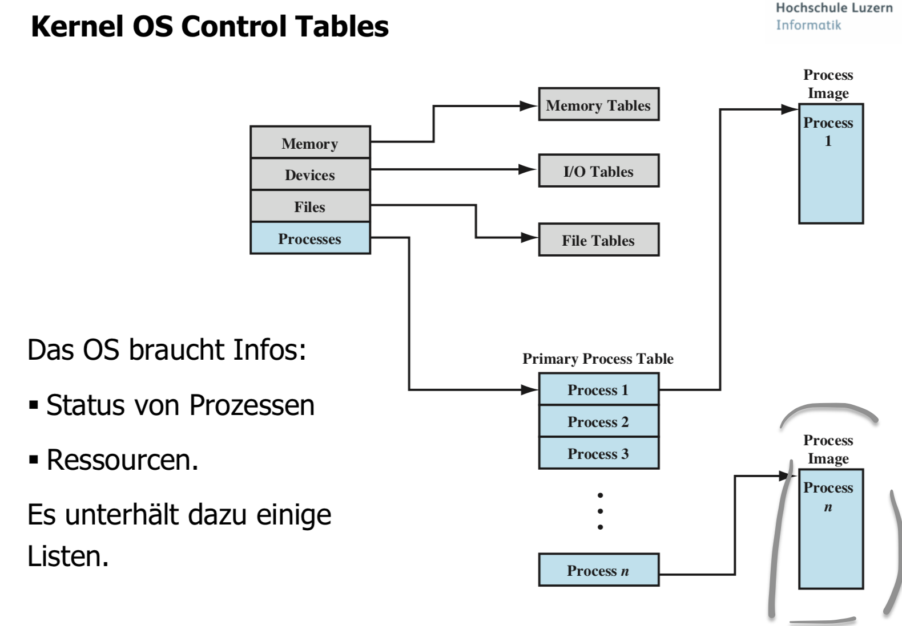
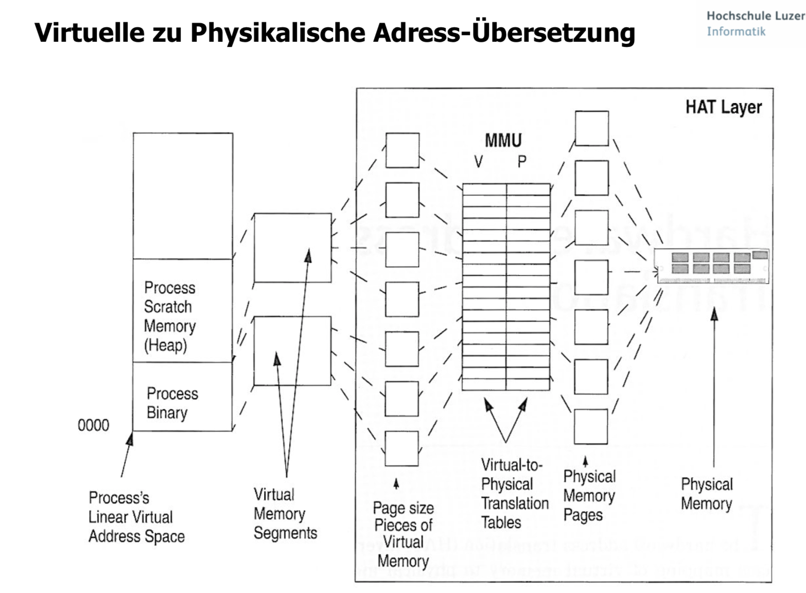
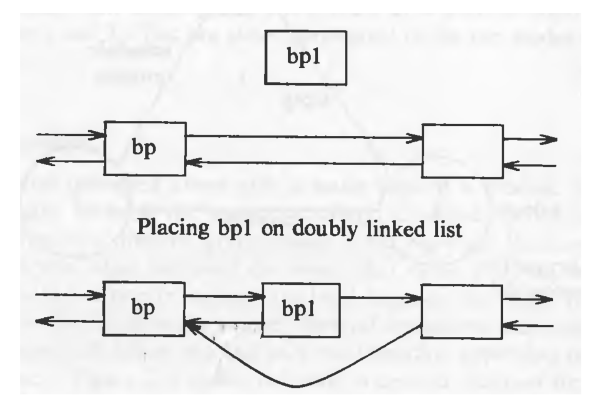

# Systemsoftware

Geschützte Bereiche mit Systemcalls. Systemcalls liegen im Memmorybereich.

## Prozess Control Blocks
[https://en.wikipedia.org/wiki/Process\_control\_block](https://en.wikipedia.org/wiki/Process_control_block)


  
Charakteristika


Die meisten Listen sind Double-Ended Queues. 



Memory wird zur Laufzeit Hartcodiert, zur Compilezeit wird das Memory relativ geschrieben. Loader und OS weiss wie man das machen muss. 





## Prozess-Status Wechsel
Der Prozess-Status Wechsel geschieht wie folgt:
1. Save context of the proessor
2. Update the Process Control Block Status (currently “run”)
3. Move the Process Control Block to the queue
4. Select another processor for it’s execution
5. Update the Process Control Block and update the Memory Management Data Structures.
6. Restore the context of the processor, such that he continues at the same point he stopped

Falls der momentan laufende Prozess in einen anderen Status verschoben wird (Ready, Blocked, etc.), dann muss das OS substantielle Wechsel in seinem Environement machen.

## Prozess-Modus Wechsel
Es wird differenziert zwischen:
1. Interrupt vorhanden -\> PC auf den Interrupt Handler setzen & vom User Mode in den Kernel Mode wechseln, damit privileged Instructions ausgeführt werden können.
2. \_ -\> `fetch stage` zum nächste Instruktion vom aktuellen Programm & Prozess zu holen.

Der “Modus Switch” kann ohne einen Status-Wechsel vom momentan laufenden Prozess durchgeführt werden. In diesem Falle verursacht das Speichern des Kontextes und das Anschliessende „restoring“ einen sehr kleinen Overhead.

## Ausführung im OS (Execution Models?)


## UNIX Process Status
Prüfungsstoff!

* **User Running**: Executing in user mode.
* **Kernel Running**: Executing in kernel mode.
* **Ready to Run, in Memory**: Ready to run as soon as the kernel schedules it.
* **Asleep in Memory**: Unable to execute until an event occurs; process is in main memory (a blocked state)
* **Ready to Run, Swapped**: Process is ready to run, but the swapper must swap the process into main memory before the kernel can schedule it to execute.
* **Sleeping, Swapped**: The process is awaiting an event and has been swapped to secondary storage (a blocked state).
* **Preempted**: Process is returning from kernel to user mode, but the kernel preempts it and does a process to switch to schedule another process.
* **Created**: Process is newly created and not yet ready to run.
* **Zombie**: Process no longer exists, but it leaves a record for its parent process to collect.

Scheduler kann User Mode nicht unterbrechen!

## Prozess erzeugen
Fork, Gabel, Vergabelung, weil jeder Prozess ein Vater haben muss.

Erzeugt durch den System Call: fork ( )
Im Kernel Mode macht dann das OS folgendes:


Clone ist performanter als komplett neu erstellen, aber bringt Risiken mit sich.

```c
										   +-+
	   +---+                               |0|
	   |   |                               +-+
	   |P_v|                                |
	   |   |                                |
	   +---+                                +-----+-+
		 |                                  |     |8|P_v
		 |        +---+                     +     +-+
		 |        |   |                            |
		 +-------->P_s|                            |
		     	  |   |                            +-+
				  +---+                            |8| P_s
				          						   +-+

```


##  Traps
TODO

## What


Arten von Scheduler:
1. Fare Share Scheduler

Buffer Cache via Software realisiert im Memory. 

## Prozess Adressraum


## Prozess Kontext


Passiert nicht weil OS hohe Priorität setzt 
Systemfunktionen sind reentrant -\> Globale Variablen sind böse und es gibt bei reentrant keine


## Kontrollfragen
### Wie kommunizieren Anwenderprogramme (oder auch die Shell) mit dem Kern?
Mit System Calls (syscalls) oder Systemaufrufen über das System Call Interface (API/ABI).

### Wie werden Geräte im Unix OS behandelt?
Alle Dateien (Devices) werden als Datei (File) ins Verzeichnis `/dev` gemountet.

### Wie unterbricht der Kern die Ausführung eines Prozesse
Mit Hilfe von Interrupts


### Was gehört zu einem Prozess-Image?

###  Was ist ein Prozess?
Ein Pointer zu einem Prozess Imagae

###  Was ist ein Stack?
Eine Datenstruktur, welche die LIFO/FILO Semantik implementiert. 

### Kann ein Prozess sich selber Schlafenlegen? Versuchen sie eine Erklärung abzugeben.


###  Skizzieren Sie die Zustände eines Unix Prozesses auf!


### Was gehört zu einem Prozess Kontext?

### Was gehört zu einem Thread Kontext?

###  Wie stellt der Kern sicher, dass seine Datenstrukturen auch bei Kontextswitches unversehrt bleiben?


### Wieso steht die folgende Anweisung beim Erzeugen eines neuen Prozesses, Wann wird excec aufgerufen?
```c
if (fork() == 0)
	execl(neues Programm);
wait((0);
```

###  Erklären Sie die einzelnen Schritte eines Prozess Status Wechsel. Ist ein Modus Switch das gleiche?

Nicht das gleiche

###  Erklären sie den Ablauf eines Traps im Detail

### Wieso sind Threads so beliebt (Vorteile im allgemeinen)?
### Welches sind die Vorteile von ULTs (user level threads)?
Einfachheit, Portabilität (POSIX) und günstige Kontextswitches (in Linux werden Kernel-Threads als normale Prozesse abgebildet, welche die selben Ressourcen teilen.

###  Nennen sie einen gewichtigen Nachteil von ULTs.
### Nennen Sie Vorteile von KLTs (kernel level threads)
[http://www.cs.iit.edu/~cs561/cs450/ChilkuriDineshThreads/dinesh's%20files/User%20and%20Kernel%20Level%20Threads.html](http://www.cs.iit.edu/~cs561/cs450/ChilkuriDineshThreads/dinesh's%20files/User%20and%20Kernel%20Level%20Threads.html)
[https://stackoverflow.com/questions/34569354/benefits-of-user-level-threads](https://stackoverflow.com/questions/34569354/benefits-of-user-level-threads)