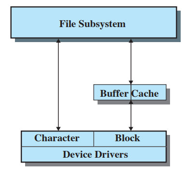
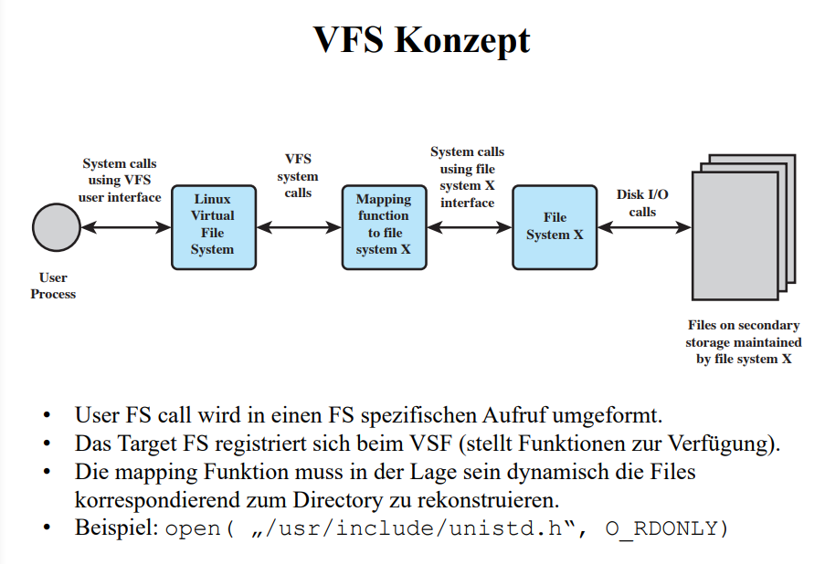
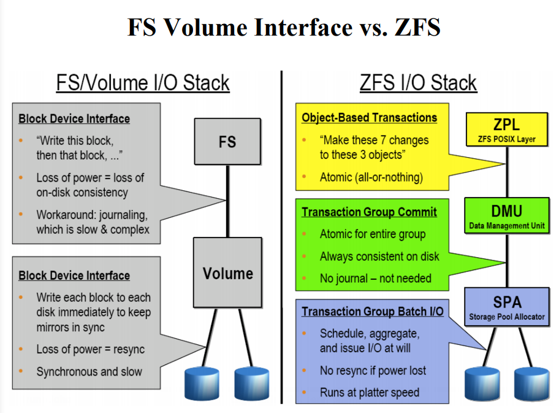
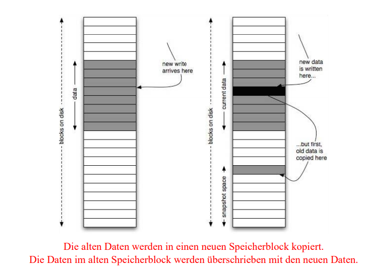
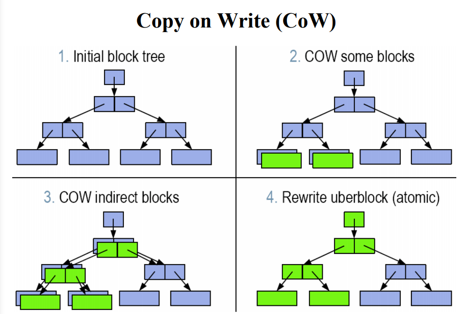
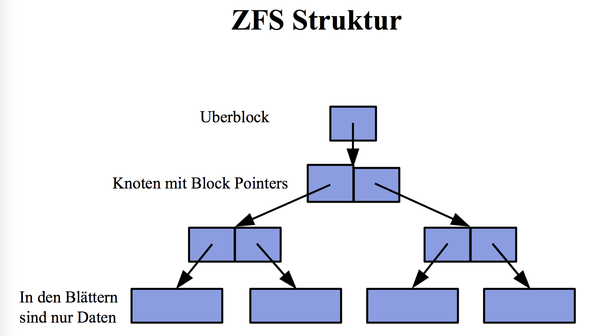
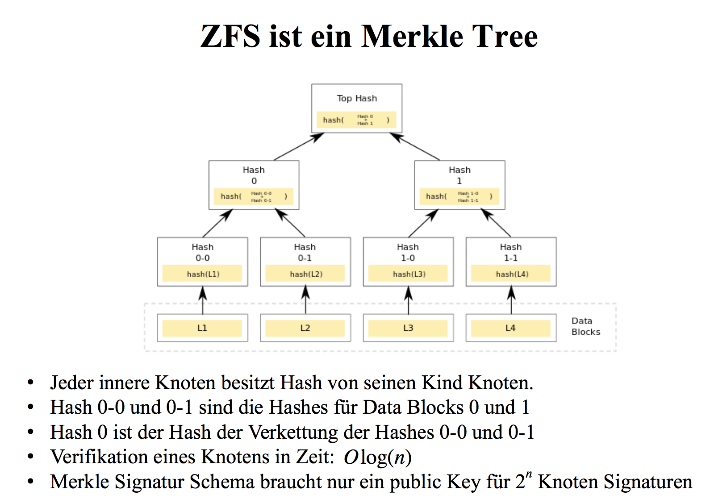
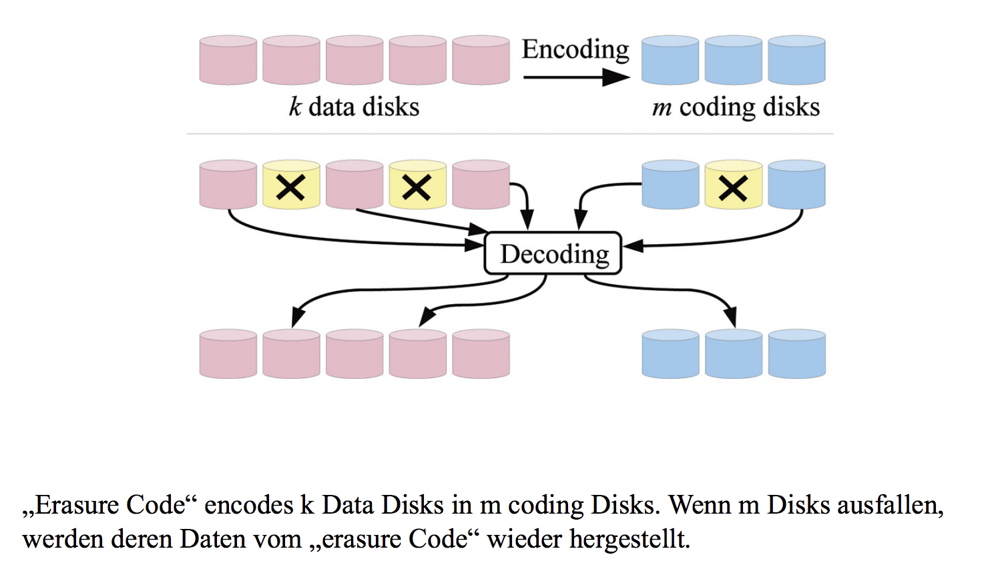

# Filesysteme

## Stoffabgrenzung

Sie kennen die Anforderungen an ein modernes Filesystem und können dessen Konzepte erklären.

## Anforderungen an ein modernes Filesystem

Wir betrachten im folgenden Sun/Oracle‘s zfs File System als Vertreter eines modernen Filesystems.

- grosse Adressierbarkeit
- Volume Manager eingebaut
- umfangreiche Funktionalitäten
- immer konsistent und integer
- kein fsck mehr nötig nach Absturz
- kann mit "silent corruption umgehen"

Dazu:

Kann mit allen Fehler-Klassen umgehen
– Bit rot
– Phantom writes
– Misdirected read and writes
– Administrative errors
• Disk Scrubbing (niemand kann gelöschte Daten lesen)
• Resilvering (rebuilding, reconstructing datas before use)*
• Real time remote replication (zfs send, zfs receive)
• encryption
• Data deduplication
• .....vieles mehr

## Buffer Cache

Greift ein Prozess auf die Blöcke eines Files zu, so wird es vom Kernel ins Memory geladen. Das File Subsystem cached Blöcke vom Dateisystem. Diese Blöcke werden im Buffer Cache (In-Memory Struktur) abgelegt und über eine bestimmte Zeit verwaltet. Der Cache beschleunigt den Blockzugriff (wenn er zuvor schon einmal verwendet wurde).

* Disk Cache
* Buffer Cache handelt I/O Operationen
* Datentransfer zwischen Buffer Cache (Kernel-Raum) und dem User Prozess wird über DMA gemacht (braucht somit keine CPU Cycles, dafür aber Bus Cycles).
* 3 verkette Listen werden gebraucht:
  * Freie Liste: beinhaltet alle Plätze vom Cache, die für den Gebrauch zur Verfügung stehen.
  * Device Liste: listet alle Buffer, die momentan mit einem FS verknüpft sind.
  * Driver I/O Queue: listet die Buffer auf, die bei einem bestimmten Device einen I/O ausführen oder auf einen I/O warten.

### Funktionsweise

* Buffer Cache enthalten die Daten von kürzlich verwendeten Disk Blöcken.
* Wenn der Kern Daten von der Disk lesen will versucht er sie zuerst vom Buffer Cache zu lesen.
* Falls die Daten im Buffer Cache sind braucht er diese nicht von der Disk zu lesen
* Falls die Daten nicht im Buffer Cache sind so liest der Kern diese von der Disk und legt sie im Buffer Cache ab

## Virtual File System (VFS)

* VFS präsentiert ein einziges uniformes FS Interface zum User Prozess
* Der User Prozess setzt einen FS call im POSIX Format ab.
* VFS setzt voraus:
  * dass ein File einen symbolischen, einzigartigen Namen hat
    und von einem Directory identifiziert werden kann.
  * Ein File hat einen Besitzer und ist geschützt gegen nicht
    autorisierten Zugriff.
* Für jedes spezifische FS wird ein mapping Modul bereitgestellt
  wo das reelle FS auf das virtuelle FS transformiert wird.

## Volumes

## ZFS

ZFS ist ein Merkle-Tree.

## Konsistenz der Daten

* fsck angewendet auf kann von einigen Minuten bis zu 72 Stunden (sehr grosse Filesysteme) in Anspruch nehmen.
* Wir möchten zu jederzeit wissen wenn Daten Korrupt sind, nicht erst beim Verwenden der Daten.
* Vergl. spätere Folie „Selbstheilendes ZFS“
* CoW „Copy on Write“ und RoW „Redirect on Write“ werden angewandt um jederzeit konsistent zu sein.

## CoW (copy on write)

 

## RoW (redirect on write)

## Kontrollfragen
###  Was ist ein Buffer Cache?
Ein Buffer Cache ist ein Cache für Block Devices. Er beschleunigt den Blockzugriff (vom Kernel), da nur vom Device gelesen werden muss, wenn Blöcke nicht im Cache vorhanden sind. Der Datentransfer wird mittel DMA gemacht. Daher braucht er keine Prozessor Zyklen, sondern Bus Zyklen.

3 verkettete Listen werden gebraucht um den Buffer Cache zu unterhalten:
- Freie Liste: listet alle Plätze vom Cache die für den Gebrauch zur Verfügung stehen.
- Device Liste: listet alle Buffer die momentan mit einem FS verknüpft sind.
- Driver I/O Queue: listet die Buffer auf die bei einem bestimmten Device einen I/O ausführen oder auf einen I/O warten.

### Wie werden im zfs Volumes mit einem Filesystem darauf gebildet.

### Was ist neu im zfs I/O Stack?
Operationen sind atomisch und benötigen kein Journal. 

### Wie sieht die zfs Struktur aus?

[https://en.wikipedia.org/wiki/Merkle\_tree](https://en.wikipedia.org/wiki/Merkle_tree)

### Welche Informationen sind in einem Block Pointer enthalten?

[https://en.wikipedia.org/wiki/Inode](https://en.wikipedia.org/wiki/Inode)
[https://en.wikipedia.org/wiki/Inode\_pointer\_structure](https://en.wikipedia.org/wiki/Inode_pointer_structure)

### Wieviele Buffer Caches unterhält das VFS?
4 Caches:
- Page Cache
- Inode Cache
- Buffer Cache
- Directory Cache
[https://www.usenix.org/legacy/publications/library/proceedings/usenix01/full\_papers/kroeger/kroeger\_html/node8.html](https://www.usenix.org/legacy/publications/library/proceedings/usenix01/full_papers/kroeger/kroeger_html/node8.html)

### Erklären sie den Unterschied zwischen CoW (copy on write) und RoW (relocate on write)
**Copy on write**: Die alten Daten werden in einen neuen Speicherblock kopiert. Die Daten im alten Speicherblock werden überschrieben mit den neuen Daten. 

**Redirect on write**: Neue Schreibanfrage möchte die Daten in den alten Block schreiben. Diese werden aber in einen neuen Block geschrieben (redirect). Der Originalblock enthält alte Daten

###  Was sind Snapshot und wie funktionieren diese?

### Was versteht man unter einem „Erasure Code“?
[https://en.wikipedia.org/wiki/Erasure\_code](https://en.wikipedia.org/wiki/Erasure_code)

### Wozu eignen sich Snapshots nicht?
Sie eignen sich nicht für Backups, aber für Restores.