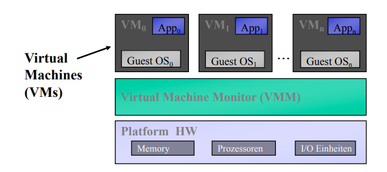
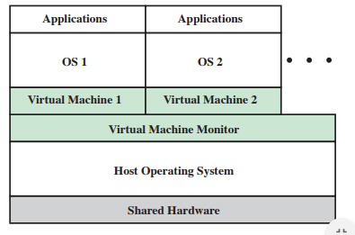
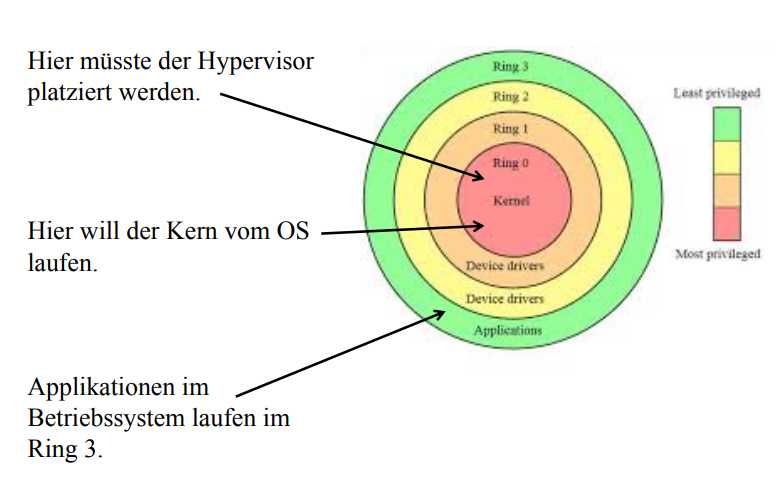
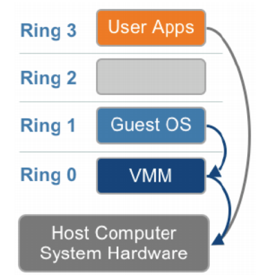

# 05 - Hardware Virtualisierung

Privilegierte Instruktionen lösen einen Trap, in den Kernel (Supervisor Modus), im User Modus aus. Privilegiert sind alle Instruktionen, welche versuchen die Konfigurationen von Systemressourcen zu verändern oder abhängig von der Konfiguration der Ressourcen sind (z.B. Inhalt der Relocation Register oder Prozessor Modus).

[https://en.wikipedia.org/wiki/Protection\_ring](https://en.wikipedia.org/wiki/Protection_ring)
CPL (current privilege level) -\> 2bit = 4 Privilegien = 4 Sicherheitsringe

## Memory Virtualisierung

## Memory Rückgewinnungstechniken

Memory Rückgewinnungstechniken werden benötigt, da der Hypervisor in der Regel den Arbeitsspeicher dem VMs overcommitted: Er stellt mehr Arbeitsspeicher zur Verfügung als er eigentlich hat. Um dies zu bewerkstelligen, benötigt er Rückgewinnungstechniken.

* **Page Sharing**: In homogenen Gastsystem finden sich viele identische Pages (z.B. bei mehreren Windows 10 VMs gibt es viele Pages die immer gleich sind, diese können somit geshared werden)
* **Page Patching**: Fast gleiche / ähnliche Pages gibt es viele. Daher werden inkrementell nur Änderungen gespeichert.
* **Page Compression**: Viele Pages die in naher Zukunft nicht mehr verwendet werden (reduziert die Anzahl paging requests)
* **Memory Ballooning**: 
  * Benötigt einen Treiber im Gast-OS (Balloon-Treiber)
  * Wenn der Hypervisor Memory benötigt, instruiert er den Balloon-Treiber in einer Gast-VM sich "aufzublasen". Dabei übergibt der Hypervisor die gewünschte Grösse des Speichers resp. die Anzahl der Memory Pages die er gerne hätte.
  * Der Balloon-Treiber fordert dann Speicher vom Gast-OS an (in der gewünschten Anzahl Pages) und markiert diese (sofern sie frei sind!). Danach informiert der Treiber den Hypervisor, dass er diese Pages verwenden kann.
  * Frage: was ist genau paged out?
  * Möchte das Gast-OS trotzdem auf diese Pages zugreifen, so handelt das der Hypervisor als regulären Memory Request / Allocation ab.
  * Wenn der Hypervisor entscheidet, dass die Balloon-Grösse verringert werden kann, übergibt er dem Balloon-Treiber die neue Grösse und der Treiber hebt darauf hin die Markierung auf.
  * https://www.youtube.com/watch?v=mxproh2qaU8

Warum Memory Rückgewinnung:
- Viel redundantes z.B. Kernel, Systemdateien, usw.

## Virtual Machine Monitor (VMM)

VMM (= Hypervisor) ist eine Schicht von System Software und ermöglicht VMs sich eine Hardware Plattform zu teilen.

1. Die VMM stellt die Umgebung zur Verfügung, die identisch ist mit jener der original Maschine
2. Im schlechtesten Fall zeigen Programme in dieser Umgebung eine geringe Performance-Einbusse
3. Die virtuelle Maschine (VM) ist die Umgebung erzeugt vom VMM.

## x86 Virtualisierung

> Nach Popek und Goldberg ist eine CPU (ISA*) virtualisierbar, wenn alle privilegierten Instruktionen eine Exception erzeugen, wenn sie in einem unprivilegierten Prozessormodus ausgeführt werden. Alle sensiblen Instruktionen sind privilegiert.

ISA: Instruction Set Architecture, Befehlssatzarchitektur (z.B. IA-32 = x86, ARM, PowerPC, RISC-V etc.)

### Theorem 1

> Für beliebige Prozessorarchitekturen der dritten Generation kann eine effektive VMM aufgebaut werden, wenn der Satz der kontrollkritischen Instruktionen für eine Prozessorarchitektur eine Untermenge des Satzes der privilegierten Instruktionen darstellt.

Erklärt: Um eine VMM zu bauen, genügt es wenn alle Instruktionen die das korrekte funktionieren einer VMM beinflussen können (control sensitive instructions) immer getrapped werden und zur Kontrolle an die VMM weitergegeben und verarbeitet (emuliert) werden.

### Theorem 2

> Eine beliebige Prozessorarchitekturen der dritten Generation ist rekursiv virtualisierbar, wenn:
>
> - sie selbst virtualisierbar ist
> - für sie ein VMM ohne Zeitabhängigkeiten konstruiert werden kann

Einige Architekturen, wie zum Beispiel die x86-Architektur ohne hardwaregestütze Virtualierungsfunktionen, erfüllen diese Bedingungen nicht, weswegen sie nicht auf dem klassischen Weg virtualisierbar sind (sondern z.B. mittels Binary Translation)

### Komponenten der VMM

Die VMM besteht aus einem Control Program mit drei 3 Teilen:

1. **Dispatcher**: Die Initial Instruction des Dispatchers liegt am Speicherplatz, wo die Hardware trapped.
2. **Allocator**: Entscheidet, wer welche Systemressourcen erhält. Er hat 1 oder n Member (VM).
3. **Interpreter**: Hat für alle Instruktionen, die einen Trap auslösen, eine Interpreter Routine pro privilegierte Instruktion.

### Instruktionsklassifizierung

Es gibt im Prinzip zwei Betriebsmodi:

- User Mode: Eingeschränkter Modus
- Supervisor Mode: Uneingeschränkter Modus

**Privilegierte Instruktionen**: Wird eine privilegierte Instruktion (z.B. Memory allozieren) im User Mode ausgeführt, so gibt es einen Trap. Im Supervisor Modus nicht. Zu diesen Instruktionen gehören:

* **Control Sensitive** (kontrollkritische Instruktionen): Jene, die versuchen die Konfiguration von Systemressourcen zu verändern.
* **Instruction Sensitive** (verhaltenskritische Instruktionen): Jene Instruktionen welches Verhalten oder Resultat abhängig ist von der Konfiguration der Ressourcen (Inhalt der Relocation Register oder Prozessor Modus). 

Beide Arten müssen eine Untermenge der privilegierten Instruktionen sein.

**Harmlose Instruktionen** sind dabei alle nicht sensitiven Instruktionen.

Weitere Definition:

> Privileged instructions form a subset of all available instructions on a CPU. These are instructions that can only be executed if the CPU is in higher privileged state, e.g. current privilege level (CPL) 0 (where CPL 3 is least privileged). A subset of these privileged instructions are what we can call “global state-changing” instructions – those which affect the overall state of CPU. Examples are those instructions which modify clock or interrupt registers, or write to control registers in a way that will change the operation of root mode. This smaller subset of sensitive instructions are what the non-root mode can’t execute.

### Formale Definition nach Popek & Goldberg

Popek & Goldberg haben drei Anforderungen an ein physisches und virtuelles System gestellt:

* **Gleichheit**: Jedes Programm, dass in einer virtuellen Maschine ausgeführt wird, verhält sich gleich wie wenn es auf dem Original der Maschine ausgeführt wird.
* **Effektivität**: Wann immer möglich, sollen die Instruktionen nicht auf dem virtuellen Prozessor sondern direkt auf der physischen CPU ausgeführt werden (ohne dass die VMM interveniert). Harmlose Instruktionen (also solche, die nicht privilegiert sind wie z.B. Memory Allocation) werden von der Hardware direkt ausgeführt.
* **Ressourcenkontrolle**: Die VMM behält die komplette Kontrolle über die Ressourcen (z.B. Memory, I/O, Peripheriegeräte etc.,), aber nicht unbedingt über die Prozessoraktivität. Für die Programme (Gast-Systeme) muss es unmöglich sein, die Ressourcen des Systems zu beinflussen (z.B. verfügbares Memory). Der Verteiler (Allocator) des Kontroll-Programmes muss bei jedem dieser Versuche aufgerufen werden.

### Herausforderungen

### Hypervisor Typen

**Typ 1**: Ist direkt auf der Hardware installiert, wie z.B. bei VMWare ESXi, XEN oder Hyper-V

**Typ 2**: Ist auf einem Betriebsystem (Host) installiert, wie z.B. bei VMWare Workstation, KVM

### Direct Execution & Sicherheitsringe

Die x86-Architektur kennt vier Ebenen (Levels) von Privilegien, Ring 0 bis Ring 3. User Mode Programme laufen im Ring 3, welcher nicht privilegiert ist. Das Betriebssystem läuft im Ring 0, da es Zugriffe auf die Hardware etc. braucht.

Die Virtualisierungsschicht muss also unter dem Ring 0 sein!

### Binary Translation

**Problem**: Der x86 ISA (Befehlssatz) hat insgesamt 17 privilegierte Instruktionen, welche *nicht* durch einen Trap geschützt sind. Werden diese Instruktionen von einem Gast in Ring 1 ausgeführt, ignoriert sie die CPU schlicht. Auch genannt "nicht abfangbare, für x86 getarnte" Instruktionen. VMWare hat ein Patent für eine Lösung für dieses Problem.

Full Virtualization mit Binary Translation:

* Kombination aus *direct execution* und *binary translation*
* User Level Code wird direkt ausgeführt, wobei nicht ausführbarer kontrollkritischer Code "übersetzt" wird. Um die Performance zu steigern wird es nur einmal übersetzt und danach im Cache abgelegt.
* Übersetzter Kernel Code ersetzt nun die nicht virtualisierbaren Instruktionen
* Für diese Methode ist keine Unterstützung der Hardware nötig. Das Gast OS ist voll abstrahiert, weiss also nicht dass es in einer VM läuft.

Dabei entsteht natürlich ein Overhead. Ein nativer System Call benötigt 242 CPU Cycles, wobei ein übersetzter System Call (32Bit OS, Ring 1) 2308 Cycles benötigt.

### Para Virtualization (Software assisted)

Das Wort Para bezieht sich auf die Kommunikation zwischen Gast OS und Hypervisor. Bei dieser Art muss der Kernel vom Gast-OS modifiziert werden, um **nicht virtualisierbare Instruktionen** mit Hypercalls zu ersetzen, welche direkt mit dem Virtualization Layer Hypervisor kommunizieren. Es gibt hier also keine unmodifizerte Gast OS! Der Hypervisor stellt Hypercall Interfaces zur Verfügung.

Diese Art ist sehr änhlich zu der Binary Translation, wobei BT die kritischen Instruktionen in harmlose übersetzt. Paravirtualisierung macht dasselbe, aber direkt im Source Code des Betriebssystems. Dies erlaubt eine grössere Flexibilität und es benötigt keine Übersetzung zur Laufzeit.

### Full Virtualization (Hardware assisted)

Dazu wurde ein neuer CPU Modus eingeführt welcher die Ausführung unterhalb von Ring 0 erlaubt. Privilegierte und sensitive Calls trappen automatisch zum Hypervisor ohne Binary Translation. Der Status des Gastes wird in *virtual machine control structures* gespeichert. 

### Wie löst Intel das Problem?

Aus Slides:

Die VM under VMM haben getrennte Adressbereiche. Die VMCS (Virtual Memory Control Structure) sind zusätzliche Kontrollstrukturen im Memory. Die VMCS verfolgen die Kontextwechsel (Context Switch) Prozessorinformation für VMs,

Zwei neue Operationsmodi (in Ring 0-3 vorhanden):

- VMX root Operation: Voll privilegiert für den VMM
- VMX non-root Operation: Nicht voll privilegiert für die Gast-OSs. Reduziert Gast-OS Privilegien ohne auf die Ringe zurückgreifen zu müssen.

Aus Blog ([hier](https://binarydebt.wordpress.com/2018/10/14/intel-virtualisation-how-vt-x-kvm-and-qemu-work-together/))

Intel hat VT-x eingeführt für die Virtualisierung der CPU (VT-d für I/O Virtualisierung). Bei VT-x operiert die CPU in zwei Modis: *root*  und *non-root*. Die VMM läuft dabei im root-mode, und die VMs im non-root mode. Diese Modis sind orthogonal zu den Ringen.

Die VMX (Virtual Machine Extensions) sind neu eingeführte Instruktionen um VT-x zu ermöglichen:

* VMXON: Aktiviert den Virtualisierung-Modus. Vorher kennt die CPU den root und non-root Modus nicht.
* VMXOFF: Gegenteil von VMXON, beendet den Virtualisierungsmodus.
* VMLAUNCH: Erstellt eine Instanz einer VM und begibt sich in den non-root mode. Die Instanz führt die Instruktionen aus als ob es nativ laufen würde bis es etwas ausführen will, dass privilegiert ist. Das erzeugt einen VM exit und wechselt in den root mode. Der Hypervisor läuft im root mode und handelt den VM exit und führt dann wieder VMRESUME aus, um in den non-root mode zu gelangen. Sodass der Hypervisor den Grund für den VM exit kennt gibt es die VMCS (Virtual Machine Control Structures). Darin ist der Grund für den VM exit und weitere Informationen enthalten. Für jede virtuelle CPU existiert ein VMCS.
* VMRESUME: Begibt sich in den non-root mode für eine existierende VM Instanz.
* VMREAD / VMWRITE (root mode only): Zum Lesen und Schreiben der VMCS.
* Weitere..inte

Im non-root mode werden Instruktionen direkt ausgeführt als ob sie im root-mode wären. Privilegierte Instruktionen.

## Kontrollfragen

Dokument: Lernkontrolle Virtualisierung 1 (HW Virtualisierung)

### Claudio

#### Wann ist eine CPU nach Poppek & Goldberg virtualisierbar?

Nach Popek und Goldberg ist eine CPU (ISA*) virtualisierbar, wenn alle privilegierten Instruktionen eine Exception erzeugen, wenn sie in einem unprivilegierten Prozessormodus ausgeführt werden. Alle sensiblen Instruktionen sind privilegiert.

#### Was ist eine Simulation?

Die Simulation **imitiert** die Operationen eines echten Systems oder Prozesses. Dazu muss zuerst ein Modell entwickelt werden, welches die Schlüssel-Charakteristiken des abstrakten oder physikalischen Systems repräsentieren.  Das Modell repräsentiert das System selber während die Simulation die Operationen über die Zeit repräsentieren.

####  Was versteht man unter Emulation?

In der Informatik wird ein Emulator als System bezeichnet, **welches ein anderes in** bestimmten Teilaspekten **nachbildet**. Das System erhält die gleichen Daten, führt vergleichbare Programme aus und erzielt die möglichst gleichen Ergebnisse in Bezug auf bestimmte Fragestellungen wie das zu emulierende System. Als Beispiel Qemu: Qemu kann diverse Hardware-Architekturen (z.B. ARM) emulieren, womit das emulierte Programm auf dieser Architektur laufen kann.

####  Nennen Sie ein paar verschiedene Virtualisierungen die eine wichtige Rolle im Data Center spielen

Es gibt diverse Bereiche, welche virtualisiert werden:

* Server (Virtuelle Maschinen)
* Speicher
* Applikationen
* Desktops
* Netzwerke (Ethernet, SAN =>SDN)

#### Wie geht Intel das Problem an, damit die *direct execution* realisiert werden kann?

Mittels Intel VT-d (siehe oben).

#### Was ist eine Virtualisation?

Dabei gibt es zwei elementare Begriffe resp. Konzepte.

**Virtualität** ist die Eigenschaft einer Sache, nicht in der Form zu existieren, in der sie zu existieren scheint, aber in ihrem Wesen oder Wirkung einer in dieser Form existierenden Sache zu gleichen.

Einfacher ausgedrückt: *Virtualität* spezifiziert also eine gedachte oder über ihre Eigenschaften konkretisierte Entität, die zwar nicht physisch, aber doch in ihrer Funktionalität oder Wirkung vorhanden ist.

**Virtualisierung** (in der Informatik) bezieht sich auf den Vorgang der Erstellung einer virtuellen (also nicht tatsächlichen) Version von *etwas*, wie z.B. virtuelle Hardware-Plattform, Betriebssystem oder Netzwerk-Ressourcen (z.B. SDN)

#### Welche Herausforderungen muss eine VMM lösen können?

Die VMM muss ...:

* Gast-Systeme (OS, Applikationen) wissen nicht, dass eine VMM existiert oder dass sie Ressourcen mit anderen VMs teilen
* sollte den Software-Stack der Gästen gegenüber anderen Gästen **isolieren**
* sollte gegenüber anderen Gast-Systemen **geschützt** laufen
* eine virtuelles Plattform Interface gegenüber den Gast-Systemen präsentieren

### Emanuel

### Wann ist eine CPU nach Popper & Goldberg virtualisierbar?

Eine CPU (ISA) ist virtualisierbar, wenn alle privilegierten Instruktionen eine Exception erzeugen (somit [ge]trapped werden), wenn sie in einem umprivilegierten Prozessormodus ausgeführt werden.

###  Was versteht man unter Emulation?
Unter Emulation versteht man eine Nachbildung eines Systems, welches im Vergleich zum nachgebildeten System, möglichst gleiche Ergebnisse mit gleichen Daten und vergleichbaren Programmen erzielt.

### Welches sind einige wichtige Virtualisierungen, die im Datacenter eine Rolle spielen?
1. Hardware Partitionierung (auf High End Computer, wie z.B. Sparc, kann das höchste Sicherheitszertifikat mit sich bringen)
2. Hardware Virtualisierung (mittels Hypervisor)
3. Operating System Virtualisierung (z.B. mittels Docker)

### Wie geht Intel das Problem an damit die direct execution realisiert werden kann?
Das Problem wird mit Hilfe einer Kombination aus *direct execution* und *binary translation* realisiert. Alle privilegierten Instruktionen welche nicht Trap geschützt sind werden im Kernel übersetzt und gechached. Der übersetzte Kernel Code ersetzt nun die nicht virtualisierbaren Instruktionen. Alle anderen Instruktionen (*user level*) werden direkt ausgeführt. Somit ist keine Hardware Unterstützung notwendig. Gast OS ist abstrahiert, hat keine Ahnung dass es in einer VM läuft.

Ein Binary Translated System Call eines 32 bit Gast OS im Ring 1 braucht ~10x mal mehr Prozessor Zyklen.

### Was ist eine Virtualisation?
Virtualisation bezieht sich auf den Vorgang der Erstellung einer virtuellen (und nicht tatsächlichen) Version von etwas, was in seinem Wesen oder seiner Wirkung in dieser Form gleicht, wie zB. virtuelle Computer-Hardware-Plattform, Betriebssystem (OS), Speichergerät oder Computer-Netzwerk-Ressourcen.

###  Welche Herausforderungen muss ein VMM lösen können?
Probleme die es zu lösen gibt:
* Mehrere Betriebssysteme gleichzeitig auf einem physikalischen Server. 
* Betriebssysteme sind konstruiert dass sie die Zugriffe auf die
Betriebsmittel regeln.
* Betriebssystem kann nicht abgeändert werden (Microsoft)

Ein (Virtual Machine Monitor) muss folgendes gewährleisten:
* Gleichheit (Programm in VM verhält sich genau so wie in der originalen Maschine)
* Effektivität (Wann immer möglich *direct execution*, möglichst wenig im *VMM*)
* Ressourcenkontrolle (komplette Kontrolle über Ressourcen [z.B. Memory, I/O, Devices], jedoch nicht umbedingt über Prozessoraktivität)

Es muss für jedes Programm unmöglich sein System Ressourcen zu beeinflussen. Der **Allocator** (entscheidet wer welche Systemressourcen bekommt) der VMM muss bei jedem dieser Versuche aufgerufen werden. Für jede privilegierte Instruktion muss der **Interpreter** des VMM eine Methode zur Verfügung stellen.

Dispatcher dessen Initial Instruction am Speicherplatz liegt wohin die HW trapped.?KONTEXT

Dabei kann ein VMM vom OS unterstützt werden (Para Virtualisierung [neben]).

**OS Unterstützt**

Kernel vom OS muss modifiziert werden um nicht virtualisierbare Instruktionen mit Hypercalls zu ersetzen die direkt mit dem Virtualization Layer Hypervisor kommunizieren. Der Hypervisor stellt Hypercall Interfaces zur Verfügung. Keine unmodifizierte Gast OS!.?KONTEXT

Paravirtualisierung ist nicht so verschieden von Binary Translation. BT übersetzt „kritischen“ in „harmlosen“ Code. Paravirtualisierung macht dasselbe aber im Source Code. Änderungen im Source Code erlaubt grössere Flexibilität. Para Virtualisierung braucht keine „Laufzeit-Übersetzung“ und wird daher schneller ausgeführt. Unveränderte Betriebssysteme können nicht ausgeführt werden.

**HW Unterstützt**

Neuer CPU Modus eingeführt. Erlaubt Ausführung unterhalb Ring 0. Privilegierte und sensitive Calls trapen automatisch zum Hypervisor ohne binary translation. Der Gast Status wird in virtual machine control structures abgespeichert. CPUs seit 2006 erhältlich.

### Wo werden im HW unterstützten x86 Sicherheitsmodell der Kern, Hypervisor und die Applikationen ausgeführt?

VMM und VM haben getrennte Adressbereiche. VMCS (Virtual Memory Control Structure) sind zusätzliche Kontroll Strukturen im Memory. VMCS verfolgt die Kontextwechsel Prozessorinformationen für VMs. Neue Intel IA32 Instruktionen:
 2 neue Operationsmodi (die in Ring 0-3 vorhanden sind): - VMX root Operation:
- Voll Privilegiert für den VM Monitor - VMX non-root Operation:
- Nicht voll privilegiert für die Gast Betriebssysteme
- Reduziert Gast SW Privilegien ohne auf die Ringe zurückgreifen zu
müssen.

### Was sind Gründe für eine Hardware Virtualisierung
- Performanz
- OS muss nicht angepasst werden
- 

