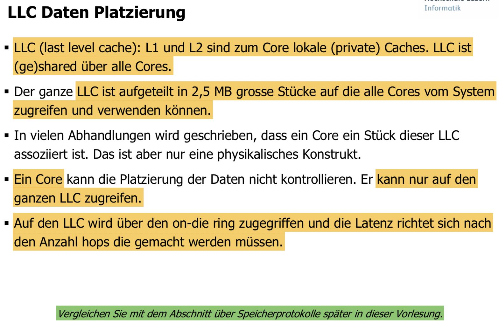
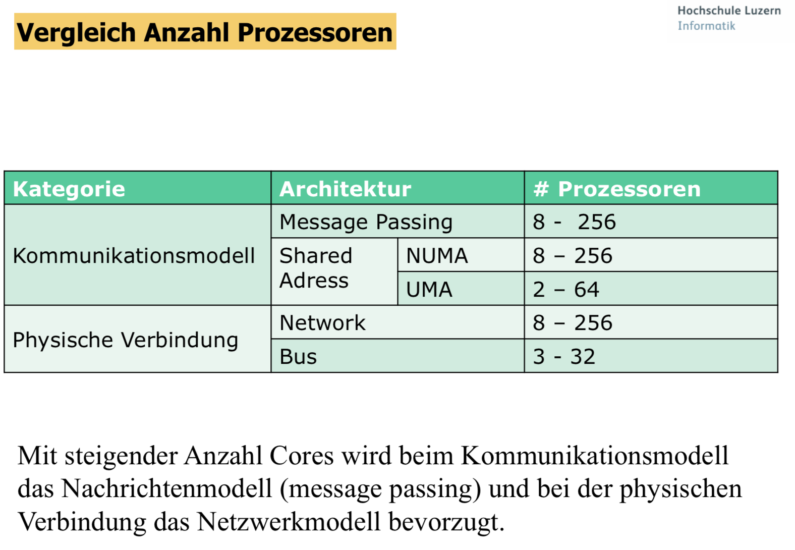
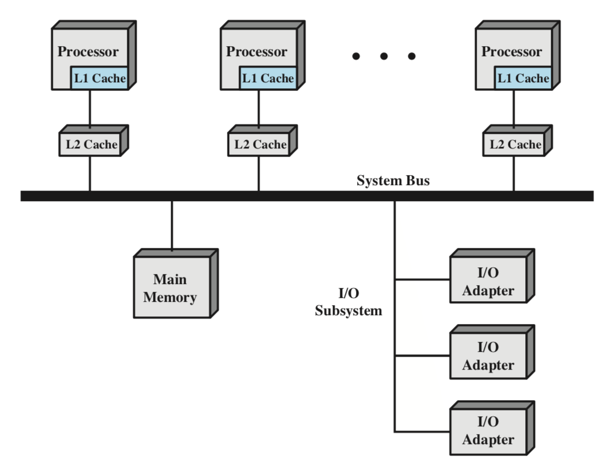
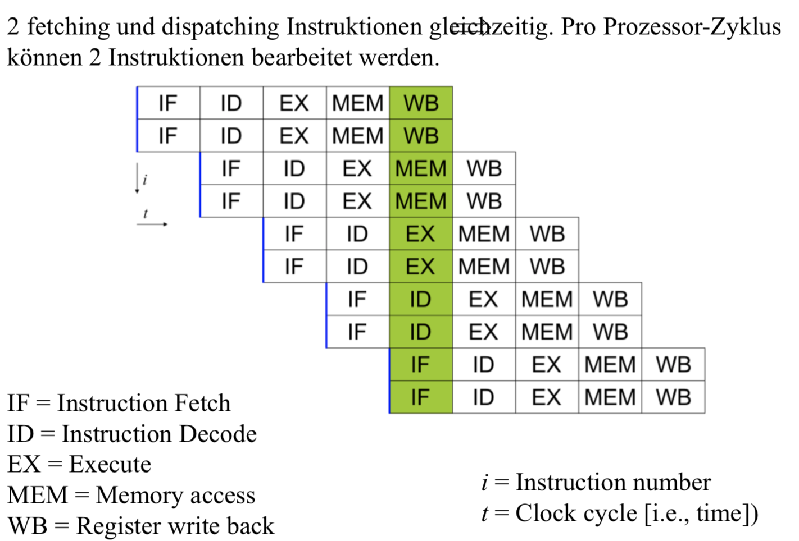
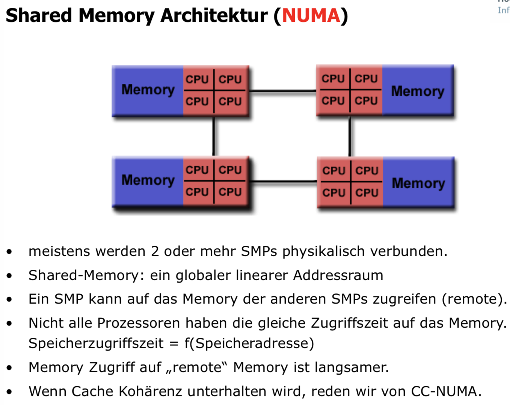
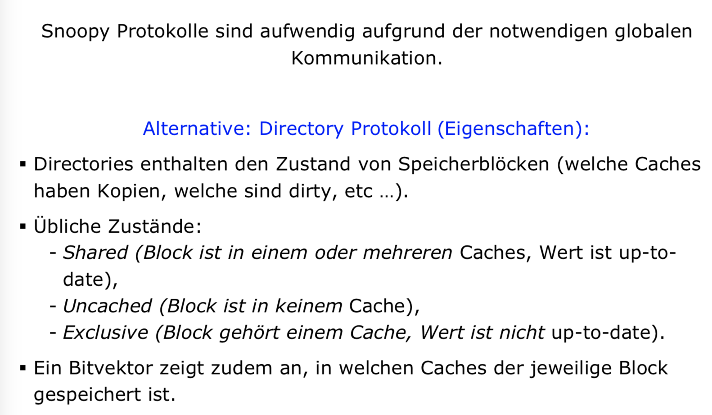
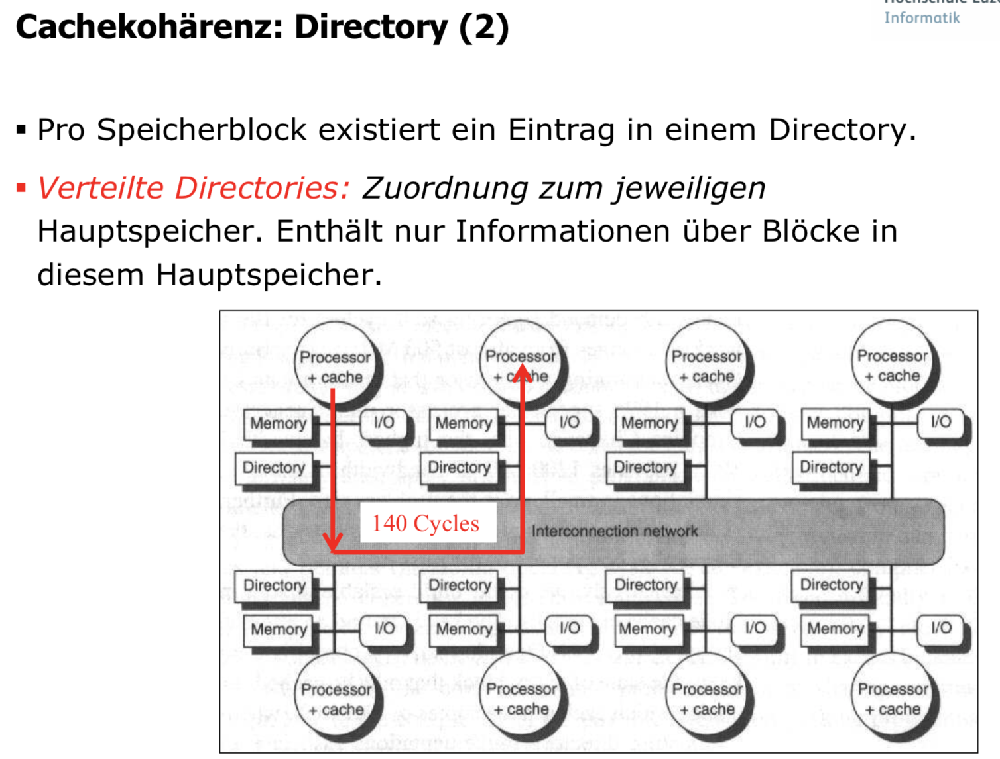
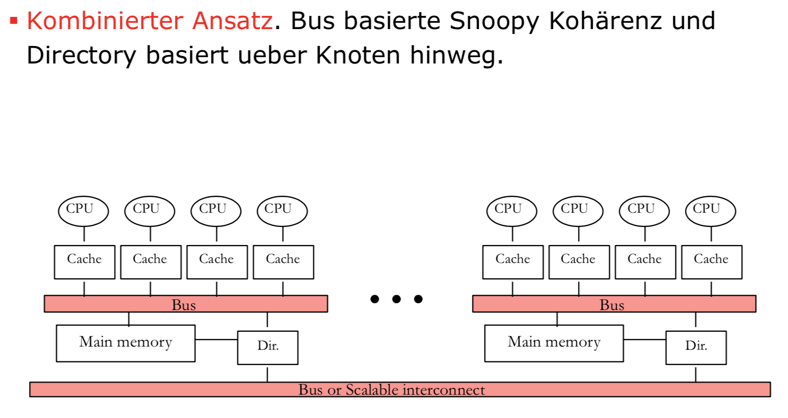
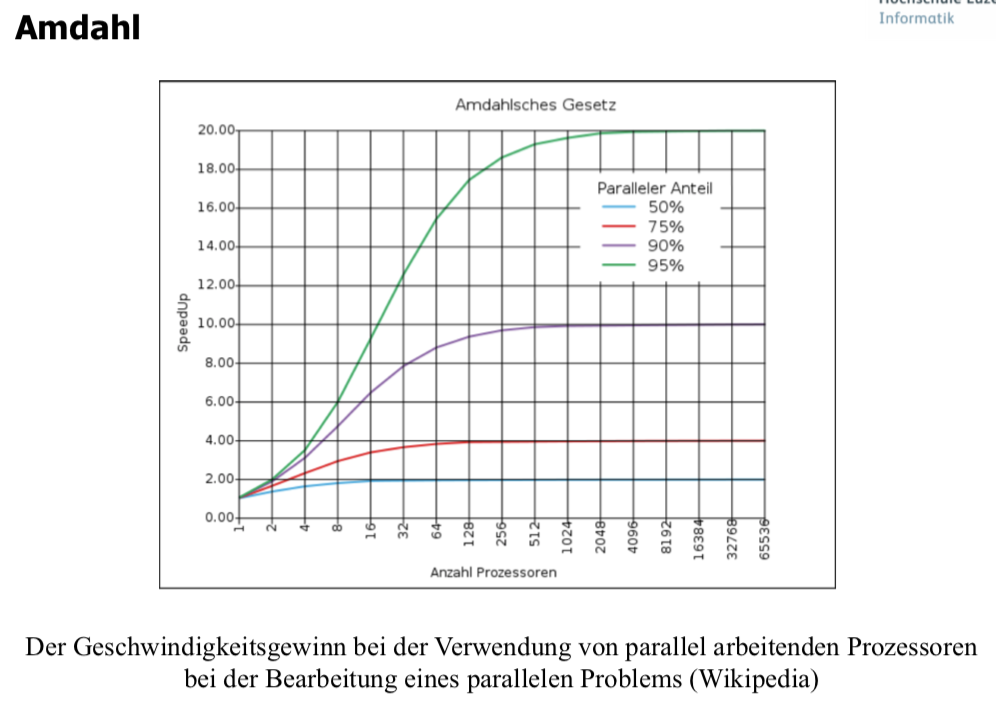

# Paralelle Architekturen

User homes werden gemountet und sind nicht lokal (NFS).

## Kontrollfragen
###  Was sind SMPs und wo liegen deren Vorteile?

Ein symmetrisches Multiprozessorsystem (SMP) ist eine Multiprozessor-Architektur mit folgenden Eigenschaften:
* Zwei oder mehr gleichartige Prozessoren mit vergleichbaren Möglichkeiten, wobei alle Prozessoren die gleichen Funktionen ausführen können
* Prozessoren teilen sich das Memory und sind über einen Bus oder eine interne Verbindung zusammengeschaltet.
* Prozessoren teilen sich die I/O Devices.
* Das System wird durch ein integriertes OS kontrolliert. Dieses stellt die Interaktion her zwischen Prozessoren und deren Programmen auf dem Level von Job, Task, File und Daten-Elementen.

Vorteile von SMP:
1. Erhöhte Availability & Performance durch Paralelität.
2. Scaling? (Hersteller können eine Palette von Produkten mit verschiedenen Preisen und Leistungen anbieten.)
3. Incremental Growth (Zusätzliche Prozessoren können dazu gefügt werden um die Performance zu erhöhen.)

### Erklären sie die „superskalare Architektur“
Eine superskalare Architektur bringt Parallelismus auf der Instruktionsebene. Daher kann der Prozessor mehr als eine Instruktion während eines Clock-Cycle ausführen indem er mehrere Instruktionen auf mehrere redundante Funktionseinheiten im Prozessor legt. 

### Erklären Sie den Unterschied zwischen UMA und NUMA Memory Architekturen

Uniform Memory Access (UMA) bietet einen einfachen und schnelleren Kommunikationsmechanismus für Prozessoren, da alle Ps direkten Zugriff auf alle Speicherstellen haben.

Negation

### Zeichnen sie eine gemischte UMA/NUMA Architekturen auf wo Memory lokal, sowie verteilt zum Prozessor ist.
zB: 

oder wie auf den Folien zu Frage 3 gezeigt.

### Wie werden multi Chip oder multi Core Architekturen, wie wir sie heute verwenden, genannt?

Siehe Folie: Simultanes Multi Threading

??? [https://de.wikipedia.org/wiki/Mehrkernprozessor](https://de.wikipedia.org/wiki/Mehrkernprozessor)

### Ist ein Crossbar Switch (k mal k Elemente) blockierend? Ist ein Omega Netzwerk (n Elemente \< k) blockierend? Versuchen sie eine Begründung zu liefern.
Siehe Folie Koppelnetze (2) und Koppelnetze (3)

???
  
### Was ist der Hauptgrund wieso ein Multi Core Chip mehrere Hardware Threads implementieren soll?
Siehe Folie: Memory Stalls und Wie lange wartet eine CPU?

### Wie implementiert der Chip Hersteller diese Hardware Threads?
Siehe Folie: Simultanes Multi Threading und Superscalar Architecture

Teile der Architektur doppelt vorhanden.

###  Welches Problem tritt bei Multi Core Architekturen auf, das man bei single Core Architekturen mit einem L1 und L2 Cache nicht hatte?
Bei einer Multi Core Architektur können einzelnen Caches für dieselbe Speicheradresse unterschiedliche (inkonsistente) Daten zurückliefern.

### Welche 2 Schreibstrategien gibt es bei Prozessorcaches?
Write-back & Write-through
https://de.wikipedia.org/wiki/Cache#Schreibstrategie

### Welche Cache Koherenz Protokolle gibt es und wie funktionieren sie?
**Snoopy**

**Directory**

**Kombinationen**

### Welche Einheiten sind beim Directory Protokoll beteiligt?
* Local Node: Ursache der gesamten Transaktion.
* Home Node: Hauptspeicher und Directory, in denen die Adresse der Schreib- oder Leseanforderung liegt.
* Remote Node: Knoten, der eine Kopie des jeweiligen Cacheblocks besitzt.

### Was besagt das unter dem Namen: „Amdahls Law“ bekannt gewordene Gesetz?
Nach Amdahl wird der Geschwindigkeitszuwachs vor allem durch den sequentiellen Anteil des Problems beschränkt, da sich dessen Ausführungszeit durch Parallelisierung nicht verringern lässt.

### Nach welchen Kriterien werden Verbindungsnetze unterschieden?
Siehe Folie Verbindungsnetzwerke, Topologie Bewertungskriterien und lesen sie: „Kennwerte Netze.pdf“