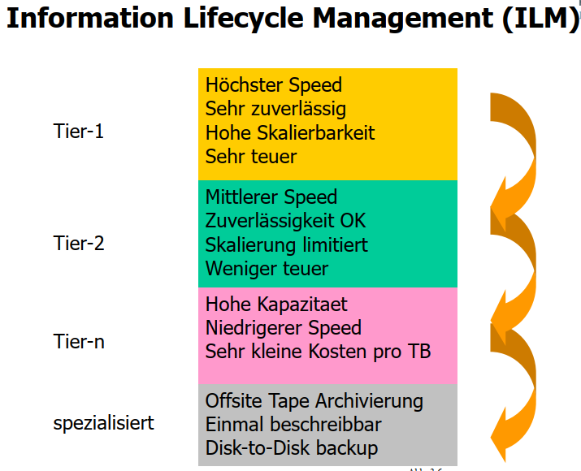
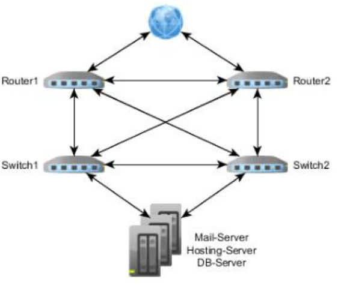
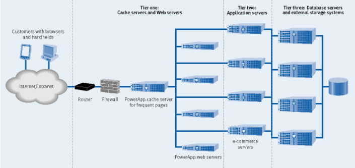
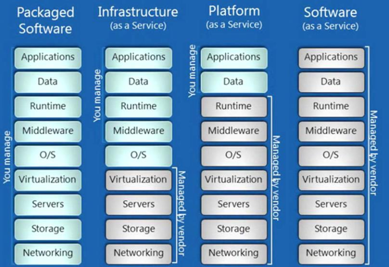

# stoffabgrenzung

\# ITEO Lernziele

 still to do

 help needed

## Sie kennen die Building Blocks eines Datacenters.

* Gebäude
* Zutrittskontrolle
* Brandschutz / Hochwasserschutz
* Klimatisierung
  * 26°C als Optimum
  * Reine Luft
  * Probleme: Kondenswasser, Luftverteilung
  * Immersion Cooling = Tauchkühlung = Komponenten eines Servers werden zur Kühlung direkt in eine Flüssigkeit getaucht.
* Serverracks
  * 1 HE = Höheneinheit = 1 U = 1 Unit = 1.75'' = 44.45 mm
* Stromversorgung
* Datenleitungen / Netzwerk
* Administration und Überwachung

## Sie sind fähig die kritischen Punkte eines Datacenters zu adressieren und Massnahmen vorzuschlagen.

* Einbruch, Diebstahl, Vandalismus, Sturmschäden = bauliche Massnahmen
* Fremdzugriff = Zugriffskontrolle, Firewall, Abhörsicherheit
* Feuer/Rauch = Brandfrüherkennung, Löschung, Abschottung
* Netzausfälle/Netzstörungen = Netzfilter, USV, Generatoren
* Elektromagnetische Störfelder = Abschirmung
* Staub / Schmutz / Wasser = Filteranlagen

## Sie kennen die Technologien und Tiers eines Datacenters.

: Technologien

Tier I: Redundanz: N, Jährliche Ausfallzeit 28.8 h, 99.67 % Verfügbarkeit

Tier II: Redundanz: N+1 , Jährliche Ausfallzeit 22 h, 99.75 % Verfügbarkeit

Tier III: Redundanz: N+1, Jährliche Ausfallzeit 1.6 h, 99.98 % Verfügbarkeit

Tier IV: Redundanz: 2\(N+1\), Jährliche Ausfallzeit 0.8 h, 99.99 % Verfügbarkeit

## Sie können die Anwendung eines Failover Datacenters aufzeichnen und erklären.

Failover Cluster = Verbund von zwei oder mehreren Servern bei welchen die wenn der erste Server ausfällt der zweite die Aufgabe übernimmt. =&gt; Hochverfügbarkeit

## Sie wissen wie man Daten klassifiziert und sie in SLAs einbindet.

## Sie sind in der Lage Data-Tiers und deren Aufgaben zu erklären.

## Sie können die Anforderungen an ein RZ-Netzwerk definieren und erklären.

### Anforderung 1: Hochverfügbarkeit

Ein zentrales Kriterium für die Infrastruktur eines unternehmenswichtigen IT-Systems ist und bleibt die ständige Verfügbarkeit aller Daten und der Anwendungen selbst. Unabhängig ob die Server im eigenen Unternehmen oder im Rechenzentrum betrieben werden, relevant für die Nutzung der Software ist dabei die Kennzahl der störungsfreien Zugriffszeit. Die Prozentwerte der durchschnittlichen Verfügbarkeit sind wiederum Bestandteil des Service Level Agreements, indem die zugesicherten Verfügbarkeiten den Preis der Dienstleistung bestimmen.

Über 99 % durchschnittliche Verfügbarkeit bieten heutzutage die meisten Anbieter an. Auch wenn die Ausfallzeiten auf den ersten Blick gar nicht so weit auseinander liegen, kann das – hochgerechnet auf die Dauer eines Jahres – mehr als drei Tage Ausfallzeit des Systems bedeuten. Es lohnt sich also einen genauen Blick in die eigenen Ausfallkosten zu werfen, um das Angebot mit dem optimalen Datacenter für die benötigten Anforderungen zu finden.

### Anforderung 2: Redundanz

Aus der Forderung nach Verfügbarkeit ergibt sich die Forderung nach Redundanz. Strom- und Datenleitungen können beschädigt werden, Festplatten und CPUs können ausfallen. Daher bieten Rechenzentren mit hoher Verfügbarkeit entsprechend viele redundante Komponenten, um einen reibungslosen Betrieb zu gewährleisten. So kann der Ausfall eines systemkritischen Bauteils innerhalb eines Rechenzentrums zeitnah aufgefangen werden, indem dieses im laufenden Betrieb stetig gespiegelt und die Ersatz-Komponente im Notfall zugeschaltet wird.

### Anforderung 3: Sicherheit

Neben der Hochverfügbarkeit ist die [Sicherheit der Daten](http://blog.myfactoryschweiz.ch/erp-blog/datensicherheit-in-der-cloud) vor unbefugtem Zugriff und Verlust ein wesentlicher Parameter für die Entscheidung eines passenden Data Centers. Schon bei der Zutrittskontrolle werden unterschiedliche Massstäbe bei der Videoüberwachung, der Zugangskontrolle oder dem kontinuierlichen Wachpersonal gesetzt. Hinzu kommt, dass auch eine Sicherheitskompetenz bezüglich des Brandschutzes eine relevante Rolle spielt. Über mehrere Brandabschnitte verteilte IT-Systeme bieten dabei den sichersten Schutz und sorgen dafür, dass Daten nicht aufgrund derselben Ursache verloren gehen. Ähnlich verhält es sich bei der Datensicherung, wo dank der Speicherung an unterschiedlichen Orten, im sogenannten georedundanten Backup, höchste Verfügbarkeit sichergestellt werden kann.

### Anforderung 4: Zertifikate

Alle vorweg genannten Anforderungen werden in der Zertifizierung eines Rechenzentrums abgebildet. Die relevanteste und führende Klassifizierung wurde vom amerikanischen Uptime-Institute entwickelt. In dem [TIA 942](http://www.tia-942.org/) \(Telecommunications Infrastructure Standard for Data Centers\) Standard ist die vierstufige Einteilung nach sogenannten Tier-Levels festgelegt:

**Tier I:** Rechenzentren dieser Klassifikation verfügen über keinerlei Redundanz. Sie bieten eine durchschnittliche Verfügbarkeit von 99,67 % und damit 28,8 Stunden Ausfallzeit pro Jahr.

**Tier II:** In diesem Level werden einige Komponenten redundant betrieben. Mit 99,75 % durchschnittlicher Verfügbarkeit verringert sich der Ausfall pro Jahr auf 22 Stunden.

**Tier III:** Zusätzlich zur Redundanz ganzer Server werden in dieser Stufe unterschiedliche Brandabschnitte genutzt. Die Ausfallzeit sinkt auf 1,6 Stunden, was eine durchschnittliche Verfügbarkeit von 99,98 % bedeutet.

**Tier IV:** Diese höchste Zertifizierung erreichen derzeit in der Schweiz nur 2 Rechenzentren. 0,8 Stunden Ausfallzeit bzw. 99,991 % durchschnittliche Verfügbarkeit wird durch komplette Redundanz der IT-Systeme sowie der Strom- und Datenleitungen erreicht.

[myfactoryschweiz.ch](http://blog.myfactoryschweiz.ch/erp-blog/4-anforderungen-an-ein-rechenzentrum-um-saas-produkte-zu-hosten)

## Sie sind fähig die kritischen Punkte eines RZ-Netzwerks zu adressieren und vorbeugende Massnahmen vorzuschlagen.

## Sie kennen die grundlegenden Topologien im RZ-Netzwerk.

### Topologie

#### Provider

* Angebote nicht einfach zu überblicken
* Übersicht [https://www.providerliste.ch/](https://www.providerliste.ch/)
* Global, regional, lokale Angebote
* Bundle-Angebote \(Internet, Webhosting, Services\)

**Kupferkabel** \(längenabhängige Leistung\)

* ADSL mit 2 –ca16 Mbit/s"
  * AsymmetricDigital Subscriber Line", Uplinktyp. 10% vom Downstream
* VDSL mit 20 –ca. 100 Mbit/s"
  * VeryHigh Speed Digital Subscriber Line ", Uplinktypisch 10% vom Down
* SDSL mit 20 –200 Mbit/s"
  * SymmetricDigital Subscriber Line", Up-= Downstream

_Asymmetrisch = höherer Download als Upload_ _Symmetrisch = gleiche Upload wie Download_

**Antennenkabel**

* Parallel zum TV Signal, 2 –500 Mbit/s

**Glasfaser \(OTO-Dose mit FTTH Anschlüsse\)**

* Mit 10 Mbit/s –10 Gbit/s

**Richtfunk**

* Abgelegene, unerschlossene Gebiete, bis 20 Mbit/s

#### Grenze

**Router**

* NAT = Network Addresse Translation = Umsetzen von privaten in öffentlichen IP-Adress-Bereich
* Aufrechterhaltung von QOS \(Interne Bandbreite für Telefonie reservieren\)
* Anbindung von verschiedenen Netzwerken
* VPN-Endpunkt
* Unterschiedliche Netzwerktechniken
  * Ethernet, ISDN, PPPoE, FDDI

**Firewall**

* Sicherheitsbaustein, Teil des Sicherheitskonzepts
* Meist auch Routing-Funktion
* Sperrung / Weiterleitung von Netzwerkpaketen
* VPN-Endpunkt
* Arbeitet auf allen OSI-Schichten

**IDP = IDS + IPS**

* Intrusioin Detection Systeme = IDS = erkennet Eindringversuche, verdächtige Aktionen \(Portscans, DoS, Mustererkennung\)
* Intrusion Prevention System = IPS = Eindringversuche bekämpfen/verhindern
* Rechenintensive Funktionen

#### DMZ - Demilitarisierte Zone

* Geschützter Bereich bei dem nur bestimmte Zugriffe \(Mail, FTP\) von aussen zugelassen werden

**Netzwerk / Redundanz**

* 1 Provider / 2 Zugänge
* 2 Provider / je 1 Zugang
* Ausfallüberwachung nötig
* Getrennte Wege / Trassen
* Loadbalancing möglich \(Ausgleich von Netzwerklast\)

## Sie kennen die wichtigsten Begriffe im RZ-Netzwerkbereich.

## Sie kennen der verschiedenen Bauformen von Servern und Storage-Geräten.

Es gibt je nach Leistung, Verwendungszweck, Erweiterungsmöglichkeiten und Kapazitäten unterschiedliche Bauformen.

**Tower Gehäuse** für kleine Anlagen in Räumen ohne Rack

**19 Zoll Rackmount \(Standard\)**

* 1 Höhehneinheit = 1 HE =1 U = 1.75 Zoll = 4.45 cm
* Ausziehbar für Wartung
* Verkabelung auf Rückseite
* Luftführung von vorne nach hinten
* Hohe Packungsdichte
* Gute Erweiterbarkeit

**1 U für hohe Dichte**

* 1-2 Slots
* 1-2 Festplatteneinschübe

**2 U für Standardanwendungen**

* 2-8 Slots für Zusatzkarten
* Leistungsstarke Prozessoren
* Mittlere RAM-Grössen
* 2-24 Festplatteneinschübe

**3-6 U für High Performance Rechner**

* Viele Slots
* 2-8 Protessoren
* Höchste RAM Grösse
* Über 48 Festplatten

**Blade Server**

* Anstelle von Festplatteneinschüben hat man Servereinschübe
* Höchste Dichte
* Zentralisierte Komponenten
  * Power-Supplies
  * Management
  * Switches \(LAN & Glas\)
* Hot-Swap von Ganzen Servern
* Rip&Replace = Zuweisung eines MS2012 Server + SQL einem Slot
* Flexibler Ausbau mit Switches
* Alle Komponenten redundant und Hot-Swap

**Spezialserver**

* 1 U Appliance = von Herstellern komplett vorgefertigt mit Konfiguration für fixe Aufgabe
  * Firewall
  * VPN

### Bauweisen von Servern

* Modular = Servicefreundlich
* Hot-Swap Möglichkeiten \(mit Violett gekenntzeichnet\)
  * Nur bei genügend Redundanz!

## Sie können die Einsatzzwecke der verschiedenen Typen, Vor- und Nachteile der Geräte sowie die optimale Platz-Ausnutzung erklären.

* Einfache Dienste
  * Kleine Rechenleistung
  * Webserver
  * Firewall
* Virtualisierungsplattform
* HPC = High Performance Computing
  * Höchste CPU Dichte
  * Viel Speicher
* Standalone DB Server
  * SAP mit Oracle DB Server
  * InMemory DB Server \(mehrere TB RAM\)

## Sie kennen die Ausbaumöglichkeiten und Leistungsbereiche von Servern und Storage.

**Ausbaumöglichkeiten**

* Speichererweiterung on the fly
  * HotPlug Disks, dynamische Arrays
  * Controller kann Daten selber neu verteilen
* Speichererweiterung mit neuer Technologie
  * SAS/FC zu SSD: migrieren von LUNs auf schnelleren Betrieb
* Einbau von Cache
* Mehr Shelfs / Controller

## Sie können spezifische Redundanzbereiche adressieren und technisch erklären.

## Sie kennen die modernen Prozessorarchitekturen mit SMT, deren Speicheranordnungen und Verbindungsnetzen und können die Cachekoherenzprobleme und die Lösungsansätze dazu erklären.

## Sie sind mit der Systemsoftware Struktur vertraut und kennen insbesondere das Prozesssubsystem mit den Threads und Traps und können diese erklären.

## Sie wissen welche Virtualisierung wo angewendet werden kann.

## Sie kennen die HW- und OS-Virtualisierung und können deren technische Funktionsweise kompetent erklären.

## Sie kennen die Anforderungen an ein modernes Filesystem und können dessen Konzepte erklären.

**Anforderungen**

* Grosse Adressierbarkeit
* Volume Manager vorhanden
* Umfangreiche Funktionalitäten
* Immer konsistent und integer
* kein fsck \(file system check\) mehr nötig nach Absturz
* Kann mit "silent corruption" \(unerkannte Verfälschung, Bit kehrt sich um, von Informatinen innerhalb von Dateien aufgrund kleinster Schallwellen oä.\) umgehen.

## Sie verstehen die Rolle eines Docker Images und dessen Lebenszyklus

## Sie haben die Übungen gemacht und können diese beschreiben und erklären.

done

## Sie kennen die wichtigsten Schlagworte aus den virtualisierten Umgebungen und können diese erklären.

## Sie können die Aufgaben im Management von virtuellen Umgebungen aufzeigen und erklären.

## Sie können die Aufgaben der Systemadministrator-Rolle definieren.

**Aufaben**

* planen, installieren, konfigurieren und pflegen der IT-Infrastruktur
* Führe manuell erforderliche Operationen für den täglichen Betrieb der Infrastruktur aus

**Anforderungen**

* Lehre, Studium
* Breites IT-Wissen
* Netzwerk-Hardware und Architektur
* Diverse Betriebssysteme
* Datenbanken und Mailsysteme
* RZ-Umfeld
* Allgemeinbildung
* Systematisches, analytisches, vernetztes Denken
* Mehrjährige Erfahrung

**Fähigkeiten**

* Ständige Weiterbildung
* Verantwortungsbewusstsein
* Risikoabschätzung
* Belastbar, stressresistent
* Teamorientiert

**Arbeitsfelder**

* Helpdesk / Benutzerbetreuung
* Server- und Arbeitsplatzhardware
* Betriebssysteme
* Datenbanksysteme
* Speichersysteme
* Netzwerkhardware und Netzwerkdienste
* IT-Dienste \(Mail-, Web-, DB-Services\)
* Überwachungssoftware

**Aufgaben**

* Erstellen von Backups und deren Kontrolle
* Störungserkennung und Behebung
* Messung und Planung der Auslastung
* Einbau, Konfiguration, Test und Inbetriebnahme von diversen Komponenten
* Erstellen von Reports für die Organisation / GL
* Benutzerverwaltung und Support
* Konstante Erneuerung \(Updates/Upgrade/Sicherheit\)
* Softwareverteilung

## Sie können die Einbindung des SysAdmins in ITIL aufzeigen.

## Sie verstehen den neuen Begriff DevOps und deren Abbildung auf den IT-Betrieb.

* DevOps ist KEINE Technologie und KEIN konkreter Prozess
  * Es fordert/stärkt/beschläunigt die Zusammenarbeit verschiedener Parteien
* Denkweise und Methodik sowie Kultur der Zusammenarbeit zwischen Applikationsentwicklung und Betrieb
  * Gleichgewicht: Stabilität vs. Flexibilität
* **Kerngedanke: alle an der Software Entwicklung, Einführung und Betrieb beteiligen durch hoch automatisierten Arbeitsabläufen ingegrieren/einbeziehen**
  * **Zusätzliche Tools sind zwingend notwendig! =&gt; Toolchain**
* **Fokus: zeitnahe Entwicklung, Test und Betrieb von qualitativer und stabiler Software**
  * Schnelle Lieferung von hoch qualitativer Software welche die Anforderungen des Benutzers befriedigt und gleichzeitig die Integrität und Stabilität des Systems gewährleistet
* Hohe stellenwerte haben kurze Entwicklungszyklen, integriertes QA, direktes Feedback und unterbreuchngs- /fehlerfreie Produktion
* Entwickler, Tester und Produktion arbeiten an gemeinsamen Ziel

## Sie verstehen die Bedeutung des IT-Betriebs für ein Unternehmen.

Der IT-Betrieb ist unumgänglich. Wenn sie ihren Job nicht richtig machen leidet das gesamte Unternehmen darunter. Wenn sie ihren Job richtig machen entstehen gewaltige Optimierungsmöglichkeiten.

## Sie kennen die Bedeutung von ITIL und wissen was ITIL ist.

Sammlung von vordefinierter Prozesse, Funktionen und Rollen, wie sie typischwerweise jeder IT-Infrastruktur mittler und grosser Unternehmen vorkommen.

* Best Practise-Framework um IT Applikationen/Services zu managen
* De facto \(aktueller\) Standard für ICT-Betrieb

## Sie verstehen die Kernidee von ITIL, das IT-Service Management.

**Aufbau und Inhalt \(generisches Prozess und Rollenmodell\)**

* Rollenmodell
* Organisationsneutral
* Umfassend und vollständig \(alle Aspekte und Funktionsbereiche sind berücksichtigt\)
* Auf grössere IT-Organisationen ausgelegt
* **Fokus:** Weg von der Technik-Orientierung, hin zu **Kundenorientierung**
  * IT-Service und Kunde im Zentrum

## Beachten Sie die beiden referenzierten Kapitel im Buch.

## Sie können die grundlegenden Prozesse eines Unternehmens erläutern und in die drei Hauptkategorien einteilen.

## Sie kennen die Prozessgruppen von ITIL V3.

**5 Hauptprozesse von ITIL**

* Service Strategies
* Service Design
* Service Transition \(Übergang\)
* Service Operation \(Betrieb\)
* Continual Service Improvement

## Sie wissen, was ein IT-Service ist und kennen die Bedeutung eines IT-Servicekatalogs.

Besteht aus einem oder mehreren Elementen, welche Geschäftsprozesse unterstützen

* Element = Hardware, Software, Prozess, Person, Einrichtung

## Sie können das Budget für ein kleines Team oder die IT einer KMU erstellen.

## Sie kennen ITIL Vers. 3 und dessen Phasenmodell und Prozessgruppen

In _ITIL 2011 \(ITIL V3 2011 Edition\)_ sind die ITIL-Prozesse in die Disziplinen Service Strategy, Service Design, Service Transition, Service Operation und Continual Service Improvement gruppiert _\(siehe Abb. 1\)_. Jede dieser fünf Disziplinen ist auf eine bestimmte Phase im Service-Lifecycle ausgerichtet.

[Wiki](https://wiki.de.it-processmaps.com/index.php/ITIL-Prozesse)

## Sie kennen und verstehen die wichtigsten IT-Betriebsprozesse aus ITIL V3 und deren Bedeutung für das Unternehmen.

## Sie kennen folgende ITIL-Prozesse vertieft: Continual Service Improvement, Service Asset & Configuration Mgmt., Change Mgmt., Software Deployment, Incident Mgmt.

## Die ausgewählten und als Experte bearbeiteten IT-Betriebsprozesse aus der Testatübung gehören dazu.

Continual Service Improvement

## Die zu den vertieften Prozessen zugehörigen Kapitel im Buch ITIL V3 gehören auch zum Prüfungsstoff.

## Sie verstehen die grundlegende Theorie des Cloud Computing \(IaaS, PaaS und SaaS\).

**Iaas** = Infrastructure as a Service, Zugriff auf Infrastruktur

**Paas** = Platform as a Service, Zugriff auf Plattform jedoch nicht weiter

**Saas** = Zugriff direkt auf Applikation \(Service\)

* Office 365

**Packaged Software:** man kauft und betreibt alles selbst

**Infrastructure:** man mietet Viertualiserungsplattform und betreibt dort selbst virtuell seine Serverlandschaft

* Vmware
* Google Cloud
* Hostpoint

**Plattform:** man mietet fertige Server mit Betriebssystem und Runtime bereits installiert

* Ich kümmere mich nur noch um die Applikation und Daten
  * Microsoft Azure
  * Vmware Cloud Foundry

**Software:** man mietet nur den Service, hat auf den Server selbst meist keinen Zugriff mehr.

* Meist nur noch Webbrowser Zugriff auf Dienst
* Datensicherung, Updates etc. werden im Hintergrund durch Anbieter gemacht
  * Office 365
  * Dropbox
  * Abacus
  * Europa3000

## Sie kennen die wichtigsten Prinzipien für eine Cloud-Architektur und können diese bewerten und in der IT-Landschaft einordnen.

## Sie verstehen was Outsourcing ist und kennen die möglichen Ausprägungen.

**Definition Outsourcing: Out**side + re**sourc**e + us**ing**

* Beteiligung von externen Firmen bei der Erbringung von IT Services
* Beinhaltet die Frage, ob bestimmte Aktivitäten **intern** oder durch **externe Anbieter** erbracht werden soll
  * Langfristiger externer Bezug von IT-Dienstleistungen
  * Make or buy

## Sie kennen die Beweggründe sowie Risiken und Strategien des Outsourcing

* **Managementsicht:**
  * Schnell Ressourcen auf- und abbauen
  * Schnellwe Wechsel des Anbieters möglich
* **Kosten- / Finanzsicht**
  * geringe Lohnkosten
  * Sparen von Steuern
  * Konzentration auf Kernkompetenz
  * Kostenvorteil durch Grossvorteil
* **Personal**
  * geringeres Personalmanagement
  * weniger Spezialisten notwendig
  * besser Ausgebildete machen die Arbeit
  * Einkauf von Know-How
* **Technologie & Verminderung von Risiken**
  * Risiken abwälzen
  * weniger Aufwand für Neuerungen

## Die Themen Microsoft Cloud Center \(Folien 22 – 26\) und die Fallstudie Credit Suisse \(Folien 39 - 44\) sind nicht prüfungsrelevant

## Sie verstehen den neuen Begriff DevOps und dessen Abbildung und Einfluss auf den IT-Betrieb.

