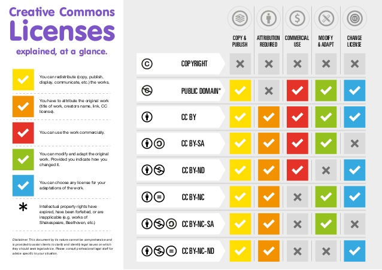

# Lizenzvertragsrecht

> 🎯 Sie kennen die typischen Formlierungen in Lizenzverträgen

> 🎯 Sie kennen die Vor- und Nachteile von Open Source Lizenzen

## Beschaffungsverträge

*Beschaffungsverträge* haben ein Ziel: Eigentumswechsel oder dauerhaftes Nutzungsrecht erlangen, beispielsweise durch: Kauf, Werkvertrag, Dienstleistungsvertrag (d.H. Service), Outsourcing oder eben ein Lizenzvertrag (hier: Nutzungsrecht oder *Miete*).

## Lizenzvertrag

* **Keine gesetzliche Regelung!** Sie werden lediglich erwähnt im Markenschutzgesetz (MSchG), Patentgesetz (PatG) und Designgesetz (DesG)
* Diese gesetzliche Lücke wird (sofern notwendig) üblicherweise durch eine Kombination aus Mietvertragsrecht, Auftragsrecht und Werksvertragsrecht gefüllt.
* Achtung: Es gilt hier immer auch der Allgemeine Teil des ORs wie Erfüllung, Verzung etc.
* Anwendungsbereiche: Software, Patente, Markenrechte, Urheberrechte, Nutzung von Plattformen, Vertriebsverträge, Kooperationsverträge
* Zentrale Lizenzbestimmung: Eine Lizenz definiert drei wichtige Parameter:
  * Ist die Lizenz zeitlich begrenzt oder unbegrenzt?
  * Ist die Lizenz übertragbar oder nicht?
  * Ist die Lizenz ausschliesslich oder nicht ausschliesslich (d.H. ein bestimmter Lizenznehmer hat die Lizenz für dieses Produkt / Software ausschliesslich)
  * Aus der Folie - die Software-Lizenz-Klausel: *"Der Lizenzgeber gewährt dem Lizenznehmer ein **zeitlich (un)begrenztes, (nicht) übertragbares, (nicht) ausschliessliches Recht**, den Lizenzgegenstand in der zum Zeitpunkt des Vertragsschlusses aktuellen Version zu nutzen.“*  

# Lizenzierung von Patenten, Marken oder Designs

Ein Lizenznehmer kann beispielsweise auch Patente für sich lizenzieren, um eine bestimmte patentierte Technologie anzuwenden etc. In diesem Fall hat der Lizenznehmer noch weitere Verpflichtungen. Beispielsweise muss er das Recht das Patent, Marke oder Design auch tatsächlich zu verwenden! Falls er dies nicht verwendet (und z.B. nur lizenziert sodass niemand anderes dies macht), droht ihm der Entzug dieses Rechts oder gar eine Konventionalstrafe.

Wenn Patente, Marken oder Designs lizenziert werden, so kann der Vertag auch ähnlich einem Agentur- oder Vertriebsvertages (**Franchising**) sein. In so einem Fall erhält der Lizenznehmer dann oftmals auch Unterstützung vom Lizenzgeber bei Werbung und Vermarktung.

Bei Franchising-Verträgen kommt es häufig zu *Knebelverträgen* - also verträge mit *übermässiger Bindung* (Verstoss gegen Art 27. II ZGB, eventuell auch gegen UWG).

Diese Lizenzrechte können auch im nationalen Patent-, Marken- oder Designregister registriert werden.

# Preis / Umsatzbeteiligung

> Bei Software-Vertriebs-(Lizenz-)Verträgen wird regelmässig eine Umsatz- oder
> Gewinnbeteiligung vereinbart. Das bedingt ein regelmässiges Reporting der  Zahlen durch den Lizenznehmer. Oft erhält der Lizenzgeber ein Einsichtsrecht in die Bücher des Lizenznehmers oder es wird eine neutrale Stelle mit der Feststellung der Zahlen beauftragt (Monitoring)! Aus Folie; (c) HSLU 2021

# Rechtsgewährleistung

> **Rechtsgewährleistung:**
> „Behaupten Dritte Ansprüche, die den Auftraggeber [Lizenznehmer / Endkunde] hindern, die ihm vertraglich eingeräumten Nutzungsbefugnisse wahrzunehmen, unterrichtet der Auftraggeber [Lizenznehmer]  den Auftragnehmer [Lizenzgeber]  unverzüglich schriftlich und umfassend. Er ermächtigt den Auftragnehmer  [Lizenzgeber] hiermit, Klagen gegen Dritte gerichtlich und
> außergerichtlich allein zu führen. Wird der Auftraggeber [Lizenznehmer] verklagt, stimmt er sich mit dem Auftragnehmer [Lizenzgeber] ab und nimmt Prozesshandlungen, insbesondere Anerkenntnisse und Vergleiche, nur mit dessen Zustimmung vor.“   Aus Folie; (c) HSLU

Vgl. Kaufrecht: Der Verkäufer muss mir garantieren, dass er das Recht besitzt mir dieses Produkt zu verkaufen. Angenommen jemand verkauft ein Produkt, dessen Vertriebsrecht (oder so) er nicht hat, kann er verklagt werden. Das kommt jedoch selten vor.

Häufiger kommt es bei Software vor. Der Lizenzgeber muss garantieren, dass er Eigentümmer **aller Bestandteilen** der Software ist und dass er berechtigt ist, mir das Nutzungsrecht an allen Bestandteilen dieser Software einzuräumen.

**An allen Bestandteilen** is wichtig, da die Software ja externe Libraries aus anderen Quellen beziehen / verwenden kann. Der Lizenzgeber ist da nicht der Eigentümer. Diese Bibliotheken haben oftmals eine Lizenz, d.H. sie werden lizenziert. Diese Lizenz muss präzise überprüft werden, ob diese überhaupt kommerziell verwendet werden darf.

Falls wir zum Beispiel eine Software für einen Kunden lizenzieren / verkaufen, und diese erhält Bibliotheken welche eine Lizenz haben, welche das verbietet. Nun wird der Kunde durch den ursprünglichen Lizenzgeber verklagt. Genau für solche Fälle gilt die Rechtsgewährleistung.

Die obige Klausel beschreibt genau diesen Fall. Im Falle, dass ein Dritter kommt und Ansprüche geltend macht, dann kann der Endkunde dies zum Lizenzgeber weitergeben (ist ja nicht sein Problem). Der Lizenznehmer ermächtigt den Lizenzgeber, dass dieser selbst die Klagen gegen den Dritten führen kann (der Endkunde will damit nichts zu tun haben).

# Lizenzvertrag beenden

Der Vertrag läuft immer weiter, bis eine Partei beschliesst den Vertrag aufzulösen (Kündigung) unter den geregelten Aspekten - es handelt sich um eine ordentliche Kündigung. Diese Kündigungsfristen können auch sehr lange sein.

Ein Lizenzvertrag kann ausserordentlich gekündigt werden in folgenden Fällen:

* clausula rebus sic stantibus (Gerichtspraxis): Grundlegende veränderte Verhältnisse bei lange dauernden Verträgen. 
* 

Note: Ausserordentliche Kündigungen können i.d.R nur gemacht werden, wenn die Fortführung des Vertrages unzumutbar wird (z.B. fristlose Kündigung).

# Beispiel Muster-Lizenzvertrag der SIK

* SLV = Einzelarbeitsplatz / Server Software
* CLV = SaaS / Cloud Services

Unterschiede SLV / CLV: CLV beinhaltet neben den Nutzungsrechten für die Software auch die Rechte für die Nutzung der **Plattform**.

# Open-Source Lizenzen

Open-Source Lizenzen gestatten (u.a.):

* Free Redistribution: Software kann frei weiterverbreitet und vervielfältigt werden
* Source Code: Der Quellcode ist frei zugänglich
* Derived Works: Software darf frei geändert und bearbeitet werden

Unterschiedliche Copylefts:

* Strenges Copyleft: Jegliches Resultat muss auch wieder frei sein (GNU GPL, SIK)
* Non-Copyleft: Keine Vorgaben für die Lizenzierung von abgeleiteter Software (Apache, MIT, BSD)
* Eingeschränkte Copyleft: LGPL

# Creative Commons

# Aufgabe

> Formulieren Sie für SW-Lizenzklausel mit folgenden Rahmenbedingungen:
>
> * Die Lizenznehmerin erhält das Nutzungsrecht dauernd
> * Das Nutzungsrecht ist auf die Verwendung im Unternehmen beschränkt
> * Die Lizenznehmerin hat die Zusicherung, dass die von ihr mitfinanzierte Software während 2 Jahren nicht durch die Konkurrenz benutzt wird

Recap: Lizenzklausel besteht aus drei Parameter: Exklusivität, zeitliche Begrenzung und Übertragbarkeit. Angewendet auf die Aufgabenstellung:

* Zeitliche Begrenzung: Nutzungsrecht ist *dauernd* (i.e., keine zeitliche Begrenzung)
* Übertragbarkeit: Das Nutzungsrecht ist auf die *Verwendung im Unternehmen beschränkt* - d.H. es ist nicht übertragbar
* Exklusivität: Die Software wird während zwei Jahren nicht durch die Konkurrenz benutzt (d.H. zeitlich limitierte Exklusivität)

Angewendet auf das SW-Lizenzklausel-Template:

*"Der Lizenzgeber gewährt dem Lizenznehmer ein **zeitlich unbegrenztes, nicht übertragbares, für während zwei Jahren ausschliessliches Recht**, den Lizenzgegenstand in der zum Zeitpunkt des Vertragsschlusses aktuellen Version zu nutzen.“*  

