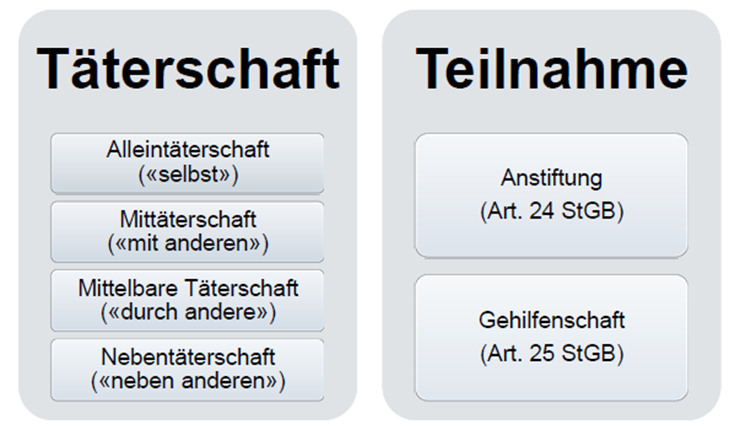

# Lernziele

> 🎯 Sie kennen die Voraussetzungen, damit es zu einer Verurteilung kommen kann

> 🎯 Sie kennen die verschiedenen Grundlagen für das Strafrecht (u.a. Tatbeteiligungen, Strafarten, Verjährungen)

> 🎯 Sie wissen, was es braucht, damit ein Straftatbestand erfüllt ist

> 🎯 Sie sind in der Lage, die wichtigsten Strafttbestände mit Bezug zu IT zu erklären

Bei IT ist da Territorialtiätsprinzip oftmals schwierig, da der Begehungsort (z.B. bei Hacking) nicht in der Schweiz liegt, der Erfolg / Schaden jedoch hier erfolgt.

Verbrechen

Vergehen

Übertrettung

Varia:

Zum Strafgesetz gehört auch die Strafprozessordnung; Analog zu Zivilrecht gehört die Zivilprozessordnung.

## Strafgesetzbuch (StGB)

Art 1. *nulla poena sine lege* - Keine Sanktion ohne Gesetz

> *Eine Strafe oder Massnahme darf nur wegen einer Tat verhängt werden, die das Gesetz ausdrücklich unter Strafe stellt.*

Art. 2: Zeitlicher Aspekt: Macht jemand etwas, welches zum Zeitpunkt der Tat nicht im Gesetz war, so kann er/sie nicht dafür belangt werden später

> Absatz 1: 1 Nach diesem Gesetze wird beurteilt, wer nach dessen Inkrafttreten ein Verbrechen oder Vergehen begeht.

> Absatz 2: Hat der Täter ein Verbrechen oder Vergehen vor Inkrafttreten dieses Gesetzes begangen, erfolgt die Beurteilung aber erst nachher, so ist dieses Gesetz anzuwenden, wenn es für ihn das mildere ist.

Art 3. ff. StGB: Territorialitätsprinzip (Verbrechen oder Vergehen im Inland)

Art 8. Räumlicher Bereich (Begehungsort)

> Absatz 1: Ein Verbrechen oder Vergehen gilt als da begangen, wo der Täter es ausführt oder pflichtwidrig untätig bleibt, und da, wo der Erfolg einge­treten ist.

> Absatz 2: Der Versuch gilt als da begangen, wo der Täter ihn ausführt, und da, wo nach seiner Vorstellung der Erfolg hätte eintreten sollen.

Art 9. Persönlicher Geltungsbereich (Militärstrafrech und Alter)

> Absatz 1: Dieses Gesetz ist nicht anwendbar auf Personen, soweit deren Taten nach dem Militärstrafrecht zu beurteilen sind.

> Absatz 2: Für Personen, welche zum Zeitpunkt der Tat das 18. Altersjahr noch nicht vollendet haben, bleiben die Vorschriften des Jugendstraf­gesetzes vom 20. Juni 2003[13](https://www.fedlex.admin.ch/eli/cc/54/757_781_799/de#fn-d156787e509) (JStG) vorbehalten. Sind gleichzeitig eine vor und eine nach der Vollendung des 18. Altersjahres begangene Tat zu beurteilen, so ist Artikel 3 Absatz 2 JStG anwendbar.[14](https://www.fedlex.admin.ch/eli/cc/54/757_781_799/de#fn-d156787e518)

## Verbrechen, Vergehen und Übertretung

[Art. 10](https://www.fedlex.admin.ch/eli/cc/54/757_781_799/de#art_10): 

* Absatz 1: Dieses Gesetz unterscheidet die Verbrechen von den Vergehen nach der Schwere der Strafen, mit der die Taten bedroht sind.
* Absatz 2: Verbrechen sind Taten, die mit Freiheitsstrafe von mehr als drei Jahren bedroht sind.
* Absatz 3: Vergehen sind Taten, die mit Freiheitsstrafe bis zu drei Jahren oder mit Geldstrafe bedroht sind.

[Art. 103:](https://www.fedlex.admin.ch/eli/cc/54/757_781_799/de#art_103)

* Übertretungen sind Taten, die mit Busse bedroht sind.

# Voraussetzungen für Strafbarkeit

Die Strafbarkeit bedingt drei Elemente:

* (Subjektiver- und objektiver-) Tatbestand muss erfüllt sein
* Rechtswidrigkeit (Tat muss gesetzlich verboten sein)
* Schuldhaftigkeit

Rechtswidrigkeit bei IT: Bei Pentests und Public Security Tests: Hacking ist nicht erlaubt, jedoch in diesem Kontext (Unternehmen ruft dazu auf / willigt ein) nicht rechtswidrig.

## Objektiver Tatbestand (Aussenseite der Handlung)

Objektiver Tatbestand (StGB 123 - Einfache Körperverletzung):

* Täter - z.B. Person X
* Tatobjekt - z.B. Person Y
* Tathandlung - z.B. Körperverletzung
* Taterfolg - z.B. Person Y hat eine Wunde
* Kausale Zurechnung - z.B. Person Y hat eine Wunde auf Grund der Tathandlung von Person X

Objektiver Tatbestand (StGB 139 - Diebstahl):

* Täter - Person X
* Tatobjekt - Portemonnaie (eine "fremde bewegliche Sache" gemäss Gesetz)
* Tathandlung - Portemonnaie entwenden
* Taterfolg - Person Y hat ihr Portemonnaie nicht mehr und Person X hat mehr geld
* Kausale Zurechnung - Indem Person X Person Y das Portemonnaie entwendet hat, hat Person X mehr Geld und Person Y einen Verlust

## Subjektiver Tatbestand = Innenseite der Handlung 

Der subjektive Tatbestand wird unterschieden in:

* **Vorsatz**: Tat mit Wissen und Willen getätigt
* **Eventualvorsatz:** Tat nicht direkt gewillt, aber in Kauf genommen
* **Fahrlässigkeit:** Tat nicht gewollt, war aber nicht genügend vorsichtig

Unterschied zwischen Eventualvorsatz und grober Fahrlässigkeit ist nicht immer einfach. Am Beispiel von Verkehrsdelikten: 

## Deliktskategorien

Täterverhalten: Handeln = Begehen; Nichtstun = Unterlassen

Begehungsdelikt:

* Verbot zu handeln
* Unterlassungsgebot (es soll unterlassen werden)

Unterlassungsdelikt:

* Verbot des Nichtstun (Nothilfe)
* Handlungsgebot (es soll gehandelt werden)

Was ist der Unterschied zwischen StGB 128 (*Unterlassung Nothilfe*) und 111 StGB (*Vorsätzliche Tötung*)?  111 ist mit Vorsatz, also die Tat *begeht* regelt 128 die Unterlassung von Nothilfe (Nichtstun obwohl zumutbar).

## (Mit-)Täterschaft und Teilnahme

**Mittäter**: Aktive Beteligung -> Mittäter hat eine eigene Tatherrschaft, sie kann selbst mitentscheiden ob etwas passiert / ob das Verbrechen durchgeführt wird

**Teilnahme**: Passiv dabei; Anstiftung (Anzetteln) oder Gehilfenschaften (z.B. Schmiere stehen)

**Mittelbarer Täter:** Beispiel mit den Personen, welche dachten sie spielten bei einer versteckten-Kamera-Show mit, haben jedoch eine Person vergiftet. Sie wurden somit (unbewusst) zu einem Tatwerkzeug = Mittelbare Täterschaft. Dabei ist es wichtig, dass bei der unmittelbaren Täterschaft die Person a) die Straftat gar nicht wollte und b) keinen Vorteil für sich daraus ziehen kann / will. Oftmals bei Erpressungen oder Bedrohungen.

## Gemeine Delikte / Sonderdelikte

Ein gemeines Delikt kann jede Person machen. Für Sonderdelikte benötigt es eine bestimmte Rolle / Position um es zu begehen: Zum Beispiel Amtsmissbrauch oder Ausnutzung einer höheren Position.

Echte Sonderdelikte (StGB 312) -> Amtsmissbrauch:

* Kann nur durch eine Person begangen werden, welche in einer Behörde arbeitet / ein Amt inne hat.

Unechte Sonderdelikte (StGB 138) -> Veruntreuung:

* Bedingt, dass einer Person etwas anvertraut wurde (sonst kann ja nichts veruntreut werden). Sie muss jedoch keine bestimmte Stellung oder Position inne haben (kann jede Person sein, welcher etwas anvertraut wurde).

# Antrags- und Offizialdelikte

# Strafarten

* Freiheitsstrafe: 3 Tage, maximal 20 Jahre; ev. lebenslänglich (Art. 40 StGB)
* Geldstrafe: maximal 360 Tagsätze; maximal CHF 3’000.-/Tag
* Gemeinnützige Arbeit: maximal 720 Stunden
* Busse maximal CHF 10’000.-
* Massnahmen

# Verjährung

# IT-Spezifischere Themen

## Computerdelikte

### Art. 143 StGB: Unbefugte Datenbeschaffung

* Freiheitsstrafe bis zu 5 Jahren oder Geldstrafe
* Bei Angehörgen / Familienangehörigen -> nur auf Antrag (-> Antragsdelikt)

### Art. 143bis StGB Unbefugtes Eindringen in ein Datenverarbeitungssystem (Hacking)

* Interessant: Nur geahntet auf Antrag 

### Art. 144 bis Ziff. 1 StGB - Datenbeschädigung

Beispiel: Daten einer anderen Person löschen, unbrauchbar machen oder verändern.

### Art. 144 bis Ziff. 2 StGB - Herstellen von datenbeschädigenden Programmen (Viren-Tatbstand)

Täter stellt ein Virenprogramm her, welches zur Datenschädigung geeignet ist.

### Art. 147 StGB - Betrügerischer Missbrauch einer Datenverarbeitungsanlage (Computerbetrug)

Beispiel: Kreditkarten (inkl. PIN) gestohlen und Verwendung

-> Kann auch ein Bankautomat sein etc.

Der Artikel wurde geschaffen, weil Art. 146 *Betrug* nur auf natürliche Personen Anwendung fand. Dieser Artikel schliesst Datenverarbeitungeun wie Bankautomaten oder Kreditkarten ein.

### Art. 148 StGB - Check- und Kreditkartenissbrauch

Beispiel: Trotz Zahlungsfähigkeit verwendet der Inhaber:in seine Check- und Kreditkarte.

### Besonderes an Computerdelikten

* Computertatbestände kamen erst im 1994 ins StGB
* Daten können nicht gestohlen werden im Sinne von Art. 139 StGB (keine fremde, bewegliche Gegenstände sind)

**Unterschied 143 (Datenbeschaffung)  und 143bis (Eindringen):** 143 hat die Absicht sich zu bereichern, sommit Offizialdelikt, bei 143bis ist die Absicht nicht dabei (nur der Zugriff) und daher ein Antragsdelikt. Der Absatz 2 ist dann wiederum ein Offizialdelikt, weil es das Zugänglich-machen unter Strafe stellt. 

-> Bereicherungsabsicht ist zentral beim 143

## Urkundenfälschungen (Art. 251-254 StGB)

- Urkunde fälschen durch z.B. Photoshop etc., Aktuelles Thema: Impfausweis; Angst davor, dass dieser Ausweis gefälscht werden kann. Oder: Marschbefehl als Word-Dokument, somit kann man die Daten fälschen und ausdrucken (= Free GA). Das sind Beispiele für Urkundenfälschungen im Bezug auf IT.

Urkundenfälschung liegt vor wenn:

* Absicht Urkunden oder Ausweise zu fälschen (Inhalt oder Unterschrift)
* Wissentlich falsche Urkunden verwenden, oder Beamte dazu bringen, falsche Urkunden auszustellen
* Urkunden unterdrücken (verstecken, vernichtem beschädigen; Bei Familienangehörigen nur auf Antrag)
* Muss ein Vorteil einer Person oder ein Nachteil einer anderen Person verursachen
* Freiheitsstrafen von 3-5 Jahren oder Geldstrafe

## Computerdelikte im weiteren Sinne 

-> Internet-Mobbing, KiPo, Gewaltsdarstellungen, etc.

Art. 135 StGBs 

* Verbreitung Gewalttaten gegen Menschen / Tiere ohne schutzwürdigen kulturellen oder wissenschaftlichen Wert
* bis zu drei Jahre für Verbreitung, bis zu 1 Jahr für Erwerb

Art. 197 StGB:

* Verbreitung porno. Inhalte an unter 16 Jährige (Freiheitsstafe bis zu 3 Jahre)
* Unaufgefordertes Anbieten von porn. Inhalten -> Busse, mit Ausnahme wenn auf diesen porn. Charakter vorher hingewiesen wird
* Anwerben von Minderjährigen bei Mitwirkung von porn. Inhalten (Freiheitsstrafe bis 3 Jahre oder Geldstrafe)
* Besitz von sexuellen Handlungen mit Tieren oder Gewalttätigkeiten unter Erwachsenen: Freiheitsstrafe bis 3 Jahre oder Geldstrafe; bei Minderjährigen bis zu 5 Jahren.

Art. 261 StGB:

* Störung der Glaubens- und Kulturfreiheit: Muss eine Böswilligkeit vorliegen -> Geldstraffe

Art. 173 StGB:

* Ehrverletzung: Geldstrafe, nicht strafbar wenn die Ehrverletzung wahr ist
* Beispiel: Andreas Glarner klagt oft wegen Ehrverletzung (wegen Social Media), beispielsweise "Infantiler Dummschwätzer"

## Persönlichkeitsverletzungen

Art. 179 ff. Strafbare Handlungen gegen den Geheim- oder Privatbereich:

* Unbefugtes Abhören oder Aufnehmen
* Unbefugtes Beschaffen von Personendaten
* Inverkehrbringen und Anpreisen von Abhör-, Ton- und Bildaufnahmegeräte

Speziell aufgefallen:

* Es ist möglich, diese straffrei einzusetzen wenn die Genehmigung eines Richter:ins eingeholt wird (z.b. Polizei, Art. 179bis ff.)
* Drohnen/Dashcam etc: Ich darf nicht einfach jemanden aufnehmen (=> Persönlichkeitsverletzung einer Person, Verletzung der Privatssphäre).

Beispiel: Wenn ich ein (E-Mail)Passwort in einer Schublade finde, darf ich dann die E-Mails anschauen? Nein, weil Art. 179 (Verletzung des Schriftgeheimnisses, Antragsdelikt) Das würde auch gelten, wenn das Passwort 12345 ist (=> nicht besonders geschützt).

# Cybercrime

* Straftaten welche mit ICT-Technologien ausgeübt werden
* Übereinkommen des Europarats zu Cyberkriminalität hat diverse Themen:
  * Computerbetrug, Datendiebstahl etc
  * Dokumente mit Hilfe eines Computers fälschen
  * Hacking
  * KiPo im Netz
  * Verletzung Immaterialgüterrecht

# Strafprozessordnung (StPO)- Art. 3 Achtung der Menschenwürde

> Die Strafbehörden achten in allen Verfahrensstadien die Würde der vom Verfahren betroffenen Menschen.

[Art. 3](https://www.fedlex.admin.ch/eli/cc/2010/267/de#art_3).

-> Bemühungen gegen Geheimjustiz

-> Art. 140 Verbotene Beweismethoden

-> Art. 141: Wurden Beweise nicht rechtmässig erhoben sind sie nichtig

## Die geheime Überwachung wird in der STPO geregelt (Art. 269):  

> Die Staatsanwaltschaft kann den Post- und den Fernmeldeverkehr überwachen lassen, wenn:
>
> * der dringende Verdacht besteht, eine in Absatz 2 genannte Straftat sei begangen worden;
> * die Schwere der Straftat die Überwachung rechtfertigt; und
> * die bisherigen Untersuchungshandlungen erfolglos geblieben sind oder die Ermittlungen sonst aussichtslos wären oder unverhältnismässig erschwert würden  

# Übungen

Wichtig: In der Prüfungen wurde oftmals etwas überlesen -> deshalb diese Übungen.

## 1

> Um was geht es in den Strafnormen von Art. 258 ff. StGB?

Gemäss StGB: *Wer die Bevölkerung durch Androhen oder Vorspiegeln einer Gefahr für Leib, Leben oder Eigentum in Schrecken versetzt, wird mit Frei­heitsstrafe bis zu drei Jahren oder Geldstrafe bestraft.* -> Vergehen

>  Was unterscheidet Art. 260ter StGB von Art. 260quinquies StGB?

Landfriedensbruch (z.B. unbewilligte Demo mit Ausschreitung) vs. Finanzierung des Terrorismus 

> Beschreiben Sie ein mögliches Ereignis, das unter den Straftatbestand von Art. 262 StGB fallen würde. Beachten Sie dabei Tatbestand, Rechtswidrigkeit und Schuldhaftigkeit)

Art. 262 ist die Störung des Totenfriedens:

1. *Wer die Ruhestätte eines Toten in roher Weise verunehrt, wer einen Leichenzug oder eine Leichenfeier böswillig stört oder ver­unehrt, wer einen Leichnam verunehrt oder öffentlich beschimpft, wird mit Frei­heitsstrafe bis zu drei Jahren oder Geldstrafe bestraft.*
2. *Wer einen Leichnam oder Teile eines Leichnams oder die Asche eines Toten wider den Willen des Berechtigten wegnimmt, wird mit Frei­heitsstrafe bis zu drei Jahren oder Geldstrafe bestraft.*

Beispiel: Person X stiehlt die Urne einer Person Y (die Urne enthält die Asche eines verstorbenen Angehörigens)

Tatbestand: Person X stiehlt die Urne von Person Y

Rechtswidrigkeit: Asche eines Toten wider Willen des Berechtigen weggenommen

Schuldhaftigkeit: Täter hat die Urne bewusst und böswillig entwendet

## 2 

> Was sind die Unterschiede zwischen einem Antrags- und Offizialdelikt? Bitte je zwei Beispiele eines Antrags- und Offizialdeliktes.

 ## 3

> Beschreiben Sie eine Tat, die danach unter folgenden Strafartikel fällt: Art. 144bis

> Beachten Sie: Der Täter wird zu einer Freiheitsstrafe von 4 Jahren verurteilt.

> Der Täter kann sich ins Ausland absetzen, bevor er der Strafe antreten muss. Wie sieht es mit der Verjährung aus (bitte auch den Artikel angeben)

 
