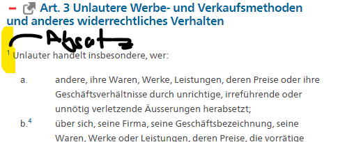

## Unlauterer Wettbewerb

### Lernziele

🎯 Sie wissen, was unlauterer Wettbewer ist

🎯Sie wissen, welche Rechtsmittel bestehen und wie Sie diese anwenden müssten

🎯 Sie können argumentieren, und beurteilen, ob etwas unlauter ist.

### Grundsatz

> Unlauter und widerrechtlich ist jedes täuschende oder in anderer Weise gegen den Grundsatz von Treu und Glauben verstossende Verhalten oder Geschäftsgebaren, welches das Verhältnis zwischen Mitbewerbern oder zwischen Anbietern und Abnehmern beeinflusst.

Dabei ist das Territorialitäts- respektive Auswirkungsprinzip zu beachten: Es können nur Handlungen in der Schweiz beinflusst werden. Was im Ausland passiert wird nicht betrachtet. Es betrifft alle Akteure welche im wirtschaftlichen Wettbewerb stehen, z.B. zwei konkurriende Firmen oder Produzent und Konsument (Werbung, etc.).

### Beispiele in den Folien

**Kaffeefahrt (Werbefahrt)**

https://www.srf.ch/news/schweiz/langes-verfahren-prozess-gegen-mutmasslichen-kaffeefahrten-drahtzieher

**Otto's Fall**

* Art 26a [**Art. 26***a*](https://www.fedlex.admin.ch/eli/cc/1988/223_223_223/de#art_26_a)[53](https://www.fedlex.admin.ch/eli/cc/1988/223_223_223/de#fn-d42241e1365)[ Widerruf und Sperrung von Domain-Namen und Telefonnummern](https://www.fedlex.admin.ch/eli/cc/1988/223_223_223/de#art_26_a)

* Problem war die Verwechslungsgefahr
* Eintragung des Namens ist keine Garantie -> man muss den Namen auch verwenden!

**Influencer / Schleichwerbung**

*Schweizerische* Lauterkeitskommission -> Grundsätze

UWG: Art 3 Ziffer 1 Lit o

Sie wurden im Sinne des Grundsatzes Nr. B.15 Abs. 1 und 2 der SLK beurteilt.

**Migros/Coop Farmer**

**Bottom-Line:** Täuschung der Kunden; Irreführung; Beinflussungen von Konsument*innen. 

### Varia

$^1$ ist ein Absatz, $a$ sagt man "Litera a" oder einfach "Lit a".

### Ressourcen

* [UWG](https://www.fedlex.admin.ch/eli/cc/1988/223_223_223/de)
* Übungsdokument

