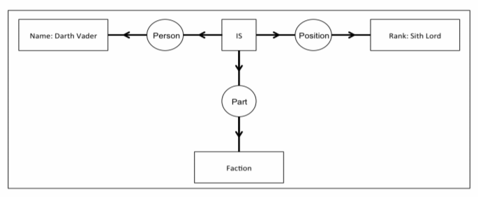
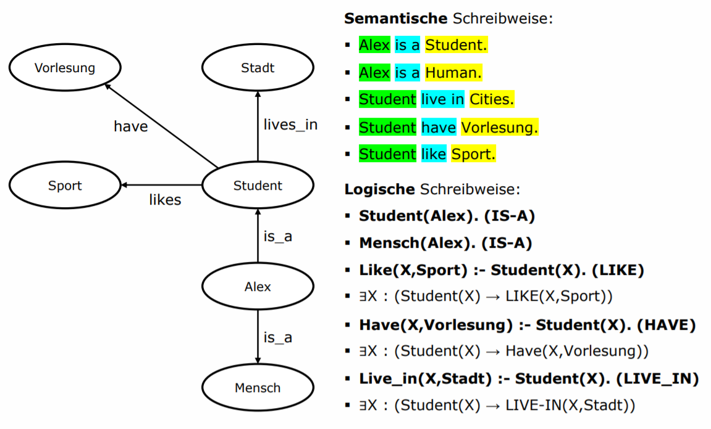
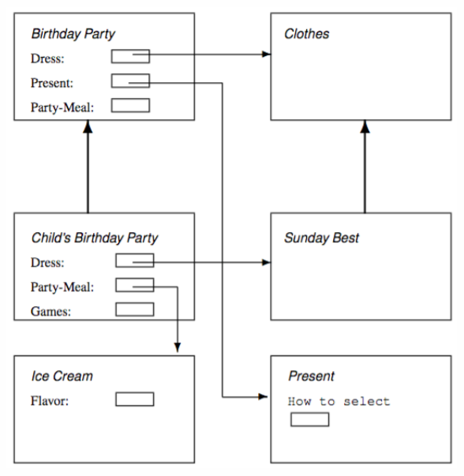
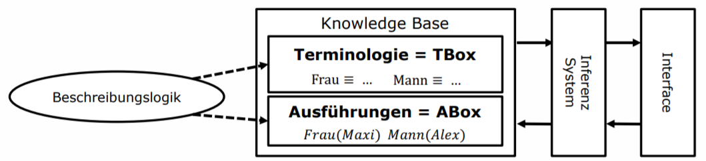
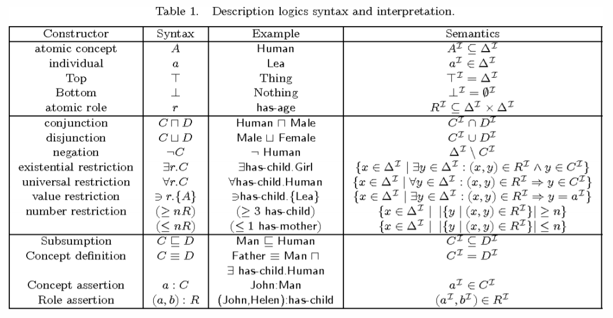

# Knowledge Representation Formalisms (SW02)

## Wissensrepräsentation

🎯 **Lernziel**: Zweck sowie Einsatzmöglichkeiten von Knowledge Representation Formalisms sind ihnen geläufig.

Die Repräsentation von Wissen ist ein essentieller Bestandteil des AI-Teilbereichs **Symbolic Artificial Intelligence**.
Das Ziel ist, unsere menschliche Auffassung der Welt auf eine für Maschinen verständliche Art abzubilden.
Dabei dienen Symbole als Werkzeug zur Formulierung von Sachverhalten.
Es wird zwischen **Knowledge Representation Formalisms** und **Semantic Web Languages** unterschieden.

Die resultierenden logischen Formulierungen dienen als Enstcheidungsgrundlage für _rule-based systems_, zu denen die _expert systems_ zählen.

## Inferenzsysteme

🎯 **Lernziel**: Sie kennen mögliche Architekturen zum Bau eines Inferenzsystems.

## Modellierungsansätze

🎯 **Lernziel**: Die Modellierungsansätze von _Conceptual Graphs_, _Semantic Networks_, _Frame Systems_ sowie _Description Logic_ sind ihnen bekannt und können angewandt werden.

### Existential Graphs

Existential Graphs gelten als Grundlage für zahlreiche Knowledge Representation Formalisms, u.a. auch _Conceptual Graphs_ und _Semantic Networks_.
Sachverhalte werden mit logischen Aussagen oder einer graphischen Schreibweise formuliert.

**Ziel: Graphen-basierte (Netzwerk) Wissensmodellierung**

### Conceptual Graphs

Die _Conceptual Graphs_ gelten als Ursprung der graphenbasierten Wissensrepräsentation.
Rechteckige _Konzeptknoten_ symbolisieren Entitäten.
Die Beziehungen werden mit elliptischen _Beziehungsknoten_ auf den Kanten zwischen Konzeptknoten versehen.
So können Beziehungen mit einem Label versehen werden, das eine Aussage der natürlichen Sprache trägt.

Die Repräsentation kann dabei graphisch oder mit logischen Ausagen formuliert werden.
Das Problem bei _Conceptual Graphs_ ist, dass unscharfe Ausssagen nicht oder nur schlecht modellierbar sind.

### Semantic Networks

Zur Erstellung von _Semantic Networks_ werden gerichtete Graphen zur Verknüpfung von Konzepten genutzt.
Ziel ist es, den semantischen Kontext abzubilden und auf diese Weise eine Art kognitives Netzwerk zu kreieren.
Dabei ist die Linguistik ein zentrales Element.

Ein semantisches Netzwerk kann als Graph dargestellt werden, wobei die Entitäten durch Knoten repräsentiert werden.
Die Beziehungen werden durch gerichtete Kanten symbolisiert, die ein Label aus einem definierten Set an Bezeichnungen trägt.

> Hier bezeichnen die Wörter `Entität`, `Objekt` und `Konzept` allesamt den Knoten des Graphen.

In Weiterentwicklungen des Konzepts wurde das Vokabular der Bezeichnungen weiter ausgebaut.
Folgende Bezeichnungen gibt es:

- **Synonym**: Konzept A und B drücken dasselbe aus (`Car` und `Automobile`)
- **Antonym**: Konzept A und B sind Gegensätze (`white` und `black`)
- **Hyponym / Hypernym**: IS-A / TYPE-OF (`Alex is a human.`)
- **Meronym**: IS-PART-OF (`A wheel is a part of a car.`)

Durch die Verwendung dieser Beziehungs-Bezeichner lässt sich Wissen über hierarchische Abhängigkeiten gut modellieren.

Aussagen mit **nicht binären Beziehungen** können formuliert werden, indem die Beziehung selber zu einem Knoten transformiert wird.
Dieser Vorgang wird **Reification** genannt.

### Frame Systems

Während in _Semantic Networks_ ein Konzept genau einen einzigen Dateneintrag darstellt, kann ein Konzept eines _Frame Systems_ gleich mehrere Dateneinträge enthalten.
Aufgrund des starken Fokus auf die zugrundeliegende Logik werden die _Frame Systems_ auch als Vorfahren der Beschreibungslogik angesehen.

Die Bestandteile eines _Frame Systems_ sind:

- **Frames**: Ähnlichkeit zu einem Konzept, fasst Slots zusammen
- **Slots**: Referenzieren andere Konzepte
    - Slot Name: Bezeichnung
    - Slot Value: Dateneintrag (Facets)
- **Hierarchische Strukturierung** der Frames (_super class_ und _sub class_)
- **Slots** haben **Beziehungen** zu anderen **Frames** oder **Slot Value**.

### Description Logic

Mit _Semantic Networks_ und _Conceptual Graphs_ lassen sich Sachverhalte leicht abbilden.
Das Verständnis über deren Aussage ist jedoch stark vom Betrachter abhängig. 
Hier kommt die Beschreibungslogik ins Spiel. 
Anstelle eines Graphen-basierten Ansatzes setzt die Beschreibungslogik auf die Prädikatenlogik erster Stufe.

Die Beschreibungslogik besteht aus:

- **Konzepte**: Einzelne Klassen / Kategorien
- **Rollen**: Binäre Fakten über eine Klasse (Ausführungen)
- **TBox**: Formulierung des generellen Sachverhaltes zwischen Konzepten
- **ABox**: Formulierung zum Konzept der einzelnen Konzepte

#### Logiksymbole

#### TBox

Die _TBox_ definiert den generellen Sachverhalt: Die relevanten Konzepte werden identifiziert.
Die Abhängigkeiten zwischen Konzepten werden definiert. Die Eigenschaften der Konzepte werden definiert.

**Beispiele:**

- Woman $\equiv$ Person $\sqcap$ Female
- Parent $\equiv$ Mother $\sqcup$ Father
- HSLUStudent $\equiv$ Person $\sqcap$ existsisStudentof.HSLU
- Father $\equiv$ Man $\sqcap \neg($ Person $\sqcap$ Female $)$
- Wife $\equiv$ Woman $\sqcap \exists$ hasHusband.Man

#### ABox

Die _ABox_ definiert den kontextspezifischen Sachverhalt von _TBox_.
Dabei werden relevanten Objekte und Individuen identifiziert und der Kontext definiert.

**Beispiele:** 

- Female(Maxi)
- isMarried(Alex,Maxi)
- $(Person \sqcap \neg Student)(Alex)$
- $(>3 Vorlesungen. (Person \sqcap \existsisStudentof.HSLU)) (\boldsymbol{M} \boldsymbol{a} \boldsymbol{x} \boldsymbol{i})$

#### Reasoning

Anhand von _TBox_ und _ABox_ können Aussagen formuliert werden.

##### Beispiel 1

$$
TBox =\mathcal{T}= Female드Person
$$

$$
ABox =\mathcal{A}= Female(Maxi)
$$

$$
IF Knowledge Base \mathcal{K}=(\mathcal{T}, \mathcal{A}) then \mathcal{K} \vdash Person(Maxi)
$$

##### Beispiel 2

$$
TBox =\mathcal{T}=\exists unterrichtet.Vorlesung 드 Professor
$$

$$
ABox =\mathcal{A}= unterrichtet(Alex, \mathrm{KBDSS}), Vorlesung (\mathrm{KBDSS})
$$

$$
IF Knowledge Base \mathcal{K} = (\mathcal{T}, \mathcal{A}) then \mathcal{K} \vdash Professor(Alex)
$$