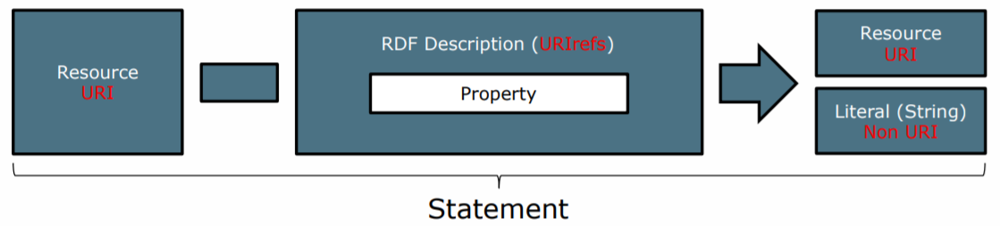

# Semantic Web Languages & Wissensgraphen (SW03)

_Knowledge Representation Formalisms_ (siehe SW02) dienen primär der Repräsentation von Wissen für **kleine, abgeschlossene Anwendungsfälle**. Die Gründe liegen in der **mangelhaften Skalierbarkeit** im Einsatz sowie im **fehlenden Standardvokabular**.

Hier kommen die _Semantic Web Languages_ ins Spiel. Sie beschäftigen sich mit der **Wissensrepräsentation in offenen und primär grossen Systemen**, wie z.B. dem Internet.
Dabei wird das Ziel verfolgt, das Web für Maschinen interpretierbar zu machen.
Um die Probleme der _Knowledge Representation Formalisms_ zu umgehen wurden Repräsentationsstandards sowie ein Standardvokabular eingeführt.
Diese Standards werden von der [W3C](https://w3.org) verwaltet und umfassen:

- RDF (Resource Description Framework)
- RDFS (RDF Schema)
- OWL (Web Ontology Language)

## RDF (Resource Description Framework)

🎯 **Lernziel**: Sie kennen die Einsatzmöglichkeiten von RDF, RDFS und OWL, sowie deren Unterschiede.

Das _RDF_ wurde 1999 durch das W3C eingeführt, um Webinhalte systematisch zu modellieren.
Als Webinhalte zählen _Webseiten_, _Dokumente_, _Bilder_ und weitere Quellen.

_RDF_ setzt sich aus den folgenden Komponenten zusammen:

- **Resource**: Eine Ressource ist eine relevante Entität, die per URI (_uniform resource identifier_) in das zu modellierende System aufgenommen wird. Eine URI bezeichnet ein identifizierbares Merkmal, nicht zwingend eine URL.
- **Description**: Hiermit wird die Beziehung zwischen Ressourcen charakterisiert. Dazu wird entweder ein _Property Type_ oder _Value_ verwendet. Die Verknüpfung wird mit _URIrefs_ hergestellt.
- **Framework**: Als _Framework_ bezeichnet man das standardisierte Vokabular zur Modellierung des Sachverhalts.

> Das Dataset [linked open vocabularies](https://lov.linkeddata.es/dataset/lov) kann nach standardisierten Beziehungs-Bezeichnern durchsucht werden.



### Modellierung mit Graphen

Als Werkzeug zur Modellierung des Sachverhalts dienen bei _RDF_ Graphen.
Diese Graphen bestehen aus _Triples_:

1. **Subjekt**: Dies ist die Entität, die charakterisiert werden soll (Knoten).
2. **Objekt**: Das Objekt ist ein Wert (z.B. eine Webseite, ein Name, eine E-Mail-Adresse etc.) (Knoten)
3. **Prädikat**: Das _Prädikat_ bezeichnet die Beziehungsart zwischen _Subjekt_ und _Objekt_.

**Beispiel**:


Gehören verschiedene Sachverhalte zusammen, haben aber keine Entität, so werden _blank nodes_ eingesetzt.


### Web Of Data

Ein Subjekt ist immer identifizierbar per URI.
Verschiedene _Triples_ bzw. _RDF-Graphen_ desselben Subjekts können so gesammelt und kombiniert werden.
Inhalte können so miteinander verknüpft werden.
Dem entstehenden Netz sagt man _Web of Data_.
Dieses _Web of Data_ ermöglicht Maschinen die Extraktion des Kontexts aus der Unmenge an Daten aus verschiedensten Quellen des Internets.
Das zentrale Bindeglied dabei ist die standardisierte Repräsentationssprache.

## RDFS (RDF Schema)

🎯 **Lernziel**: Sie kennen die Einsatzmöglichkeiten von RDF, RDFS und OWL, sowie deren Unterschiede.

Bei _RDF_ ist nach wie vor ein grosser Interpretationsspielraum für die verschiedenen Bezeichner der Entitätsbeziehungen vorhanden.
Die W3C adressierte dieses Problem im Jahre 2000 durch die semantische Erweiterung des RDF-Datenmodells mit einem Schema.
Das _Schema_ dient der taxonomischen Strukturierung von _Resources_ und kann die kontextuellen Abhängigkeiten unter Ressourcen genauer spezifizieren.

Beispiele dafür sind _class_, _property_, _type_, _subClassOf_, _subPropertyOf_, _range_, _domain_.

_RDFS_ wird auch als _Lightweight Ontology Language_ bezeichnet.

> Der Zusammenhang von RDF und RDFS ist vergleichbar mit jenem von _Semantic Networks_ und _TBox, ABox_ aus der vorhergehenden Semesterwoche.

### Komponenten

Das RDF Schema legt die Komponenten _Resource_, _Class_ und _Property_ fest.
Alle Ressourcen sind implizit Instanzen von `rdfs:Resource`.

#### Klassen

Eine Klasse beschreibt ein Set von Ressourcen. Eine Klasse selber ist wiederum eine Ressource und ist implizit Teil von `rdfs:Class`.
Hierarchische Verbindungen werden durch `rdfs:subClassOf` ermöglicht.

| Attribut        | Beschreibung                    |
| --------------- | ------------------------------- |
| `rdfs:Resource` | Klasse aller Ressourcen         |
| `rdfs:Class`    | Klasse aller Klassen            |
| `rdfs:Literal`  | Klasse aller Literals (strings) |
| `rdfs:Property` | Klasse aller Properties         |
| `rdfs:Datatype` | Klasse aller Datentypen         |

#### Properties

Die Properties bilden ein Subset der RDFS Ressourcen mit den folgenden Eigenschaften:

- **Domain**: Dies ist eine Klasse des Typs `rdfs:domain` mit einer Property (Eigenschaft)
- **Range**: Dies ist ein Wert, der mit der Klasse assoziiert wird. Dafür wird `rdfs:range` verwendet.

| Attribut             | Beschreibung                                                                                   |
| -------------------- | ---------------------------------------------------------------------------------------------- |
| `rdfs:subClassOf`    | Legt die Klassenhierarchie fest, verbindet Sub- mit Superklassen, ist per Definition transitiv |
| `rdfs:subPropertyOf` | Verbindet Sub- mit Superproperties, ist per Definition transitiv                               |
| `rdfs:domain`        | Legt die Klasse des Subjekts im Triple fest                                                    |
| `rdfs:range`         | Legt die Klasse oder den Datentyp des Objekts eines Triples fest                               |
| `rdfs:comment`       | Stellt typischerweise eine längere textuelle Beschreibung einer Ressource dar                  |
| `rdfs:label`         | Assoziiert die Ressource mit einem _human-readable_ Namen                                      |
| `rdfs:isDefinedBy`   | Referenziert auf die Definition einer Ressource, typischerweise ein RDF Schema                 |
| `rdfs:seeAlso`       | Verlinkt eine Ressource mit einer weiterführenden, erklärenden Ressource                       |

### Beispiel

Das untenstehende Beispiel soll den vorhergehend beschriebenen Sachverhalt veranschaulichen.


### Schwachstellen

Während _RDFS_ einige Probleme löst, mit denen sich _basic RDF_ konfrontiert sah, so weist es doch einige Schwachstellen auf.

- **Eindeutigkeit**: Das Vokabular ist zu schwach für die zweifelsfreie Modellierung von Sachverhalten.
- **Quantifizierbarkeit**: Quantifizierbare Bedingugnen können nicht modelleirt werden (z.B. maximale Stückzahl ist 2).
- **Automatisierbares Reasoning**: Eine automatisierte Entscheidungsfindung ist nur bedingt möglich, denn gewisse Elemente der Formulierung können frei beschrieben werden.

_RDFS_ ist also auch nicht aller Probleme Lösung.

## OWL (Web Ontology Language)

🎯 **Lernziel**: Sie kennen die Einsatzmöglichkeiten von RDF, RDFS und OWL, sowie deren Unterschiede.

Aufgrund der bei _RDFS_ erklärten Schwachstellen wurde ein weiterer aufbauender Standard entwickelt: Die Web Ontology Language (kurz: OWL).

> Der aufmerksame Leser mag sich an dieser Stelle fragen, ob dem Autor ein Schreibfehler unterloffen ist (womit die Spannung womöglich um einiges angestiegen ist).
> Tatsächlich ist dies nicht der Fall! Die Ursache des Nicht-Akronyms kann [im deutschen Wikipedia-Artikel](https://de.wikipedia.org/wiki/Web_Ontology_Language#Abk%C3%BCrzung) nachgelesen werden.

Von den durch RDFS offengelassenen Schwachstellen soll mit _OWL_ vor allem das **automatische Reasoning** ermöglicht werden.
Dazu wurden drei verschiedene Versionen von OWL eingeführt:

1. **OWL Full**: Diese Version nutzt die OWL-Syntax sowie RDF.
2. **OWL DL**: Bei dieser Version wird _Description Logic_ (vgl. SW02, mit _ABox_, _TBox_ etc.) verwendet.
3. **OWL Lite**: Hierbei handelt es sich um eine vereinfachte Version vom oben beschriebenen _OWL DL_.

Der Einsatz von Description Logic bringt einige Vorteile mit sich: Die Semantik ist klarer definiert.
Es existieren bereits _Reasoning Algorithmen_, die auf Description Logic aufbauen.
Im Bereich der Description Logic wurden bereits viel Forschung betrieben und Erfahrungen im Einsatz gesammelt.

Dies eliminiert die im Kapitel _RDFS_ beschriebenen Schwachstellen.

### Operatoren

In OWL gibt es integrierte Operatoren, über welche die untenstehende Tabelle Aufschluss geben soll.
Die Operatoren werden in XML (bzw. HTML) als _nodes_ dargestellt.

| Operator              | Beschreibung                                                                                                                                                                          |
| --------------------- | ------------------------------------------------------------------------------------------------------------------------------------------------------------------------------------- |
| `owl:unionOf`         | Die Klasse enthält Elemente, die aus mehr als einer anderen Klasse stammen ([Mengenlehre](<https://en.wikipedia.org/wiki/Union_(set_theory)>).                                        |
| `owl:disjointWith`    | Zwei Klassen gehören _disjunkten_ Mengen an bzw. gehören nicht zusammen (z.B. verschiedene Geschlechter, [Mengenlehre]https://en.wikipedia.org/wiki/Disjoint_sets))                   |
| `owl:intersectionOf`  | Die Elemente gehören auch zu einere anderen Klasse ([Mengenlehre]https://en.wikipedia.org/wiki/Intersection_(set_theory))).                                                           |
| `owl:equivalentClass` | Dieser Operator beschreibt Synonyme.                                                                                                                                                  |
| `owl:complementOf`    | Die Klasse enthält Elemente, die nicht Teil einer anderen Klasse sind (z.B. Kinder gehören nicht zu Senioren, [Mengenlehre](<https://en.wikipedia.org/wiki/Complement_(set_theory)>)) |

#### Beispiel

So kann beispielsweise eine Wohnung mithilfe des Operators `owl:unionOf` wie folgt beschrieben werden:

```xml
<owl:Class rdf:ID="Wohnung">
    <rdfs:subClassOf>
        <owl:Class rdf:about="#Bestandteile"/>
    </rdfs:subClassOf>
        <owl:equivalentClass>
        <owl:Class>
            <owl:unionOf rdf:parseType="Zusammensetzung">
            <owl:Class rdf:about="#Schlafzimmer"/>
            <owl:Class rdf:about="#Küche"/>
            <owl:Class rdf:about="#Bad"/>
            <owl:Class rdf:about="#Wohnbereich"/>
            </owl:unionOf>
        </owl:Class>
    </owl:equivalentClass>
</owl:Class>
```

### Attribute

Mithilfe von XML-/HTML-Attributen können noch präzisere Aussagen formuliert werden.

|       Attribut       |                     Beschreibung                      |
| -------------------- | ----------------------------------------------------- |
| `owl:hasValue`       | Definiert die Auswahl an spezifischen Werten (Values) |
| `owl:someValuesFrom` | Mind. 1 Wert stammt von einer Klasse                  |
| `owl:allValuesFrom`  | Alle Werte die einer Klasse angehören.                |
| `owl:minCardinality` | Mindestwert                                           |
| `owl:maxCardinality` | Höchstwert                                            |
| `owl:Cardinality`    | Genauer Zahlenwert                                    |

#### Beispiel

Somit kann nun quantifiziert werden. 
Eine Wohnung kann somit mit genau einem Badezimmer gekennzeichnet werden.

```xml
<owl:Class rdf:ID="Wohnung">
    <rdfs:subClassOf rdf:resource="#Bad" />
        <owl:subClassOf>
            <owl:Restriction owl:cardinality="1">
            </owl:Restriction>
        </owl:subClassOf>
    </rdfs:subClassOf>
</owl:class>
```

## Wissensgraphen (knowledge graphs)

🎯 **Lernziel**: Die Einsatzmöglichkeiten und Vorteile von Knowledge Graphs sind ihnen geläufig.

Die semantsiche Modellierung des Internets war wohl etwas schwierig mit den bisher vorgstellten Methoden zur Wissensrepräsentation.
Deswegen führte Google 2012 die _knowledge graphs_ ein.

> A knowledge graph is a special kind of database which stores knowledge in a machine-readable form and provides a means for information to be collected, organised, shared, searched and utilised. ([DBpedia](https://wiki.dbpedia.org/about))

Suchabfragen können damit auch kontextbezogene Fragestellungen beantworten, ohne auf das Matching von Suchanfragetext und Dokumentinhalt reduziert zu sein (PageRank).
Der bestehende Knowledge Graph enthält eine Fülle unterschiedlicher Daten (z.B. Personen, Definitionen, Orte).
Diese Daten stammen aus zahlreichen Quellen. Die wichtigsten davon sind Online-Enzyklopädien wie [Wikipedia](https://wikipedia.org).

Quellen wie Wikipedia bieten folgende Vorteile. Die Konzepte sind manuell definiert.
Die Zusammenhänge sind definiert. Es besteht eine Repräsentationssprache.
Es ist eine grosse Menge an breit gestreutem Wissen gesammelt, die kontinuierlich aktualisiert wird.
Und natürlich die Kosten - diese Daten sind verfügbar.
 
 ### DBpedia

 Das _crowd-sourced_ Projekt [DBpedia](https://wiki.dbpedia.org/about) hat es sich zur Aufgabe gemacht, strukturierten Inhalt aus verschiedenen Wikimedia-Projekten zu extrahieren.
 Diese strukturierte Informationssammlung ähnelt einem _open knowledge graph (OGK)_, der für jeden im Web verfügbar ist.

 ### Anwendungsbereiche

- **Semantische Suchmaschinen**
- **Social Media (Social Graph)**: Benutzerempfehlungen, Produkt Empfehlungen, etc.
- **Telekommunikation (Network Graph)**: Netzwerk Abhängigkeiten, Auslastungsgrade, etc.
- **Online Bezahldienste (Payment Graph)**: Betrugsprävention, Risikoevaluation, etc.
- **Banken (Portfolio Graph)**: Budgetplanung, Trading, Compliance, etc.
- **Medizin (Health Graph)**: Medikament Entwicklung, Genetik, Arztempfehlung, etc.
- **Terrorismus und Verbrechensbekämpfung**

#### Semantische Suchmaschinen

 In semantischen Suchmaschinen werden Wissensgraphen verwendet. Das wohl prominenteste Beispiel hierfür ist Google Hummingbird.
 Bei der semantischen Suche werden die in der Suchanfrage verwendeten Wörter miteinander in Verbindung gebracht, um die Bedeutung der Anfrage in den Mittelpunkt zu stellen.
 Anders als bei _keyword-based_ Suchalgorithmen kann so die Bedeutung der einer Frage ermittelt werden, ohne zwingend bestimmte Wörter enthalten zu müssen.

 