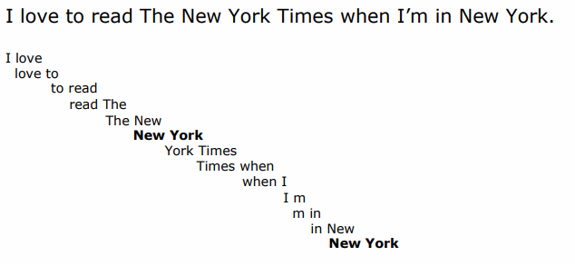
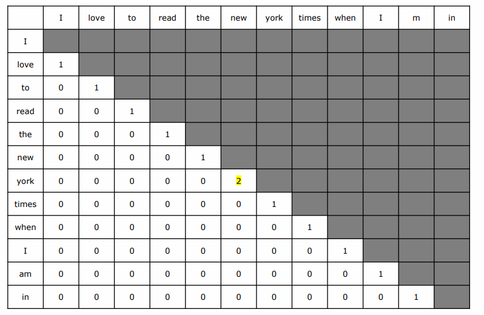
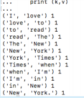
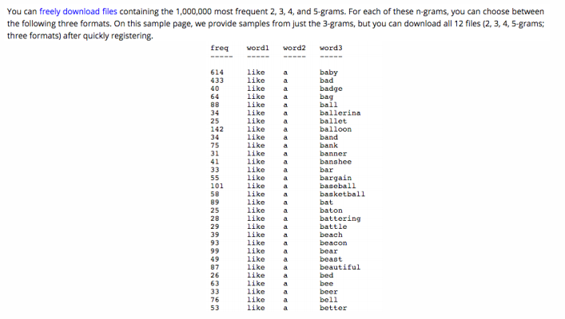
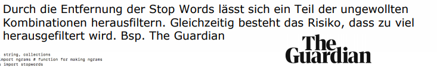
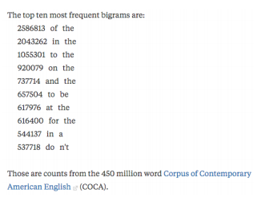
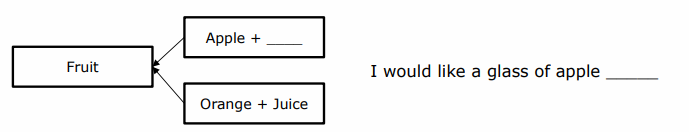
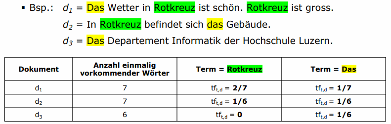
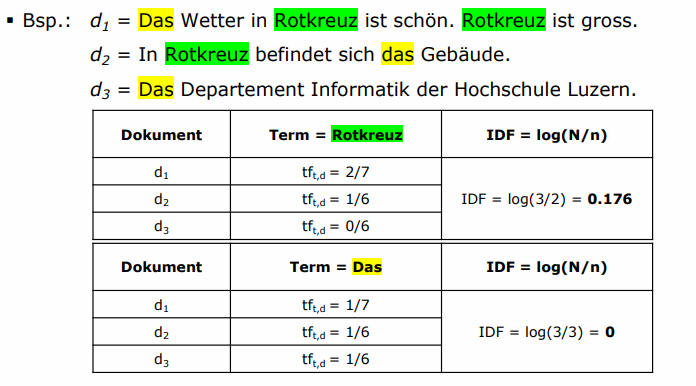
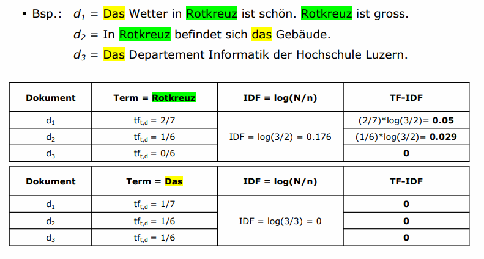

# Natural Language Processing – Basics 2

## Word Embeddings

🎯 **Lernziel**: Sie kennen die unterschiedlichen Vorgehensweisen im Umgang mit Word Embeddings.

> Word embeddings are a type of word representation that allows words with similar meaning to have a similar representation.

Durch Word Embeddings wird der *Verwantschaftsgrad* einzelner Wörter.  Um diesen Grad zu bestimmten gibt es verschiedene Ansätze:

* Frequency-based:
  * N-Grams
  * TF-IDF
  * Co-Occurrence
* Prediction-based (Neural Networks & Vektoren):

  * Skip-Gram
  * Continuous Bag of Words (CBOW)

Beispiel: `New + <word> / <word> = York (92%), Jersey (87%), Orleans (78%)`

## N-Grams

🎯 **Lernziel**: Sie wissen wie N-Grams berechnet werden und können dies selbständig vornehmen.

>  **N-Gramme** sind das Ergebnis der Zerlegung eines Textes in Fragmente. Der Text wird dabei zerlegt, und jeweils $N$ aufeinanderfolgende Fragmente werden als *N-Gramm* zusammengefasst. 

Die Tokenization / Lemmatization listet alle Wörter einzeln. Bei Bezeichnungen, die aus Wortkombinationen bestehen (z.B. *New York* oder *Hochschule Luzern*) wird dies problematisch. Solche Kombinationen werden in NLP als N-Gram bezeichnet. Der Fokus liegt dabei darauf, **nachfolgende Wörter zu identifizieren**. $N$ definiert die Anzahl Wörter, welche eine Wortkombination ausmachen.

*Typische* N-Gramme sind:

* Unigram: Einzelne Wörter, beispielsweise nach Tokenization
* Bigram: 2 Wörter ($n = 2$), z.B. (New York), (Hochschule Luzern)
* Trigram: 3 Wörter ($n=3$), z.B. (The White House)
* Four-Gram: 4 Wörter ($n=4$), z.B. (The New York Times)
* etc.

### N-Gram-Analyse

Die Analyse von N-Grams versucht die Frage zu beantworten, wie wahrscheinlich auf eine bestimmte Wortfolge ein bestimmtes Wort folgt: $P(w|h)$

Dabei ist $P$ die Wahrscheinlichkeit (Probability), dass $w$ das nächste Wort einer Abfolge ist, gegeben die historischen Daten $h$. 

#### Beispiel:

Wie hoch ist die Wahrscheinlichkeit, dass *York* nach der Eingabe von *I love New* erscheint? Hinweis: $C$ steht für Korpus:
$$
P(\text{York}|\text{I love New}) = C(\text{I love new york} / C(\text{I love new}))
$$

Diese Wahrscheinlichkeit kann mit der Häufigkeit / Occurrance / Frequenz, mit welcher *New York* in einem Korpus erscheint berechnet werden.

## Vorgehensweise

N-Grams verhalten sich wie ein Sliding Window, welches über den Text gelegt wird. Dabei entstehen überlappende Tupel der Länge $n$. Folgend ein Beispiel für Bigramme ($n=2$).

Somit kann man die Bezeichnung *New York* (eine Wortkombination bestehend aus zwei Wörter), finden. 

Aus obiger Analyse kann folgende Co-Occurrence Matrix erstellt werden:

### Daten bereinigen

Um N-Gramme sinnvoll einsetzen zu können, muss der Datensatz zuerst bereinigt werden. Ansonsten können die Wörter nicht sauber analysiert werden, zum Beispiel:

In diesem Beispiel wurde die Bezeichnung *New York* mehrmals aufgelistet, da im zweiten N-Gram noch Satzzeichen enthalten sind. Diese interessieren uns nicht und können bereinigt werden. Uns interessieren nur die Wörter respektive die Wortkombinationen.

Ein Beispiel mit NLTK um Bi- und Trigrams zu bilden:

.png)

### Korpus

Der Korpus ist eine Sammlung von Texten (oder Audio). Die Grösse der Korpus ist dabei wichtig, da sie direkten Einfluss auf die "Treffsicherheit" des Algorithmus hat. Oftmals werden jedoch nur kleine Texte analysiert. Deshalb existieren auch Referenzkorpusse als Basis für die Identifikation, wie z.B.: https://www.ngrams.info/samples_coca1.asp

### Stop Words entfernen

N-Grams beinhalten oft auch sehr uninteressante Wortkombinationen wie (it is), (of the), (in the). Diese können entfernt werden, z.B. mittels `stopwords` aus `nltk.corpus` (siehe Code Snippet oben).

### Summary

* Die N-Gram Detection ist einfach zu implementieren

* Sie sind stark abhängig vom Korpus, welcher üblicherweise sehr klein ist. Es können Referenzkorpusse zur Hilfe gezogen werden.

* Identifikation von Bigrams ist schwierig, da die Kürze der Kombination das Resultat stark beinflusst.

* Daneben ist die Identifikation von Trigrams deutlicher genauer

* N-Gram Detektion ignoriert den Kontext, indem die Wörter sich befinden

* Wortkombinationen werden immer einzeln betrachtet, sprich es werden keine Annahmen auf Grund von bereits vorhandenen Wortkombinationen getroffen. Daher ist dieser Ansatz ineffizient.

  

## TF-IDF 

🎯 **Lernziel**: Sie sind in der Lage mittels TF-IDF die Relevanz einzelner Terme, sowie von N-grams in den jeweiligen Dokumenten zu berechnen.

TF-IDF steht für die Term Frequency - Inverse Document Frequency. Es ist ein Mass für die Relevanz von Termen in einzelnen Dokumenten ($n$) einer Sammlung von Dokumenten ($N$). Sie berücksichtigt Worthäufigkeit in einem Korpus (mehrere Dokumente). Gleichzeitigt bestraft sie häufige Wörter (z.B. der, die, das) und reduziert deren Relevanz mittels einer Gewichtung.

### Term Frequency (TF)

Term Frequency (TF) = $\text{tf}_{t,d}$ =  Häufigkeit Term $t$ in einem Dokument $d$. Umso höher die TF, desto "wichtiger"  ist der Term für die Charakterisierung des Dokuments

#### Beispiel

### Inverse Document Frequency (IDF)

Inverse Document Frequency (IDF) wiederum misst, in wie vielen Dokumenten $n$ aller Dokumenten $N$ der jeweilige Term vorkommt. Die Terme, die in einer Vielzahl an Dokumenten vorkommen sollen an Relevanz verlieren (Inverse = log())

#### Beispiel:

Das Wort *Das* ist für die Charakterisierung des Dokumentes nicht interessant, es ist somit nicht *relevant*. Die Relevanz wird daher reduziert. *Rotkreuz* hingegen ist relevanter, um den *jeweiligen* Text (hier: d1 und d2) zu klassifizieren:

> *Welche Worte kommen zwar häufig ein einem einzelnen Dokument vor, sind jedoch, auf alle Dokumente die wir uns anschauen, relativ einzigartig? Oder welche Worte kommen in allen Dokumenten vor und sind damit wahrscheinlich uninteressanter?*

### TF-IDF:

TF-IDF ist folglich die Kombination respektive das Produkt aus der TF und IDF.

#### Beispiel:

### Code

Beispiel mit [Sklearn TfidfVectorizer](http://scikit-learn.org/stable/modules/generated/sklearn.feature_extraction.text.TfidfVectorizer.html):

.png)

## Testat
- [x] Identifiziert die Bi- und Trigrams aus 'shakespeare-macbeth.txt'. Dieses Buch ist Teil des Gutenberg Corpus. Der Datensatz muss zunächst bereinigt werden (Stop Words, Satzzeichen, etc.)
- [x] Berechnet den TF-IDF Wert er Bigrams aus den Dokumenten IDB_1.txt, IMDB_2.txt, IMDB_3.txt