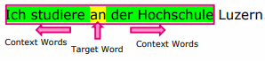
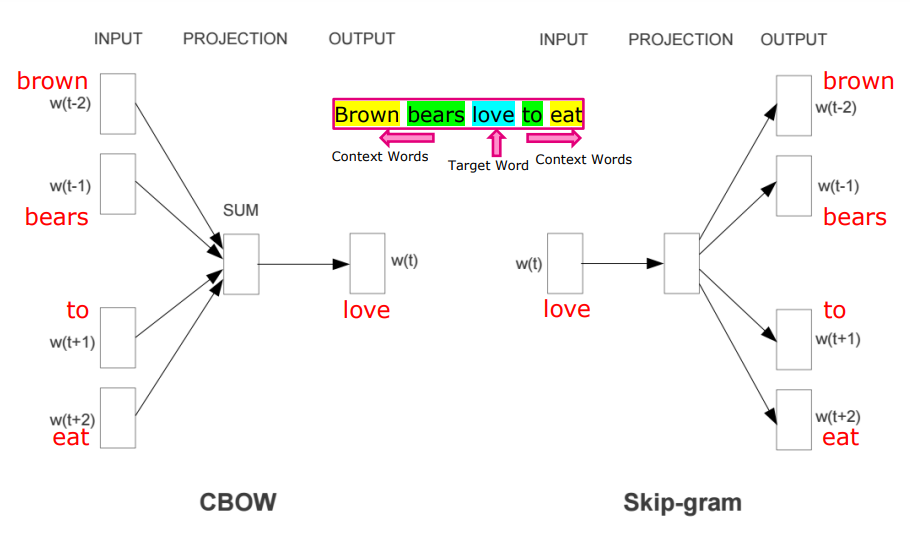
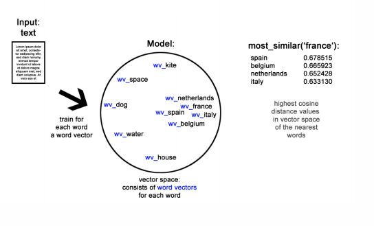
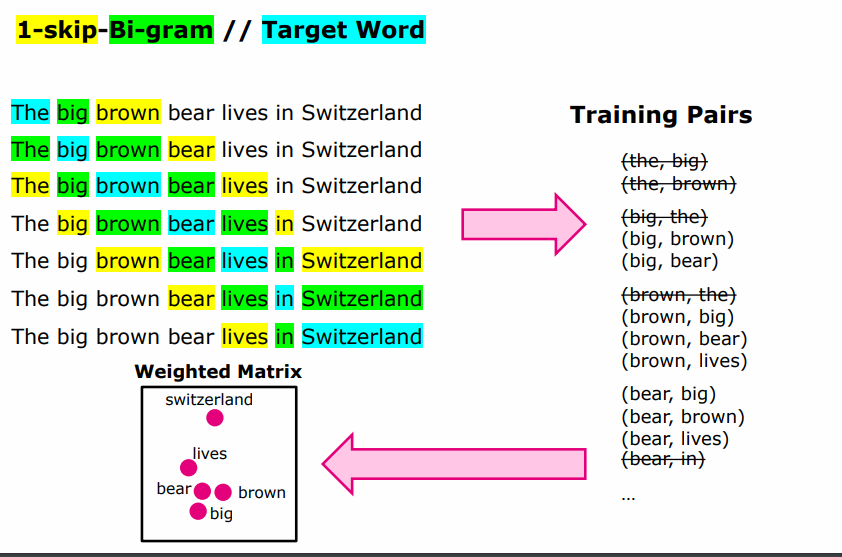
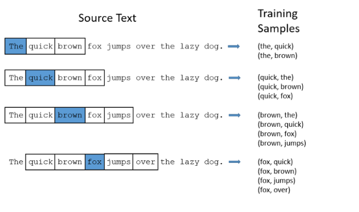
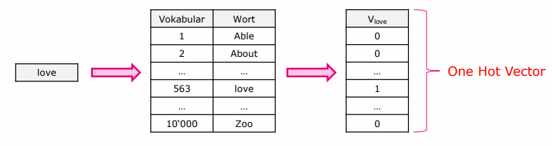
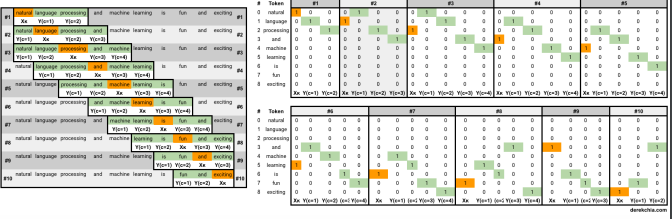
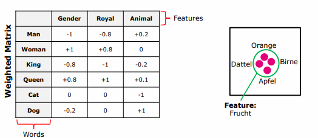

# Natural Language Processing – Basics 3

## Word2Vec

> 🎯 **Lernziel**: Sie können die Funktionsweise von Word2Vec mittels Skip-Grams erläutern

Word2Vec ist ein Kontext- und Vorhersage (Prediction)-basierter Ansatz zur Ermittlung der Verwandtschaft zwischen Wörtern.

Word2Vec verwendet ein trainiertes, neuronales Netzwerk um die Ähnlichkeit zwischen einem Input Word und irgendeinem Wort im Vokabular anzugeben. Die Ähnlichkeit wird mit einem Wert zwischen 0 und 1 als Cosine Similarity ausgedrückt.

Als Beispiel: Wie ähnlich sind sich *Bear* und *Animal*?D

Word2Vec kann zwei Methoden zur Messung des Verwandtschaftsgrades verwenden:

**1. Skip-Gram Model**

Nimmt als Input ein Wort $w_t$ und gibt als Output den Kontext des Wortes zurück.

**2. CBOW Model**

Wiederum nimmt als Input den Kontext eines Wortes und gibt das Wort zurück.

Folgendes Bild zeigt die Unterschiede dieser beiden Methoden im Kontext von Word2Vec:

## Skip-Grams

> 🎯 **Lernziel**: Sie können das Vorgehen beim Einsatz von Skip-Grams mit einem Beispiel erklären. 

Skip-Grams ziehen die Semantik (Kontext) eines Wortes mitein. Dabei zieht es nicht nur das nächste Wort mitein, sondern auch Wörter in einem bestimmten Abstand zum Wort hinzu (es *skippt* Wörter dazwischen). 

Dieses Vorgehen berücksichtigt mehr Kombinationen und hat daher eine höhere Wahrscheinlichkeit, akkuratere Kombinationen zu identifizieren. 

**Beispiel**

In Blau ist das Target Word (= Input Word)

Ein weiteres Beispiel:

## One Hot Vector

>  🎯 **Lernziel**: Transformation und Einsatz von One-Hot Vectors sind ihnen geläufig.

Vorgehen um Wörter in One Hot Vectors zu transformieren:

1. Bestimmen des Vokabulars anhand der einzigartigen (discint) Wörter
2. Wörter z.B. alphabetisch in absteigender Ordnung in einer Liste erfassen
3. Jedes Wort hat innerhalb der Liste eine eindeutige Position (*ID*)
4. Für jedes Wort den entsprechenden (1xV) Vektor erstellen

Problem: Sie haben oft eine sehr hohe Dimensionalität!

### One Hot Encoding

Als One Hot Encoding wird die resultierende Abbildung der jeweiligen Wörter im Sliding Window (Target word = Orange, Bi-Gram & Skip-Gram = Grün) bezeichnet:

## Features

Um das Problem mit den hohen Dimensionen anzugehen können dedizierte **Features** eingesetzt werden. Dabei handelt es sich um thematische Gruppierungen, welche im Kontext des Vokabulars einen möglichst hohen Grad an Abdeckung erreichen.

Der Zusammenhang der Wörter wird innerhalb der Features modelliert. Dadurch reduziert sich die Komplexität bei der Berechnung, zumal nicht mehr mit (1xV) Vektoren gerechnet werden muss

Eine Kennzahl: Zwischen 100-300 Features werden angestrebt.

Somit werden die Wörter in Konzepte (Features) zusammengefasst und in der Matrix die Wahrscheinlichkeit / Score dass ein Worter zu diesem Konzept gehört.

## Anwendung

> 🎯 **Lernziel**: Sie sind in der Lage mit den erwähnten Operatoren einen Datensatz zu bearbeiten.

Siehe Code-Samples in den Folien oder Testat.