# SW07 - NLP 4 (F)

🎯 **Lernziel**: Sie kennen den Unterschied zwischen Word2Vec mit Skip Grams und CBOW.

🎯 **Lernziel**: Den Einsatz von Sliding Windows und Bag of Words können sie mit einem Beispiel erläutern.

## MEP (Tonspur)

2 Ansätze:

* (C)BOW (schlechtere Performance da kein Kontext, dafür schneller)

* Skip Gram (bessere Performance, dafür aufwändiger)

Bag of Words vs. TF-IDF

Sparse Matrix (Vektor mit vielen 0en und wenigen 1en)

Domain: Oft schwierig, Texte mit Fachwissen zu findein

Modelle kontrollieren (Dimensionen reduzieren zB mit PCA), plotten und prüfen.

## Bag of Words

Bag of Words bringt jedoch auch einige Probleme mit sich:

* Berücksichtigt den Kontext nicht, die Ordnung der Wörter ist nicht relevant => Verliert Semantik / Kontext
* N-Grams
* Sparse Vectors (benötigt Rechenleistung)

Bag of Words kann einfach mit `CountVectorizer()` von Sklearn implementiert werden. Für jedes Wort im Vokabular wird die Häufigkeit gezählt.

## Continuous Bag of Words (CBOW)

Erweitert BoW, sodass der Kontext der Wörter miteinbezogen wird. Dazu nutzt CBOW Sliding Windows (*Context Window*) um den Kontext zu erfassen. Dabei unterscheiden sich Skip-Gram und CBOW lediglich darin, welchen Input sie nehmen und welchen Output sie erzeugen:

* **Skip-Gram** erzeugt aus einem Target Word (Input) $\rightarrow$  mehrere Context Wörter (Output)

* **CBOW** erzeugt aus mehreren Context Wörter (Input) $\rightarrow$ ein Target Word (Output)

Skip-Grams wird die Cosine Similarity immer einzeln zwicshen einem Target Word $t_i$ und dem Context Word $w_i$ berechnet:

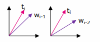

CBOW wiederrum berechnet die Cosine Similarity zwischen einem Durchschnittsvektor $W_D$ (= Average Embedding) der Context Words und dem Target Word $t_i$.

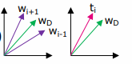

### Average Embedding

Folgendes Beispiel: *Flag* ist das Target Word $t_i$, die gelben und grünen Wörter sind die Context Words (*the* = $w_{i-2}$, *swiss* = $w_{i-1}$, *is* = $w_{i+1}$, *red* = $w_{i+1}$)

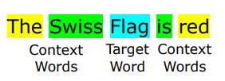

??

## CBOW vs Skip-Gram

**Skip-Gram**:

* Gut geeignet auch für kleine Datensätze
* Kann auch seltene Wörter mit tiefer Häufigkeit akkurat erfassen

**CBOW**:

* Ist schneller beim Training (Berechnung) mit grossen Datensätzen
* Kann gut mit häufigen Wörtern umgehen

Folgende Tabelle zeigt diese Unterscheide besonders gut:

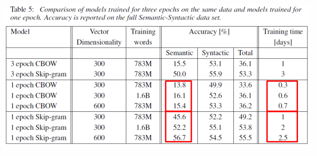

Währned Skip-Grams eine bessere (semantische) Accuracy erzielten, benötigte es dafür jedoch viel mehr Trainingszeit.

## Knowledge Base

Als Beispiel soll eine Wissensdatenbank für Aus- und Weiterbildungen erstellt werden. Die Frage ist also, wie kommt man vom Bild (links) zum Resultat (rechts)?

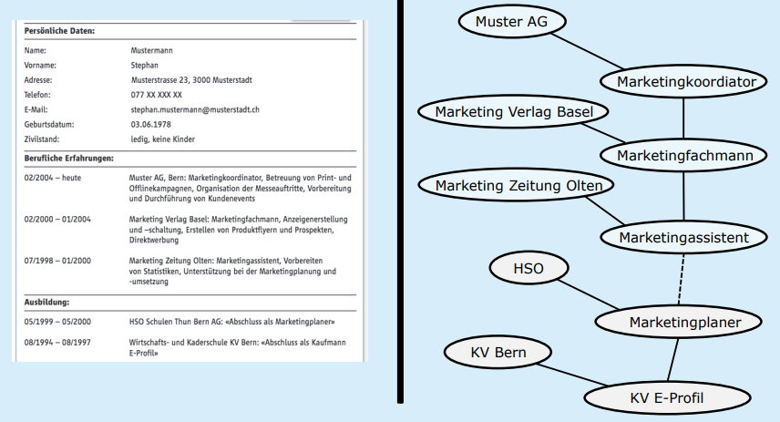

**Input (Daten)**

* Lebensläufe
* Jobbeschreibungen (z.B. von Jobportalen)
* Aus- und Weiterbildungen (z.B. mittels Beschreibungen der Kurse)
* usw.

**Vorgehen**

* Daten werden aggregiert (z.B. standardisiert und zentral gespeichert)
* Tokenization, Stop Word Removal, Word2Vec
* (Bei kleinen Datensätzen: Word2Vec mit Skip-Gram)

**Output**

* Word Embedding (*n*-dimensionale Repräsentation der Wörter)
* Wörter sind nach ihrer semantischen Ähnlichkeit (Kontext) verteilt

Um dieses Ziel zu erreichen, können aus einer **zweidimensionalen Wortrepräsentation** die entsprechenden **Konzepte** mitsamt ihrem **Änhlichkeitsmass** in eine Graphdatenbank transformiert werden.

## Dimensionality Reduction & PCA

> 🎯 **Lernziel**:  Sie kennen dein Einsatzzweck von PCA und können grob beschreiben wie die Dimensionsreduktion ausgeführt wird.

Das Problem: Aus einer *n*-dimensionalen Repräsentation der Wörter soll auf zwei Dimensionen hinuntergebrochen werden:

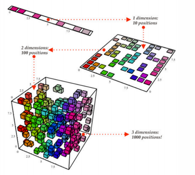

Dabei können die bestehenden Distanzen (respektive Winkel) zwischen den Vektoren im *n*-dimensionalen Raum als Distanzen der Punkten in dem zweidimensionalen Raum verwendet werden.

Die Herausforderung dabei liegt darin, während der Reduktion diese bestehenden Distanzen so gut wie möglich zu bewahren.

Die Principal Component Analysis (PCA) hilft bei dieser Reduktion. Dieses mathematische Verfahren reduziert diese Repräsentation mit möglichst wenig Informationsverlust reduziert werden. Dabei verwendet es eine Art von Komprimierung (Data Compression), welche sich auf Distanzen fokussiert welche **möglichst stark variieren**. 

Im folgenden Beispiel hat die Dimension *PLZ* keine Varianz und kann somit ohne grossen Verlust komprimiert werden.

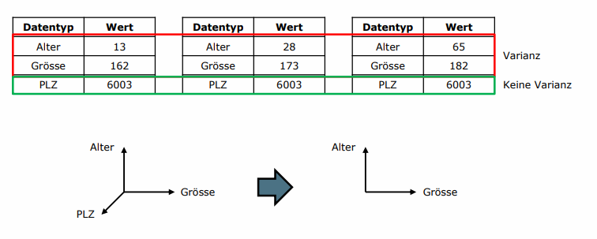

Dabei soll die Varianz der Datenpunkte auf einer neuen Achse (der *Principal Component*) maximiert werden, also eine maximale Streuung erreicht werden. Diese Achse entspricht einem **Eigenvektor**. Die Summe der Distanzen zwischen dem Eigenvektor und den Datenpunkten (den **Eigenwerten**) soll wiederum minimiert werden.

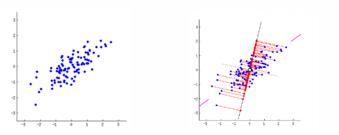

## Überführung in Graphdatenbanken

>  🎯 **Lernziel**: Sie kennen mögliche Ansätze zur Überführung der Wörter aus der 2D “Wortmappe“ in eine Graph Datenbank.

Liegt die Repräsentation in einem zweidimensionalen Raum vor, können die Wörter und deren Beziehungen einfach in eine Graphdatenbank überführt werden. Dabei sind die Wörter die Knoten in einem Graphen und die Kanten haben als Wert die Distanz aus der 2D Repräsentation. Dieser Wert sollte normiert sein und steht dafür, wie **ähnlich** sich diese Wörter sind.

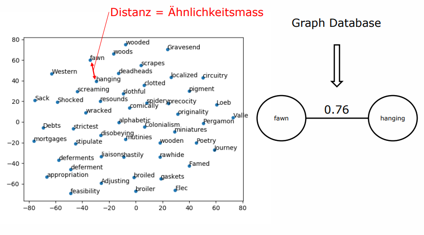

Somit können einfach ähnliche Wörter gefunden werden:

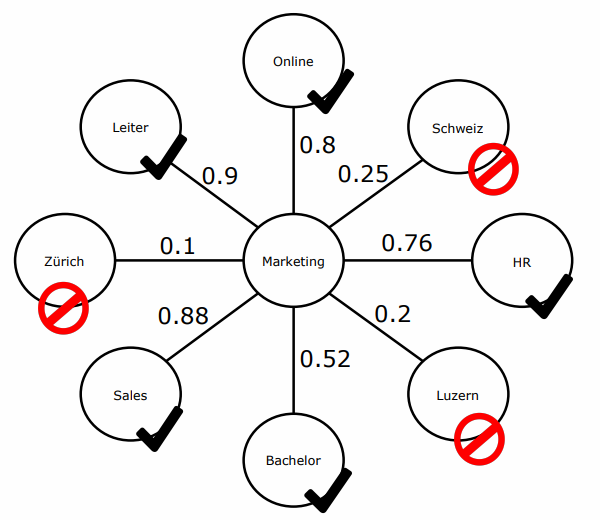

### Wortkombinationen

Nicht alle Kombinationen von ähnlichen Wörter machen auch Sinn (z.B. *Marketing HR*). Solche Wortkombinationen können herausgefiltert werden, indem einzelne Wörter kombiniert werden und danach die Distanz zu einem weiteren Wort berechnet wird, zum Beispiel wie gut passt *Sales* zu *Marketing Leiter*?

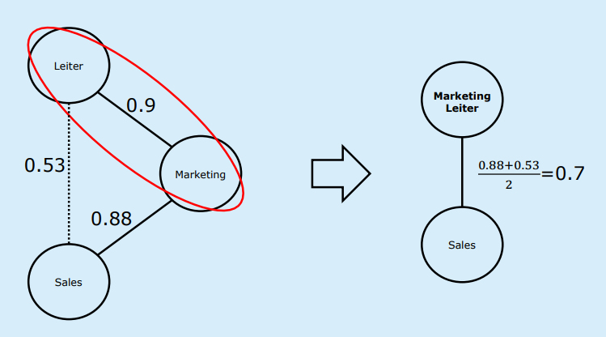

## Konzept-Extraktion

> 🎯 **Lernziel**: Probleme und Lösungsansätze zur Konzept-Extraktion sind ihnen geläufig.

Konzepte sind für eine domänenspezifische Wissensdatenbank (respektive für die Modellierung einer solchen DB) relevante Wörter oder Wortkombinationen. So ist jedes Konzept auch ein Wort, umgekehrt ist nicht jedes Wort ein Konzept.

Welche Wörter als Konzepte gelten sollen ist schwierig. Oftmals existiert keine Referenzdatenbank für eine spezifische Anwendung / spezifische Domäne.

Dazu existieren einige Lösungsansätze:

* Referenzdatenbank (sofern vorhanden)
* Manuelle Klassifikation (sog. Concept Whitelist)
* Domänenspezifische & statistische Verfahren
* Maneulle Klassifikation durch Benutzende (z.B. Experten)

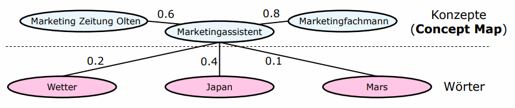

## Testat

1. Erstellen Sie für das GOT Model eine 2D Visualisierung von 50 Begriffen.
2. Für Game of Thrones soll eine spezifische Wissensdatenbank zu den genutzten Waffen erstellt werden. Wie würden sie die Konzeptextraktion vornehmen? (Vorgehen kurz erläutern)