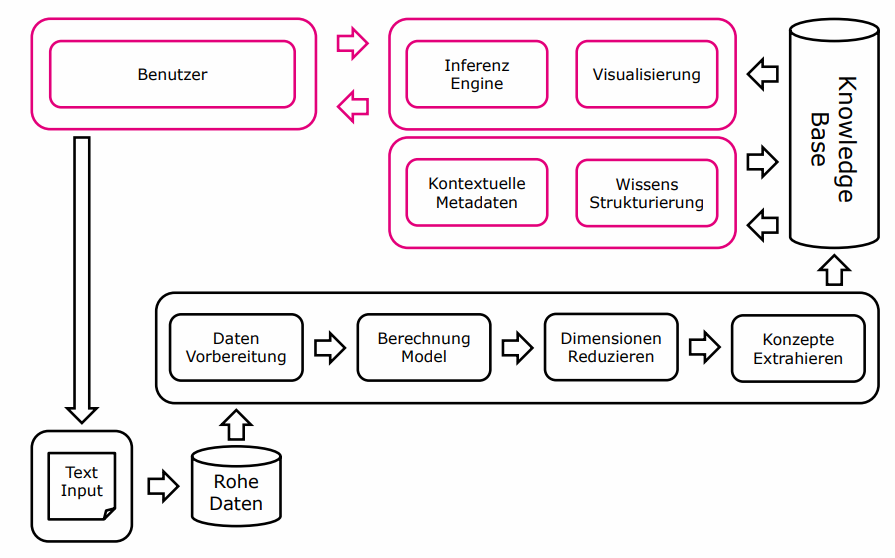
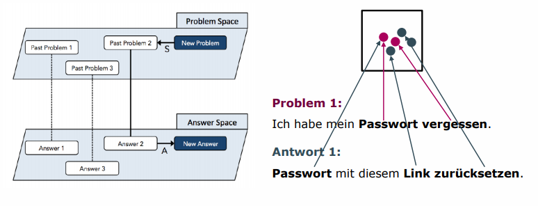
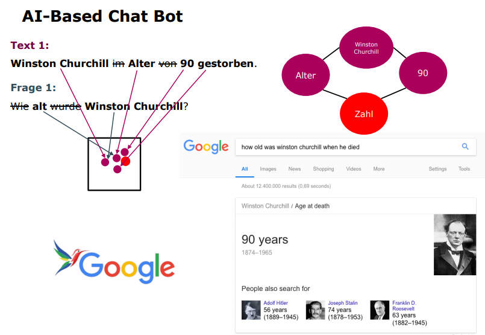
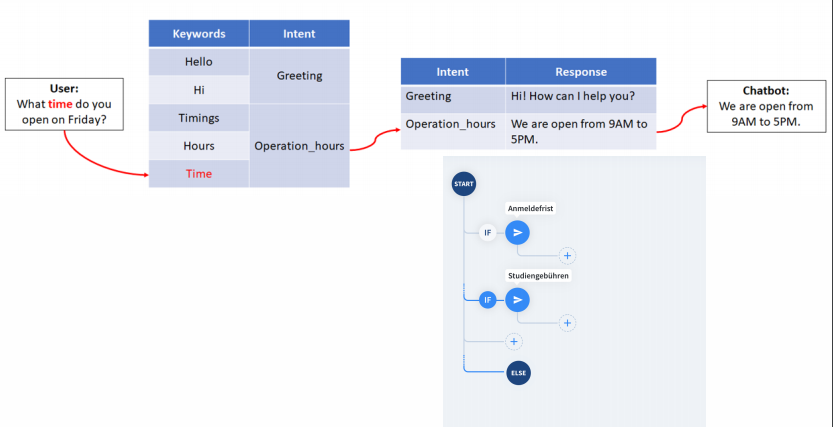
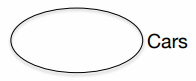
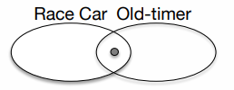
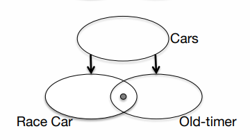
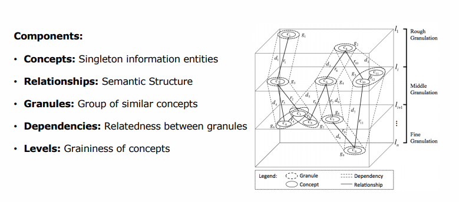

# Wissensstrukturierung, Repräsentation und Reasoning

## Architektur KBDSS

> 🎯 Sie verstehen wie ein KBDSS für unterschiedliche Anwendungsfälle konfiguriert werden können.

Unterschiedliche Konfigurationen eines KBDSS:

**Case-Based Reasoning**

Bekannte, vergangene Probleme im Problem Space werden mit zu Antworten im Answer Space verlinkt.

**AI-Based Chat Bot**

**Rule-based Chat Bot**

## Charakteristika Wissen

> 🎯 Die unterschiedlichen Charakteristika von Wissen sind ihnen geläufig.

Im Folgenden sind einige relevante Charakteristika von Wissen aufgelistet:

**Wissensdomänen**: Teilbereiche der Knowledge Base, beispielsweise Wissensdomäne "Auto"

**Fuzzy Asset**: Ein Konzept kann zu mehreren Wissensdomänen gehören (z.B. das Konzept "Ford Shelby" kann zu der Domäne "Race Car" sowie "Old Timer" gehören)

**Hierarchische Wissenstrukturen**: Eine Parent-Child Hierarchie.

## Expert Finder Systems

> 🎯 Sie kennen die Anforderungen an die Erstellung eines Experten Finder Systems (Wissen erfassen, Metadaten zur Beschreibung der Benutzer).

Ein Exper Finder System hat zum Ziel, bei einer Problemstellung einen möglichst gut geeigneten Expert*in zur Lösung zu finden / vorzuschlagen. Um dieses System zu implementieren müssen jedoch folgende Bedingungen erfüllt sein:

* Das Wissen der Expert*innen ist bekannt
* Das System kann den Inhalt der Fragen verstehen
* Eine Methode, wie Fragen zu Expert*innen gematched wird

### User Profiling & Modeling

**User Profile (Explicit)**: User stellt die Informationen, genauer: *a collection of personal information that is expressed through a set of properties*

**User Model (Impicit)**: Es werden Informationen über den User gesammelt, genauer: *acquisition of knowledge about a user, construction, update, maintenance and exploitation of the user mode*

### Granular Computing & Granular Knowledge Cube

Beschriebt wie Informationen granuliert und *fuzzy* dargestellt werden können:

* **Granule Characterization**: How concepts should be clustered 

* **Granulation Criteria**: Measure to determine to which level a concept belongs

* **Representation Method**: How granules and the structure should be established

* **Granulation Algorithm**: Execution of the granulation. 

