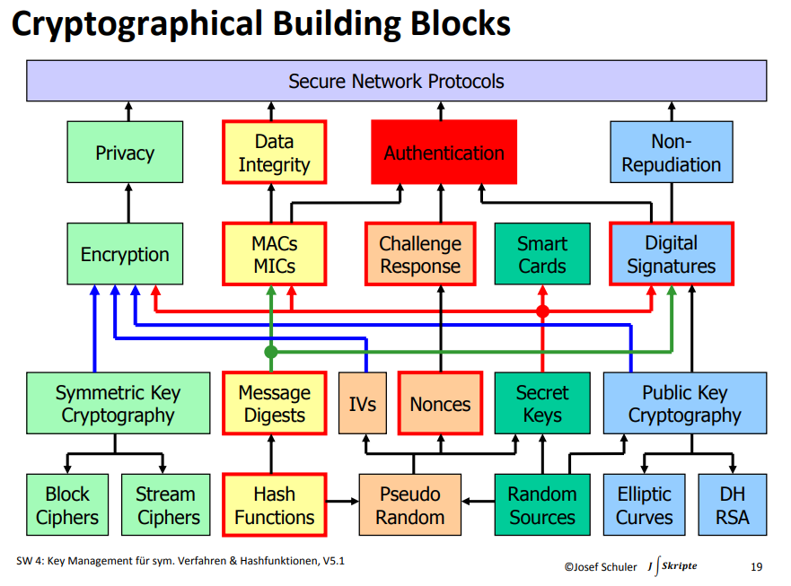

# Key Management

🎯 Ich kann die Elemente eines symmetrischen Key Managements aufzählen.

🎯 Ich kann ein einfaches Key Management gemäss den vorgegebenen Eigenschaften beurteilen.

🎯 Ich kann den Unterschied zwischen einer keyed-Hashfunction und einer keyless-Hashfunction erklären.

🎯 Ich kann den CBC-MAC und HMAC aufzeichnen.

🎯 Ich kann die Einsatzgebiete von CBC-MAC und HMAC benennen

(JS Skripte „Einführung in die Kryptologie“, Kap. 8.2, 9, 13.2 & 14. )

## Key Mgmt für symmetrische Verfahren

Aufgaben des Key Management:

* Erzeugung der Systemschlüssel
* Verteilung der System- und/ oder Terminalschlüssel
* Speicherung und Administration der Systemschlüssel
* Berechnung der aktuellen Sessionkeys • „Transport“ der Sessionkeys.

