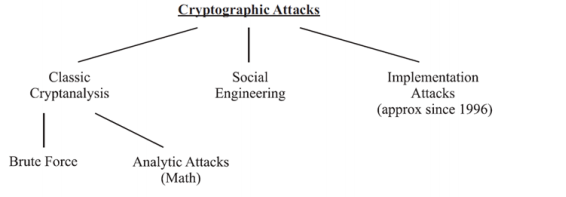

# Kryptoanalyse mit Schwerpunkt symmetrische Kryptographie

## Literatur

* JS Skript Kapitel 10
* In [CP-D] die Kap. 1.3, 1.4.4, 5.2 & 5.3
* JS Skript „Aufgaben und Lösungen zum Modul KRYPT an der HSLU-I“, Kap. 2.1. „Aufgaben zu den Präsenzen SW 1 – SW 5

## Was heisst Sicherheit

Zwei zentrale Fragen:

1. Welche **Information** steht Angreifenden zur Verfügung?
2. Wie viele **Ressourcen** (Computing) steht Angreifenden zur Verfügung?

Die erste Frage lässt sich mit dem **Prinzip von Kerckhoff** beantworten: „Von einem Kryptosystem ist alles ausser der Schlüssel bekannt“. Das heisst, dass die Algorithmen der Verfahren offen sein können ohne dass Angreifende davon einen Nutzen haben. Das einzige Geheime an einem Verfahren soll das Schlüsselmaterial sein. Das ist der Fall bei allen modernen Verfahren, die Algorithmen sind offen und geheim bleibt das Schlüsselmaterial. Jedoch haben Angreifende mehr Informationen als nur über das Verfahren, daher siehe folgende Attacken.

Die zweite Frage hat zwei Antworten, welche sich in der Annahme über die Ressourcen unterscheiden:

* **unbeschränkt**: Die Gegenschaft kann uneingeschränkte Ressourcen zur Verfügung haben. Ein System, welches unter dieser Annahme sicher ist, nennt man **informationstheoretisch** sicher.
* **beschränkt**: Die Gegenschaft kann sehr hohe, aber doch beschränkte Ressourcen haben. Systeme, die unter diese Annahme sicher sind, nennt man **berechenmässig** sicher.

## KLASSISCHE ANALYSE VON BLOCKCHIFFREN

🎯 **Lernziel**: Ich erhalte einen ersten Einblick in die Kryptoanalyse
🎯 **Lernziel**: Ich kenne die Definitionen der Attacken

Es gibt eine Vielzahl von Angriffen auf Blockchiffren, im folgenden werden *die drei wichtigsten* Angriffe vorgestellt. Diese Ansätze der Kryptoanalyse sind unabhängig von deren internen Struktur. Diese Analysen werden durchgeführt, um die Mindestanforderungen für die Blockgrösse und Schlüssellänge zu bestimmen. 

### Ciphertext-only Attacke

**Bekannt**: Ausschliesslich der verschlüsselte Output des Kryptoverfahrens (Ciphertext)

**Ziel**: Inhalt des Inputs und/oder Schlüssel erfahren

Die Analyse kann ausschliesslich den verschlüsselten Output analysieren. Das kann beispielsweise entstehen, wenn ein Angreifer nur auf einen unsicheren Übertragungskanal Zugriff hat (beispielsweise über Tapping von Netzwerkverbindungen).

### Known-plaintext Attacke

**Bekannt:** Teile des Klartextes (*known*) und der komplette, verschlüsselte Output

**Ziel:** Inhalt des restlichen Klartextes und/oder Schlüssel in Erfahrung bringen

Den Angreifenden ist der unverschlüsselte Inhalt sowie der Ciphertext bekannt. Aus den Plain/Cipher-Paaren kann folglich versucht werden, Strukturen wieder aufzufinden. Dabei wird ausgenutzt, dass die Inhalte bestimmte Phrasen beinhalten, wie z.B. *Sehr geehrte Damen und Herren*.

Der Angreifer kann jedoch nicht eigene Texte verschlüsseln, das ist Gegenstand der nächsten Attacke. Er ist nur im Besitz von beispielsweise E-Mails oder Dokumente im Klartext und deren verschlüsselten Versionen.

### Chosen-plaintext Attacke

**Bekannt:** Zugriff auf Kryptomodul mit dem geheimen Schlüssel

**Ziel:** Inhalt des Schlüssels erfahren

Die Angreifenden haben Zugriff auf das Verschlüsselungsgerät und kann beliebige Klartexte selber verschlüsseln. Somit kann er beliebige Ciphertexte generieren um ggf. Strukturen wieder zu finden.

## Aufgaben

#### Aufgabe 1

Welcher Angriff wird hier beschrieben?

* Angriff 1: Der Angriff beruht darauf, dass ausgenutzt wird, dass gewisse Teile der unverschlüsselten Dokumente immer gleich lauten und dass der immer gleich lautende Teil bekannt ist. ***Known-Plaintext Attack***
* Angriff 2: Der Gegner besitzt ein Verschlüsselungsgerät und will den darin enthaltenen unbekannten Schlüssel eruieren. Er versucht das, indem er selber bestimmte Klartexte hineinschickt. ***Chosen-Plaintext Attack***
* Angriff 3: Der Gegner hat nur verschlüsselte Daten zur Verfügung. Diese analysiert er mit verschiedenen Methoden. ***Ciphertext-only Attack***

#### Aufgabe 2

>  Erklären Sie kurz, warum eine Chosen-plaintext Attacke bei einer Public Key Verschlüsselung immer möglich ist.

Bei Public Key Crypto steht der öffentliche Schlüssel, welcher zur Verschlüsselung genutzt wird, immer zur Verfügung. Angreifende können den Public Key nehmen und beliebige Inhalte damit verschlüsseln, somit beliebige Ciphertexte produzieren.

## Brute Force Angriffe

🎯 **Lernziel**: Ich kann den Nutzen einer Brute-Force Attacke abschätzen

TODO

Es existieren zwei Arten von Brute Force Angriffen:

* **Exhaustive Search**: die vollständige Schlüsselsuche
* **Table Look Up**: Zugriff auf vorab berechnete Tabelle

## Die 3 Attacken an der Stromchiffre

🎯 **Lernziel**: Ich kann einen Angriff auf eine Stromchiffre analysieren, resp. erklären, wieso die Stromchiffre keine Integrität gewährt.

-> Hausaufgabe

## Time-Memory Tradeoffs

🎯 **Lernziel**: Ich kann das Prinzip eines Time-Memory Tradeoff Angriffs erklären

🎯 **Lernziel**: Ich kann den 2-DES analysieren und kenne die wahre Schlüsselstärke

Es ist eine Kombination der beiden Brute Force Angriffen. Diese Tradeoffs kommen häufig bei Mehrfachverschlüsselungen vor (2-DES, 3-DES). Diese Mehrfachverschlüsselungen wurden erstellt, weil der Single-Algorithmus (z.B. nur DES) einen zu kleinen Schlüsselraum besitzt. Dies hat man im Glauben erstellt, dass sich dadurch der Schlüsselraum vergrössert. Jedoch zeigt der Angriff, dass dem nicht unbedingt so ist. 

 ### Beipsiel an einer 2-fach Verschlüsselung

 

## Übersicht der kryptographischen Attacken

🎯 **Lernziel**: Ich kann die verschiedenen Grundtypen der Kryptoanalyse unterscheiden

Die drei wichtigsten Grundtypen der Attacken:

1. Die klassische Kryptoanalyse, wie:

   1. Time-Memory Tradeoff
   2. Differential Cryptoanalysis
   3. Linear Cryptoanalysis
   4. Weitere, statistische Methoden, wobei die meisten nur noch historischen Wert haben

2. Social Engineering: Erpressung oder Drohung von Personen, die dann das Schlüsselmaterial rausgeben 
3. Angriffe auf die Implementation der Verfahren (z.B. Side Channel Attack)
