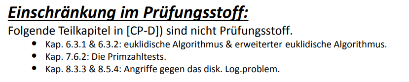

# Public Key Kryptographie

🎯 **Lernziel**:  Ich kann die mathematischen Grundlagen in der asymmetrischen Kryptographie anwenden und vertiefen.
🎯 **Lernziel**: Ich kann die verschiedenen Schlüsseltypen der asymmetrischen Kryptographie richtig einsetzen.
🎯 **Lernziel**: Ich kann eine RSA-Berechnung im Detail ausführen.
🎯 **Lernziel**: Ich kann eine "square and multiply" Berechnung durchführen und den Aufwand berechnen.
🎯 **Lernziel**: Ich kenne den Unterschied zwischen einem „Schoolbook“ RSA und einem „RSA in Practice“.
🎯 **Lernziel**: Ich kenne Homorphie Eigenschaft des RSA und kann eine RSA Verschlüsselung.
🎯 **Lernziel**: Ich kann einen DH Schlüsselaustausch im Detail ausführen.
🎯 **Lernziel**: Ich kann eine Elgamal Verschlüsselung durchführen.
🎯 **Lernziel**: Wichtig: Mindestens einer der 4 folg. Algorithmen wird in der Prüfung vorkommen: RSA-Berechnung, Homomorphe Eigenschaft des RSA, Diffie-Hellman Schlüsselverteilung, Elgamal Verschlüsselung

## Repetition

### Die zwei grundlegenden Schutzbedürfnisse

#### 1. Vertraulichkeit (Geheimhaltung)

Schützt ausschliesslich vor dem *Abhören* einer Nachricht.

Massnahmen: Symmetrische und asymmetrische Verschlüsselung

#### 2. Integrität / Authentizität

Massnahmen:

* MAC-Berechnung (symmetrisch)
  * Schützt vor Verfälschen und Einfügen
  * CBC-MAC (basiert auf Blockchiffre), üblich in der "Zahlungswelt"
  * HMAC (basiert auf Hashfunktionen), üblich in der "Netzwerkwelt"
* Digitale Signatur (asymmetrisch)
  * Schützt vor Verfälschen, Einfügen sowie Abstreiten eine Meldung geschickt zu haben
  * Verfahren: Diskrete Logarithmen, diskretes Wurzelziehen
  * Algorithmen: ECC (Elliptic Curve), RSA, DSA, Schnorr etc.

## Angriffe

Es gibt acht Angriffe, denen mit Kryptographie entgegen gewirkt werden kann. Die vier wichtigsten sind:

1. Confidentiality: Eine Nachricht wird abgehört
2. Integrity: Eine Nachricht wird verändert
3. Insertion: Eine erfundene Nachricht wird eingespielt
4. Non Repudiation of Origin: Es wird abgestreitet, dass eine Nachricht verschickt wurde

Die vier weiteren sind:

5. Replay: Eine Nachricht wird abgefangen und später wieder eingespielt
6. Delete: Eine Nachricht wird gelöscht
7. Masquerade: Jemand gibt sich für jemand anders aus
8. Non Repudiation of Receipt: Es wird abgestritten, eine Meldung erhalten zu haben.

## One-Way Funktionen (SW7)

Gegeben ein Input der Output einfach berechnet werden kann, sich aber aus dem Output nicht auf den Input schliessen lässt. Daher der Begriff *Einweg-Funktion*.

Es gibt One-Way-Funktionen mit oder ohne **Trapdoor**. Der Begriff Trapdoor respektive eine Trapdoor-Funktion hat ein *Secret*, mit welchem sie das Inverse (vom Output zum Input) effizient berechnen kann.

Als Beispiel sei $f$ eine Trapdoor-Funktion. $y = f(x)$ ist einfach zu berechnen, das Inverse davon ($x = f^{-1}(y)$ schwierig ausser man weiss das Secret $k$. Ist $k$ gegeben, lässt sich das Inverse einfach berechnen: $x = f^{-1}(y,k)$.

> The analogy to a "trapdoor" is something like this: It's easy to fall through a trapdoor, but it's very hard to climb back out and get to where you started unless you have a ladder.

Siehe auch [Wikipedia](https://en.wikipedia.org/wiki/Trapdoor_function) oder [StackOverflow](https://crypto.stackexchange.com/questions/10087/what-is-the-meaning-of-trapdoor-in-cryptography)

## 3 One-Way-Funktionen

RSA hat eine Trapdoor 

DH 

### Trapdoor

* Mit oder ohne Trapdoor (=> trick um das inverse / retour zu rechnen)

RSA:

- trapdoor

### Aufgabe 1:

>  Wiso ist jede asymmetrische Verschlüsselung (per Definition) unsicher gegenüber einer Insertion Attacke?

### Aufgabe 5

1. 1
2. ja
3. nein
4. 

preisgeldaufgabe?