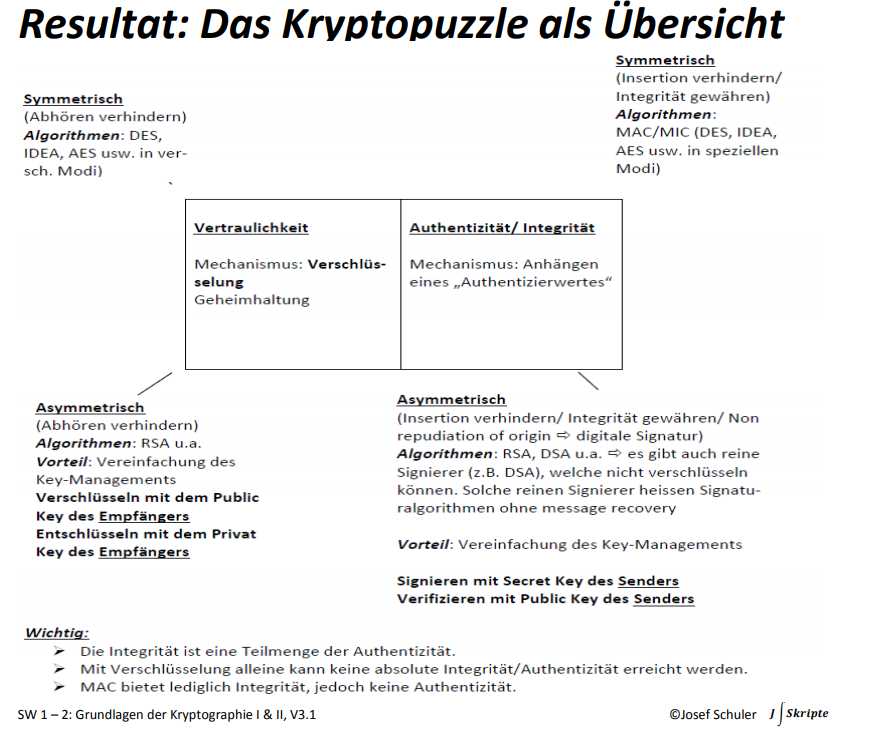
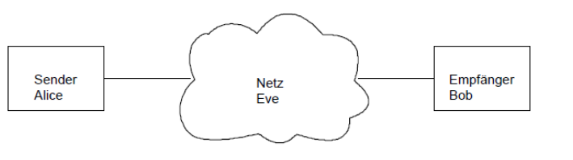
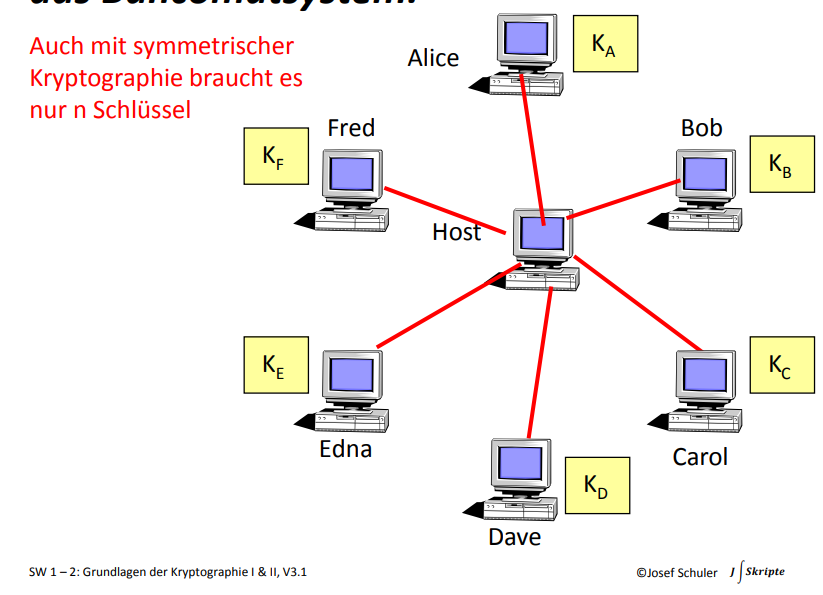
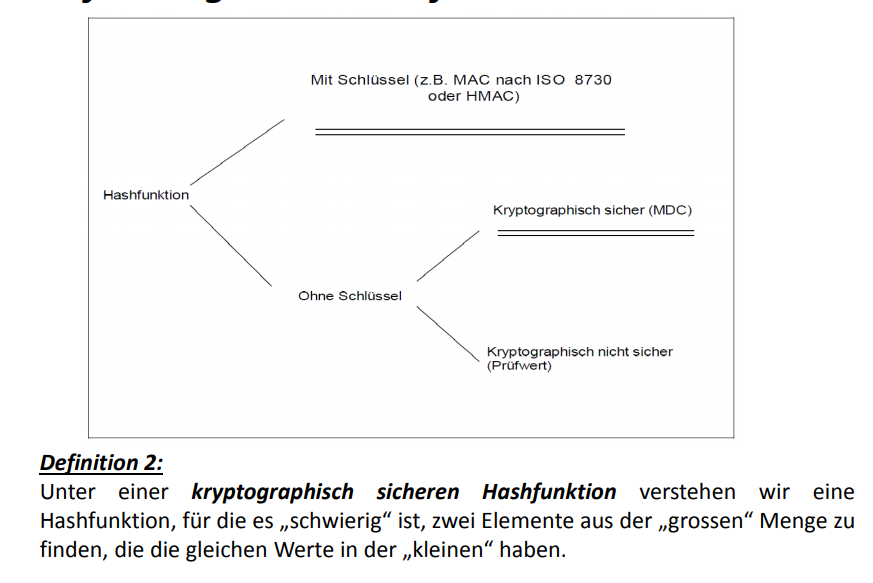
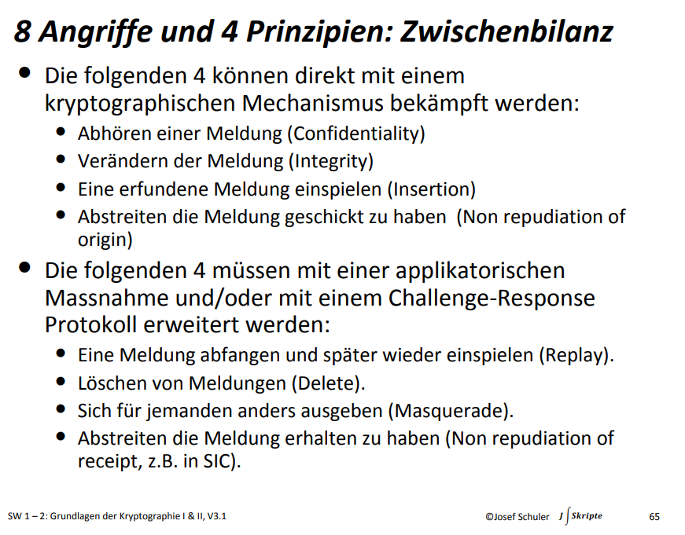
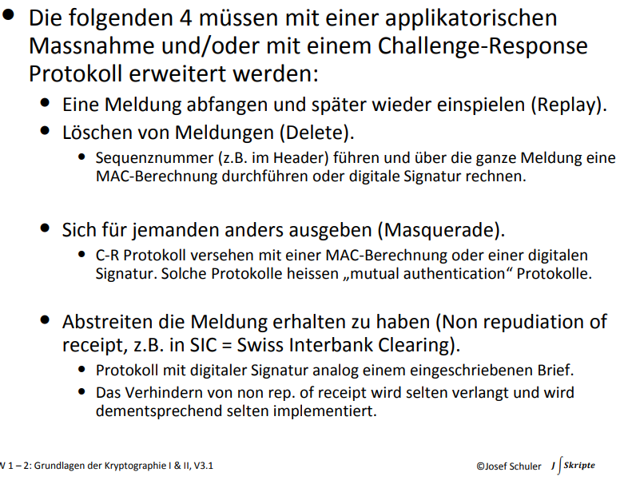

# KRYPTO - SW 1 & 2

🎯 Ich kann die Grundbegriffe der Kryptologie richtig einordnen.
🎯 Ich kann den Nutzen von kryptographischen Massnahmen beurteilen. 
🎯 Ich kann die verschiedenen Schutzmechanismen unterscheiden.
🎯 Ich kann die 8 typischen Angriffe, die mit Hilfe der Kryptographie verhindert werden können, aufzählen.
🎯 Ich kann die Zuordnung, mit welchen Schutzmechanismen welche Angriffe verhindert werden können, anwenden. 
🎯 Ich kann bei einem kryptographischen System erkennen, welches der Schlüssel und welches das Verfahren (Algorithmus) ist.
🎯 Ich kenne den Unterschied zwischen symmetrischer und asymmetrischer Kryptographie.
🎯 Ich kenne den Unterschied zwischen Verschlüsseln und Integritätsschutz.
🎯 Ich kenne den Unterschied zwischen einer digitalen Signatur und einem MAC.
🎯 Ich kann die Stärke eines Passwortes in die Länge eines kryptographischen Schlüssels umrechnen.

## Kryptopuzzle

| Vertraulichkeit                                 | Integrität / Authentizität               |
| ----------------------------------------------- | ---------------------------------------- |
| Mechanismus: Verschlüsselung Geheimhaltung | Mechanismus: "Authentizierwert" anhängen |

# Angriffe im klassischen Kryptomodell

Die drei Parteien können unterschiedliche Angriffe ausführen

**Sender (Alice)**

* Abstreiten, dass sie die Meldung geschickt hat (*Non repudiation of origin*, "Unleugbarkeit des Ursprungs")
* Eine Meldung nochmals schicken (Replay)
* Sich für jemanden anders ausgeben (Masquerade) (=> In diesem Fall wäre Alice in der Rolle von Eve)

**Eavesdropper (Eve)**

* Abhören einer Meldung / Entschlüsselung (Verletzt Confidentiality)
* Meldung verändern (Verletzt Integrität)
* Erfundene Meldung einspielen (Insertion Attacke)
* Meldung abfangen und später wieder einspielen (Replay Attacke)
* Löschen einer Meldung (Delete)
* Sich für jemanden anders (zB für Alice) ausgeben (Masquerade Attack)

**Recipient (Bob)**

* Abstreiten die Meldung erhalten zu haben (*Non repudiation of receipt*)

## Akive vs. passive Angriffe

* Passiv: Unternimmt alles, um eine Nachricht abzuhören. Greift jedoch nicht aktiv in die Kommunikation ein (z.B. durch Verfälschen einer Nachricht)
* Aktiv: Greift bewusst in die Kommunikation ein, z.B. verfälscht eine Nachricht oder spielt eine erfundene Meldung ein.

## Schlüsselasutausch

* Symmetrisch (*Fall: Jeder mit jedem*): Es benötigt in einem Kommunikationssystem mit $n$ Teilnehmer $n(n-1) / 2$ respektive $n(n-1)$ Schlüssel
* Assymetrisch (*Fall: Jeder mit jedem*): Es benötigt $n$ Schlüsselpaare (jeder Teilnehmer macht seinen öffentlichen Schlüssel zugänglich)

Es gibt auch Anwendungsfälle in symmetrischer Krypto, in welcher nur $n$ Schlüssel benötigt werden - beispielsweise in einer Sterntopologie:

Da die Teilnehmer nur mit dem zentralen Host kommunizieren, benötigt es nur $n$ symmetrische Schlüssel die der zentrale Host kennt.

Es ist möglich, dass bei symmetrischen Verfahren für beide Richtungen der Kommunikation ($A \rightarrow B$ sowie $B \rightarrow A$) derselbe Schlüssel verwendet wird. In der Regel sind dies jedoch unterschiedliche Schlüssel. Bei der asymmetrischen Krypto sind diese unterschiedlichen Schlüssel inherent gegeben.

Pro *Dienst* (wie Verschlüsselung, Integritätsschutz etc) werden verschiedene Schlüssel verwendet. Somit ist es nicht erlaubt, mit demselben Schlüsselpaar zu Verschlüsseln sowie zu Signieren.

**Aufgabe 4.4**: 1000 Computer sollen so vernetzt werden, dass jeder mit jedem einen separaten Schlüssel hat.

Symmetrischer Fall:

Gegeben: Nur ein Dienst (e.g. Encrypt) und beide Wege denselben Key benötigen:

Anzahl Teilnehmer $n = 1000$, somit $n ( n - 1) / 2 = 1000 (1000 - 1) / 2= 1000 * 999 / 2= 999'000 / 2 = 499.500 \text{ Keys}$

Gegeben: Gegeben: Nur ein Dienst (e.g. Encrypt) und beide Wege unterschiedliche Keys benötigen:

Anzahl Teilnehmer $n = 1000$, somit $n ( n - 1) = 1000 (1000 - 1) = 1000 * 999= 999'000 \text{ Keys}$

Gegeben: Gegeben: Zwei Dienste (e.g. Encrypt, Sign) und beide Wege unterschiedliche Keys benötigen:

$2 * n (n-1) = 999'000 * 2 = 1'998'000 \text{ Keys}$

Assymetrischer Fall:

Gegeben: Nur ein Dienst (e.g. Encrypt) und beide Wege denselben Key benötigen:

$n = 1000 \text{ key pairs}$ -> Der Fall, dass beide denselben Key verwendet, ist gar nicht möglich!

Gegeben: Nur ein Dienst (e.g. Encrypt) und beide Wege unterschiedliche Keys benötigen:

$n = 1000 \text{ key pairs}$

Gegeben: Gegeben: Zwei Dienste (e.g. Encrypt, Sign) und beide Wege unterschiedliche Keys benötigen:

$2n = 2000 \text{ key pairs}$

## Passwort- & Schlüsselgrössen

Codierungen, Anzahl Bit pro Zeichen

| what                            | Anzahl mögliche Zeichen | Bits pro Zeichen                                    |      |
| ------------------------------- | ----------------------- | --------------------------------------------------- | ---- |
| Digits (0..9)                   | 10                      | $2^x = 10 = ln(10) / ln(2) = 3.32$ Bits pro Zeichen |      |
| Hexadecimal (0..F)              | 16                      | $2^x = 16 = 4$ Bits pro Zeichen                     |      |
| Alphabet (A..Z)                 | 26                      | $2^x = 26 = 4.7$ Bits pro Zeichen (in Folien: 4.46) |      |
| Alphabet + Digits (A..Z, 0..9)  | 36                      | 5.16 Bits pro Zeichen                               |      |
| Base64 (A..Z, a..z, 0..9, /, +) | 26 + 26 + 10 + 2        | 6                                                   |      |

Die Anzahl der Bits pro Zeichen ergibt sich aus der Lösung der Gleichung (für $x$):
$$
2^x = \text{Anzahl möglicher Zeichen}
$$
E.g. bei 10 Zeichen:
$$
2^x = 10 \rightarrow \frac{ln(10)}{ln(2)} = 3.32 
$$
Somit ergibt sich 3.32 Bits pro Zeichen. Um nun daraus einen 128 Bit Schlüssel zu konstruieren, bentötigt es:
$$
\frac{128}{3.32} = 38.55 = 39 \text{ Zeichen}
$$
Beispiele:

`39475 10485 98021 43380 05872 49759 70291 2634 ` =  39 Digits = 39 Digits * 3.32 Bits pro Zeichen = 129.48 Bits

`3F8A 84D1 EA7B 5092 C64F 8EA6 73BD F01B` = 32 Hex Chars * 4 Bits pro Zeichen = 128

`AWORH GHJBP IUCMX MLZFQ TZDOP ZJV` = 28 * 4.64 = 129.92 Bits

`E5RGL UPQ7A 8F3ZP NWTIC 22JBM` = 25 * 5.16 = 129 Bits

`y5GNa Riq92 VCm4Q 1BOKl x0` (Base 64) = 22 * 6 = 132 Bits

5.1: 

a) Stärke einer 6-stelligen PIN (Assume: Numeric PIN): 6 Digits * 3.32 = 19.92 Bits = 20 Bits

b) `EB832A10B5A8221D6E7E` (hex): 20 * $ln(16) / ln(2)$ = 80 Bits

c) Schreiben Sie ein Passwort hin das eine kryptografische Stärke von ca. 120 Bits besitzt und erklären Sie kurz wie Sie es gebildet haben:

Idee: Hex Passwort da 4 Bytes (einfacher): Dazu braucht es (120 / 4) = 30 Zeichen

`0123456789ABCDEF0123456789ABCD`

d) Welche kryptographische Stärke in Bit hat in etwa folgendes, in Anführungszeichen gesetztes Passwort bestehend aus 20 Base64 Zeichen: „6+R2z7BOQ4GW5TJxhF14“

Base64 => 64 Mögliche Zeichen, 6 Bits pro Zeichen. 20 * 6 = 120 Bits.

# Hashfunktionen

**Anwendung:** Hashfunktion(Dokument / Meldung) = Message Digest (MD), Hash oder Fingerprint

Eine Hashfunktion ist eine Einwegfunktion und produziert aus einer Meldung mit variabler Länge einen Hash von fixer Grösse (z.B. 256 Bits).

# Sicherheitsanforderungen

2 Anforderungen & 2 Schutzmechanismen => 2 * 2 = 4 Prinzipien

| Vertraulichkeit / Geheimhaltung | Authentizität / Integrität                                   |      |      |
| ------------------------------- | ------------------------------------------------------------ | ---- | ---- |
| Verschlüsselung                 | "Authentizierwert anhängen"                                  |      |      |
| Symmetrisch: Verhindert abhören | Symmetrisch (MAC, hashfunktion mit Key): Verhindert Insertion Attacke, gewährt Integrität |      |      |
| Asymetrisch: Verhindert abhören | Asymmetrisch (Digitale Signatur): Integrität, Insertion, Non. Rep. of Origin |      |      |

# Symmetrisch vs. Asymmetrisch

Symmetrisch:

* Schnelle Berechnung für grosse Datenmengen
* Problem: Sichere Schlüsselverteilung

Asymmetrisch:

* Einfaches Key Management
* Problem: Ca. 1000-mal langsamer als symmetrische Verfahren

Hybrid:

* Daten werden symmetrisch verschlüsselt (e.g. mit einem Session Key, zufällig)
* Der Key wird asymmetrisch übergeben, indem der symmetrische Schlüssel in einem asymmetrischen Verfahren mitgeschickt wird.
* Vorteile beider Welten: Einfaches Key Mgmt und bessere Performance bei der Verschlüsselung

Angriffe respektive Eigenschaften von Hashfunktionen:

1. Pre-Image Resistance: Gegeben $H(m)$, sollte es schwierig sein um auf $m$ zu schliessen
2. Second Pre-Image Resistance: Gegeben $m_1$ sollte es schwierig sein ein $m_2$ zu finden sodass $H(m_1) = H(m_2)$ gilt.
3. Collision Resistance: Es sollte schwierig sein, zwei $m$ ($m_1, m_2$) zu finden sodass  $H(m_1) = H(m_2)$ gilt.

Unterschied #2 und #3: Die Second Pre-Image Resistance geht davon aus, dass $m_1$ eine bestimmte Meldung sein muss und somit einen bestimmten (**bekannten**) Hash ergibt (z.B. ein Passwort finden, dass denselben bekannten Hash ergibt). Die Collision Resistance wählt dabei zufällige Meldungen $m$ die denselben Hash ergben.

# Fazit

# Varia

* klassisches modell vs "embedded security" modell: -> krypto betrachtet nur das klassische modell

## Sicherheitsanforderungen

CIA:

* Confidentiality / Vertraulichkeit
* Integrity (Integrität)
* Availability (Verfügbarkeit)

Weitere:

* Verbindlichkeit
* Authentizität
* Non Repudiation

Krypto kann Vertraulichkeit & Integrität / Authentizität gewähren

## Gegner & Angriffe

**Unintelligente Angriffe / Gegner**

* Fehler & Störungen (Rauschen auf Leitungen, Stromausfall, Naturereignisse, Software- oder Hardwarefehler, User Error etc)

**Intelligente Angriffe / Gegner**

* Versuchen aktiv / bewusst ein System an der schwächsten Stelle anzugreifen (Hackern bis zu Geheimdiensten)
* KRYPTO beschäftigt sich mit dieser Art

