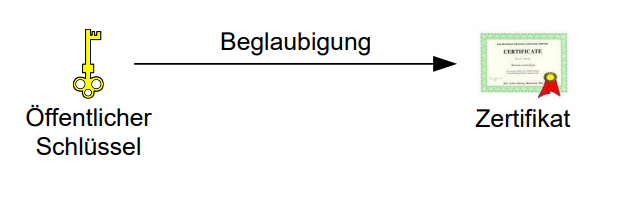
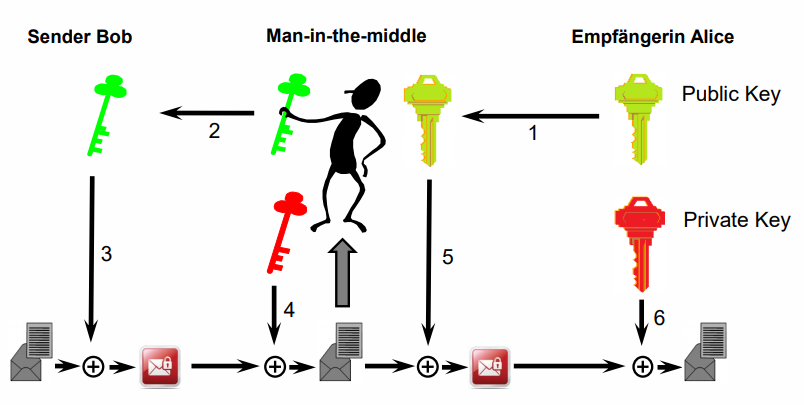

# Public Key Infrastrukturen (PKI)

## Repeition asymmetrische Verschlüsselung & digitale Signaturen

🎯 Sie kennen die Mechanismen, die PKI-Verfahren zugrunde liegen (verschlüsseln, signieren)

Asymmetrische Verschlüsselung:

* Unterschiedliche Schlüssel: Public & Private Key
* Algorithmen: RSA, elliptische Kurven etc.

Digitale Signatur:

* Bieten Integrität von Dokumenten (i.e. dass die Dokumente unverändert sind)
* Bieten Authentizität (i.e. der Ursprung kann bewiesen werten, z.B. wenn das Dokument von Person X signiert, muss diese Person den privaten Schlüssel haben)
* sind effizient erstellt und verifiziert

Übung 1

|                 | Public Key          | Private Key        |
| --------------- | ------------------- | ------------------ |
| Authentizität   | Signatur überprüfen | Signatur erstellen |
| Vertraulichkeit | Verschlüsseln       | Entschlüsseln      |

Übung 2

|            | Sender has...        | Recipient has...      |
| ---------- | -------------------- | --------------------- |
| Signing    | Sender Private Key   | Sender Public Key     |
| Encrypting | Recipient Public Key | Recipient Private Key |

## Signieren & Verschlüsseln (Beispiel an E-Mail)

🎯 Sie wissen, wann öffentliche und wann private Schlüssel beim Einsatz von PKI-Verfahren zur Anwendung gelangen

🎯 Sie wissen, worauf beim Beantragen von Zertifikaten zu achten ist

- Session Key wird nur für diese E-Mail angewendet und verschlüsselt die Meldung symmetrisch
- wird zufällig generiert und asymmetrisch verschlüsselt (mit Public Key des Empfängers)
- => hybrid weil symmetrische Algorithmen schneller (weil Dokumente gross sind) und asymmetrische, langsame Algos müssen nur den Schlüssel verschlüsseln (z.B. 256 bit). 
- Man nimmt die Vorteile der Schlüsselverteilung der asymmetrische Krypto mit der Performance der symmetrischen Verfahren.
- Der Schlüssel muss **vertraulich** verteilt werden => das geht bei asymm. Krypto einfacher, sonst wirds aufwändig.

TODO: Wie müssen die Schlüssel verteilt werden? 

Von links nach rechts (Folie 15):

* unten: Session Key mit privaten Schlüssel entschlüsseln => Session Key
* Dokument mit Session Key entschlüsseln
* Signatur überprüfen mit Public Key des Absenders

Verschlüsselung & Signieren: Es wird zuerst signiert, dann verschlüsselt da die Signatur die Authentizität des Plaintextes beweisen soll. Diese Authentizität soll durch die Entschlüsselung nicht verloren gehen, daher wird sie vor der Verschlüsselung angewendet.

## Sicherheitsanforderungen an private und öffentliche Schlüssel

🎯 Sie wissen, wie Zertifikate erzeugt werden

🎯 Sie kennen die wichtigsten Key-Management-Aspekte beim Umgang mit öffentlichen und privaten Schlüsseln

**Certificate Authority (CA)**

> Vertrauenswürdige Institution, die öffentliche Schlüssel beglaubigt und publiziert

* Ordnet öffentliche Schlüssel einer Person zu
* Veröffentlicht diesen öffentlichen Schlüssel & macht ihn dadurch allen Personen zugänglich
* Zertifikat: "Digitale" Beglaubigung des öffentlichen Schlüssels wird als *Zertifikat* bezeichnet
* (Zertifikate können und werden auch für Computer ausgestellt, z.B. Zertifikate für TLS)

**Öffentliche Schlüssel müssen:**

* beglaubigt sein (i.e. eindeutig einer Person oder Computer zugeordnet werden) -> Schlüssel wird in ein Zertifikat embedded
  

Ist dies nicht gegeben, können Angreifende welche man in the middle access haben einfach einen anderen Public Key vorgaukeln und dann die Nachricht abfangen und entschlüsseln (aktiver Angriff). Um keinen Verdacht zu erwecken können sie danach die Nachricht noch immer mit dem richtigen Public Key verschlüsseln und versenden.

**Private Schlüssel**

* müssen sicher aufbewahrt werden (i.e. nur die besitzende Person darf darauf zugreifen)
* beispiele dafür sind Smart-Cards oder Hardware-Keys

## Zertifikate und ihr Lebenszyklus

Zertifikat erstellen:

1. Antragstellende Person wird durch CA verifiziert (z.B. mittels ID, Pass oÄ)
2. Zertifikatsinhalt (Name, Public Key, weitere Info) erstellen
3. Zertifikatsinhalt wird mit dem Private Key der CA signiert -> Resultat: Zertifikat
4. CA veröffentlicht dieses Zertifikat

Zertifikate haben ein Gültigkeitsdatum, danach werden sie ungültig.

**Zertifikatsklassen**

Macht Vorgaben für verschiedene Faktoren:

* Registrierungsprozess
* Was im Zertifikat steht (z.B. Name)
* Zu verwendende Token
* Wer darf so ein Zertifikat erhalten (Inhabende Person)
* Anforderungen an die CA

Die Namen der Klassen variieren bei den Zertifizierungsstellen.

**Class 1 Certificates (tiefe Sicherheit)**

- Überprüft die Identität der Antragsstellenden nicht
- Stellen nur sicher, dass der Name im Zertifikat einmalig ist
- Werden idR online bestellt und sind oft gratis
- Beispiele:
  - Freemail-Certificates: Überprüfung der Identität erfolgt über z.B. eine Validierungsemail (so kann man sicherstellen, dass der Antragsstellende die E-Mail Adresse besitzt)
  - Lets Encrypt: Dasselbe Konzept -> prüft einfach ob Antragsstellende die Domain besitzt

**Class 2 Certificates (mittlere Sicherheit)**

**Class 3 Certificates (hohe Sicherheit)**

**Extended Validation Certificates (höhchste Sicherheit)**

**Certificate Revocation (Ungültigkeitserklärung)**

* Gründe: Privater Schlüssel wurde gebrochen / kam abhanden, Zertifikatsbesitzer verlässt das Unternehmen, Personendaten des Zertifikatsbesitzer haben sich geändert ...s
* Zertifikate werden über die Seriennummer identifiziert
* Revozierte Certs wird auf der Certificate Revocation List (CRL) pro CA geführt, die CA muss diese Liste publizieren
* Alternative dazu ist auch eine Online-Prüfung via Online Certificate Status Protocol (OCSP)

## Bausteine einer PKI

> 🎯 Sie wissen, aus welchen Komponenten eine PKI aufgebaut ist und welche Aufgaben diese haben

**Certification Authority (CA)**

**Personal Security Environment (PSE)**

**Directory Service**

Ist Ablageort der ausgestellten Zertifikate und der ausgestellten CRL • Wird von der Sicherheitsapplikation angesprochen • Kommuniziert zum Zwecke des Datenabgleichs evtl. mit anderen Verzeichnisdiensten • Lagert nicht nur Zertifikate und CRLs, sondern auch andere Personendaten. Bsp. Globales Adressbuch von Microsoft Exchange

**Sicherheitsapplikation**

## Gültigkeit von Zertifikaten & Zertifikatsketten

>  🎯 Sie wissen, wie Zertifikate überprüft werden und welche Rolle dabei Zertifikatsketten spielen