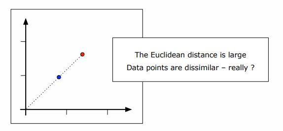
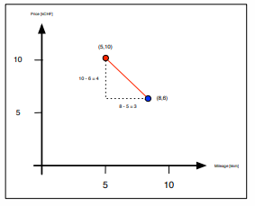
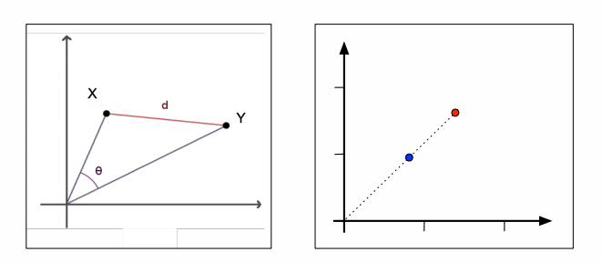
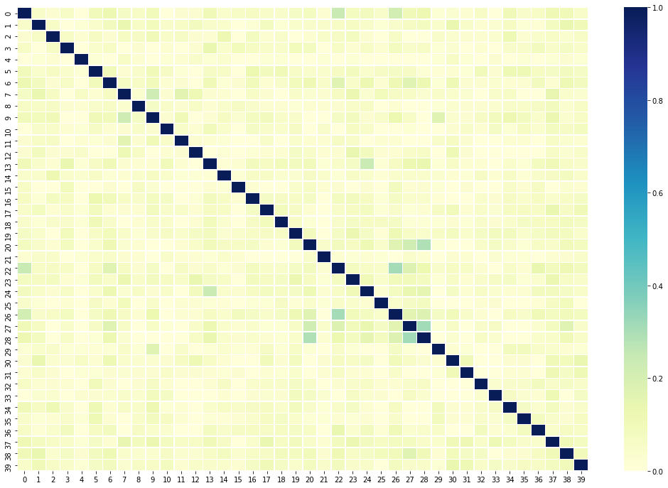
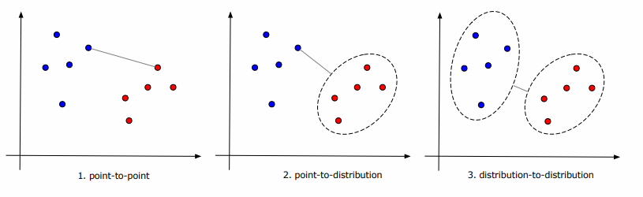
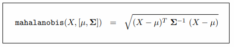
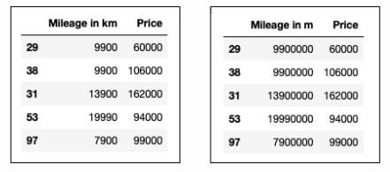
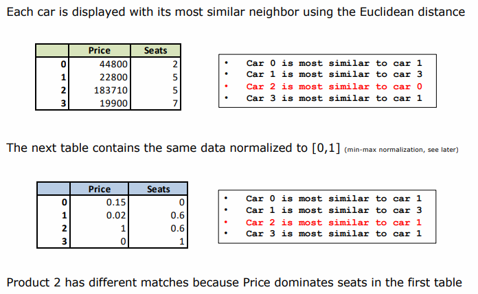
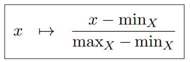
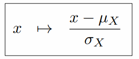

# SW02 - Machine Learning Fundamentals

TODO:
- [ ] document k-NN

## Distance vs. Similarity

Many machine learning algorithms are based on the following assumption:
> The closer two data points in the geometric space, the more similar they are

For example:
* Online dating recommends the user profile most similar to your preferences
* A car reselling platform suggests you a price for your car by taking the average price of the 20 most similar cars sold in the past
* The Amazon recommender system finds customers whose shopping history is most similar to yours and recommends products they have liked

Both properties compete with each other: Similarity is indirectly proportional to distance.

## Distance & Similarity Measures

Following functions can be used as a toolbox to measure distance & similarity. However, the appropriate measure must be chosen semantically meaningful in the domain of the project!

Speaking of semantics, an example:



* This might be reasonable for a car reselling platform: A car with twice the horsepower and price is indeed very different

- This might be unreasonable in natural language processing: An article with twice as many occurrences of the same words should not be different (e.g. copy-paste) (e.g. `AAAA BBBB` and `AAAA BBBB AAAA BBBB`)

### Euclidean Distance

>Generalization of Pythagoras‘ formula to an arbitrary number of dimensions. Also called the L^2 norm.

Finds the most similar data point by minimizing the distance. Note that the Euclidean distance has unbound range $[0, \infty[​$.
$$
euclid(X, Y) = ||X-Y||_2 \\
= \sqrt{\sum_{i=1}^n{(x_i - y_i)^2}} \\
= \sqrt{\sum_{i=1}^n{x^2_i-2x_iy_i+y_i^2}}
$$

A simple example for measuring the eclidean distance between $X = (8, 6)$ and $Y = (5, 10)$:



Python example:

```python
def euclidean_distance(v1, v2):
    ## My first, very naive and verbose approach:
    # e = 0
    # for i in range(0, len(v1)):
    #     e += (v1[i] - v2[i])**2
    # return np.sqrt(e)
    
    # Better approach using properties of numpy.ndarray:
    # v1, v2 are of type `numpy.ndarray`. These arrays can be
    # subtracted from each other just by performing v1 - v2.
    return np.sqrt(np.sum((v1 - v2)**2))

print("Distance between car 0 and car 1 = ", euclidean_distance(X_car0, X_car1))
print("Distance between car 0 and car 2 = ", euclidean_distance(X_car0, X_car2))
```


### Cosine Similarity & Distance

While the euclidean distance measures the length $d​$ between two points, the Cosine similarity measures the angle $\phi​$ between the two vectors $X​$ and $Y​$.



In the right picture, the cosine similarity between the two points is 0 - but they have a large Euclidean similarity.

```python
def cosine_similarity(v1, v2):
    # First approach (naive and verbose)
    # return np.sum(v1 * v2) / (np.sqrt(np.sum(v1**2)) * np.sqrt(np.sum(v2**2)))
    
    # Better approach:
    # np.dot = Dot product
    # np.linalg.norm = n-th norm (none given means n = 2, so the L^2 norm)
    sim = np.dot(v1, v2) / (np.linalg.norm(v1) * np.linalg.norm(v2))
    return sim

print("Distance between car 0 and car 1 = ", cosine_distance(X_car0, X_car1))
print("Distance between car 0 and car 2 = ", cosine_distance(X_car0, X_car2))
```

#### Cosine Similarity

The cosine similarity has a range of $[-1, 1]$
$$
cos(X,Y) = \frac{\langle X,Y \rangle}{||X||_2\cdot||Y||_2} = \frac{\sum_{i=1}^n{x_iy_i}}{
    \sqrt{\sum_{i=1}^n x_i^2} \sqrt{\sum_{i=1}^n y_i^2}
}
$$

The **distance** is defined by $1 - \text{cosine similarity}$

```python
def cosine_distance(v1, v2):
    return 1 - cosine_similarity(v1, v2)
```


### Jaccard Similarity for Sets

The jaccard similarity (or jaccard score) between the sets $X$ and $Y$ is defined as:
$$
jaccard(X, Y) = \frac{|X \cap Y|}{|X \cup Y|}
$$

Means that it is the number of common items present in both $X$ and $Y$ (intersection) divided by the total number of items in both sets (union). The range of the Jaccard similarity is $[0, 1]$. Meaning 1 is very similar (identical) and 0 is not similar at all.

Possible applications:

* Two shopping carts are similar if they contain the same items:
  $$
  |X \cap Y| = |X \cup Y| = 1
  $$

* Text paragraphs are similar if they use the same jargon / (word-) stems

```python
def jaccard_similarity(list1, list2):
    similarity = 0
    similarity = len(np.intersect1d(list1, list2)) / len(np.union1d(list1, list2))
    return similarity
```

The similarities can also be visualized using a heatmap. The darker the box, the more similar they are.

```python
dm = np.asarray([[jaccard_similarity(p1, p2) 
                  for p1 in X_train[0:40]] 
                    for p2 in X_train[0:40]])
fig, ax = plt.subplots(figsize=(18,12))    
ax = sns.heatmap(dm, linewidth=0.5, cmap="YlGnBu")
plt.show()
```



### Manhattan Distance

The L1 norm or Manhattan distance between X and Y is defined as:
$$
\text{manhattan(X,Y)} = \sum_{i=1}^n{|x_i - y_i|}
$$
The range of the Manhattan distance is [0, ∞]

### Levenshtein or Edit Distance (for Strings)

* count $+2$ when changing a character (since it is basically deleting + adding)
* count $+1$ when adding a character
* count $+1$ when deleting a character

A few examples:

* from *banana* to *ananas*: 1 [d] + 1 [a] = 2
* from *Hello* to *Yellow*: 1 [c] + 1 [a] = 3

## Get nearest neighbour

Using the euclidean or cosine similarity, we can search for the most similar neighbor of a data point in a data set in Python. `distance` is a similarity function passed into the function. Note, here we work with **distance**.

```python
def get_nearest_neighbor(source_car, cars, distance):
    """First approach (naive & verbose)
    # Just perform distance in a list comprehension
    distances = [distance(source_car, car) for car in cars]
    idx = distances.index(min(distances))
    distance = min(distances)
    return distance, idx
    """

    # tqdm shows a fancy progress bar
    similarities = np.array([distance(source_car, car) for car in tqdm(cars)])
    # argmin returns the index of the min value
    idx = np.argmin(similarities)
    distance = np.min(similarities)
    
    return distance, idx
```

For **similarities**, the function is very similar but instead of the min value, the max value is obtained.

```python
def nearest_neighbor(wine, wines):
    similarities = [jaccard_similarity(wine, other_wine) for other_wine in wines]
    idx = np.argmax(similarities)
    similarity = np.max(similarities)
    return idx, similarity
```

## From points to distributions



Imagine the distribution just as a set of data points
1. Recommender systems calculate similarity between single products / users
2. Anomaly detection calculates similarity between *one* credit card transaction and a distribution (e.g. of legitimate transactions)
3. Compare images by calculating similarity between distributions (e.g. histograms of image features)


### Mahalanobis Distance between Point and Distribution

Mahalanobis distance works as follows:
1. Transform the columns of the distribution into uncorrelated variables
2. Scale the columns of the distribution to make their variance equal to 1
3. Calculate the Euclidean distance between the point X and the distribution

Measures how many standard deviations X is away from the mean. Describing the distribution by its mean and covariance matrix Σ.




## Normalization

Normalization one of the most important steps in any Machine Learning project. Raw data is often comprised of attributes with varying scales. One might be in kilograms and another is a count. Take following example:



Kilometer was suddenly change into meter and is therefore a much higher number. The scale in each dimension depends on the data:

* the largest price in the Autoscout24 dataset  is 698000 CHF
* the largest number of doors is only 6

A deviation of 15% dominates a deviation of 15% in the number of doors. Thisd ominance among features falsify the results of machine learning. 

The (pre-)process of **normalization means to bring each attribute to approx. the same scale.** 

The only exception to this are decision trees (e.g. Random Forest). Normalization should have no impact there since it does not work on distance / similarity.

Key take aways:

* Assess normalization parameters on training set for supervised learning
* Persist your normalization parameters for scaling future data


### Example



### Min-Max Normalization

Transform the data to the unit interval $[0, 1]$. The largest piece of information becomes $1$, the smallest becomes $0$.



Pro:

* allows interpretation in %
* has no negative values

Big Con: Can not be used for supervised learning since the min / max is unknown. Since supervised training splits up the input data into *train* and *test* data, only the local min / max is known. The global min / max might be in the other data set, but when training an algorithm, conducting the test dataset should never - under no circumstances - be done! For supervised learning, use the z-score normalization.

### Z-Score Normalization

Transforms your data to $mean = \mu = 0$ and $standard deviation = \sigma =1$. 




- Advantage: works regardless of supervised / unsupervised learning
- Disadvantage: no straight-forward interpretation
- Disadvantage: adopts negative values
- Has no bound range such as $[0, 1]$

In supervised learning works since it assumes (correctly) that the data is randomly distributed into the *test* and *training* set. Therefore, their mean $\mu$ and standard deviation $\sigma$ should be very similar.

### Example (Python)

Following snippet uses both min/max and z-score normalization.

```python
import pandas as pd
from sklearn.preprocessing import MinMaxScaler
from sklearn.preprocessing import StandardScaler

df = pd.read_csv('data/autoscout24/cars.csv')
df = df[['Price', 'Seats', 'Mileage']]
print(df.head())

# Min-Max Normlization
scaler = MinMaxScaler()
df[df.columns] = scaler.fit_transform(df)
print(df.head())

# Undo Normalization
df[df.columns] = scaler.inverse_transform(df)
print(df.head())

# Z-score Normalization
scaler = StandardScaler()
df[df.columns] = scaler.fit_transform(df)
print(df.head())

# Undo Normalization
df[df.columns] = scaler.inverse_transform(df)
print(df.head())
```


## K-nearest neighbors algorithm (k-NN)

TODO