# SW04 - Supervised Learning Fundamentals

## Variants of Machine Learning Models

There are two main approaches to Machine Learning models:
1. By finding a function which divides the data
2. (Kernel) By using a simple function and adding more dimensions to the data until the data can be divided by the simple function (example: 2D - 3D).

## Decision Boundary

Different machine learning algorithms differ in their decision boundary:

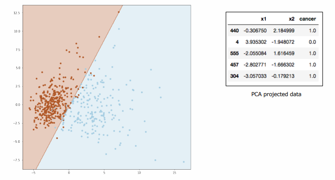

In above example, a 30 dimensional dataset is projected onto 2D using Principal Component Analysis (PCA). The axes can not be interpreted anymore, since they are a linear combination of the features. The following graphics illustrate various classification algortihms and their decision boundaries:

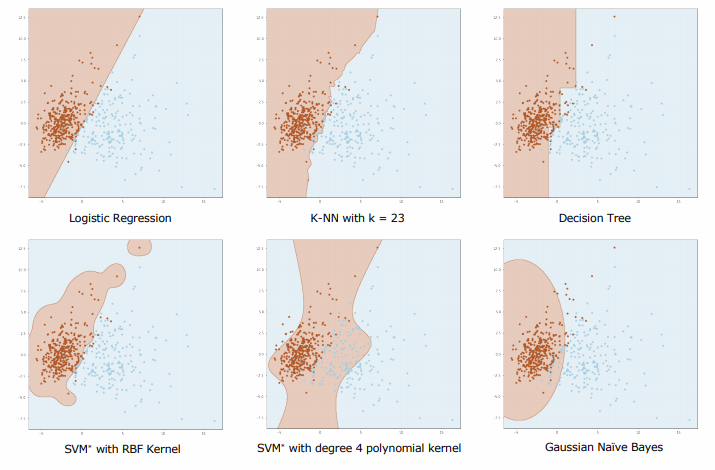

 ### Linearly separable data

Both algorithms draw a linear decision boundary. But the SVM maximizes the margin (the distance between the nearest point and decision boundary), while the logistic regression is very sensitive to the number of data points in each class (think of magnets, that pull the line to the site with more magnets.)

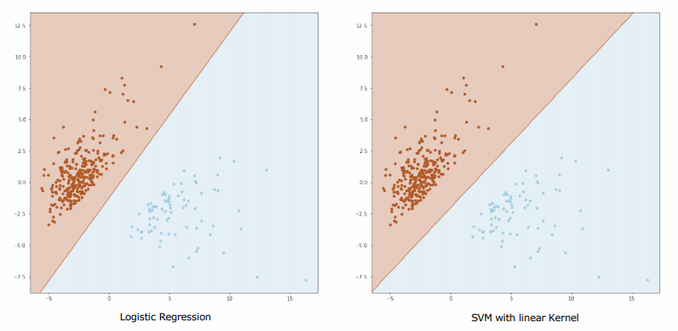

When data is not linearly separable, take a model with a non-linear decision bounday (as seen in the examples above) or use a kernel.

### The kernel trick

Data is projected into a high(er)-dimensional space, where it might become linearly separable. These transformations are performed by mathematical kernels. For example, the blue dots can not be separated from the red dots in 2 dimensions. Using a kernel, we can project the data into a 3 dimensional space and can linearly separate them:

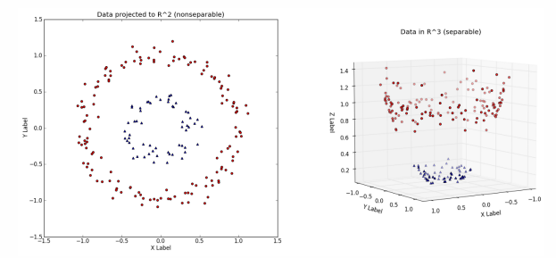

## Simple ML Quality Assessment

### Simplest machine learning workflow

In the simplest form, the dataset is split into a *training* and a *test* set. The *training* set is obviously used to train a regressor or classifier. The *test* set is used to evaluate the performance of the model on **unseen** data.

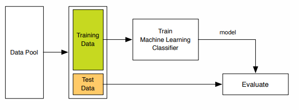

This approach only work with a lot of data and fixed hyperparameters.

### Train / Test Splits

1. Always randomly shuffle the data
2. Split the data into *training* and *test set* (~ 70% / 30%)
3. Training and test set must be completely disjoint (e.g. multiple images of the same person must only ever be in one set, not in both)
4. Training: Process to minimize some **cost function** on the training set by fitting the model parameters
5. Testing: Process to report the performance on a yet unseen test set using some **evaluation function**
6. Only a fresh evaluation on yet unseen test data can give an estimate of how well the model generalizes

#### Perform train / test splits in  Python

See the scikit-learn documentation for [train_test_split](https://scikit-learn.org/stable/modules/generated/sklearn.model_selection.train_test_split.html).

Splitting the data into: 60% training data, 20% validation and 20% test_data:

```python
# First, split data into 60/40 train and test set
X_train, X_test, y_train, y_test = train_test_split(X, y, test_size=0.4, random_state=42)
# Split the test set further into 20% (of total data set)
X_test, X_val, y_test, y_val = train_test_split(X_test, y_test, test_size=0.5, random_state=42)

print("X_train:", X_train.shape)
print("y_train", y_train.shape)
print("X_val", X_val.shape)
print("y_val", y_val.shape)
print("X_test:", X_test.shape)
print("y_test", y_test.shape)
```

## Measuring Quality of Classification

### Confusion Matrix

Given a binary classification problem, using the labels *positive* and *negative*, there are four cases:

For binary classification, there are for cases:

* True positives (TP): Number of samples with the label *positive* which were correctly predicted by the classifier as *positive*
* False positives (FP): Number of samples with the label *negative* which were wrongly predicted by the classifier as *positive*
* False negative (FN): Number of samples with the label *positive* which were wrongly predicted by the classifier as *negative*
* True negative (TN): Number of samples with the label *negative* which were correctly predicted by the classifier as *negative*

Hence this definition, one aims to keep the number of FP and FN low and the number of TP and TN high.

As an example: A classifier was supposed to predict the presence of lung cancer:

| n = 165     | Predicted: NO | Predicted: YES |
| ----------- | ------------- | -------------- |
| Actual: NO  | 50            | 10             |
| Actual: YES | 5             | 100            |

The test set consisted of 165 patient records. Given the confusion matrix above, the results can be read as:

* 50x True Negatives: classifier correctly predicted NO
* 100x True Positives: classifier correctly predicted YES
* 5x False Negatives: classifier wrongly predicted NO
* 10x False Positives: classifier wrongly predicted YES

To remember:

* The first statement (true | false) tells if the classifier was right or wrong
* The second statement (positive | negative) tells in which way it was wrong (e.g. False Positive = wrongly classified something as positive)

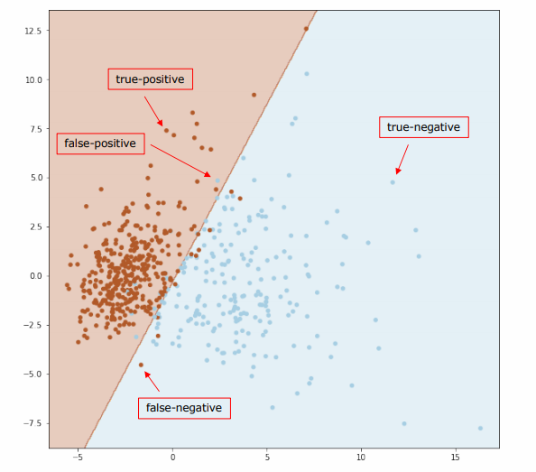

If there are more categories, the confusion matrix grows. For three categories, the confusion matrix can be represented by a 3x3 matrix.

## Measuring Quality of Classification

### Accuracy

> Accuracy measures how often the classifier was *right*


Accuracy is defined as the number of correctly predicted labels over the total number of data points:
$$
\text{Accuracy} = \frac{n(\text{correctly predicted})}{n(\text{all})} =\frac{TP + TN}{Total}
$$
The error rate then is $1 - \text{Accuracy} = \frac{FP + FN}{Total}$.

#### The problem with imbalanced data

Data sets can be imbalanced. Imagine, predicting a rare disease:

* Test set contains 5000 NO and *only* 20 YES records

Imaging having a classifier: `def classifier(x): return False`. Calculating the confusion matrix:

* True positive (predicted: YES & actual: YES): 0
* True negative (predicted: NO & actual: NO):  5000
* False positive (predicted: YES & actual: NO): 0
* False negative (predicted: NO & actual: YES): 20

Calculating the accuracy as $\frac{TP + TN}{Total} = \frac{5000 + 0}{5020} = 0.996 = 99.6\%$. So the classifier - although not doing *anything* - reaches an accuracy of 99.6%. This shows, that accuracy alone is not always suitable.

Take away: Do not use accuracy on imbalanced data, it might yield very good performance while being not accurate at all! The case of heavily imbalanced data is not uncommon. Therefore, always check class imbalance before using accuracy!

### Sensitivity (Performance on YES instances)

Sensitivity is a measure of the proportion of actual positive cases that got predicted as positive (or true positive):
$$
\text{Sensitivity} = \frac{TP}{\text{Actual YES}} = \frac{TP}{TP+FN}
$$
("Of all positive cases, how many did the classifier correctly classify as positive?")

As an example, we are going to use the same confusion matrix as above:
| n = 165     | Predicted: NO | Predicted: YES |
| ----------- | ------------- | -------------- |
| Actual: NO  | 50 (= TN)     | 10 (= FP)      |
| Actual: YES | 5 (= FN)      | 100 (=TP)      |

The number of $\text{Actual YES}$ is the sum of FP and TP, so everywhere where the model predicted YES. Calculating the sensitivity of that model:
$$
\frac{100}{100 + 5} = 95\%
$$
Sensitivity is also called **recall**.

### Specificity (Performance on NO instances)

Specificity is defined as the proportion of actual negatives, which got predicted as the negative (or true negative). 


| n = 165     | Predicted: NO | Predicted: YES |
| ----------- | ------------- | -------------- |
| Actual: NO  | 50 (= TN)     | 10 (= FP)      |
| Actual: YES | 5 (= FN)      | 100 (=TP)      |

$$
\text{Specifity}
	= \frac{TN}{\text{Actual NO}}
	= \frac{TN}{TN + FP}
$$

Here: $\frac{50}{50 + 10} = 83\%$

### Precision

Sometimes, the true negatives (TN) can not be assessed. This yields an issue with some of the aforementioned measures (think of true negatives within a Google search query: can not be assessed). Therefore, use precision. It measures how often the model is correct when it predicts YES.
$$
\text{Precision}
	= \frac{\text{TP}}{\text{Predicted: YES}}
	= \frac{\text{TP}}{\text{TP + FP}}
$$


Using above confusion matrix, precision would be: 100 / (100 + 10) = 91%.

### Probabilistic Interpretation

1. Sensitivity is the probability of a positive test given the patient has cancer:
   p(Classifier = YES | Cancer = YES)
2. Specificity is the probability of a negative test given the patient has no cancer:
   p(Classifier = NO | Cancer = NO)
3. Precision is the probability that a random patient from all those with a positive test indeed has cancer:
   p(Cancer = YES | Classifier = YES)

### F1 Score

The F1 score is the harmonic mean between precision and sensitivity (aka recall):
$$
\text{F1} = \frac{2 \cdot \text{precision} \cdot \text{recall}}{\text{precision} + \text{recall}}
$$
Use F1 whenever you have a classification problem with skewed data.

It becomes obvious (given the two measures), that the F1 score does not take TN into account!

F1 has a property, that it is strongly biased towards the worse score:

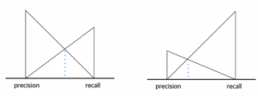


Remember: Since both these measures are ratios, one has to calculate the *harmonic* mean.

## Measuring Quality of Regression

### Regression Errors

There are infinitely many ways to draw a straight line, which one is the best? -> It is the one that minimizes the blue error terms (called residuals).

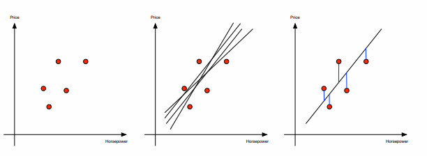

### How to Measure Regression Errors

Assume i = 1, …, m data points with predictions $f_i$ for data value $y_i$.

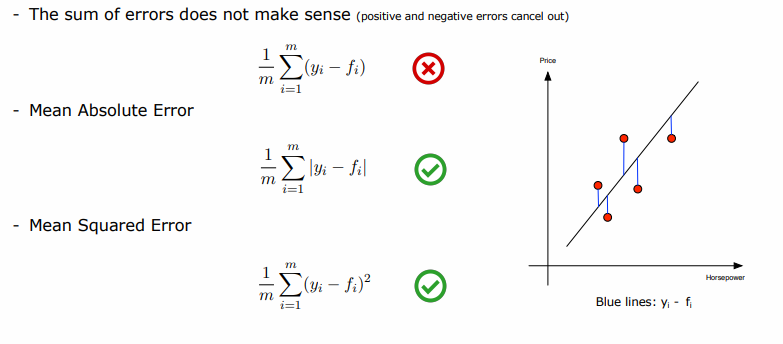

### $R^2$ Coefficient

$R^2$ is a statistical measure of how well the predictions approximate the real data points. 

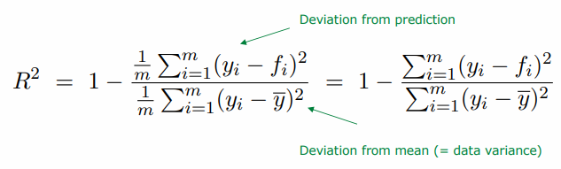

* Property: $R^2 \le 1$
* $R^2 =  1$ indicates, that the *predictions perfectly fit the data*
* $R^2 = 0.53$ means that 53% of the variance in the data is being explained by the model
* Values of $R^2 \lt 0$ can occur when the model fits the data worse than a horizontal hyperplane

## ML Quality Assessment in Practice

### Hyperparameters

## Cross Validation

A train-validation-test split of 60% / 20% / 20% is common. But this split is only possible, when there is enough data. If this is not the case, *k-fold cross-validation* can be applied: the data is split into 80% training and 20% test data (test data is locked away!). But even when there is enough data, cross-validation might add some additional trustworthiness.

An example for a 10-fold cross-validation:

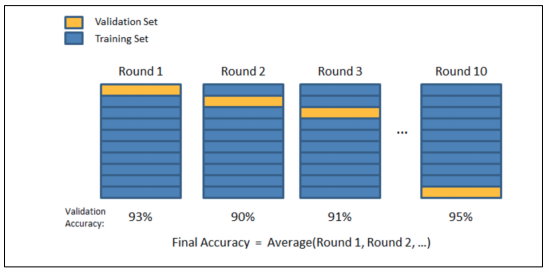

### k-fold cross-validation

The parameter $k$ determines the number of groups the data is split into (e.g. see above for $k = 10$). The general procedure for k-fold cross-validation is as follows:

1. Shuffle the data set (the training data!) randomly
2. Split the data set into $k$ groups
3. For each group:
   1. Use this group as the validation set while the remaining groups form the training set
   2. Fit a model on the training set and evaluate it on the formed validation set
   3. Note the evaluation / performance score of the model

In the end, the model that performed best can be chosen.

See also [STATQUEST](https://www.youtube.com/watch?v=fSytzGwwBVw)  (brought you by the friendly folks from the genetics department)

Leave-One-out Cross Validation (LOOCV) chooses $n$ as the parameter $k$, means that every sample (e.g. every patient) is a block itself!

## k-NN Classification and Regression

Pros:

* Good for small data sets since it always converges (sometimes, k-NN can even be the only possible algorithm since they do not converge!)

Cons:

* Can be unsuitable for very large data sets as the performance will be very slow

### An example of k-NN Regression 

See scikit-learn documentation for [KNeighboursRegressor](https://scikit-learn.org/stable/modules/generated/sklearn.neighbors.KNeighborsRegressor.html).


```python
feature_columns = ['Mileage', 'Year', 'Horsepower', 'Doors', 'schwarz']
X = df[feature_columns].values
```

```python
// We convert it to float so we don't get a conversion warning when normalizing the data

X = X.astype("float") 
y = df.Price.values

from sklearn.model_selection import train_test_split

X_train, X_test, y_train, y_test = train_test_split(X, y, test_size=0.2, random_state=42)

print("X_train:", X_train.shape)
print("X_test:", X_test.shape)
print("y_train", y_train.shape)
print("y_test", y_test.shape)
```


