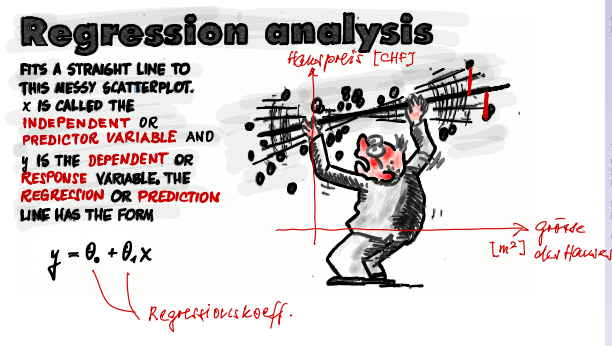

# SW06 - Linear Regression

## Topics

* Simple Linear Regression
  * Introduction
  * Coefficient of Determination (R-squared)
  * (Pearson) Correlation Coefficient
* Tipps & Tricks (not only) in Simple Linear Regerssion
* Multiple Linear Regression

> **Goal:** understand how to estimate one dependent feature based on the knowledge of one or more independent features. You are able to judge, how accurate this estimate is.
>
> **Result:** Using linear regression You are able to estimate the price of a house, based on various influencing features like number of (bath-) rooms, number of floors, etc.

## Simple Linear Regression

### Motivation

### Regression and Machine Learning

* Regression is a *supervised* learning type algorithm
* The prediction of continuous outcomes (target values), based on a number of predictor (explanatory) variables is called regression analysis
* Linear Regression assumes a linear relation between predictor variables and target (or response/estimated) variable
* *Simple* linear regression models have only *one predictor*.
* Regression models attempt to minimize the distance measured vertically between the observation point and the model line (or curve).
* The length of that line is called *residual* (or modeling error or simply error)
* The negative and positive errors should each cancel out. We want zero overall error. Many lines will satisfy this criterion; but we want the best line!

### The best fitting line

[STATQUEST Linear Regression](https://www.youtube.com/watch?v=nk2CQITm_eo)

Main concepts

1.  Use least-squares to fit a line to the data
2. Calculate $R^2$
3. Calculate p-value for R^2 (???)

It's all about fitting a line to data.

Distance from a line to the data point is called residual

R^2 helps how good that guess is

1. calculate average of y values
2. sum the squared residuals
   1. measure distance from the mean to the datapoint, square it and sum it up
   2. SS(mean) = Sum of squares around the mean = (data - mean)^2
   3. varation  around mean: (data - mean)^2 / n
   4. same as, var(mean) = ss(mean) / n

R^2 tells us how much of the variation in mouse size can be explained by taking mouse weight into account.

--

> **Linear Regression** is a machine learning algorithm based on **supervised learning**. It performs a **regression task**. Regression models a target prediction value based on independent variables. It is mostly used for finding out the relationship between variables and forecasting. Different regression models differ based on – the kind of relationship between dependent and independent variables, they are considering and the number of independent variables being used.

Linear regression predicts a dependent variable value $y$  based ona given, independent variable $x$. It finds a linear relationship between the input variable $x$ and the output variable $y$.

In the above example from https://www.geeksforgeeks.org/ml-linear-regression/, $X$ is the work experience and $Y$ is the salary of a person. The line between the points is the best fit line for the model.

What does best fit line mean?

We build a hypothesis function for our linear regression, assuming there is a linear relationship. This hypothesis function $h_\theta(x)$ can be modeled as:
$$
h_\theta(x) = \theta_0 + \theta_1x
$$
Where $\theta_0$ is the $y$ intercept and $\theta_1$ is the coefficient of $x$. When we train the model, we want to *fit* the line as good as possible. In ML terms, $x$ is the input training data (here: univariate, simple linear regression) and $y$ are the labels to the data. The model gets fit by finding values for $\theta_1$ and $\theta_2$. The line fits best when we found the best values for these parameters.

We find the best values  for $\theta_1, \theta_2$ by minimizing the distance between the predicted $y$ and the real $y$. This vertical distance is called *residual* (or *modeling error* or simply just *error*):
$$
e^{(i)} = y^{(i)}-(\theta_0+\theta_1x^{(i)}), i = 1,\ldots,n
$$
The error $e$ is the vertical distance between any real data point $y^{(i)}$ and our prediction $(\theta_0+\theta_1x^{(i)})$.

Next, we choose the parameters ($\theta_0, \theta_1$) of our model by minimize the sum of the squared errors. That means, minimizing the cost function $J$.
$$
J(\theta_0, \theta_1)
	= \frac{1}{2n} \sum_{i=1}^n(e^{(i)})^2
	= \frac{1}{2n} \sum_{i=1}^n[y^{(i)}-h_\theta(x^{(i)})]^2
$$
Note: $\frac{1}{2n}$ is just for simplicity when later the derivative is taken.

his is the **cost function J** and we will use the squares of errors. Hence we want to minimize the cost function $J$:
$$
J = \frac{1}{n}\sum_{i=1}^n(pred_i - y_i)^2
$$

### Coefficient of Determination (R-Squared)

TSS = total sum of squares

## (Pearson) Correlation Coefficient