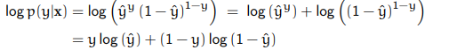

# ML - SW08 - Logistic Regression

> Logistic regression is a classification algorithm used to assign observations to a discrete set of classes. Unlike linear regression which outputs continuous number values, logistic regression transforms its output using the logistic sigmoid function to return a probability value which can then be mapped to two or more discrete classes. - [ML Cheatsheet](https://ml-cheatsheet.readthedocs.io/en/latest/logistic_regression.html)


Logistic Regression is a supervised learning method for classification. It works similarly to linear regression, but instead of returning a numeric value(s), it returns the probability that *something* belongs to a certain category.

In the case of binary classification, that means that the target variable $y$ can only take two values, e.g. $\{0,1\}$.

It works similar to linear regression in that it uses a hypothesis function and a way to measure how off the hypothesis is (cost function). Instead of a linear model, logistic regression utilizes the **Sigmoid or logistic function**, defined as:
$$
\sigma(z) = \frac{1}{1+e^{-z}}
$$


The sigmoid function takes values between zero and one. If $z$ is a going to infinity, the denominator ($e^{- \text{ something large}}$) becomes very small and $\sigma(z)$ tends to $1$. In the other direction, if $z \rightarrow -\infty$, the sigmoid function tends to zero.


You might ask - why a curve, why not use a line? The sigmoid function only takes values between $0$ and $1$, which is perfect for probabilities. A line could take values bigger than $1$.  The graph of $\sigma(z)$ shows clearly, that in order for $\sigma(z) = 0.5$, $z$ must be zero. This becomes clear when putting the $0$ in the equation.

### Decision Boundary

The sigmoid function returns a probability:

* if $p(x) \gt 0.5$ then $x$ belongs to the class $y = 1$
* if $p(x) < 0.5$ then $x$ belongs to the class $y = 0$

That means, if we predicted $0.7$ for an observation, that observation belongs to the class $y = 1$. If we made the prediction $0.2$, that observation would belong to $y = 0$. If we'd use more that two classes, we'd choose the class with the highest predicted probability.

### Making predictions

In logistic regression, the prediction functions returns the probability that an observation $x$ belongs to the class $y = 1$ (or "class 1", "positive", True, etc). It is notated as $\hat{y} = P(y = 1| x)$. As this probability gets closer to $1$, the logistic regression model is more confident that the observation belongs to $y = 1$.

The prediction is again performed using the equation from linear regression ($\theta_o+\theta_1x_1+...$). But since we want probabilities, we use this equation as a parameter to the sigmoid function.
$$
p(y = 1|x) = \sigma(\theta_0 + \theta_1x_1...)
$$
If it outputs, for example $0.2$, the model is predicting a 20% chance of $y = 1$ (e.g. passing an exam).


### Maximum Likelihood Estimation

This probability an be rewritten into one equation (with some tricks):
$$
p(y|x) = \hat{y}^y(1-\hat{y})^{1-y} =
\begin{cases}
	\hat{y} & \textrm{if y = 1} \\
	1 - \hat{y} & \textrm{if y = 0}
\end{cases}
$$
We want to maximize the above stated probability. That means, the probability that during training, we label the training set as good as possible: p("correct labels in our training set"). This probability is the product of all individual probabilities:
$$
\prod_{i=1}^n p(y^{(i)}|x^{(i)})
$$
We want to maximize this probability. We choose the logarithm of the probability to maximize, since the log is strictly monotonic. Using the **maximum likelihood estimation**, we choose a parameter vector $\theta$ so that the log of this probability is maximal.

Using the logarithm, the above product can be rewritten as:
$$
log \cdot p(\text{"correct labels..."}) = \sum_{i=1}^n log(p(y^{(i)}|x^{(i)}))
$$
The log of the probability can be rewritten as follows:



$\hat{y} = \sigma(x^T\theta)$  is the estimated probability $P(y = 1|x)$ for $y = 1$ given the independent variable(s) $x$.

#### Cost function

The cost function is constructed using the maximum likelihood estimator constructed above. We want to maximize the probability by minimizing the cost function.
$$
J(\theta)
	= - \frac{1}{n}\sum_{i=1}^n log(p(y^{(i)}|x^{(i)}))
	= - \frac{1}{n}\sum_{i=1}^n [y^{(i)}\log(h(\theta, x^{(i)})) + (1-y^{(i)})\log(1-h(\theta, x^{(i)}))]
$$
An explanatory python implementation (from [ML Cheatsheet](https://ml-cheatsheet.readthedocs.io/en/latest/logistic_regression.html)):

```python
def cost_function(features, labels, weights):
    '''
    Features:(100,3)
    Labels: (100,1)
    Weights:(3,1)
    Returns 1D matrix of predictions
    Cost = (labels*log(predictions) + (1-labels)*log(1-predictions) ) / len(labels)
    '''
    observations = len(labels)

    predictions = predict(features, weights)

    # Take the error when label=1
    class1_cost = -labels*np.log(predictions)

    # Take the error when label=0
    class2_cost = (1-labels)*np.log(1-predictions)

    # Take the sum of both costs
    cost = class1_cost - class2_cost

    # Take the average cost
    cost = cost.sum() / observations

    return cost
```

#### Gradient Descent

In short, the gradient descent can be accomplished by this matrix equation:
$$
\theta_{k+1} = \theta_k - \alpha\frac{1}{n}X^T(\sigma(X\theta_k) - y)
$$
To construct the gradient of the cost function we need following partial derivatives. First, we take the partial derivative of the hypothesis function (i.e. the sigmoid function):


For these equations, the chain rule and $\sigma'(z) = \sigma(z)(1 - \sigma(z))$ was used. To construct $x_k^{(i)}$:


The $1$ comes from the fact, that $x_0^{(i)} = 1$, since this is the first column of the data matrix $X$.

Next, we take the partial derivatives of the log probability of both cases ($y = 1$ and $y = 0$):

For $y = 1$ (i.e. $p(y = 1 | x) = \hat{y}$)


And for $y = 0$ (i.e. $1 - \hat{y}$):


With these partial derivatives, we can construct the partial derivative of $J_i$ in regards to $\theta_k$. $J_i$ is the i-th summand of $J_i(\theta)$ where $i$ is the i-th sample.


Now, we sum these $J_i$ up and finally receive the gradient of $J(\theta)$:


##### Gradient Descent Algorithm

Given $n$ samples in a training set of the form $(x^{(i)}, y^{(i)}), i = 1,2, \dots, n$ in a binary classification problem (i.e. $y \in {0,1}$) the cost function $J(\theta) = \frac{1}{n}\sum_{i=1}^n [y^{(i)}\log(h(\theta, x^{(i)})) + (1-y^{(i)})\log(1-h(\theta, x^{(i)}))]$ is minimized using gradient descent.

Therefore, we again start with a random parameter vector $\theta_0$ and iterate until we reach convergence or a set limit.


## Ressources

* [Deep Learning @ Stanford](http://deeplearning.stanford.edu/tutorial/supervised/LogisticRegression/)
* [ML Cheatsheet on Logistic Regression](https://ml-cheatsheet.readthedocs.io/en/latest/logistic_regression.html) 