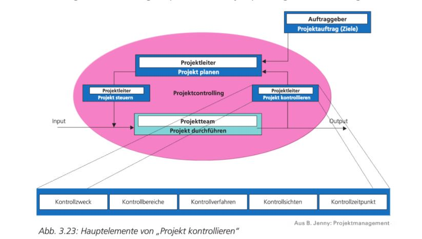
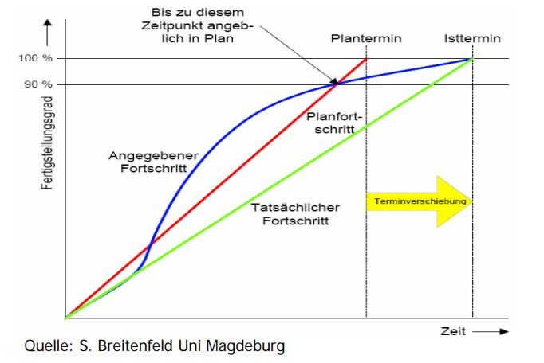
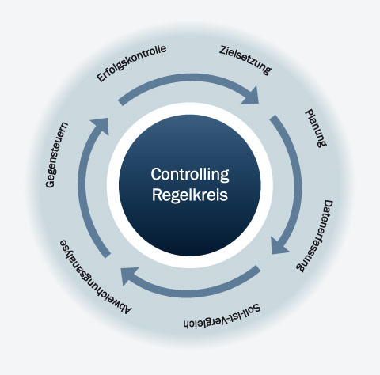

# Projektcontrolling

## Lernziele

* Sie können erläutern, warum Projektcontrolling betrieben wird.
* Sie sind in der Lage, auf Grundlage einer Liste von Arbeitspaketen ein sauberes Controlling für ein Software-Projekt aufzusetzen.
* Sie kennen die Projektcontrolling-Instrumente in der agilen Entwicklung.

# Controlling in klassischen Projekten

Definition nach Bruno Jenny:
> Die Projektkontrolle umfasst alle Aktivitäten, um projektbezogene Abweichungen zwischen dem Plan- und dem IST-Zustand aufzudecken.

Das Controlling ist ein regelmässiger Abgleich des Projektes zwischen dem Soll-Zustand (Projektplan) und Ist-Zustand (geleistete Arbeit, vorliegende Teilresultate).

## Ziele

Das Projektcontrolling hat zum Ziel, frühzeitig festzustellen ob ein Projekt *on track* ist. Dazu können folgende Fragen beantwortet werden:
 * Liegt das Projekt in der Zeit?
 * Kann das Budget eingehalten werden?
 * Sind die nächsten Meilensteine erreichbar?

Eintrittsindikatoren von Risiken sollen frühzeitig erkennt werden:
 * Technische Risiken: Tasks dauern länger als geplant
 * Fehlerhafter Zeitplan: Aufwände sind falsch geplant und benötigen deutlich mehr Zeit.

Falls die Ressourcen nicht voll ausgelastet sind, muss man sich überlegen ob es Aufwandverschiebungen zwischen Arbeitspaketen gibt.

Durch eine Umverteilung der Ressourcen kann dies abgehandelt werden.

Post-Mortem Analyse:
* Signifikante Abweichungen zwischen Schätzung und IST-Aufwand. Diese gilt es zu untersuchen und aus diese Ergebnisse bilden die Grundlange für eine verbesserte Schätzmethode
* Verhältniszahlen für Phasenaufwände gewinnen (hilft bei späteren Projekten)

## Projektplan als Grundlage

Bevor ein Controlling erfolgen kann, muss folgendes **definiert** sein:
* Projektziele
* Projektresultate
* Teilresultate
* Arbeitspakete
* Aufwand der Arbeitspakete geschätzt (Grösse der AP zwischen 5 und 20 Personentagen)
* Projektplan
    * Parallele Arbeitspakte zu Phasen zusammengefasst, orientiert an Projektergebnissen
    * Pakete verteilt auf Mitarbeiter entlang der Zeitachse
    * Meilensteine (Inhalt und Termin) sind festgelegt

## Verfahren

Der Vergleich zwischen Ist- und Soll-Zustand erfolgt auf Basis der Arbeitspakete.
Pro Arbeitspaket wird eine Status-Information erfasst.
* "Offen" - noch nicht begonnen
* "in Arbeit" - begonnen, aber noch nicht fertig
* "erledigt" - Abgeschlossen

## Fertigsstellungsgrad

Der Fertigsstellungsgrad definiert eine Schätzung darüber, in welchem Umfang die Arbeit an einem Arbeitspaket fertig gestellt wurde. Dabei wird zwischen **absoluten** und **relativen** Fertigsstellungsgrad unterschieden:
* **absolut**:
    * wird nur für vollständig abgeschlossene Arbeitspakete berechnet. Vollständig heisst z.B:
        * Code ist integriert und getestet
        * Review- und Freigabeprozess für Dokument erfolgreich beendet
    * Voraussetzung dafür ist, dass die Arbeitspakte genügend klein sind

* **relativ**:
    * prozentualer Anteil der Aufgabenerfüllung
    * Problem: "fast-schon-fertig" Syndrom

## Das "fast-schon-fertig" Syndrom

Entwickler bewerten den erreichten Fertigsstellungsgrad oft zu hoch:

## Restaufwand

Der Fertigsstellungsgrad sollte aus "verbrauchter Aufwand" und "geschätzter Restaufwand" berechnet werden.

Erfahrene Projektleiter interessiert nicht den Grad der Fertigstellung, sondern den noch zu leistenden Restaufwand.

## Verfahren

Ausgangslage ist die Schätzung (= das Budget):
* Stellt das SOLL dar (Vorgabe für den maximalen Verbrauch)
* Dies wird nicht angepasst!

* Die Daten für den IST-Zustand kommt aus Zeiterfassungstool oder Arbeitsrapporte.

* SOLL minus IST ergibt dass Restbudget: So viel Aufwand darf gemäss Vorgabe noch getrieben werden

* Restaufwandschätzung (RAS): Schätzung des Aufwandes der in absehbarer Zeit noch betrieben wird.

* SOLL - IST - RAS = wahrscheinliches Gesamtergebnis für das Arbeitspaket
    * > 0: Vorsprung
    * < 0: verzug

Kleinere Abweichungen sind in der regel unkritisch.

Bei grösseren Aufwandserhöhen muss kritisch betrachtet werden:
* Hat es Auswirkungen auf den Endtermin?
* Gibt es Probleme mit der Ressourcenverteilung?
* Sind wir auf einem kritischen Pfad?

## Rhytmus

Das Controlling sollte in regelmässigen Abständen stattfinden:
* In Software-Projekten üblicherweise 14-täglich
* In langen Projekten (> 1.5 Jahre) monatlich
* In kritischen Phasen bis zu wöchentlich
* Granularität der IST-Zeiterfassung (meist 0.5 - 1h)

## Auswertung

Die erhobenen Daten aus IST-Zustand müssen nun ausgewertet werden. Insbesondere die Meilenstein Trendanalyse macht schnell den Stand und Planungsverlauf ersichtlich:
* Zu jedem Überprüfungszeitpunkt werden die Meilensteine nach dem Projektverlauf neu prognostiziert
* Sie eignet sich besonders für die Zeitkontrolle eines kritischen Pfades

## Folgen des Controllings

* Jede Abweichung muss ergründet werden:
    * Ist sie unbedeudent und kann vernachlässigt werden?
    * Einzelfall auf Grund eines Planungsfehlers?
    * Auf Grund veränderter Rahmenbedingungen?
    * Systematische Abweichungen / Planungsfehler

* Gegensteuern durch Massnahmen: (Unbedingt den Änderungsprozess einhalten!).

* Gegenmassnahmen auf Erfolg kontrollieren
* Ausgehend von den Massnahmen Ziele neu definieren

## Regelkreis

Der Regelkreis des Controllings besteht aus:
* **Zielsetzung** - Klare Ziele definieren
* **Planung** - Wie werden die Ziele erreicht?
* **Datenerfassung** - Regelmässig IST-Daten erheben
* **SOLL-IST-Vergleich** - Abweichung feststellen
* **Abweichungsanalyse** - Gründe für Abweichung analysieren
* **Massnahmen** - gemäss Änderungsprozess definieren
* **Erfolgskontrolle** - greifen die eingeleiteten Massnahmen?

# Controlling in agilen Projekten

## Repetition: Rahmenplan und Produkt-Backlog

* Iterationen werden im Timeboxing geplant (fixe Dauer, flexibler Inhalt)
* Anzahl Sprints und Grösse des Teams wird zu Projektbeginn ermittelt
* Das Produkt-Backlog wird während der Initialisierungsphase erstellt
    * ~80% der Anforderungen sollen identifiziert werden
    * Anforderungen werden priorisiert (Wichtigkeit & Wert)
    * User-Stories für Sprint 1 werden ausgewählt und detailliert

## Controlling in Scrum

### Daily Standup

Im täglichen Standup-Meeting rapportiert jedes Teammitglied:
- Was habe ich seit dem letzten Daily getan?
- Was plane ich, bis zum nächsten Daily zu tun?
- Was hat mich bei der Arbeit behindert? (z.B. fehlende Testumgebung, unvollständiger Produkt-Backlog unvollständig, etc.)

Der Scrum Master hilft, Hindernisse zu erkennen und zu beseitigen.

### Scrum / Kanban Board

Visualisiert den laufenden Sprint und den Fertigsstellungsgrad der einzelnen User Stories. Das Board wird beim Daily Standup aktualisiert.

Des Weiteren bietet es die Grundlage für die Planung. Die Mitglieder wählen neue Arbeiten anhand des Boards.

Voraussetzung ist, dass für jede Aktivität eine User Story oder Task vorhanden sein muss.

### Burndown Chart

Die Fortschrittanalyse zeigt die zu leistende Arbeit bis zum Sprintende auf. Es visualisiert die verbleibenden Tage (x) und die verbleibenden Anzahl Stunden der Arbeiten.

Sie basiert auf Schätzungen der Sprintplanung (geplante Zeit) und der Restaufwandschätzung (RAS).

RAS wird beim Daily rapportiert. Bei Verzug muss der Scrum Master die Hindernisse registrieren und wenn möglich beseitigen.

## "definition of done"

Die Definition of Done beschreibt den Systemtest. Es beantwortet die Frage, wann die User Story richtig implementiert wurde.

Sie dient der Verifikation (gemäss V-Model):
 * Wurden alle Akzeptanzkriterien erfüllt?
 * Laufen alle funktionalen Test durch?

Zusätzlich muss das Team:
 * Unit- und Integrationstests implementieren und durchführen
 * Code Review durchführen
 * Coding Guidelines und Standards prüfen
 * Dokumentation datieren
 * Release Dokumentation anpassen

## Sprint Review

Im Review werden das Sprint-Ergebnis (potential shippable release) validiert. Dabei werden die **Sprintziele** mit den **erzielten Ergebnissen** verglichen.

Das Sprint Review Meeting:
* Teilnehmer: Scrum Team, Stakeholders, (evtl.) CEO
* Product Owner erklärt Release Inkrement basierend auf Scrum Board
* Team demonstriert SW (neue Features) auf der Zielplattform
* Stakeholders geben Feedback und können Fragen stellen
* Wenn nötig passt der Product Owner das Product Backlog an (**Backlog Grooming**)
* Zusammen mit Stakeholder wird das nächste Produktinkrement diskutiert

## Sprint Retrospektive

* Kontinuirlicher Verbesserungsprozess (KVP)
    * Machen wir es richtig?
    * Optimieren der Zusammenarbeit, Prozesse und Tools

* Längere Retrospektiven im grösseren Zeitabstand (z.B. 3-6 Monate)
    * Gibt Möglichkeit, interne Probleme im Team zu addressieren
    * Evtl. Teilnehmerkreis erweitern, bestimmte Probleme direkt mit allen Beteiligten addressieren

## Product Backlog Grooming

Dient der Pfelge des Produkt Backlogs:
* Neue User Stories gem. Bedürfniss der Stakeholder erstellen
* Stories priorisieren
* Aufwand für Stories schätzen (für Projekt Burndown Chart)
* Epics in User Stories aufteilen
* Nicht mehr relevante Stories entfernen

Im Grooming Meeting sollte in der Mitte des Sprints angesetzt werden (mit Product Owner und Scrum Team)
* Basis bietet die Sprint Planung
* Vorgängig müssen Die Backlog Einträge in User Stories übersetzt werden (Requirements Engineering)

## Restaufwand

* Lässt sich nur für die aktuelle Iteration klar bestimmen
* Product-Backlog kann sich im Projektverlauf ändern (z.B. neue Anforderungen kommen hinzu, andere fallen weg)
* Am Sprintende müssen die noch zu realiserenden Items im Backlog im Burndown Chart nachgeführt werden

## Burndown Chart

Beantwortet die Frage, ob alle Anforderungen innerhalb der geplanten Sprints umgesetzt werden können?

* Abweichungen feststellen
* Massnahmen defineren

## Sprint Planning

Am Anfang jedes Sprints erarbeitet der Product-Owner gemeinsa mit dem Team das Ziel des Sprints. Basis dafür:
* Rahmenplanung
* aktualisierte Risikobewertung
* priorisierts Backlog

Geprüft wird, wie viele der hochpriorisierten Items (Stories) im Sprint übernommen werden können.

## Planungspoker

Schätzen der Story Points (Aufwandschätzung). Jedes Teammitglied gibt eine Schätzung ab (minimiert Schätzfehlerrisiko).

# Zusammenfassung

klassisches Projektcontrolling
- Ist das Projekt in der Zeit?
- Kann das Budget eingehalten werden?
- Sind die nächsten Meilensteine erreichbar?

Agiles Projektcontrolling
- Was sind die wichtigsten und wertvollsten Anforderungen?
- Haben wir diese richtig umgesetzt?
- Was ist im nächsten Produktinkrement neu enthalten?
- Können wir das Produkt in den noch verbleibenden Sprints fertig
entwickeln? Wie viele Sprints braucht es noch?