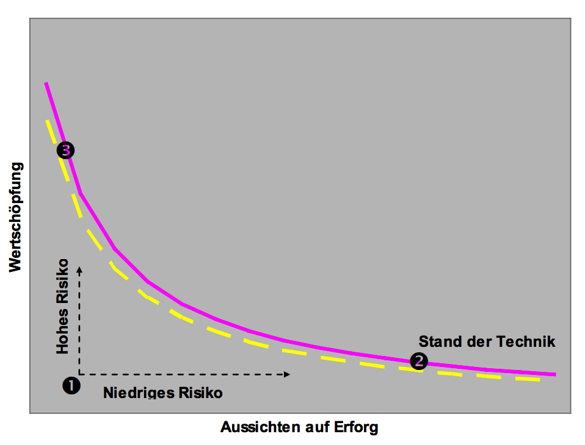
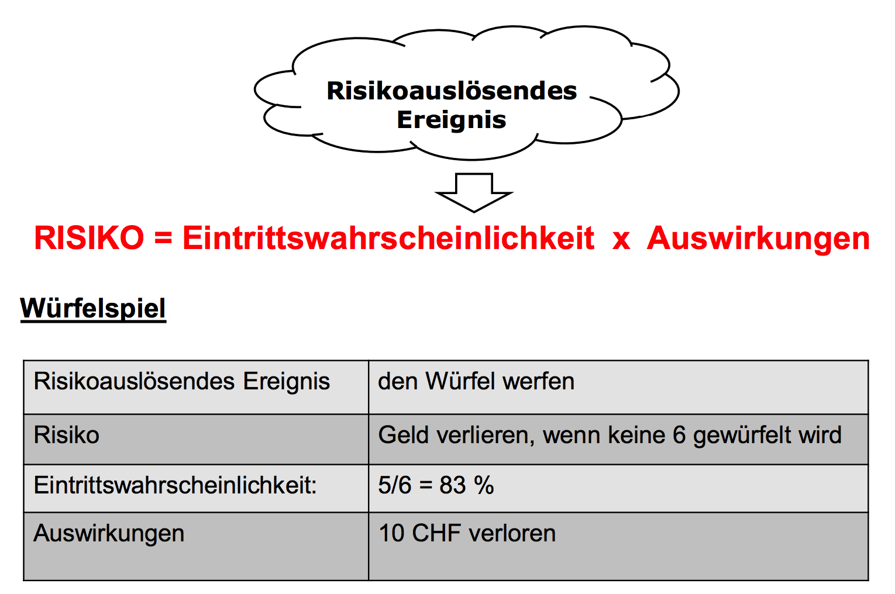
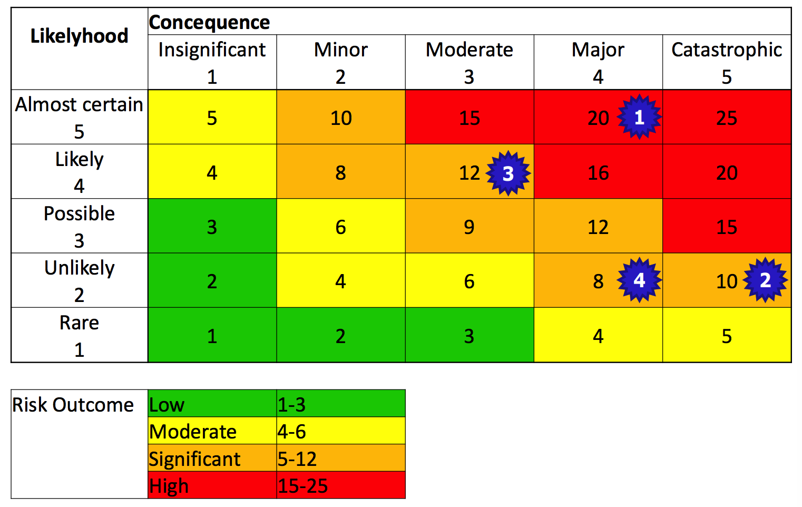
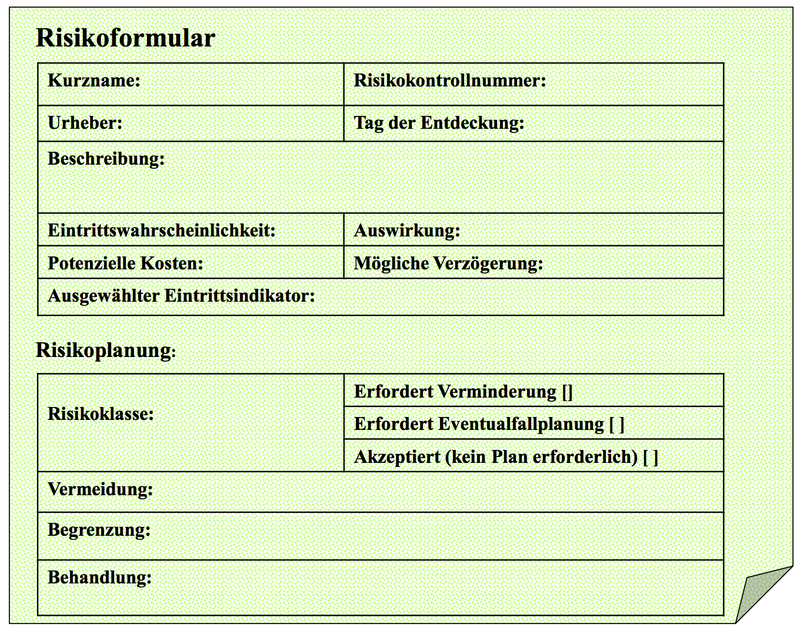
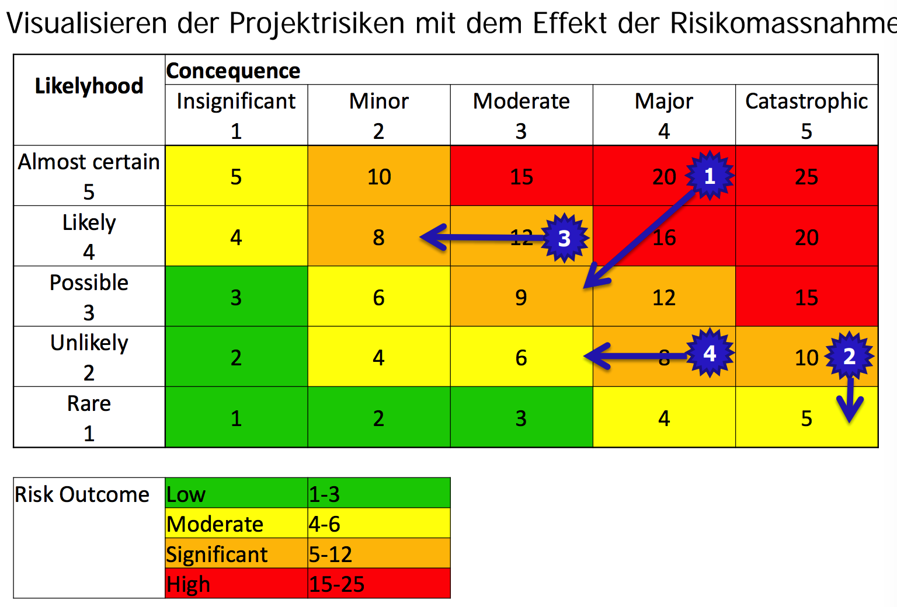
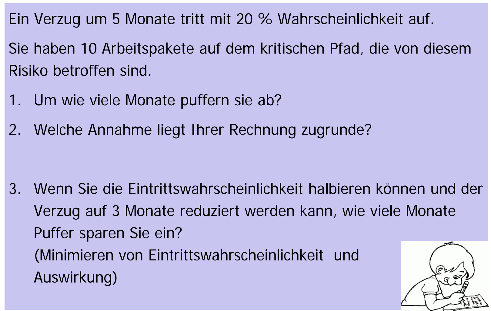

# Risikomanagement
## Lernziele
* Sie können den Begriff des Risikos definieren und erläutern, mit welchen Methoden Risiken identifiziert werden können. 
* Sie kennen das Ziel und die wichtigsten Aufgaben des Risikomanagements. 
* Sie kennen Methoden zur Bewertung und Abschwächung von Risiken.

## Risiko und Problem
Ein Risiko ist die kalkulierte Prognose eines möglichen Schadens bzw. Verlustes im negativen Fall (Gefahr) oder eines möglichen Nutzens bzw. Gewinns im positiven Fall (Chance). Was als Schaden oder Nutzen aufgefasst wird, hängt von Wertvorstellungen ab.

Ein Risiko ist ein Problem, dass erst noch auftreten muss. Ein Problem ist ein Risiko, das eingetreten ist. Ein Risiko kann das Projekt beeinflussen, muss es aber nicht.

> Schaden -\> Problem / Gefahr
> Nutzen -\> Gelegenheit / Chance

Wertschöpfung ist das Ziel jeder wirtschaftlichen Tätigkeit. Höhere Wertschöpfung bringt ein grösseres Risiko mit sich.

## Klassische Risiken
**Produktrisiken** werden als Arbeitspakete im Projekt bearbeitet. Nachweis muss erbracht werden, dass Risiken erkannt und Massnahmen umgesetzt wurden. Produkt-Risikoanalyse z.T. durch Normen vorgeschrieben. Hier ein paar Beispiele:
* Wie verhält sich das Produkt bei Teilausfällen?
* Welche Gefahren für Mensch und Umwelt treten während Bau, Einsatz, Entsorgen auf?

**Projektrisiken** werden im Projektmanagement behandelt. In der Regel sind dies technische Risiken, Implementierungsrisiken, wirtschaftliche, industrielle und Geschäftsrisiken. 

Einfaches Beispiel: *Was hindert mich daran, mein Projekt erfolgreich zu beenden?*

Erweiterte Beispiele:
* **technische Risiken** 
	* zu wenig Knowhow zu einer Technologie 
	* technische Spezifikationen von Produkten nicht korrekt 
	* Termintreue und Qualität von Lieferanten 
	* Patente von Mitbewerbern 
* **Implementierungsrisiken**
	* Anforderungen ändern sich oder Konflikte nicht aufgelöst 
	* Architektur & Design falsch 
	* Entwicklungsprozess wird nicht beherrscht 
* **wirtschaftliche, industrielle und Geschäftsrisiken **
	* Ressourcen stehen nicht zur Verfügung 
	* Änderungen am Markt 
	* Mitbewerber haben bessere Produkte 
	* Verlust an kritischem Knowhow durch Mitarbeiterfluktuation

## Ziele des Risikomanagements
Die Ziele sehen wie folgt aus: 
* Potentielle Probleme erkennen bevor sie auftreten. 
* Massnahmen ergreifen und durch den gesamten Projektlebenszyklus durchführen, damit diese Probleme nicht auftreten und die Projektziele gefährden. 
* Risiken kontrollieren, nicht Risiken vermeiden! 
* Frühzeitig und proaktiv an den Ursachen der **wichtigsten** Risiken eingreifen. 

> Gutes Projektmanagement minimiert Risiken - Gut ausgebildete Mitarbeiter - Budgetierung und Planung orientieren sich an objektiven Fakten - Arbeitsergebnisse werden geplant und mit Hilfe von Kontrollinstrumenten verfolgt - Freigabekriterien werden definiert und umgesetzt

### Risiken Priorität angehen
Iterativ-inkrementelles Vorgehen bietet die Chance gezielt die Dinge früh anzugehen, wo Probleme befürchtet werden.

> Schleppe Risiken nicht mit, plane risikoreiche Aufgaben früh ein.

## Risikomanagement Prozess
Der Risikomanagement Prozess besteht aus fünf Schritten:
1. Identifizieren
2. Analysieren/Quantifizieren (Ursachen, Eintrittswahrscheinlichkeit, Schadensmass)
3. Priorisieren (Risikoeinstufung, Verantwortung festlegen)
4. Massnahmen erarbeiten (Risikovermeidung, Schadensreduzierung)
5. Überwachen (**Regelmässig** bewerten, Massnahmen initiieren, Wirksamkeit der Massnahmen überprüfen)

###  Risiken identifizieren (Techniken)
Es gibt verschiedene Techniken zum identifizieren von Risiken. Wann verwendet man welche Technik ist unten visualisiert. Weiteres zu den Techniken in den Abschnitten weiter unten.

#### Brainstorming
Pros:
* schnell, einfach anzuwenden, kann viele Risiken liefern
* Mitarbeiter können ihre Ängste direkt kommunizieren
Cons:
* systematische Fehler durch **Gruppendruck**, Vorurteile, Betriebsblindheit

#### SWOT Analyse
Projekt aus Sicht der übergeordneten Organisation betrachten

Pros: 
* Stärken/Schwächen einer Organisation, Blick auf den Markt 
* hilft, strategische Risiken zu identifizieren
Cons:
* aufwendiger, ist der objektive Blickwinkel gegeben?

#### Bedrohungsszenarien
Im Sinne von “Was wäre, wenn… ?”

Pros:
* Situationen durchspielen und negative Verläufe betrachten
* relativ einfach, guter Blick auf operative Zusammenhänge und Prozesse
Cons:
* sind die wichtigen Situationen gefunden?

#### Übertragen von früheren Erfahrungen
Problemerfahrungen und Ursachenanalysen wiederverwenden

Pros:
* Lernen aus Fehlern gescheiterter/verzögerter Projekte 
* Prozessverbesserungen + verbesserte Zusammenarbeit
Cons:
* konstruktive Analyse- und Lernbereitschaft vorhanden?

#### Interviews
Befragung verschiedener Stakeholder

Pros:
* Identifikation von unklaren Schnittstellen und Erwartungen
* Stimmungsbild, vor allem wichtig bei grossen/komplexen Projekten
Cons:
* zeitaufwendig, erfordert gutes Gespühr + Kommunikationsfähigkeit 

#### Checklisten
Erfahrungswissen aus der Literatur und der Branche (siehe Dokument Risikomanagement – Checklisten)

Pros:
* einfach abzuarbeiten, geben Orientierung, best practices anwenden
* schnell und systematisch
Cons:
* Ist alles Relevante enthalten? Wie gut sind die Antworten?

#### Werkzeuge
Automatisierung systematischer Befragungen/Checklisten

Pros:
* Folgefragen in Abhängigkeit von Antworten
* Automatische Auswertung (auch Projektübergreifend)
Cons:
* nicht so einfach verfügbar (Geschäftsfeld für Berater)

## Risiken quantifizieren
### Risikoeintritt und Eintrittsindikatoren
Ein Risiko hat eine Eintrittswahrscheinlichkeit. Der Eintritt materialisiert sich durch Schäden (bezifferter in Zeit und/oder Geld). Er ist das Startsignal zur Schadensbegrenzung, dazu kann eine Eventualfallplanung (zusätzlich Zeit und/oder Geld) nützlich sein. Eintrittsindikatoren zeigen zeigen eventuell frühzeitig das Auftreten des Risikos an.

**Beispiel**

### Quantifizierung der Eintrittswahrscheinlichkeit

### Quantifizierung der Auswirkungen

\* *konrekte Werte je nach Unternehmens- und Projektgrösse*

### Risikolandkarte
Visualisiert alle Projektrisiken

### Muster für eine Risikobeschreibung

### Risikomassnahmen und Eventualfallplan
Es gibt 4 mögliche Risikomassnahmen:  

**Vermeiden**: Eintrittswahrscheinlichkeit reduzieren (damit verzichtet man aber auch auf die Chancen, die das Eingehen eines Risikos bietet)

**Begrenzen**: Auswirkungen abschwächen (wie bei einer Versicherung mit Selbstbeteiligung) und Eventualfallplan erarbeiten.

**Behandeln**: Durch zusätzlichen Aufwand Eintrittswahrscheinlichkeit und/oder Auswirkungen reduzieren (z.B. Prototypen erstellen). Risikobehaftete Tätigkeiten möglichst früh einplanen und bei Eintritt gemäss Eventualfallplan agieren.

**Ingonieren**: nuff said!

### Risikolandkarte mit Risikomassnahmen

### Beispiel: Risiko Benutzerfreundlichkeit

### Strategien zur Risikobewältigung
* Eintrittswahrscheinlichkeit des Risikos vermindern durch entsprechend vorbeugende Massnahmen 
	* Prototypen 
	* riskante Tätigkeiten früh angehen 
* Auswirkung von Ereignissen vermeiden 
	* Eventualfallplan 
	* alternative Lieferanten
* konsequente Überwachung und Steuerung des Projektes 
* Partner und Lieferanten die Risiken (teilweise) mittragen lassen 
* Risiken versichern 
* Projekt gar nicht starten

### 10 Gebote im Risikomanagement
1. Risiken gehören zu jedem Projekt und sind nicht zu vermeiden. 
2. Die „Entdecker" von Risiken sind nicht wie „Schuldige" zu behandeln. 
3. Alle Projektbeteiligten sind für das Risikomanagement verantwortlich. 
4. Um drohende Risiken zu erkennen, ist offene und ehrliche Kommunikation im Projektteam unverzichtbar. 
5. Risiken werden nicht nur vom Projektleiter bekämpft, sondern durch abgestimmtes und gemeinsames Handeln des Projektteams. 
6. Risiken und diesbezügliche Abwehrmassnahmen gehören zu den TOP-1-Themen jeder Projektbesprechung.
7. Beschlossene Abwehrmassnahmen und Entscheidungen werden konsequent umgesetzt und auf Wirksamkeit überwacht.
8. Risikovermindernde bzw. -vermeidende Massnahmen werden möglichst auf der Arbeitsebene entschieden und nicht zum Management „delegiert".
9. Sofortige, wirksame Massnahmen sind perfekten Massnahmen, die aber zu spät kommen, vorzuziehen.
10. Vorgehensweisen und Tools im Risikomanagement werden im Projektteam abgestimmt und einheitlich angewendet.

## Fragen
### Projektverzögerung
