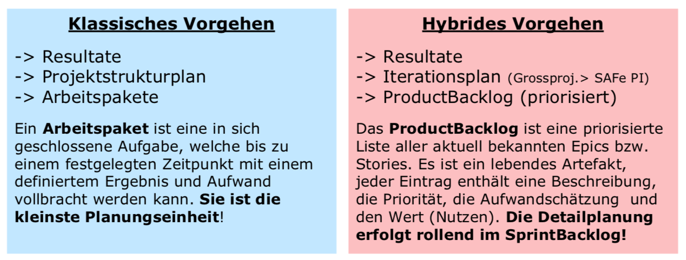
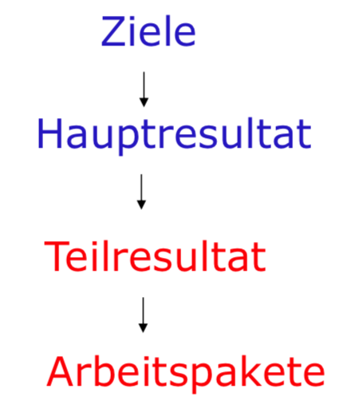
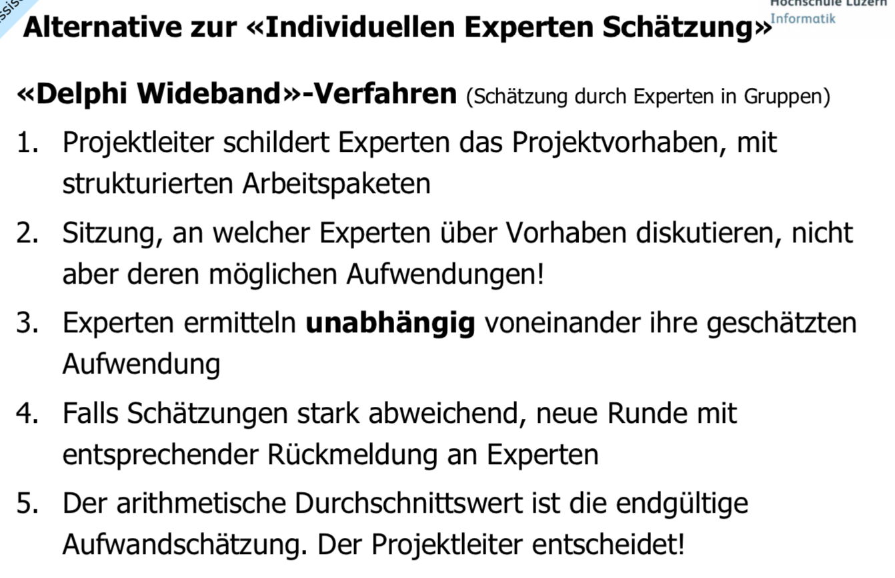
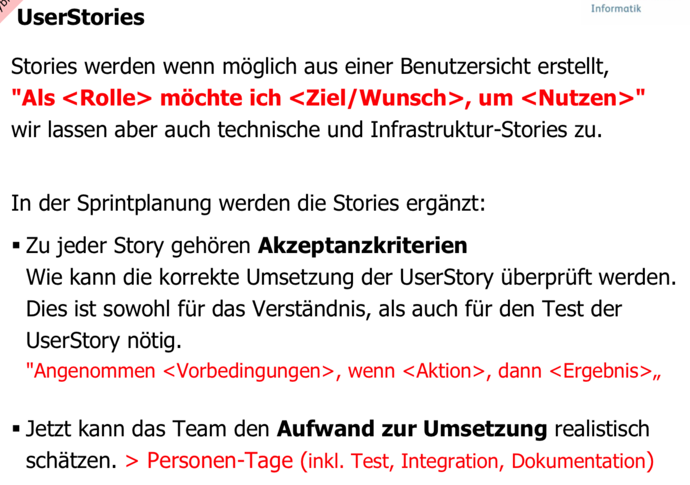
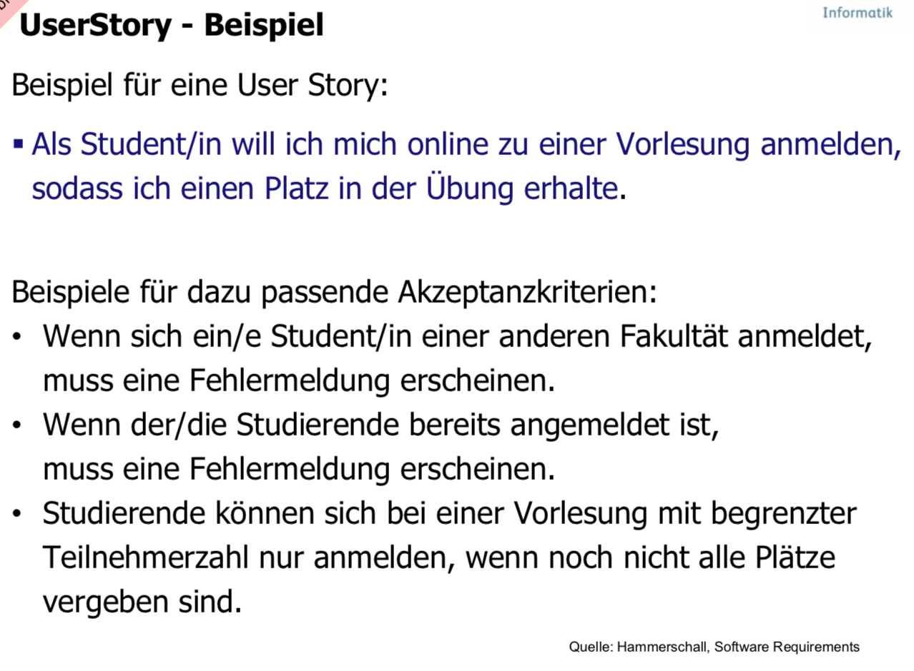
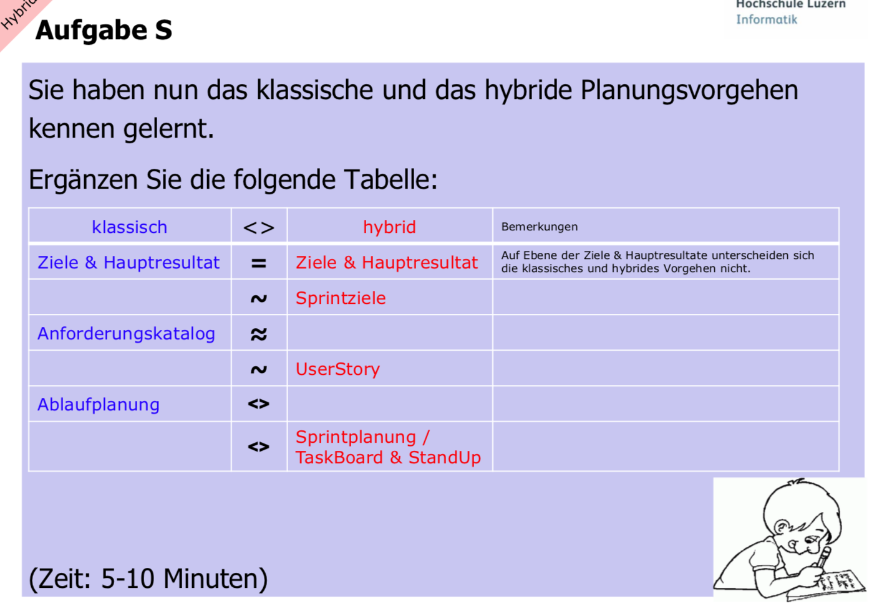

# index

Unterschiedliche Prioritäten im klassischen und agilen PM 

## Lernziele

* Sie können für ein kleines bis mittleres Projekt eine Projektplanung vollständig durchführen. 
* Sie sind in der Lage dies für eine klassisches Projekt basierend auf Arbeitspaketen und für ein agiles respektive hybrides Projekt zu tun. 
* Sie sind in der Lage, aus der Beschreibung der Ausgangslage und dem Anforderungskatalog eines Projektes Teilresultate und Resultate für ein Projekt zu definieren. 

## Ausgangslage, Ziele und Anforderungen

Die Ausgangslage beschreibt die Problemstellung, resp. die Motivation warum man das Projekt machen will.

Die Projektziele beschreiben **was** man mit dem Projekt erreichen will. Ein Ziel beschreibt einen Soll **Zustand**/**Situation**.

> Zielkompromisse statt Lösungskompromisse

Ziele sollen nach S.M.A.R.T formuliert werden:

* **Spezifisch** - das Ziel muss für konkret benannte Organisationen, Rahmenbedingungen etc. gelten; die Grenzen des Zielbereichs werden vorgegeben. 
* **Messbar** - Qualitäten und ggf. Quantitäten der Zielerreichung sind bestimmbar, Indikatoren können abgeleitet werden. 
* **Angemessen** - ist es das 'richtige' Ziel? Besteht ein Bedarf für die geplanten Massnahmen? 
* **Realistisch** - die Aussichten, das Ziel zu erreichen, sind unter den gegebenen Rahmenbedingungen \(Ressourcen, Zeit, Kompetenzen\) ausreichend hoch; externe, unkontrollierbare Faktoren stehen der Zielerreichung nicht im Weg. 
* **Terminiert** - ein zeitlicher Rahmen wird vorgegeben. 

## Resultate, Meilensteine, Scope und Anforderungen

### Resultate

Projektresultate sind Arbeitsergebnisse, welche das Projekt abzuliefern hat. Alle wichtigen Projektplanungs- und Reporting-Instrumente hängen direkt von der klaren Formulierung der Resultate und Arbeitspakete ab. Man beschreibt, was der Auftraggeber oder die Benutzer **„in die Hand“** kriegen.

> Projektresultate präzise und vollständig definieren und beschreiben \(Resultate sind nicht Aktivitäten\)!

Es gibt einen Zusammenhang zwischen Zielen, Resultaten und Arbeitspaketen: Die Resultate werden aus den Zielen abgeleitet und in Haupt- und Teilresultate unterteilt:

In der Regel werden Resultate wie folgt gruppiert: 1. Applikationssoftware 2. Applikationsdokumentation 3. Prozesse / Betriebsorganisation \(Businessorientierte Resultate\) 4. Migration \(optional\) 5. Rollout 6. Projektmanagement-Ergebnisse

### Meilensteine und deren Planung

Definition Meilenstein:

> Ein geplanter Punkt im Projektablauf an dem vorher festgelegte, messbare \(Zwischen-\)Ergebnisse vorliegen, die es erlauben, den Projektfortschritt zu festzustellen.

Zu jedem Meilenstein gehören Artefakte, wie z.B. Prototypen, Prereleases, Entwurfsdokumente, Testprotokolle, usw.

Der Meilenstein ist erreicht, wenn die geforderten Artefakte vorliegen und ihre Überprüfung \( Review / Test \) erfolgreich war. Typisch sind die Meilensteine bei kleinen und mittleren Projekten wie die Widerlager und Pfeiler einer Doppelbogenbrücke verteilt. Einfacher gesagt: zwei am Anfang, einen in der Mitte und zwei am Ende.

Die Planung der Meilensteine wird nach **aussen** kommuniziert. Es gibt oft Abhängigkeiten, daher muss der Rahmenplan möglichst stabil sein. Der Meilensteinplan lehnt sich an das Projekt-\(Phasen-\)Modell an. Er gibt eine grobe Vorstellung des übergeordneten Projektablaufs, d.h. der Rahmenplan zeigt:

* Die Projektdauer \(geplantes Projektende, geplanter Projektstart\)
* Die Meilensteine \(Name, Termin, Deliverables\)

### Scope

Der Scope beschreibt was nicht zum Projekt gehört \(**out of scope**\) und die Einschränkungen \(**constraints**\). Oft wird auch beschrieben, was zum Scope \(**in scope**\) gehört. Trotzdem dies eigentlich mit der Beschreibung der Resultat nicht notwendig wäre.

Über die Aufgabenabgrenzung erreichen die Parteien ein gemeinsames Verständnis für das Projekt und vermeiden einen Interpretationsspielraum.

### Anforderungen

Eine Anforderung hingegen beschreibt eine **Eigenschaft** oder eine **Leistung \(erwünschtes Verhalten\)**. Bei sind um so besser formuliert, je einfacher ihre Erfüllung geprüft werden kann.

In kleinen und mittleren Projekten genügt es Anforderungen in einer Tabelle \(Excel oder Word\) zu erfassen. Die Anforderungen sollen in genügender Tiefe beschrieben werden, sodass auch noch nach **3 Monaten klar** ist, was gemeint war.

Ein Anforderungskatalog bzw. ein Product Backlog soll folgende Informationen enthalten:

* Titel
* Description \(Stichwortartig, aber in adäquater Tiefe - Motto: **So viel wie nötig, so wenig wie möglich**\)
* Priority \(Klassisch: fix, Hybrid: fortlaufend durch PO\)
  * High
  * Medium \(kann in den nächsten Release\),
  * Low \(kann in den übernächsten Release\)\)
* Status
  * Proposed: entgegengenommen und ungeprüft
  * Accepted: geprüft und akzeptiert
  * Postponed: geprüft, aber verschoben
* Source \(Die Person oder Organisation von dem sie stammt \)
* Complexity \(Komplexität und Aufwand für die Umsetzung\)
  * Klassisch durch Projektleiter
  * Hybrid durch Team im Planning Poker
* Benefit \(Nutzen; wird benötigt um Anforderungen zu priorisieren und eventuell abzulehnen\)

## Klassische Projektplanung

Klassische Projektplanung beinhaltet unter anderem folgendes:

* Projektstrukturplanung \(Arbeitspakete, Work Breakdown Structure\) 
* Ablaufplan \(Abhängigkeiten der Arbeitspakete\) 
* Aufwandplanung \(Aufwände in PT festlegen\) 
* Ressourcenplanung \(Verteilung der AP auf Mitarbeiter und die Zeitlinie\) 
* Kostenplanung \(Planung der effektiven Kosten in CHF\) 

### Work-Breakdown-Structure \(WBS\)

Man kann es auch Projektstrukturplanung \(PSP\) nennen, aber das kennt niemand.

Klare **resultatorientierte Gliederung** der bevorstehenden Gesamtaufgabe in einzelne plan- und kontrollierbare Teilaufgaben sprich **Arbeitspakete**. Verschafft einen Überblick über die Bestandteile des zu schaffenden Objekts. Die Arbeitspakete werden aus den Resultaten abgeleitet.

Die oben gezeigte Grafik und der darauffolgende Projektstrukturplan kann man auch Objektstrukturplan, ProduktSP oder PBS nennen - so versteht auch ein Profi dich nicht mehr!

Die Resultate werden aus den Zielen abgeleitet und in Haupt- und Teilresultate unterteilt. Pro Teilresultat können dann 1 – n Arbeitspakete gebildet werden.

#### Erarbeitung des Plans: Vorgehen

1. Mapping der Anforderungen auf die Resultate
   * pro Paarung kann in der Regel ein Arbeitspaket gebildet werden. 
2. Benennung und Beschreibung der Arbeitspakete 
   * \(Name und Kurzbeschreibung\) 
3. Schätzung des Aufwandes
   * Aufwand in Personentagen oder -Wochen 
4. Vorläufer \(Nachläufer\)
   * Feststellung der logischen Abhängigkeiten der Arbeitspakete \(Ablaufplan\)  

In einem IT-Projekt ist nach der Definition der Ziele, der Erarbeitung der Anforderungen und der Festlegung Resultate zu überprüfen, ob alle Resultate vorhanden sind. Dies geschieht durch das Zuordnen ALLER Anforderungen zu Resultaten. Die zu stellende Frage ist:  
«Welche Anforderungen werden durch welche Resultate erfüllt?».

Quasi nebenbei können daraus auch die Arbeitspakete \(AP\) abgeleitet werden. Pro Mapping wird in der Regel ein Arbeitspaket erstellt. In Ausnahmefällen müssen zwei Mappings zu einem AP zusammengefasst werden oder ein Mapping wird in zwei AP aufgeteilt.

#### Richtschnur für die Erstellung von Arbeitspaketen

* Arbeitspaket sollte zwischen 2 – ca. 20 Arbeitstage Aufwand generieren, damit eine gute Abschätzung des Aufwandes möglich ist. 
* Arbeitspaket sollte in der Regel einem Mitarbeitenden \(MA\) zugeteilt werden. In Ausnahmenfällen können auch zwei oder drei MA an einem Arbeitspaket arbeiten. 
* Mitarbeitende\(r\) sollte nicht mehr als 2 Arbeitspakete zeitgleich bearbeiten. 
* Arbeitspakete \&lt; 2 Tage sollten zusammengefasst oder allenfalls als Tasks in einer Open-Task-Liste geführt werden. 

### Ablaufplan

Ermittelt und legt die logischen Abhängigkeiten der einzelnen Arbeitspakete fest. Daraus Resultiert:

* Gruppierung der AP zu Phasen, die sequentiell bearbeitet werden. 
* Festlegung der Abhängigkeiten innerhalb einer Gruppe, nur wo notwendig. 

Überlegen Sie, welche Arbeitspakete \(AP\) parallel bearbeitbar sind. Wir gehen hier zweistufig vor:  
1. Grobe Zuordnung der AP zu Phasen respektive Gruppen.  
Idee: Die AP von zwei Phasen müssen sequentiell bearbeitet werden, also zuerst die AP der Phase 1 und dann die AP der Phase 2 usw. 2. Festlegung der effektiven Abhängigkeiten innerhalb einer Phase nur wo notwendig. Idee: Grundsätzlich geht man davon aus, dass die AP innerhalb einer Phase parallel bearbeitbar sind. Abhängigkeiten werden nur gesetzt, wo unbedingt notwendig. Einfache Abhängigkeiten werden über das wöchentliche Projektmanagement erledigt.

### Aufwandplanung

 

Methoden:

* **Individual Expert Judgement: WBS – Work Breakdown Structure**
* Estimation by Analogy 
* Count, Compute, Judge \(Function Point Methode\)
* **Expert Judgement in Groups \(Wideband Delphi\)**
* Formale Methoden 

   

### Ressourcenplanung

Zuordnung von Arbeitsaufwänden \(Arbeitspakete\) zu den Projekt-MA und Verteilung der Arbeitspakete auf die Zeitachse. Mit dem Ziel: Die Zuteilung \(zu MA und auf die Zeitlinie\) und die Dauer der Arbeitspakete des Projekts ermitteln. Daraus soll die Dauer der Arbeitspakete und Projektdauer abgeleitet werden können. Entsprechend muss ein Ressourcenplan und Kapazitätsbelastungsdiagramm geliefert werden.

> Unter Ressourcen, aka Einsatzmittel, werden alle für die Arbeitspakete benötigten Mittel verstanden, nicht nur personelle Ressourcen.

#### Parkinsons erstes Gesetzt

«Work expands so as to fill the time available for its completion» «Arbeit dehnt sich aus, so weit es geht». Dieses «Gesetz» ist aus der Praxis bekannt: Wenn man zu früh fertig ist, findet man immer Arbeit «zur Verschönerung» oder man testet mehr, oder wenn man hingegen nicht fertig wird, aber das Budget erschöpft oder der Endtermin erreicht ist, wird der erreichte Zustand als fertig erklärt.

Beim hybriden Vorgehen wird ohne Zeitreserven geplant, es werden dank dem Pull-Prinzip in jedem Sprint so viele der höchst priorisierten Stories wie möglich umgesetzt.

#### Vorgehen

1. Festlegung der für die Arbeiten benötigten Profile und Zuordnung zu den Arbeitspaketen. 
2. Sichtung der verfügbaren Mitarbeiter und deren Profile und Zuordnung Mitarbeiter \&lt;&gt; Arbeitspaketen und... 
3. Verteilung der Aufwände pro Arbeitspakete und Mitarbeiter auf die Zeitachse unter Beachtung der Auslastung der Mitarbeiter. 

#### Profile und Mitarbeiter

Aus den Arbeitspaketen ergeben sich die benötigten Skillprofile wie Java Entwickler oder Datenbankspezialist. Diese müssen zu Beginn der Ressourcenplanung für das jeweilige Projekt festgestellt werden. Sind diese bekannt, können in einem zweiten Schritt die Mitarbeiter- profile gesichtet und die passenden Mitarbeiter ausgewählt werden. Bei fehlenden Skills muss man allenfalls externe MA-Ressourcen zurückgreifen.

Ist bekannt, welches Arbeitspaket welches Profil benötigt, geht es nun darum die «richtigen» MitarbeiterInnen \(MA\) zu finden. Es müssen die Profile der MA gesichtet und es sollen diejenigen MA den jeweiligen Arbeitspaketen zugewiesen werden, zu denen sie am besten passen.

> Praxis ist, dass man hier vielfach Kompromisse eingehen muss, da man selten den idealen Mitarbeiter findet.

Durch das Zuweisen der MA zu den Arbeitspaketen und deren Verfügbarkeit \(z.B. 80%\) ergibt sich die Dauer eines Arbeitspakets. Es ist wichtig auf die Auslastung der MA zu achten. Sie sollten nicht überlastet aber auch nicht deutlich unterbelastet sein. Ziel: Möglichst nahe an die mögliche Verfügbarkeit zu kommen, manchmal sogar leicht darüber.

## Hybride Projektplanung

### Scrum

Insbesondere bei Software-Entwicklungsprojekten ist es oft kaum möglich bereits in der Initialisierungsphase die Anforderungen vollständig zu erfassen. Zudem ist die Trennung zwischen Konzeption \(SW-Design\) und Realisierung \(Programmierung\) bei der Software-Entwicklung eher künstlich. Ein Vorgehen, wie beispielsweise Scrum erlaubt in mehreren Durchgängen die Anforderungen zu ergänzen und anzupassen und die Software schrittweise zu entwickeln \(entwerfen & programmieren\).

### SoDa

Die Projektdurchführung bei **Software-Entwicklungsprojekten** bzw. für den **Software-Teil** eines interdisziplinären Projektes stützt sich in SoDa für die Konzeptions- und die Realisierungsphase auf das Scrum Vorgehensmodell.

Dieses Modell trägt einerseits dem **Bedürfnis** von Auftraggebern und übergeordneter Organisation nach **geordneter Projektdurchführung** mit standardisierten Phasen und Meilensteinen Rechnung. Andererseits wird sichergestellt, dass die Software **iterativ-inkrementell** entwickelt wird und sich agil an den Bedürfnissen und Möglichkeiten orientiert.

#### Rollende Planung

Die Planungsaufgaben werden im hybriden Vorgehen **nicht “up fron”**, **Planung und Umsetzung** sind enger verschränkt. Zu Beginn wird nur der Meilensteinplan gemacht \(plus allenfalls eine Aufgabenplanung für die Initialisierungsphase\) und es wird die Sprintdauer für die Konzeptions- & Realisierungsphase festgelegt. Innerhalb des Meilensteinplans werden die jeweils nächstfolgenden Iterationen im «Timeboxing» \(fixe Dauer, flexibler Inhalt\) geplant.

#### Ablauf- und Ressourcenplanung

Die Verantwortung für die Ablauf- und Ressourcenplanung beim ProductOwner und erfolgt auf zwei Ebenen:

**Product Backlog**:

* initiale Erstellung, laufende Pflege
* Erfassen und klar formulieren der Einträge im ProductBacklog
* Ordnen der Einträge in eine zielführende Fertigstellungsreihenfolge 
* Transparenz des ProductBacklog für alle Beteiligten sicherstellen 
* Fortlaufenden Pflege \(„Grooming“/Refinement\) des ProductBacklogs

 **Sprint Backlog**:

* Auf Basis der Rahmenplanung und der höchst priorisierten ProductBacklog-Items ein sinnvolles Sprintziel festlegen, das mit den verfügbaren Ressourcen in der vorgesehenen Timebox erreicht werden kann. 
* Ausgewählte Backlog-Items konkretisieren und Aufwand abschätzen.  

#### TODO

 

               

## Fragen

* Was ist ein Meilenstein? 
* Warum werden Meilensteine in einem Projekt gesetzt? 
* Welchen Abstand sollten Meilensteine vernünftigerweise haben? 
* Warum will man die Bearbeitung der Arbeitspakete möglichst parallelisieren? 
* Was ist der kritische Pfad in einem Projekt? 
* Warum gibt es im agilen / hybriden Projekt keine kritischen Pfade? 

